# Agent Flow Diagram — ULTRON AI WORLD

> End-to-end lifecycle of AI agents: orchestration, LangGraph state machines, Model Router inference, memory retrieval, tool execution, and client visualization paths.

---

## Agent System Scope by Phase

| Phase   | Agents (DB) | Concurrent LangGraph | Districts         | Key flows                                     |
| ------- | ----------- | -------------------- | ----------------- | --------------------------------------------- |
| **MVP** | 50          | ≤ 10                 | Reasoning only    | Dialogue, memory store, streaming WS          |
| **v1**  | 500         | ≤ 50                 | All 5             | + delegation, movement, simulation background |
| **v2**  | 5,000       | ≤ 200                | All 5 + swarm LOD | + debate, reputation, pooled workers          |

Canonical source: [`docs/canonical-numbers.md`](../docs/canonical-numbers.md)

---

## Agent Architecture Overview

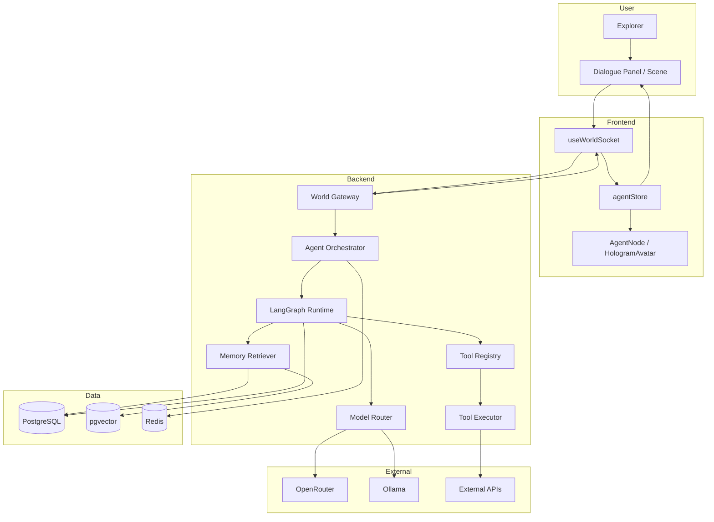

---

## Agent Lifecycle State Machine

Server-side agent **status** (distinct from LangGraph internal state):

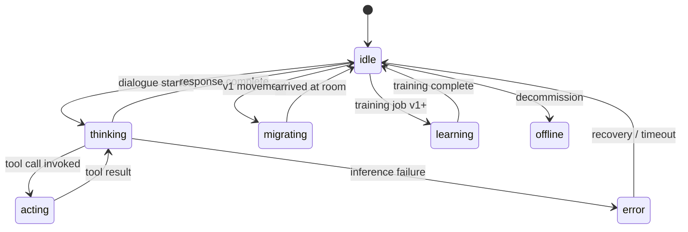

Client receives transitions via `agent:status` WebSocket events → particle effects on `HologramAvatar`.

---

## LangGraph Workflow (Per Dialogue Turn)

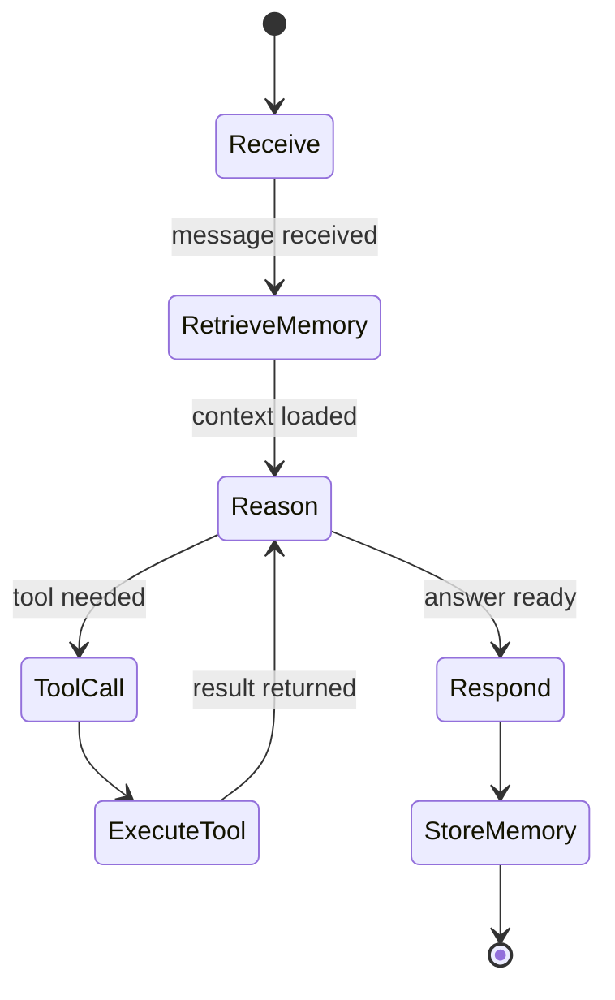

### Role-specific graph variants

| Role         | District         | Unique nodes                               |
| ------------ | ---------------- | ------------------------------------------ |
| `planner`    | Reasoning        | `decompose`, `prioritize`, `validate_plan` |
| `classifier` | Perception       | `classify`, `route`, `filter`              |
| `archivist`  | Memory           | `index`, `deduplicate`, `link`             |
| `executor`   | Action           | `select_tool`, `execute`, `verify`         |
| `trainer`    | Self Improvement | `prepare_data`, `train`, `evaluate`        |
| `debater`    | Reasoning (v2)   | `argue`, `counter`, `synthesize`           |

MVP agent roles (all Reasoning): planner 20, simulator 10, debater 10, verifier 10.

---

## Complete Dialogue Flow

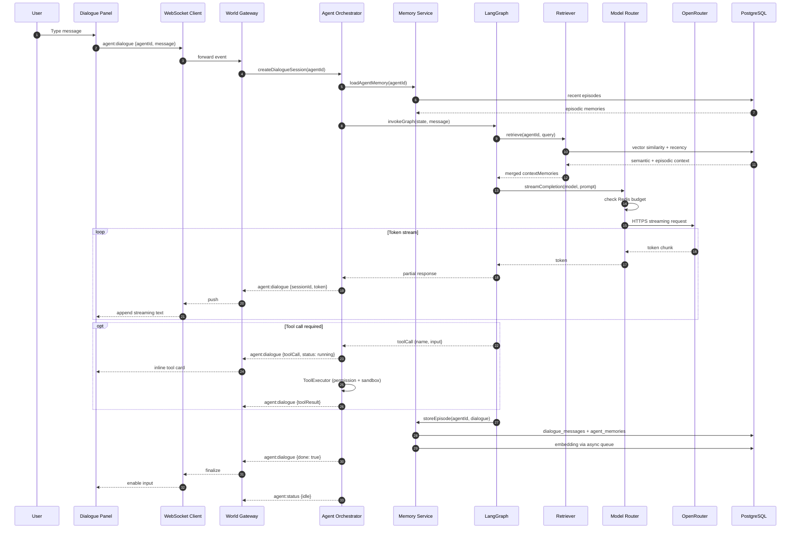

**Latency target**: P95 first token < 2 s (MVP), < 3 s mobile.

---

## Model Router Decision Flow

All inference passes through Model Router — no bypass paths.

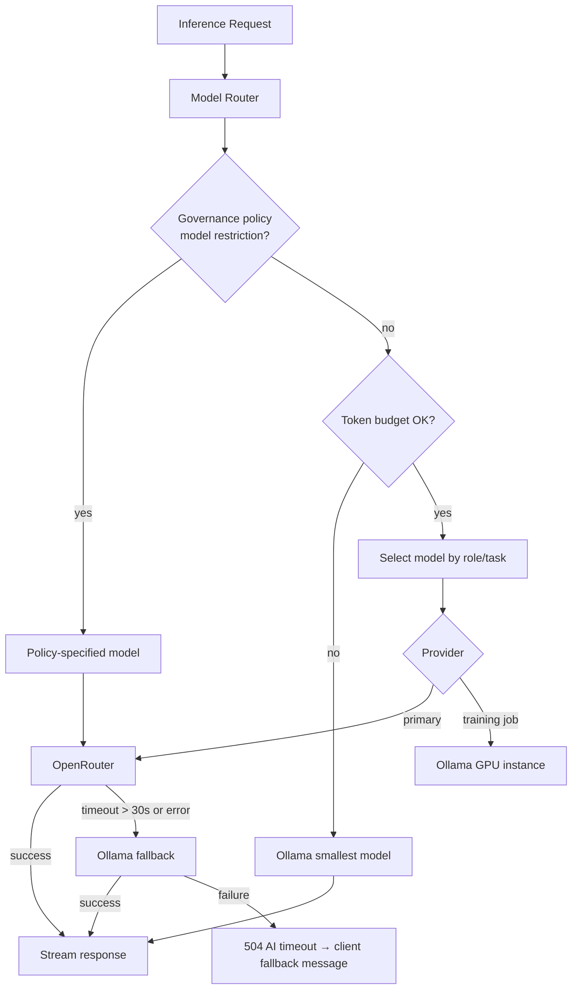

### MVP model routing

| Use case            | Primary                          | Fallback            |
| ------------------- | -------------------------------- | ------------------- |
| Reasoning, planning | `claude-sonnet-4` via OpenRouter | `llama3:70b` Ollama |
| General dialogue    | `gpt-4o`                         | `llama3:70b`        |
| Classification      | `gpt-4o-mini`                    | `llama3:8b`         |
| Embeddings          | `text-embedding-3-small`         | —                   |

---

## Memory Retrieval Pipeline

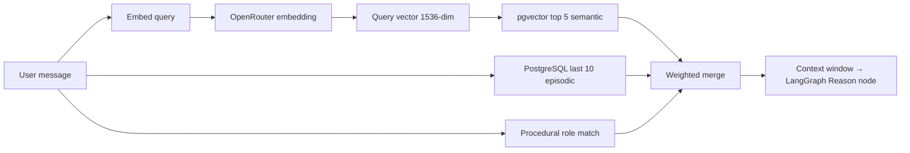

| Memory type | Weight | Storage                         |
| ----------- | ------ | ------------------------------- |
| Semantic    | 0.5    | `agent_memories.embedding` HNSW |
| Episodic    | 0.3    | `dialogue_messages` recency     |
| Procedural  | 0.2    | Agent role capabilities         |

Post-response: new episode stored → embedding queued (Bull `embedding`).

---

## Tool Execution Flow

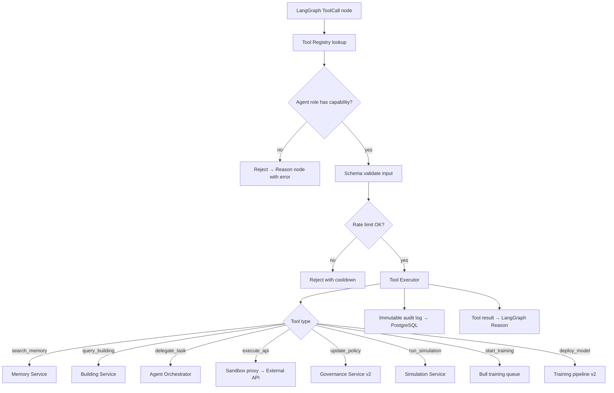

Perception District applies **prompt injection filtering** on classifier agents (security layer).

---

## Agent Delegation Flow (v1)

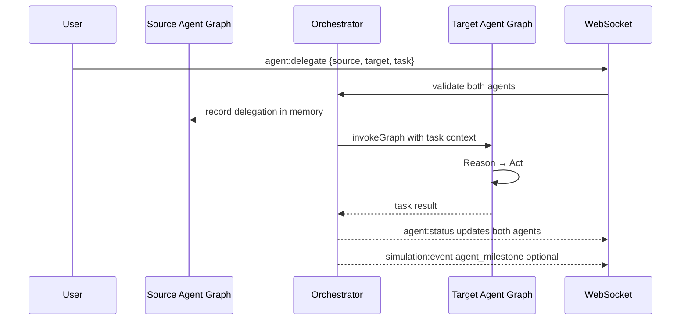

---

## LangGraph Instance Pool Strategy

Critical scalability constraint: **agents in DB ≠ LangGraph instances running**.

```mermaid
flowchart TB
    subgraph MVP["MVP (≤ 10 concurrent)"]
        D1[Dialogue request] --> CREATE[Create instance]
        CREATE --> RUN[Run graph]
        RUN --> DESTROY[Destroy on session end]
    end

    subgraph V1["v1 (≤ 50 concurrent)"]
        D2[Dialogue request] --> POOL{Pool full?}
        POOL -->|no| ACQUIRE[Acquire instance]
        POOL -->|yes| QUEUE429[Queue / HTTP 429]
        ACQUIRE --> RUN2[Run graph]
        RUN2 --> RELEASE[Release to pool]
    end

    subgraph V2["v2 (≤ 200 concurrent)"]
        D3[Dialogue request] --> WORKER[AI Worker Pool]
        WORKER --> SHARED[Shared graph templates]
        SHARED --> REDIS_CP[Redis hot checkpoint]
        REDIS_CP --> PG_CP[PostgreSQL durable checkpoint]
    end
```

| Phase | Strategy                       | Load test gate                      |
| ----- | ------------------------------ | ----------------------------------- |
| MVP   | On-demand per dialogue         | 10 concurrent, P95 first token < 2s |
| v1    | Pool max 50; queue overflow    | 50 concurrent, API memory < 4GB     |
| v2    | Worker pool + shared templates | 200 concurrent dialogues            |

---

## Agent → Client Visualization Path

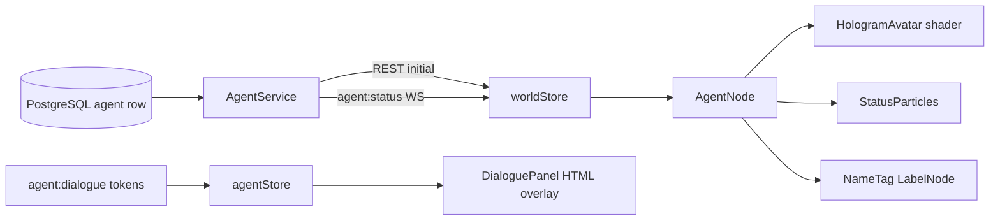

Swarm rendering strategy ([`docs/feature-specs/agent-swarm-rendering.md`](../docs/feature-specs/agent-swarm-rendering.md)):

| Agents visible | Rendering                                                |
| -------------- | -------------------------------------------------------- |
| ≤ 50 (MVP)     | Full holographic avatar                                  |
| ≤ 500 (v1)     | Full in viewport; dots on mini-map elsewhere             |
| ≤ 5,000 (v2)   | Full in room; LOD silhouette in district; dots elsewhere |

---

## Inference Budget & Cost Control

Tracked in Redis with PostgreSQL audit trail:

| Resource                          | MVP     | v1                              |
| --------------------------------- | ------- | ------------------------------- |
| Tokens per anonymous user/day     | 50,000  | 100,000                         |
| Tokens per authenticated user/day | —       | 500,000                         |
| Tokens per agent/hour             | 50,000  | 200,000                         |
| Concurrent inference jobs         | 5       | 20                              |
| Background agent inference        | **Off** | Limited (simulation uses rules) |

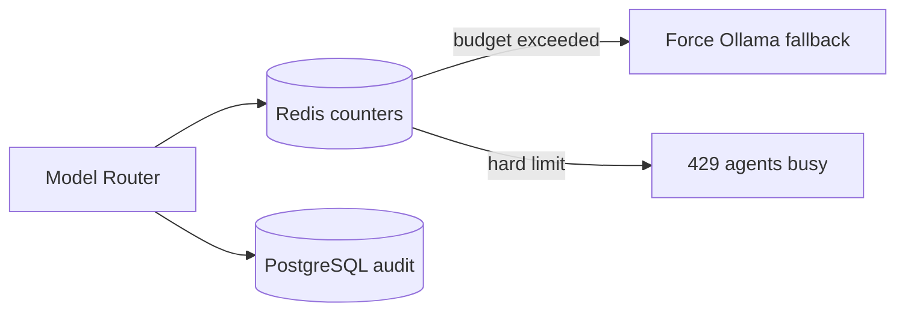

**v1 cost estimate**: ~$900/mo dialogues + ~$50/mo embeddings at 5,000 dialogues/day (see scalability plan).

---

## Checkpoint & Session Durability

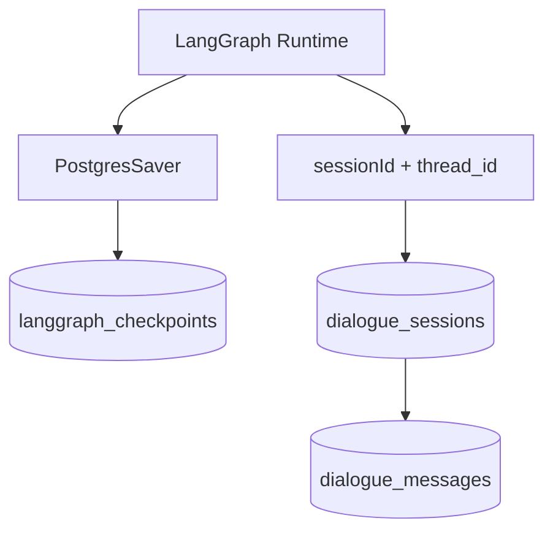

- Graph can resume mid-workflow on API restart
- Session tied to WebSocket `sessionId` for streaming continuity
- Soft-deleted agents retain audit trail; no new dialogues

---

## Scalability Bottlenecks (Agent Path)

| ID  | Bottleneck               | Risk                               | Mitigation                                                          |
| --- | ------------------------ | ---------------------------------- | ------------------------------------------------------------------- |
| R1  | 1:1 LangGraph instances  | Memory exhaustion at 5K agents     | Pool + on-demand destroy; worker pool v2                            |
| R2  | OpenRouter cost/latency  | Unsustainable background inference | Dialogue-only MVP; rule-based simulation; Ollama for classification |
| R4  | pgvector at 1M memories  | Retrieval p95 > 100ms              | Qdrant migration; partition tables                                  |
| —   | Tool `execute_api` abuse | Security, cost                     | Allowlist proxy, rate limits, audit                                 |
| —   | Embedding queue backlog  | Delayed memory indexing            | Bull concurrency 5; batch embed                                     |
| —   | GPU training contention  | Inference starvation               | Reject training at 90% GPU; separate GPU node                       |

---

## Future Expansion Strategy

### Agent capabilities

| Horizon | Feature                         | Architectural change                                   |
| ------- | ------------------------------- | ------------------------------------------------------ |
| v1      | Cross-room movement, delegation | AgentService position events; orchestrator fan-out     |
| v2      | Multi-agent debate, reputation  | Multi-graph coordination; debate amphitheater scene    |
| v2      | Personality evolution           | Versioned prompt templates in DB; A/B via Model Router |
| Future  | Agent swarms (100+ on one task) | Coordinator graph; hierarchical delegation             |
| Future  | Fine-tuned district models      | Model Router policy per `DistrictId`                   |
| Future  | Multi-modal perception          | Image/audio nodes in Perception graph                  |
| Future  | RL from governance outcomes     | Reward signal pipeline; training queue expansion       |

### AI infrastructure

| Trigger                    | Action                                            |
| -------------------------- | ------------------------------------------------- |
| 200 concurrent graphs      | Extract AI Worker Pool container                  |
| 1M vector rows             | Qdrant sidecar; dual-write                        |
| OpenRouter outage frequent | Promote Ollama to primary for classification tier |
| Custom governor tools      | Dynamic Tool Registry with approval workflow      |

### Integration with Project Ultron

v2+: Q&A agents share personality layer (`packages/personality`); Reasoning District agents reference Global Problems List as memory source ([`docs/integration/project-ultron-to-ai-world.md`](../docs/integration/project-ultron-to-ai-world.md)).

---

## Related Documents

- [`data-flow-diagram.md`](data-flow-diagram.md) — Persistence paths for dialogue and memory
- [`event-flow-diagram.md`](event-flow-diagram.md) — `agent:dialogue`, `agent:status` events
- [`component-diagram.md`](component-diagram.md) — AI module components
- **Source**: [`docs/architecture/ai-system.md`](../docs/architecture/ai-system.md) · [`docs/feature-specs/agent-system.md`](../docs/feature-specs/agent-system.md) · [`docs/architecture/scalability-plan.md`](../docs/architecture/scalability-plan.md)
