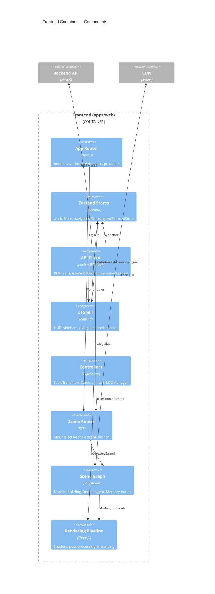
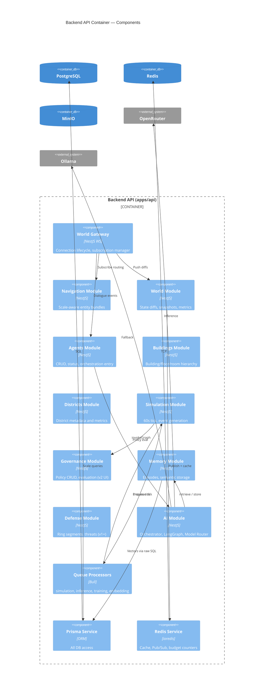
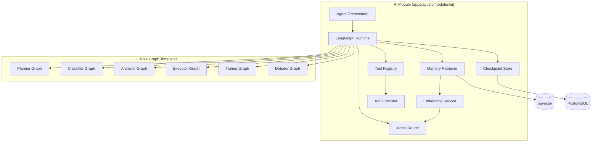
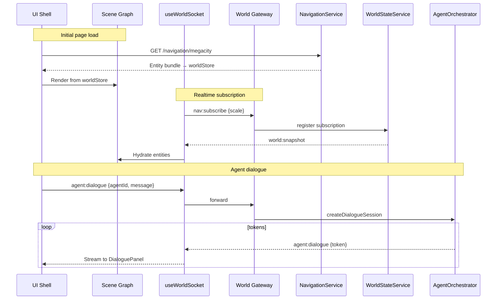

# Component Diagram — ULTRON AI WORLD

> **C4 Component level** · Internal structure of the Frontend (including Three.js Engine) and Backend API containers, plus AI subsystem components.

---

## Scope

This diagram decomposes the two primary **application containers** into components that developers implement. Infrastructure components (PostgreSQL, Redis, MinIO) appear as dependencies, not expanded internals.

---

## Frontend + Three.js Engine Components

### Frontend Component Responsibilities

| Component              | Key modules                                                   | Communicates with           |
| ---------------------- | ------------------------------------------------------------- | --------------------------- |
| **App Router**         | `app/world/[scale]`, root layout                              | UI Shell, Scene Router      |
| **Zustand Stores**     | `worldStore`, `navigationStore`, `agentStore`, `uiStore`      | All UI and scene components |
| **API Client**         | `lib/api`, `useWorldSocket`                                   | Backend REST + WebSocket    |
| **UI Shell**           | `components/hud`, `panels`, `ui`                              | Stores only (no direct API) |
| **Controllers**        | `ScaleTransitionController`, `CameraController`, `LODManager` | Scene Graph, Rendering      |
| **Scene Router**       | `SceneRouter` — single Canvas strategy                        | One active scale branch     |
| **Scene Graph**        | Per-scale R3F nodes mirroring server entities                 | worldStore, Controllers     |
| **Rendering Pipeline** | LOD meshes, shader library, post-processing                   | Scene Graph, GPU            |

---

## Backend API Components

---

## AI Systems Components

| Component                    | Responsibility                                   | Persistence               |
| ---------------------------- | ------------------------------------------------ | ------------------------- |
| **Agent Orchestrator**       | Session lifecycle, dialogue routing, delegation  | Redis runtime             |
| **LangGraph Runtime**        | State machine execution per agent role           | PostgreSQL checkpoints    |
| **Model Router**             | Provider selection, fallback, budget enforcement | Redis counters + PG audit |
| **Embedding Service**        | Batch embed for memory indexing                  | —                         |
| **Memory Retriever**         | Semantic + episodic + procedural merge           | pgvector + PostgreSQL     |
| **Tool Registry / Executor** | Capability checks, sandboxed external calls      | Audit log in PostgreSQL   |
| **Checkpoint Store**         | PostgresSaver for durable graph state            | `langgraph_checkpoints`   |

---

## Cross-Container Interaction (Component Level)

---

## Shared Package (`packages/shared`)

Components on both sides import shared contracts:

| Export                                    | Used by                         |
| ----------------------------------------- | ------------------------------- |
| `ScaleLevel`, `AgentStatus`, `DistrictId` | Frontend stores, Backend DTOs   |
| WebSocket event types                     | `useWorldSocket`, World Gateway |
| API response envelopes                    | API Client, REST controllers    |
| District theme tokens                     | Scene Graph shaders, UI Shell   |

---

## Scalability Bottlenecks (Component Level)

| Component                                | Risk                                          | Mitigation                                                  |
| ---------------------------------------- | --------------------------------------------- | ----------------------------------------------------------- |
| **World Gateway**                        | 10K connections/node; subscription map memory | Horizontal WS nodes; Redis fan-out                          |
| **WorldStateService / StateDiffService** | Diff computation CPU at megacity scale        | Scale-scoped subscriptions; 100ms batch; field-level deltas |
| **NavigationService**                    | Large payloads at city scale                  | Redis 30s cache; pagination; read replica                   |
| **Agent Orchestrator**                   | 1:1 LangGraph instance explosion              | Pool max 50 (v1); queue overflow 429                        |
| **LangGraph + Model Router**             | P95 first token > 2s                          | Streaming; Ollama fallback; prompt template cache           |
| **Scene Graph + LODManager**             | Draw calls > 500                              | Instancing, frustum cull, agent swarm LOD                   |
| **SimulationService**                    | Tick > 5s with 500 agents                     | Rule engine not LLM-per-agent; Bull single concurrency      |

---

## Future Expansion Strategy

### Frontend decomposition

| Trigger              | Action                                               |
| -------------------- | ---------------------------------------------------- |
| Team > 10 engineers  | Micro-frontend split (governance dashboard vs world) |
| WebGPU stable in R3F | Migrate rendering pipeline component                 |
| LOD CPU bound        | Web Worker for spatial indexing                      |

### Backend decomposition

| Trigger                     | Action                                             |
| --------------------------- | -------------------------------------------------- |
| Inference queue depth > 100 | Extract AI Module to `ai-worker` container         |
| Simulation tick blocks API  | Dedicated simulation worker container              |
| Navigation P95 > 500ms      | CQRS read model for navigation                     |
| 10+ API nodes               | API gateway (Traefik/Kong); optional gRPC internal |

### AI subsystem

| Trigger                    | Action                                             |
| -------------------------- | -------------------------------------------------- |
| 1M+ vector rows            | Qdrant sidecar; dual-write migration               |
| 200 concurrent graphs      | Shared graph templates; Redis checkpoint hot state |
| Fine-tuned district models | Model Router policy per district                   |

---

## Related Documents

- [`container-diagram.md`](container-diagram.md) — Deployable containers
- [`agent-flow-diagram.md`](agent-flow-diagram.md) — LangGraph state machine detail
- [`event-flow-diagram.md`](event-flow-diagram.md) — WebSocket event routing
- **Source**: [`docs/architecture/backend.md`](../docs/architecture/backend.md) · [`docs/architecture/frontend.md`](../docs/architecture/frontend.md) · [`docs/architecture/ai-system.md`](../docs/architecture/ai-system.md)
