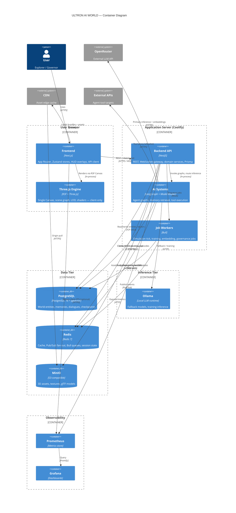
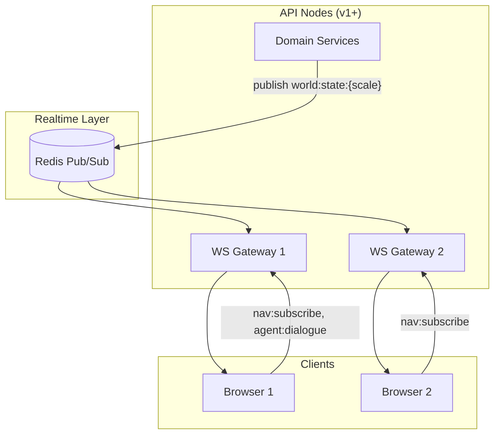
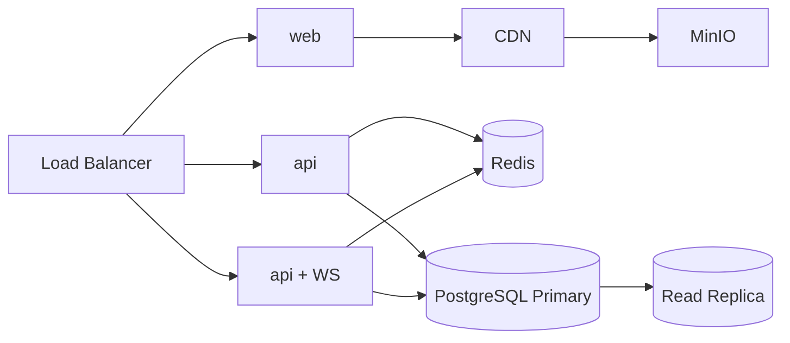

# Container Diagram — ULTRON AI WORLD

> **C4 Container level** · Shows deployable/runtime containers and all communication paths between User, Frontend, Three.js Engine, AI Systems, Databases, Realtime Systems, and External APIs.

---

## Container Overview

ULTRON AI WORLD is a **monorepo** with two primary application containers (`web`, `api`) backed by data stores and an AI inference sidecar. The **Three.js rendering engine runs entirely in the user's browser** — it is not a server container but a client-side runtime bound to the Frontend container.

| Container           | Technology              | Responsibility                             |
| ------------------- | ----------------------- | ------------------------------------------ |
| **Frontend (web)**  | Next.js 15+, React 19   | Routing, UI shell, state, WebSocket client |
| **Three.js Engine** | R3F, Three.js (client)  | 3D scenes, LOD, shaders, scene graph       |
| **Backend API**     | NestJS                  | REST, WebSocket gateway, orchestration     |
| **AI Systems**      | LangGraph, Model Router | Agent workflows, inference, tools          |
| **Job Workers**     | Bull (Redis-backed)     | Simulation, training, embedding batches    |
| **PostgreSQL**      | pgvector/pg16           | Relational + vector + checkpoints          |
| **Redis**           | Redis 7                 | Cache, Pub/Sub, queues, agent runtime      |
| **Object Storage**  | MinIO (S3-compatible)   | glTF, textures, immutable assets           |
| **Ollama**          | Ollama                  | Local LLM fallback and training            |
| **Observability**   | Prometheus, Grafana     | Metrics and dashboards                     |

---

## Container Diagram

---

## Container Communication Matrix

### User ↔ Frontend ↔ Three.js Engine

| Path                  | Mechanism                          | Payload                                     |
| --------------------- | ---------------------------------- | ------------------------------------------- |
| User → Frontend       | DOM events, keyboard               | Navigation, selection, dialogue input       |
| Frontend → Three.js   | React props, Zustand subscriptions | Entity data, scale level, LOD tier          |
| Three.js → Frontend   | Selection callbacks, raycast hits  | `entityId`, world coordinates               |
| Three.js ← worldStore | Reactive sync                      | Buildings, agents, metrics for active scale |

The Three.js Engine **never** calls external APIs directly. All authoritative state flows: **API → worldStore → Scene Graph → R3F components**.

### Frontend ↔ Backend API

| Pattern                 | Protocol                             | Use cases                                     |
| ----------------------- | ------------------------------------ | --------------------------------------------- |
| Initial navigation load | REST `GET /api/v1/navigation/:scale` | Scale-aware entity bundle                     |
| CRUD / search / auth    | REST                                 | Districts, agents, governance, health         |
| Realtime sync           | WebSocket `wss://host/ws`            | World diffs, agent status, dialogue stream    |
| Degraded mode           | REST polling + SSE                   | `GET /world/state` every 5s; dialogue via SSE |

Single WebSocket connection, multiplexed event channels ([`docs/architecture/api-contracts.md`](../docs/architecture/api-contracts.md)).

### Backend API ↔ Databases

| Store          | Access pattern                   | Data                                                                                 |
| -------------- | -------------------------------- | ------------------------------------------------------------------------------------ |
| **PostgreSQL** | Prisma ORM + raw SQL for vectors | Districts, buildings, agents, memories, dialogues, checkpoints, simulation snapshots |
| **Redis**      | ioredis                          | Navigation cache (30s), agent runtime, inference budgets, Pub/Sub channels           |
| **MinIO**      | S3 SDK                           | glTF models, texture atlases; CDN-origin in v1                                       |

### Backend API ↔ AI Systems

| Path       | Trigger                   | Flow                                                   |
| ---------- | ------------------------- | ------------------------------------------------------ |
| Dialogue   | `agent:dialogue` WS event | Gateway → AgentOrchestrator → LangGraph → Model Router |
| Delegation | `agent:delegate` (v1)     | Orchestrator spawns sub-graph on target agent          |
| Embedding  | Memory write, search      | EmbeddingService → OpenRouter → pgvector insert        |
| Training   | `start_training` tool     | Bull `training` queue → Ollama GPU worker              |

AI Systems run **in-process** with the API container at MVP/v1. At v2+, inference may split to dedicated **AI Worker Pool** containers sharing PostgreSQL and Redis.

### Realtime Systems (WebSocket + Redis Pub/Sub)

| Redis channel         | Publisher         | Consumer        |
| --------------------- | ----------------- | --------------- |
| `world:state:{scale}` | WorldStateService | All WS gateways |
| `agent:status`        | AgentService      | All WS gateways |
| `simulation:events`   | SimulationService | All WS gateways |
| `defense:alerts`      | DefenseService    | All WS gateways |

### External APIs

| Integration      | Caller             | Safety                                        |
| ---------------- | ------------------ | --------------------------------------------- |
| OpenRouter       | ModelRouterService | API key in env; HTTPS only                    |
| Ollama           | ModelRouterService | Internal network only                         |
| Third-party REST | ToolExecutor       | Allowlist proxy; schema validation; audit log |

---

## Scalability Bottlenecks by Container

| Container               | Limit (v1)                     | Bottleneck                            | Mitigation                                                       |
| ----------------------- | ------------------------------ | ------------------------------------- | ---------------------------------------------------------------- |
| **Frontend + Three.js** | 200 buildings, 50 full avatars | GPU draw calls, JS heap               | LOD manager, dynamic imports, viewport culling                   |
| **Backend API**         | ~1,000 users / node            | WS connections (10K max), CPU         | Horizontal API nodes; sticky WS or shared Redis fan-out          |
| **AI Systems**          | 50 concurrent LangGraph        | Memory per instance; OpenRouter cost  | Instance pool; destroy on session end; Ollama for classification |
| **PostgreSQL**          | 500K memories                  | Vector query latency; connection pool | PgBouncer; read replica; Qdrant migration trigger at 1M rows     |
| **Redis**               | Pub/Sub not durable            | Message loss on disconnect            | Full snapshot on reconnect; `nav:ack` protocol                   |
| **MinIO + CDN**         | 200 buildings × 500KB          | Egress, cold start                    | CDN required v1; lazy district load                              |
| **Ollama**              | 4 CPU, 8GB, GPU                | GPU memory, queue depth               | Separate GPU worker; reject training at 90% GPU                  |

---

## Future Expansion Strategy

### Phase: MVP (single node)

All containers on one Coolify host. AI in-process with API. No CDN (dev/staging acceptable).

### Phase: v1 (1,000 users)

- Split API from DB host
- CDN in front of MinIO
- PgBouncer connection pooling
- Read replica for navigation queries

### Phase: v2 (10,000 users)

- API farm (3+ nodes)
- Redis Cluster
- Dedicated **AI Worker Pool** containers (decouple inference from WS gateway)
- GPU nodes for Ollama + training
- Evaluate Qdrant for vector search at 1M+ memories

### Phase: Future (100,000+ users)

- Kubernetes migration
- PostgreSQL sharding by district
- Edge WebSocket servers
- Event sourcing + CQRS for world history
- Multi-region with CRDT sync (research phase)

---

## Related Documents

- [`component-diagram.md`](component-diagram.md) — NestJS modules and frontend layers
- [`deployment-diagram.md`](deployment-diagram.md) — Physical topology and CI/CD
- [`data-flow-diagram.md`](data-flow-diagram.md) — End-to-end data paths
- [`event-flow-diagram.md`](event-flow-diagram.md) — Event catalog and async flows
- [`agent-flow-diagram.md`](agent-flow-diagram.md) — LangGraph lifecycle
