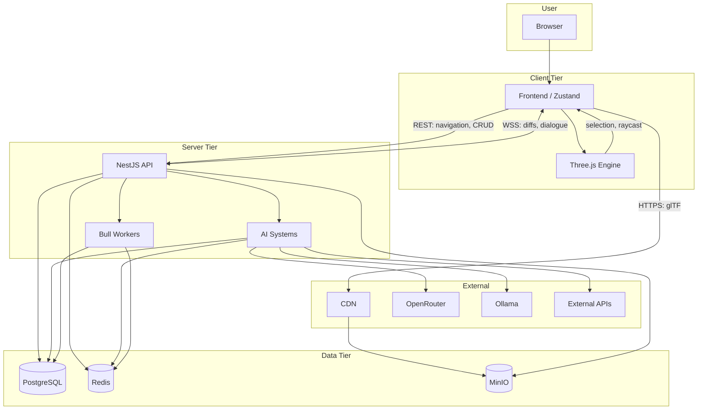
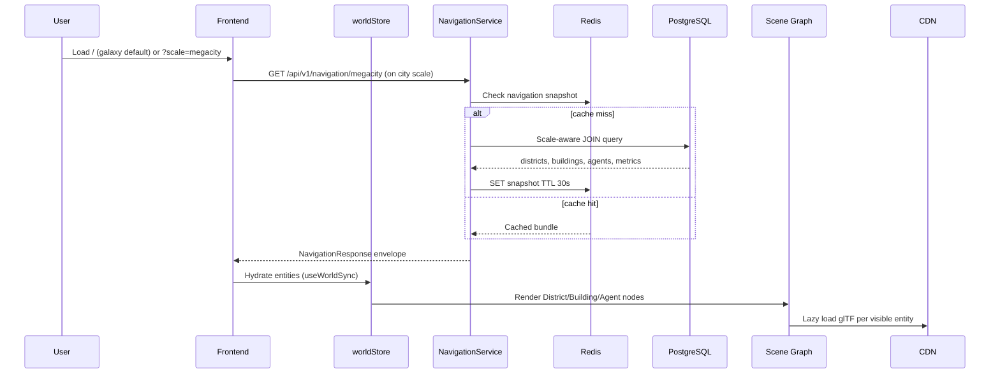
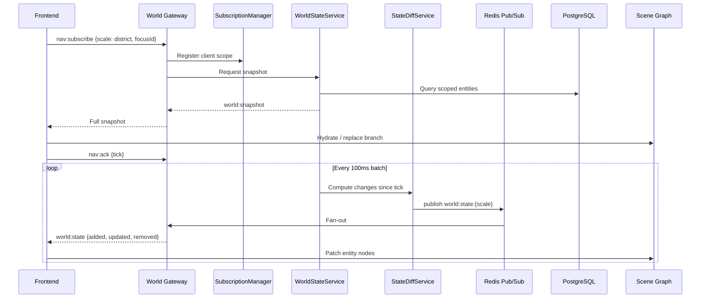
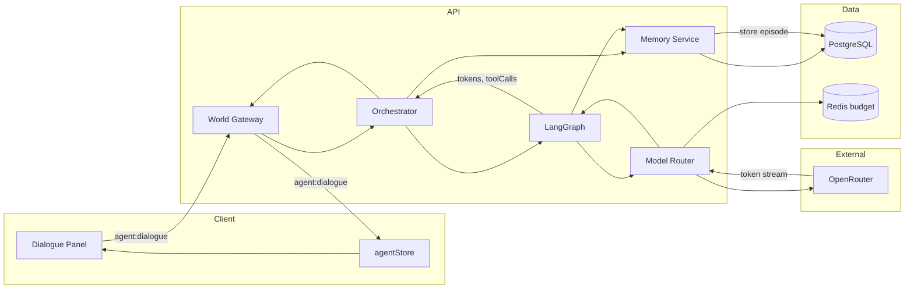
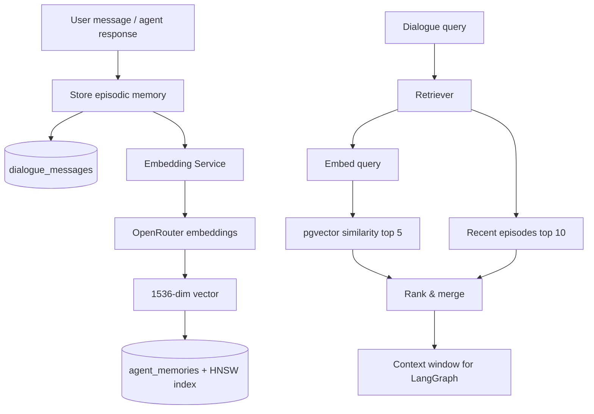
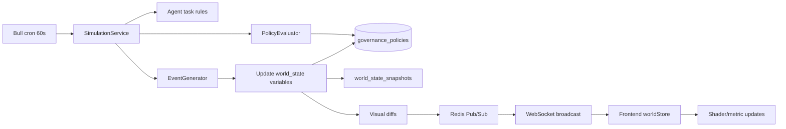
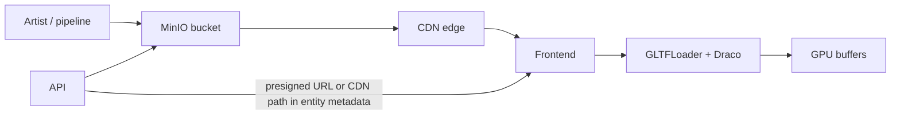
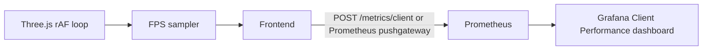

# Data Flow Diagram — ULTRON AI WORLD

> End-to-end movement of data among User, Frontend, Three.js Engine, Backend API, AI Systems, Databases, Realtime layer, and External APIs.

---

## Data Classification

| Class                   | Examples                         | Authority             | Storage               |
| ----------------------- | -------------------------------- | --------------------- | --------------------- |
| **World entities**      | Districts, buildings, agents     | Server (PostgreSQL)   | PostgreSQL            |
| **Ephemeral runtime**   | Agent status, WS subscriptions   | Server (Redis)        | Redis                 |
| **Semantic memory**     | Agent memories, embeddings       | Server                | PostgreSQL + pgvector |
| **3D geometry**         | glTF meshes, textures            | CDN/MinIO (immutable) | MinIO + client cache  |
| **Client view state**   | Camera, selection, UI panels     | Client                | Zustand + session     |
| **Inference artifacts** | LangGraph checkpoints, dialogues | Server                | PostgreSQL            |
| **Metrics**             | FPS, latency, token counts       | Both                  | Prometheus            |

**Invariant**: Server sends **entity state**, never geometry. Client maps state → Scene Graph nodes locally.

---

## Master Data Flow Overview

---

## Flow 1: Initial World Load (REST)

User opens the app at **Galaxy** (production entry per [ADR-0016](../docs/adr/0016-galaxy-first-entry-and-scale-phasing.md)); scroll journey or `?scale=` deep-link reaches megacity, then REST hydrates city data.

| Step              | Data shape                                        | Size estimate (v1 megacity) |
| ----------------- | ------------------------------------------------- | --------------------------- |
| Navigation bundle | Districts + 200 building summaries + agent counts | 50–200 KB JSON              |
| glTF per building | Draco compressed mesh                             | ~500 KB each (lazy)         |
| Agent summaries   | id, status, position, role                        | ~500 B × 500 agents         |

---

## Flow 2: Realtime State Sync (WebSocket Diffs)

After subscribe, server pushes incremental changes only.

### Diff merge rules (client)

| Operation | Scene Graph action                      |
| --------- | --------------------------------------- |
| `added`   | Create node, fetch glTF if building     |
| `updated` | Patch position, status, metrics shaders |
| `removed` | Unmount node, dispose GPU resources     |

---

## Flow 3: Agent Dialogue (Streaming)

Dialogue **history** is not sent over WebSocket — client fetches via `GET /agents/:id/memory` when opening profile.

---

## Flow 4: Memory Write & Retrieval

| Memory type | Storage            | Retrieval weight |
| ----------- | ------------------ | ---------------- |
| Semantic    | pgvector           | 0.5              |
| Episodic    | PostgreSQL recency | 0.3              |
| Procedural  | Role match         | 0.2              |

---

## Flow 5: Simulation Tick (v1+, Background)

Simulation uses **rule engine**, not LLM per agent per tick (cost control).

---

## Flow 6: 3D Asset Pipeline

| Phase | Delivery                                |
| ----- | --------------------------------------- |
| MVP   | Direct MinIO or bundled assets          |
| v1    | CDN required; Service Worker cache      |
| v2    | Per-district lazy load; texture atlases |

---

## Flow 7: Client Performance Telemetry (Optional)

Feeds ADR-0014 performance gates (60 FPS design, 30 FPS ship bar).

---

## Caching Data Flow

| Data                | Layer           | TTL       | Invalidation   |
| ------------------- | --------------- | --------- | -------------- |
| Navigation snapshot | Redis           | 30 s      | Entity change  |
| District metadata   | Redis           | 1 h       | Policy change  |
| Building metrics    | Redis           | 5 s       | Metric update  |
| Agent runtime       | Redis           | Session   | Status change  |
| glTF assets         | CDN + browser   | Immutable | Version in URL |
| Embeddings          | PostgreSQL HNSW | —         | No cache       |

---

## Scalability Bottlenecks (Data Path)

| Flow                 | Bottleneck                            | Threshold                     | Mitigation                                                        |
| -------------------- | ------------------------------------- | ----------------------------- | ----------------------------------------------------------------- |
| Navigation REST      | Large JSON at megacity                | 200 buildings + 500 agents    | Cache, pagination, read replica                                   |
| WS diffs             | 64 KB frame limit; 100ms batch volume | 1,000 subscribers at megacity | Scale-scoped subscriptions; throttle off-viewport positions to 5s |
| Memory retrieval     | HNSW query latency                    | p95 > 100ms at 1M rows        | Qdrant migration; partition `agent_memories`                      |
| Embedding writes     | OpenRouter rate                       | 100 req/min MVP               | Bull `embedding` queue batch                                      |
| Asset load           | Uncached 400MB city                   | First visit                   | CDN, Draco, lazy district                                         |
| Checkpoint writes    | LangGraph state size                  | 50 concurrent sessions        | Compress state; Redis hot checkpoint (v2)                         |
| Simulation snapshots | 1,440 ticks/day                       | v2 history growth             | Monthly partition; 90-day retention                               |

---

## Future Expansion Strategy

| Data domain      | v1              | v2                         | Future                    |
| ---------------- | --------------- | -------------------------- | ------------------------- |
| Navigation reads | Read replica    | CQRS read model            | GraphQL federation        |
| World history    | Snapshot table  | Partitioned snapshots      | Event sourcing            |
| Vectors          | pgvector        | Dual-write Qdrant          | Dedicated vector cluster  |
| Assets           | CDN + MinIO     | R2/CloudFront multi-region | Edge asset pre-warm       |
| Client state     | Zustand session | CRDT collaborative view    | Multi-user presence       |
| Dialogue archive | PostgreSQL      | Monthly partition          | Cold storage (S3 Glacier) |

---

## Related Documents

- [`event-flow-diagram.md`](event-flow-diagram.md) — Event naming and async paths
- [`agent-flow-diagram.md`](agent-flow-diagram.md) — LangGraph data touchpoints
- **Source**: [`docs/architecture/database.md`](../docs/architecture/database.md) · [`docs/architecture/realtime.md`](../docs/architecture/realtime.md) · [`docs/architecture/api-contracts.md`](../docs/architecture/api-contracts.md)
