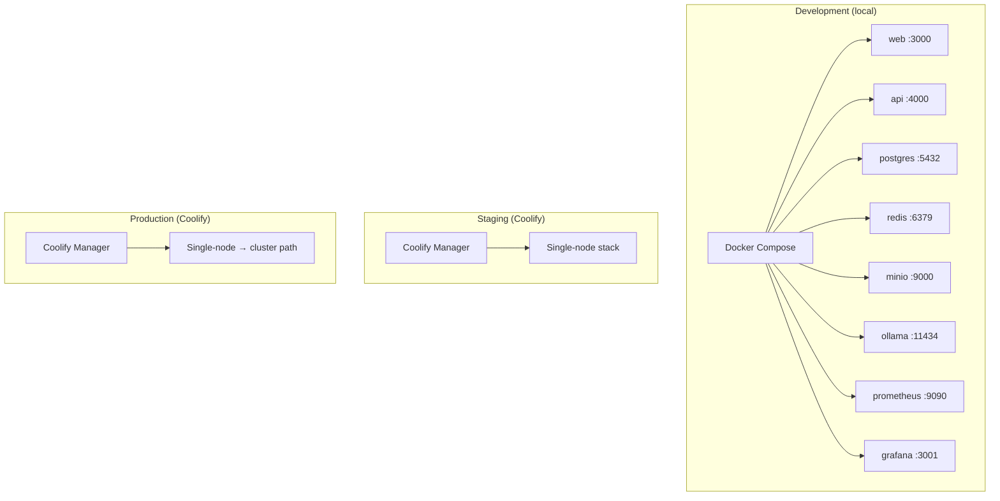
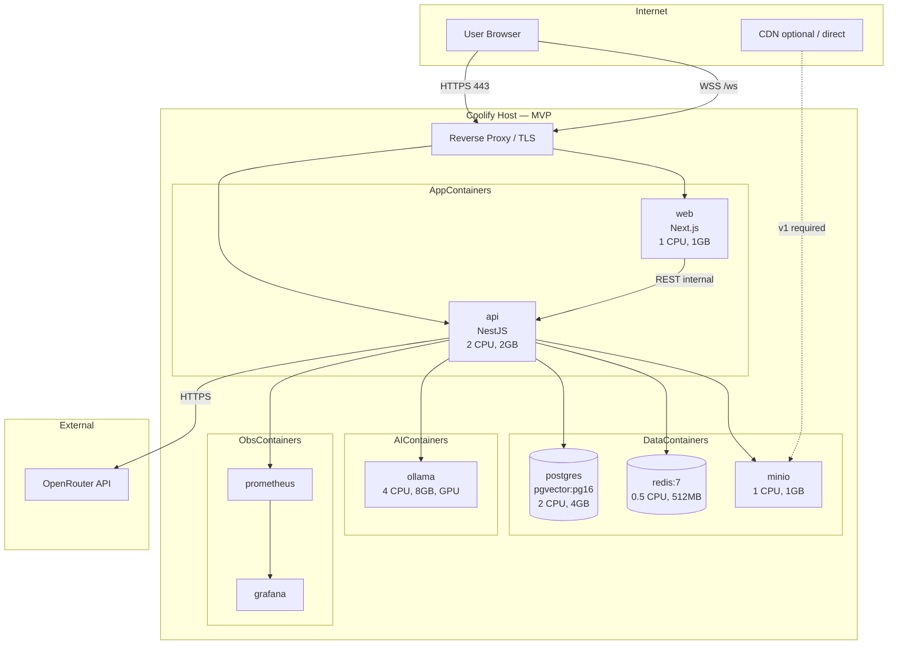
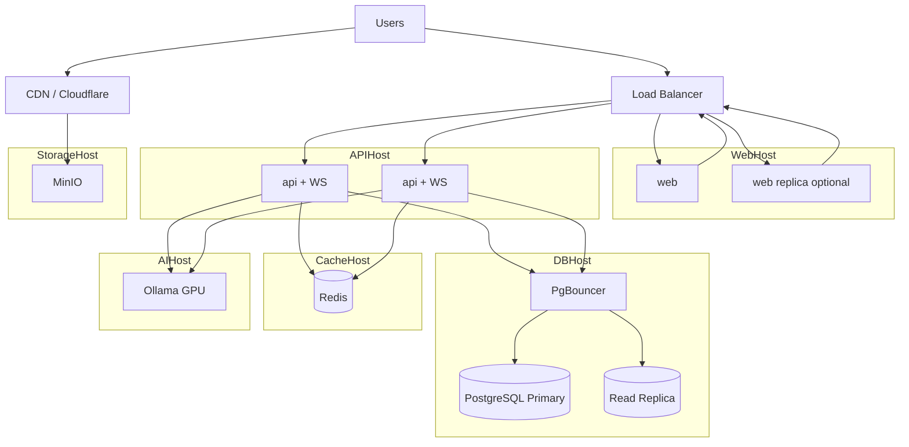
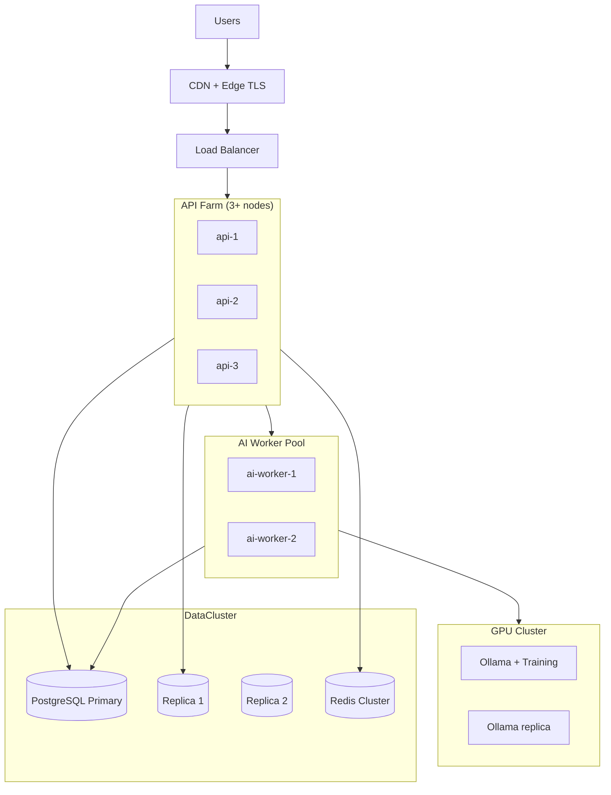
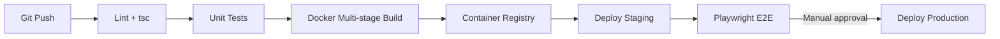
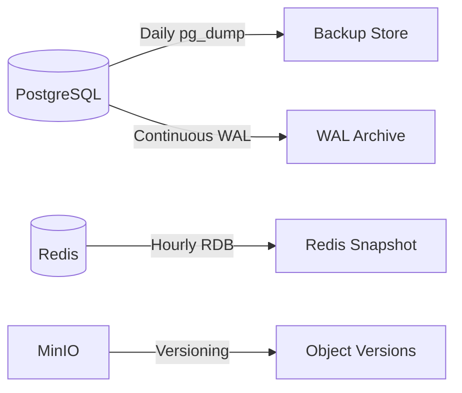

# Deployment Diagram — ULTRON AI WORLD

> Physical and logical deployment topology across environments and scale phases. No implementation code — infrastructure relationships only.

---

## Deployment Principles

| Principle                                      | Source                                                                            |
| ---------------------------------------------- | --------------------------------------------------------------------------------- |
| Docker-only; no bare-metal                     | [`docs/adr/0011-deployment-platform.md`](../docs/adr/0011-deployment-platform.md) |
| Coolify orchestration (no K8s at MVP)          | ADR-0011                                                                          |
| Single region until v2+                        | ADR-0011                                                                          |
| HTTPS via Let's Encrypt (Coolify)              | deployment.md                                                                     |
| Secrets via environment variables only         | Secure development rules                                                          |
| `prisma migrate deploy` on API container start | deployment.md                                                                     |

---

## Environment Topology

| Environment   | Purpose                      | Infrastructure                       |
| ------------- | ---------------------------- | ------------------------------------ |
| `development` | Local dev, integration tests | Docker Compose                       |
| `staging`     | Pre-production, E2E          | Coolify single node                  |
| `production`  | Live users                   | Coolify single node → multi-node v1+ |

---

## MVP Deployment (Single Node)

All services on one host. Target: **50 concurrent users**, 5 concurrent inference jobs.

### Container Resource Budget (MVP)

| Container    | Image               | Port  | CPU | RAM        | Notes                     |
| ------------ | ------------------- | ----- | --- | ---------- | ------------------------- |
| `web`        | `ultron-web:latest` | 3000  | 1   | 1 GB       | Static + SSR shell        |
| `api`        | `ultron-api:latest` | 4000  | 2   | 2 GB       | REST + WS + AI in-process |
| `postgres`   | `pgvector/pg16`     | 5432  | 2   | 4 GB       | Single source of truth    |
| `redis`      | `redis:7-alpine`    | 6379  | 0.5 | 512 MB     | Cache, Pub/Sub, Bull      |
| `minio`      | `minio/minio`       | 9000  | 1   | 1 GB       | glTF, textures            |
| `ollama`     | `ollama/ollama`     | 11434 | 4   | 8 GB + GPU | Fallback LLM              |
| `prometheus` | `prom/prometheus`   | 9090  | 0.5 | 512 MB     | Scrape `/metrics`         |
| `grafana`    | `grafana/grafana`   | 3001  | 0.5 | 512 MB     | Dashboards                |

**Ceiling**: ~1,000 users with degraded headroom; plan split at sustained CPU > 70%.

---

## v1 Deployment (Split API / DB)

Target: **1,000 concurrent users**, 50 concurrent LangGraph instances, CDN for assets.

### v1 Additions

- Load balancer with WebSocket sticky sessions (or stateless fan-out via Redis Pub/Sub)
- PgBouncer in front of PostgreSQL
- Read replica for `NavigationService` queries
- CDN origin → MinIO for 3D assets

---

## v2 Deployment (API Farm + GPU Pool)

Target: **10,000 concurrent users**, 200 concurrent LangGraph, 5,000 agents in DB.

---

## CI/CD Pipeline Deployment Flow

| Stage       | Gate                            |
| ----------- | ------------------------------- |
| Lint        | Zero ESLint/tsc errors          |
| Unit test   | > 80% coverage on services      |
| Build       | Image < 500 MB                  |
| Integration | Supertest + testcontainers      |
| E2E         | Critical paths pass             |
| Production  | Manual Coolify webhook approval |

---

## Network & Port Map

| Service    | Internal port | External exposure           |
| ---------- | ------------- | --------------------------- |
| web        | 3000          | 443 via proxy               |
| api        | 4000          | 443 `/api`, `/ws`           |
| postgres   | 5432          | **Internal only**           |
| redis      | 6379          | **Internal only**           |
| minio      | 9000          | Internal; CDN origin public |
| ollama     | 11434         | **Internal only**           |
| prometheus | 9090          | Internal / VPN              |
| grafana    | 3001          | Internal / VPN              |

---

## Environment Variables (Deployment Contract)

| Variable              | Service  | Secret      |
| --------------------- | -------- | ----------- |
| `DATABASE_URL`        | api      | Yes         |
| `REDIS_URL`           | api      | Yes         |
| `OPENROUTER_API_KEY`  | api      | Yes         |
| `OLLAMA_BASE_URL`     | api      | No          |
| `MINIO_*`             | api      | Keys secret |
| `NEXT_PUBLIC_API_URL` | web      | No          |
| `NEXT_PUBLIC_WS_URL`  | web      | No          |
| `JWT_SECRET`          | api (v1) | Yes         |

---

## Backup & Disaster Recovery

| Metric        | Target    |
| ------------- | --------- |
| RTO           | 1 hour    |
| RPO           | 5 minutes |
| PG retention  | 30 days   |
| WAL retention | 7 days    |

---

## Scalability Bottlenecks (Deployment)

| Bottleneck      | Signal                              | Action                           |
| --------------- | ----------------------------------- | -------------------------------- |
| Single-node RAM | Ollama + Postgres compete for 16GB+ | Split AI to GPU host             |
| API CPU         | p95 latency > 2s sustained          | Add API node                     |
| DB connections  | Pool > 80%                          | PgBouncer + replica              |
| WS per node     | > 5,000 connections                 | Add WS-capable API node          |
| GPU queue       | Depth > 100                         | Add Ollama worker                |
| Disk            | < 20% free                          | Expand volume; archive snapshots |

---

## Future Expansion Strategy

| Phase               | Infrastructure change                                             |
| ------------------- | ----------------------------------------------------------------- |
| **v2+**             | Kubernetes migration runbook; Helm charts from Docker Compose     |
| **Multi-region**    | Geographic routing; read replicas per region; CRDT research       |
| **Dedicated CDN**   | Cloudflare R2 or CloudFront for global glTF                       |
| **Observability**   | Loki log aggregation; Jaeger distributed tracing                  |
| **Deploy strategy** | Blue-green deployments; IaC (Terraform/Pulumi)                    |
| **100K users**      | Sharded PostgreSQL; edge WebSocket PoPs; dedicated vector cluster |

### Kubernetes trigger criteria

- API farm exceeds **10 nodes**
- Need automated pod autoscaling for inference workers
- Multi-region active-active required

Until then, Coolify remains the orchestrator of record per ADR-0011.

---

## Related Documents

- [`container-diagram.md`](container-diagram.md) — Logical containers
- [`system-context.md`](system-context.md) — External dependencies
- **Source**: [`docs/architecture/deployment.md`](../docs/architecture/deployment.md) · [`docs/architecture/scalability-plan.md`](../docs/architecture/scalability-plan.md)
