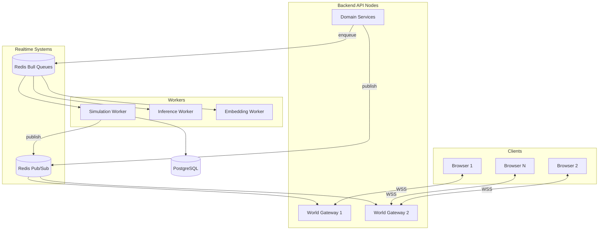
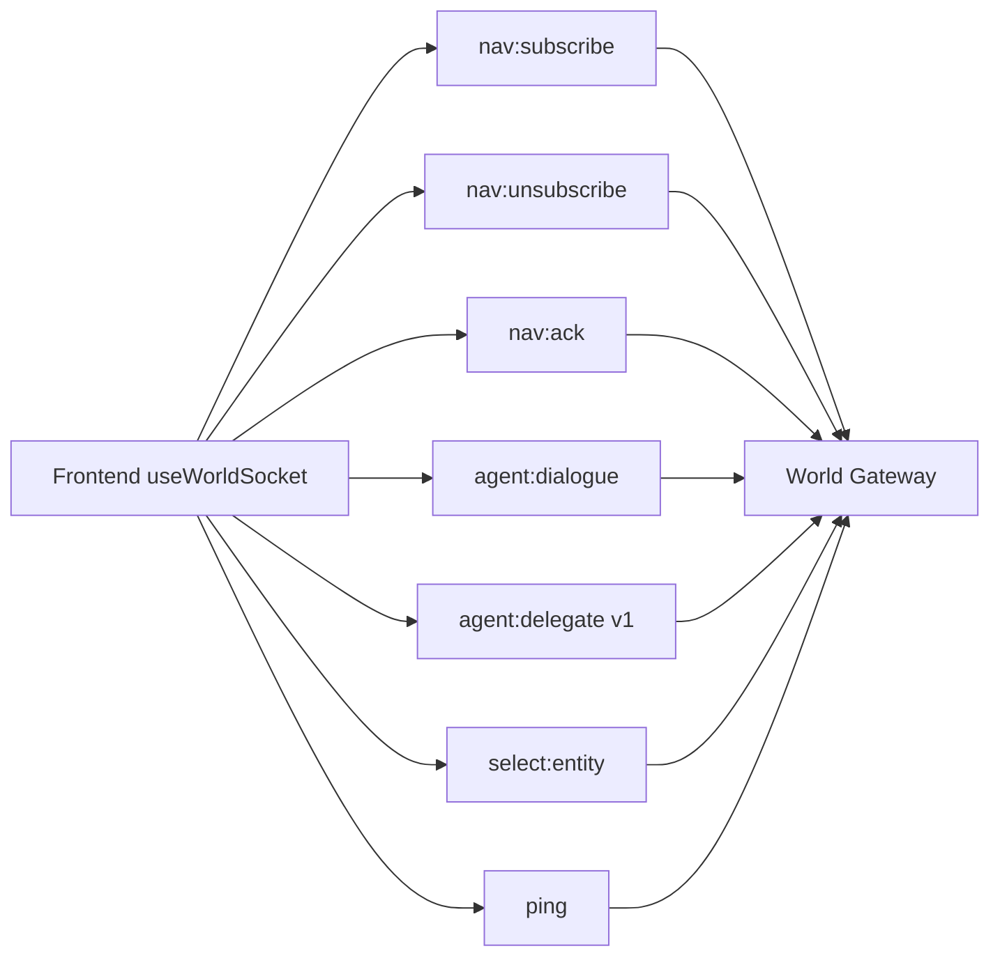
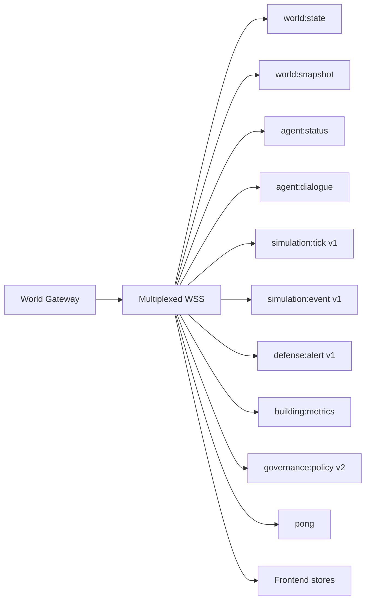
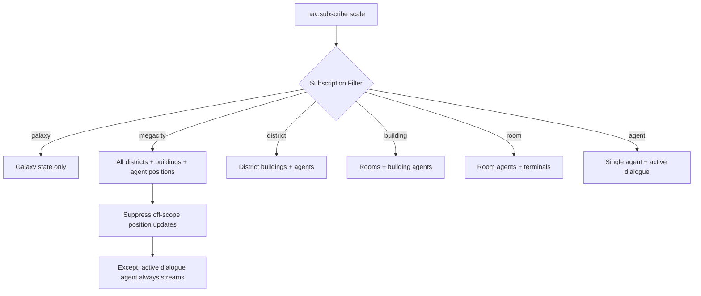
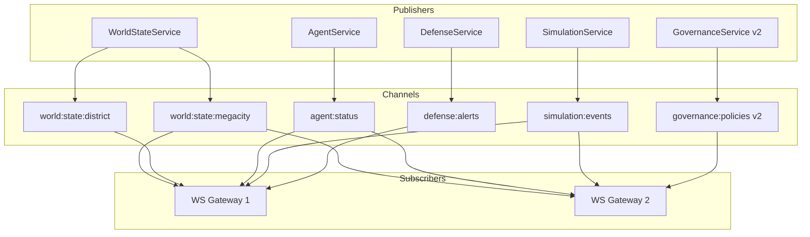
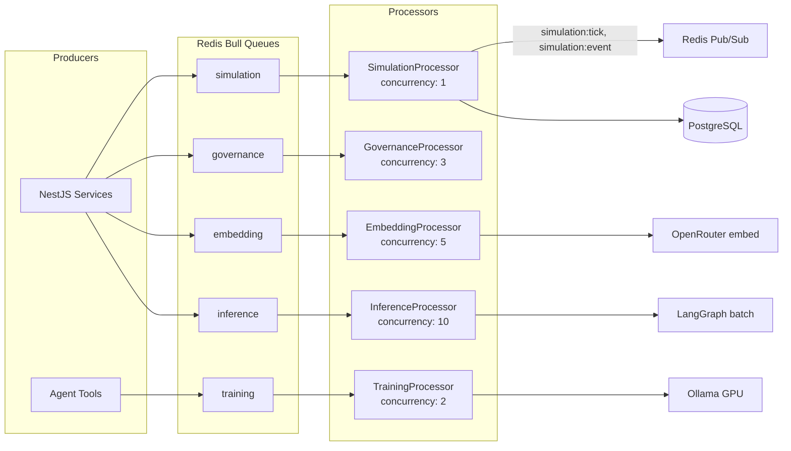
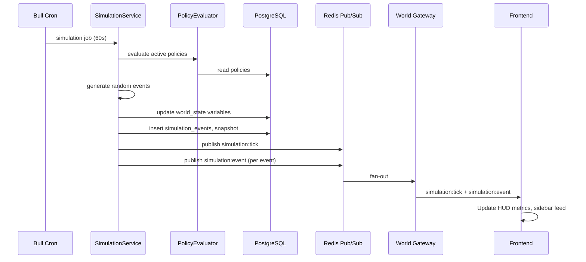
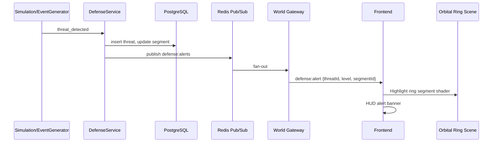
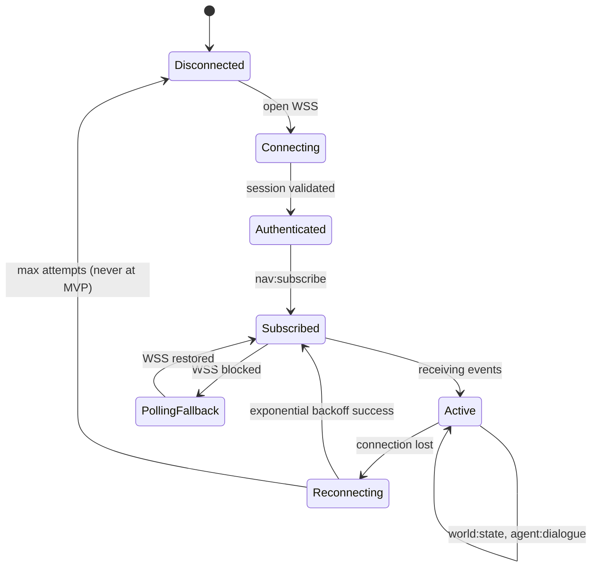
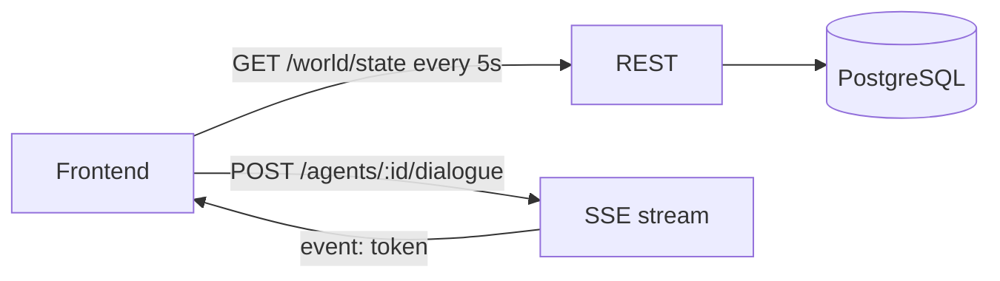

# Event Flow Diagram — ULTRON AI WORLD

> Async and realtime event paths across Frontend, Backend, Redis Pub/Sub, Bull queues, and External systems. Complements REST data flows in [`data-flow-diagram.md`](data-flow-diagram.md).

---

## Event Taxonomy

| Category                     | Transport           | Durability              | Examples                                   |
| ---------------------------- | ------------------- | ----------------------- | ------------------------------------------ |
| **Client ↔ Server realtime** | WebSocket (JSON)    | Connection-scoped       | `world:state`, `agent:dialogue`            |
| **Inter-service async**      | Redis Pub/Sub       | Ephemeral (not durable) | `world:state:{scale}`, `simulation:events` |
| **Background jobs**          | Bull (Redis queues) | Durable until processed | simulation tick, training, embedding       |
| **External callbacks**       | HTTPS               | Provider-dependent      | OpenRouter streaming chunks                |
| **Fallback**                 | REST polling / SSE  | Request-scoped          | `GET /world/state`, dialogue SSE           |

Authoritative contract: [`docs/architecture/api-contracts.md`](../docs/architecture/api-contracts.md) · ADR-0015

---

## Realtime Event Bus Architecture

---

## WebSocket Event Catalog

### Client → Server

| Event             | Handler                     | Downstream                   |
| ----------------- | --------------------------- | ---------------------------- |
| `nav:subscribe`   | SubscriptionManager         | WorldStateService → snapshot |
| `nav:unsubscribe` | SubscriptionManager         | Remove from channel          |
| `nav:ack`         | WorldStateService           | Confirm snapshot received    |
| `agent:dialogue`  | AgentOrchestrator           | LangGraph → Model Router     |
| `agent:delegate`  | AgentOrchestrator           | Target agent graph (v1)      |
| `select:entity`   | Analytics / future presence | Optional metrics             |
| `ping`            | Gateway                     | `pong` with serverTime       |

### Server → Client

| Event               | Frequency           | Throttle     | Consumer store              |
| ------------------- | ------------------- | ------------ | --------------------------- |
| `world:state`       | On change           | 100 ms batch | worldStore                  |
| `world:snapshot`    | Subscribe/reconnect | Once         | worldStore                  |
| `agent:status`      | On change           | None         | worldStore, Scene Graph     |
| `agent:dialogue`    | Streaming           | None         | agentStore → Dialogue Panel |
| `simulation:tick`   | 60 s                | None         | worldStore                  |
| `simulation:event`  | Per event           | None         | uiStore sidebar             |
| `defense:alert`     | On detection        | None         | worldStore, HUD             |
| `building:metrics`  | 5 s                 | Per-building | Scene Graph shaders         |
| `governance:policy` | On change           | None         | worldStore (v2)             |

---

## Subscription Scoping Event Filter

Clients receive only events for **subscribed scale and children**:

Reduces fan-out noise at megacity scale (critical for v1 — see scalability R3).

---

## Redis Pub/Sub Channel Map

**Durability caveat (R7)**: Pub/Sub messages are lost if no subscriber is connected. Mitigation: `world:snapshot` on reconnect + client `nav:ack {tick}` within 5 s.

---

## Bull Queue Event Flow

| Queue        | Trigger               | Output events                           |
| ------------ | --------------------- | --------------------------------------- |
| `simulation` | Cron 60 s             | `simulation:tick`, `simulation:event`   |
| `inference`  | Batch jobs            | Internal completion; optional WS notify |
| `training`   | `start_training` tool | `simulation:event` on complete          |
| `embedding`  | Memory write          | None (DB update only)                   |
| `governance` | Policy evaluation     | `governance:policy` (v2)                |

---

## Simulation Event Flow (v1)

---

## Defense Alert Event Flow (v1)

---

## Connection Lifecycle Events

### Reconnect event sequence

1. Client reconnects with exponential backoff (1s → 30s max)
2. Server assigns `clientId`; prior subscriptions cleared
3. Client re-sends `nav:subscribe` with last known scale
4. Server sends `world:snapshot` (full state, not diffs)
5. Client sends `nav:ack {tick}`

---

## Fallback Event Path (No WebSocket)

Used when corporate proxies block WSS. Half-duplex for dialogue (SSE), polling for world state.

---

## Backpressure & Event Dropping

| Signal                  | Policy              | Events affected               |
| ----------------------- | ------------------- | ----------------------------- |
| Inference queue > 50    | HTTP 429            | New `agent:dialogue` rejected |
| WS client queue > 1000  | Drop non-critical   | `building:metrics` first      |
| DB connection wait > 5s | Circuit breaker 503 | All REST; WS publish delayed  |
| Payload > 64 KB         | Split frames        | `world:state`                 |
| Token budget exceeded   | Route to Ollama     | Model Router internal event   |

---

## Scalability Bottlenecks (Event Path)

| Bottleneck                       | Impact                                  | Mitigation                                                                       |
| -------------------------------- | --------------------------------------- | -------------------------------------------------------------------------------- |
| **Megacity diff fan-out**        | 1,000 clients × large diffs every 100ms | Scale-scoped subscriptions; delta fields only; off-viewport position throttle 5s |
| **Redis Pub/Sub not durable**    | Missed events during deploy             | Snapshot on subscribe; `nav:ack`                                                 |
| **Single simulation worker**     | Tick backlog                            | Keep concurrency 1; optimize tick < 5s; never LLM in tick                        |
| **WS 10K connections/node**      | Memory, CPU                             | Horizontal gateway nodes                                                         |
| **Dialogue stream head-of-line** | Slow client blocks gateway buffer       | Per-session stream isolation; disconnect slow clients                            |
| **Bull Redis single instance**   | Queue bottleneck at v2                  | Redis Cluster                                                                    |

---

## Future Expansion Strategy

| Capability               | Event mechanism                                             |
| ------------------------ | ----------------------------------------------------------- |
| **Multi-user presence**  | New channel `presence:scene`; CRDT sync research            |
| **Durable event log**    | Replace Pub/Sub with Redis Streams or NATS JetStream        |
| **Binary protocol**      | MessagePack for high-frequency agent positions              |
| **WebTransport**         | Lower-latency dialogue and diffs                            |
| **Event sourcing**       | Append-only `domain_events` table; rebuild world from log   |
| **Webhook integrations** | Outbound events for external systems (governance decisions) |
| **Edge WS**              | Geographic Pub/Sub bridges; scale-scoped edge caches        |

### Event versioning

All WebSocket messages carry `version: 1` in envelope. Breaking changes require contract version bump per ADR-0015.

---

## Related Documents

- [`data-flow-diagram.md`](data-flow-diagram.md) — Payload persistence paths
- [`agent-flow-diagram.md`](agent-flow-diagram.md) — Dialogue and tool events
- **Source**: [`docs/architecture/realtime.md`](../docs/architecture/realtime.md) · [`docs/architecture/api-contracts.md`](../docs/architecture/api-contracts.md)
