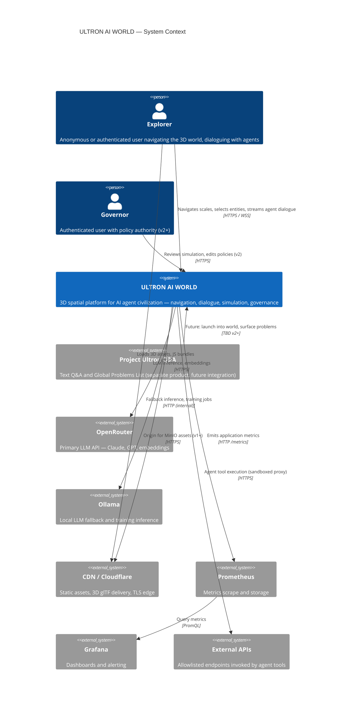
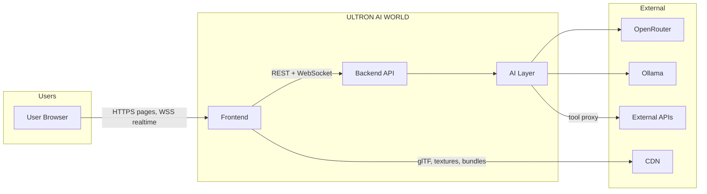

# System Context — ULTRON AI WORLD

> **Staff Architect view** · Derived from [`docs/`](../docs/) · Canonical numbers: [`docs/canonical-numbers.md`](../docs/canonical-numbers.md)

---

## Purpose

This document defines **ULTRON AI WORLD** at the highest architectural level: who uses it, what it does, and which external systems it depends on. It is the C4 **System Context** diagram for the platform — a 3D AI civilization explorer where users navigate from megacity to individual agent memory, dialogue with LangGraph-powered agents, and (from v1+) observe a live world simulation.

---

## System Boundary

| Inside boundary                        | Outside boundary                                       |
| -------------------------------------- | ------------------------------------------------------ |
| Next.js frontend (2D UI + 3D shell)    | OpenRouter (LLM gateway)                               |
| Three.js / R3F rendering (client-only) | Ollama (local LLM fallback)                            |
| NestJS API (REST + WebSocket)          | CDN / Cloudflare (asset delivery)                      |
| Agent orchestration (LangGraph)        | Prometheus + Grafana (observability)                   |
| PostgreSQL + pgvector + Redis + MinIO  | Project Ultron Q&A (separate product, v2+ integration) |

**Hard constraint**: No client-side AI calls. All LLM traffic routes through the backend Model Router ([ADR-0005](../docs/adr/0005-ai-architecture.md)).

---

## System Context Diagram

---

## Actors

### Explorer (primary)

- **MVP**: Anonymous session, megacity entry, 6 navigable scale levels, dialogue with 50 agents
- **v1**: Optional JWT, 500 agents, simulation ticks, orbital defense views
- **v2**: Galaxy → memory graph, 5,000 agents with swarm LOD, governance read access

### Governor (v2+)

- Authenticated role with policy edit authority
- Interacts via governance REST endpoints and policy change WebSocket events
- Does not bypass Model Router or execute tools directly

### System Operators (implicit)

- Deploy via Coolify, monitor Grafana, manage secrets
- Not in-product actors; covered in [`deployment-diagram.md`](deployment-diagram.md)

---

## External System Dependencies

| System                 | Role                               | Failure mode                | Mitigation                                                       |
| ---------------------- | ---------------------------------- | --------------------------- | ---------------------------------------------------------------- |
| **OpenRouter**         | Primary LLM and embedding provider | Timeout, rate limit, outage | Model Router → Ollama fallback; budget routing to smaller models |
| **Ollama**             | Local inference, training          | GPU OOM, model not loaded   | Queue backpressure; reject training jobs at 90% GPU              |
| **CDN**                | Asset delivery (required v1+)      | Slow first load             | Draco/KTX2 compression; lazy district loading                    |
| **Prometheus/Grafana** | Observability                      | Metrics gap                 | Non-blocking scrape; health endpoints independent                |
| **External APIs**      | Agent `execute_api` tool           | Third-party failure         | Tool sandbox, allowlist, audit log; graceful tool error to user  |

---

## Communication Paths (Context Level)

| Path                | Protocol        | Data                               | Direction        |
| ------------------- | --------------- | ---------------------------------- | ---------------- |
| User → Frontend     | HTTPS           | HTML, JS, CSS                      | Pull             |
| User → Frontend     | WSS             | World diffs, agent dialogue tokens | Bidirectional    |
| Frontend → API      | HTTPS           | Navigation bundles, CRUD, search   | Request/response |
| Frontend → CDN      | HTTPS           | 3D assets (MinIO origin)           | Pull             |
| API → OpenRouter    | HTTPS           | Prompts, streaming completions     | Request/stream   |
| API → Ollama        | HTTP (internal) | Fallback inference                 | Request/stream   |
| API → External APIs | HTTPS           | Tool-invoked calls                 | Request/response |

---

## Scalability Bottlenecks (Context View)

At the system boundary, these are the **first constraints** that appear under load:

| Bottleneck                    | Symptom                                   | Phase impacted | Document                                                       |
| ----------------------------- | ----------------------------------------- | -------------- | -------------------------------------------------------------- |
| OpenRouter latency/cost       | P95 first token > 2s; runaway API bill    | MVP → v2       | [`agent-flow-diagram.md`](agent-flow-diagram.md)               |
| Single-node deployment        | CPU/RAM saturation ~1,000 users           | MVP → v1       | [`deployment-diagram.md`](deployment-diagram.md)               |
| WebSocket fan-out             | Megacity diff payloads; connection limits | v1             | [`event-flow-diagram.md`](event-flow-diagram.md)               |
| 3D asset delivery             | 400MB+ uncached city load                 | v1             | [`data-flow-diagram.md`](data-flow-diagram.md)                 |
| Agent population vs inference | 5,000 agents ≠ 5,000 LangGraph instances  | v2             | [`scalability-plan`](../docs/architecture/scalability-plan.md) |

---

## Future Expansion Strategy

### Product integration (v2+)

Per [`docs/integration/project-ultron-to-ai-world.md`](../docs/integration/project-ultron-to-ai-world.md):

- ULTRON AI WORLD becomes the **primary interface**
- Project Ultron Q&A becomes a Reasoning District interaction mode
- Global Problems List surfaces in Memory District archive

### Platform expansion

| Horizon    | Capability                               | Architectural enabler                                                         |
| ---------- | ---------------------------------------- | ----------------------------------------------------------------------------- |
| **v1**     | Simulation, defense ring, 1,000 users    | API/DB split, Redis Pub/Sub, read replica                                     |
| **v2**     | Galaxy view, governance UI, 10,000 users | API farm, Redis cluster, GPU worker pool                                      |
| **Future** | 50,000+ agents, multi-region             | Kubernetes, sharded PostgreSQL, dedicated vector DB (Qdrant), edge WebSockets |
| **Future** | Event sourcing, CQRS                     | Dedicated event store; navigation read models                                 |
| **Future** | WebGPU, WebXR                            | Client rendering migration; optional edge compute                             |

### Architectural invariants (do not break)

1. **Monorepo** — `apps/web`, `apps/api`, `packages/shared` ([ADR-0012](../docs/adr/0012-monorepo-structure.md))
2. **PostgreSQL as source of truth** — Redis ephemeral only
3. **Server-authoritative world state** — Client renders; server sends entity state, not geometry
4. **Model Router gate** — No direct LLM access from any tier
5. **Scale-scoped subscriptions** — Realtime noise bounded by navigation context

---

## Related Documents

| Document                                         | Scope                                        |
| ------------------------------------------------ | -------------------------------------------- |
| [`container-diagram.md`](container-diagram.md)   | Deployable containers and their interactions |
| [`component-diagram.md`](component-diagram.md)   | Internal modules within API and frontend     |
| [`deployment-diagram.md`](deployment-diagram.md) | Infrastructure topology by phase             |
| [`data-flow-diagram.md`](data-flow-diagram.md)   | Request/response and persistence flows       |
| [`event-flow-diagram.md`](event-flow-diagram.md) | Async events, Pub/Sub, simulation            |
| [`agent-flow-diagram.md`](agent-flow-diagram.md) | LangGraph, memory, tool execution            |

**Source docs**: [`docs/architecture/overview.md`](../docs/architecture/overview.md) · [`docs/adr/`](../docs/adr/)
