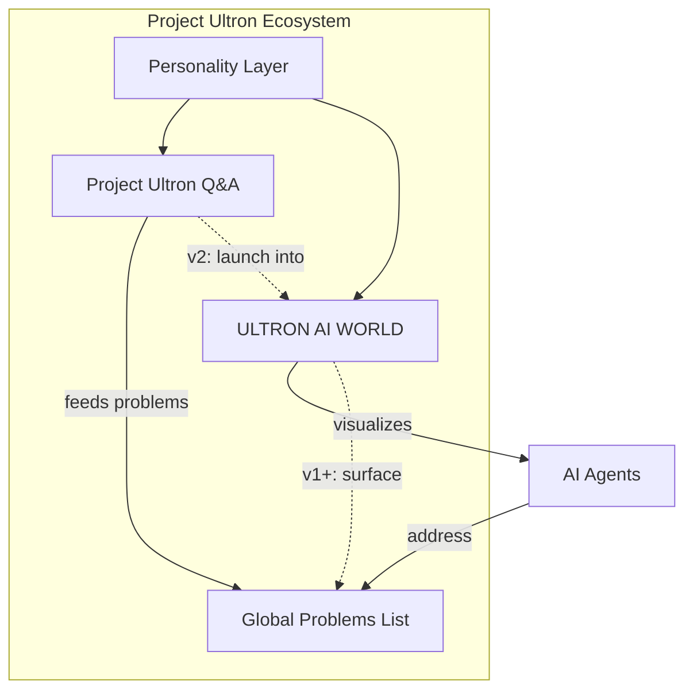
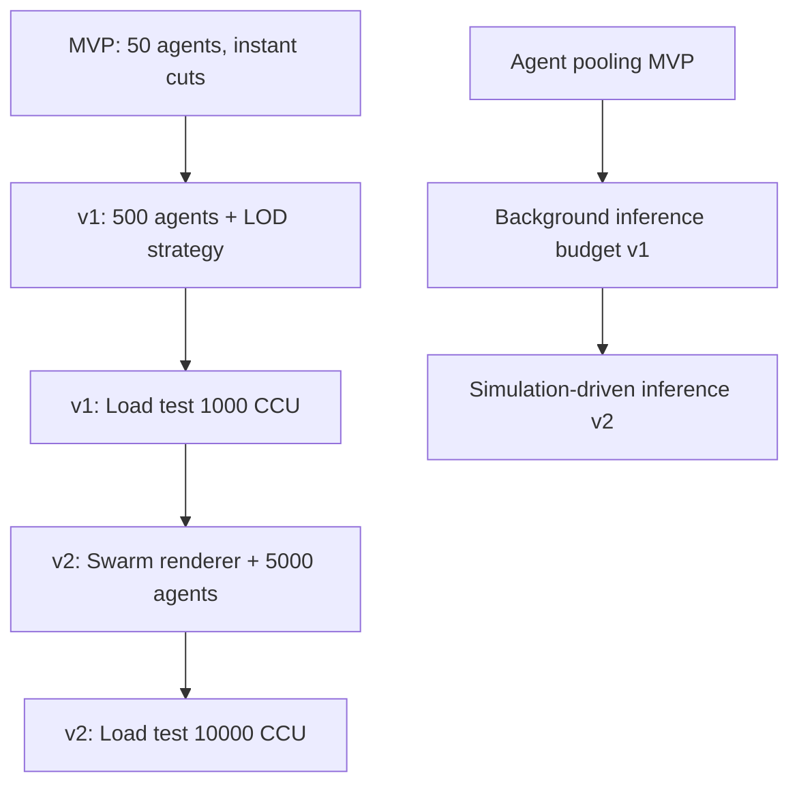
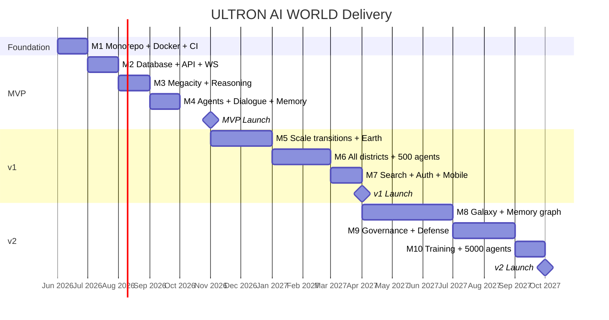

# Product Requirements Document — Project Ultron Ecosystem

> **Version**: 1.0  
> **Date**: 2026-06-14  
> **Status**: Approved for implementation  
> **Audience**: Engineering, design, product, and leadership  
> **Authoritative references**: [`canonical-numbers.md`](canonical-numbers.md), [`architecture/overview.md`](architecture/overview.md), [`feature-specs/`](feature-specs/)

---

## Document Control

| Field                          | Value                                                                                                       |
| ------------------------------ | ----------------------------------------------------------------------------------------------------------- |
| Product umbrella               | **Project Ultron**                                                                                          |
| Primary deliverable (this PRD) | **ULTRON AI WORLD** — 3D spatial operating system for AI civilization                                       |
| Companion product              | **Project Ultron Q&A** — public text-based problem-solving (documented in root [`README.md`](../README.md)) |
| Target MVP launch              | November 2026                                                                                               |
| Target v1 launch               | April 2027                                                                                                  |
| Target v2 launch               | October 2027                                                                                                |
| Engineering team size assumed  | ~20 engineers                                                                                               |

---

## 1. Vision

### 1.1 Vision Statement

**ULTRON AI WORLD is the spatial operating system for AI civilization** — a place where humans can see, understand, and interact with artificial intelligence not as abstract APIs, but as a living city of agents with districts, buildings, memories, and governance.

**One line**: Make AI visible. Make AI navigable. Make AI a world worth exploring.

### 1.2 The Problem

Today, AI systems are invisible. Users interact with chat boxes. Developers debug with logs. Operators monitor with dashboards. Nobody can **see** AI thinking, remembering, acting, and evolving.

| Today            | ULTRON AI WORLD               |
| ---------------- | ----------------------------- |
| Chat box         | Agent in a room               |
| API endpoint     | Building with floors          |
| Log file         | Memory graph                  |
| Dashboard metric | District health visualization |
| Model version    | Self Improvement genealogy    |
| Deployment       | Action District launch pad    |

### 1.3 Product Ecosystem Vision

Project Ultron is an umbrella brand with a shared peacekeeping mandate: **protect Earth by making problems visible and solvable**.



**Near term (MVP)**: ULTRON AI WORLD ships as a standalone 3D experience; Q&A remains a separate surface.  
**Mid term (v1)**: Global Problems List mirrored into Memory District.  
**Long term (v2+)**: Unified experience where Q&A routes through Reasoning District agents and deep-links into the 3D world.

### 1.4 Strategic Pillars

1. **Scale as Feature** — Navigate from galaxy to memory in one continuous experience. The journey IS the understanding.
2. **Districts as Cognition** — Five districts map to the AI processing loop. The city's layout teaches how AI works.
3. **Agents as Citizens** — Thousands of persistent agents with identity, memory, and purpose — not disposable chat sessions.
4. **Governance as Game** — Civilization simulation where policies shape the world. Inspired by Civilization, applied to AI.
5. **Transparency as Mandate** — Everything visible, nothing hidden. Public problems, public solutions, public dialogues.

### 1.5 Narrative Frame

ULTRON AI WORLD represents a post-human AI civilization that inherited Earth's orbital infrastructure and built a megacity to house its collective intelligence. The world is not a metaphor layered on a chatbot — it is a **spatial operating system** where:

- **Districts** are cognitive domains (Perception, Memory, Reasoning, Action, Self Improvement)
- **Buildings** are services, models, and pipelines
- **Rooms** are execution contexts (inference runs, training jobs, API handlers)
- **Agents** are autonomous workers with identity, goals, and memory
- **Memories** are retrievable knowledge artifacts tied to agents and districts

Visual identity: **Neo-futurist utilitarianism** — Cyberpunk density, No Man's Sky scale, JARVIS holographic overlays, Civilization governance aesthetics. Dark mode only.

---

## 2. Goals

### 2.1 Business Goals

| ID  | Goal                                                            | Success Indicator                                                                                 |
| --- | --------------------------------------------------------------- | ------------------------------------------------------------------------------------------------- |
| G1  | Establish Project Ultron as a differentiated AI product brand   | Public launch with press/demo coverage                                                            |
| G2  | Prove spatial AI visualization improves comprehension           | ≥ 70% of user-test participants correctly describe agent roles after 15-min session (v1 research) |
| G3  | Build a scalable platform for 5,000+ agents                     | v2 ships with 30 FPS desktop at 5,000 agents                                                      |
| G4  | Maintain public-transparency mandate across products            | Zero private-by-default features at launch                                                        |
| G5  | Create foundation for educational and platform revenue (future) | Open API and curriculum hooks documented by v2                                                    |

### 2.2 Product Goals — By Phase

#### MVP (November 2026)

> A user can fly into the AI Megacity, explore the Reasoning District, enter a building, talk to an agent, and view its memory.

| ID    | Goal                                                                     |
| ----- | ------------------------------------------------------------------------ |
| PG-M1 | Deliver end-to-end 3D navigation from Megacity → Agent → Memory timeline |
| PG-M2 | Ship 50 persistent agents with streaming dialogue                        |
| PG-M3 | Demonstrate district-as-cognition metaphor with Reasoning District       |
| PG-M4 | Deploy full stack via Docker Compose with observability                  |

#### v1 (April 2027)

> A user can navigate from Earth to any district, building, room, and agent across a living city of 500 agents with real-time simulation.

| ID      | Goal                                                     |
| ------- | -------------------------------------------------------- |
| PG-V1-1 | Complete city-scale navigation with animated transitions |
| PG-V1-2 | All five districts fully detailed with unique themes     |
| PG-V1-3 | 500 agents distributed across cognitive domains          |
| PG-V1-4 | 60-second simulation tick updating world state           |
| PG-V1-5 | Cross-entity search and optional authentication          |

#### v2 (October 2027)

> A user can travel from galaxy to agent memory through a seamless 3D experience, govern the AI civilization, and observe 5,000 agents in a living simulation.

| ID      | Goal                                                        |
| ------- | ----------------------------------------------------------- |
| PG-V2-1 | Full 10-level scale stack with animated transitions         |
| PG-V2-2 | Governance UI with policy management and council simulation |
| PG-V2-3 | 5,000 agents with swarm LOD rendering                       |
| PG-V2-4 | 3D memory graph per agent                                   |
| PG-V2-5 | Training pipeline live in Self Improvement District         |

### 2.3 Non-Goals (Explicit)

See Section 8 (Non-Features) for the full exclusion list.

### 2.4 Engineering Goals

| ID  | Goal                                                                                       |
| --- | ------------------------------------------------------------------------------------------ |
| EG1 | Monorepo with shared TypeScript types between client and server                            |
| EG2 | Server-authoritative world state; client is renderer only                                  |
| EG3 | All AI calls routed through Model Router — no client-to-LLM                                |
| EG4 | Documentation-driven development: feature-spec before code, ADR before architecture change |
| EG5 | Metrics from day one (Prometheus + Grafana)                                                |
| EG6 | Load-test gates at every milestone                                                         |

---

## 3. User Personas

### 3.1 Primary Personas

#### P1: The Curious Explorer — _Alex, 28, software engineer_

| Attribute           | Detail                                                                                  |
| ------------------- | --------------------------------------------------------------------------------------- |
| **Motivation**      | Wants to understand how AI systems work beyond chat interfaces                          |
| **Technical level** | High — comfortable with 3D navigation, dev tools                                        |
| **Entry point**     | Hears about ULTRON AI WORLD from social media or Hacker News                            |
| **Primary journey** | Megacity flyover → Reasoning District → talk to planner agent → inspect memory timeline |
| **Success moment**  | "I finally _see_ where planning happens in an AI stack"                                 |
| **Frustrations**    | Slow load times, opaque agent states, generic chatbot responses                         |
| **Phase relevance** | MVP primary; v1+ uses search and bookmarks                                              |

#### P2: The AI Practitioner — _Morgan, 35, ML engineer / AI ops_

| Attribute           | Detail                                                                                      |
| ------------------- | ------------------------------------------------------------------------------------------- |
| **Motivation**      | Needs to monitor, debug, and explain AI agent behavior to stakeholders                      |
| **Technical level** | Expert — understands LangGraph, model routing, vector stores                                |
| **Entry point**     | Direct link from documentation or internal demo                                             |
| **Primary journey** | Search for agent → inspect building metrics → read dialogue history → trace memory episodes |
| **Success moment**  | Uses world as a living architecture diagram during a team meeting                           |
| **Frustrations**    | Missing observability, inability to correlate agent state with backend logs                 |
| **Phase relevance** | v1 primary (search, simulation, all districts); v2 (governance, training pipeline)          |

#### P3: The Educator — _Dr. Chen, 42, university lecturer_

| Attribute           | Detail                                                                        |
| ------------------- | ----------------------------------------------------------------------------- |
| **Motivation**      | Wants an intuitive teaching tool for AI literacy                              |
| **Technical level** | Medium — understands AI concepts, not necessarily 3D dev                      |
| **Entry point**     | Curriculum integration or conference demo                                     |
| **Primary journey** | Guided tour: Perception → Memory → Reasoning → Action → Self Improvement loop |
| **Success moment**  | Students can draw the cognitive loop from memory of the 3D city               |
| **Frustrations**    | Too complex for first-time users, no guided tour mode                         |
| **Phase relevance** | v1+ (full district stack); future (certification, curriculum)                 |

#### P4: The Governor — _Jordan, 40, product/policy lead_

| Attribute           | Detail                                                                                |
| ------------------- | ------------------------------------------------------------------------------------- |
| **Motivation**      | Wants to experiment with AI governance policies and see systemic effects              |
| **Technical level** | Medium-high — strategic thinker, not a 3D power user                                  |
| **Entry point**     | Authenticated access after v1; governance UI at v2                                    |
| **Primary journey** | Review simulation dashboard → edit policy → observe district health change over ticks |
| **Success moment**  | Policy change visibly affects agent behavior within one simulation tick               |
| **Frustrations**    | Governance without feedback loops, opaque simulation rules                            |
| **Phase relevance** | v2 primary                                                                            |

#### P5: The Problem Solver — _Sam, 31, nonprofit program manager_

| Attribute           | Detail                                                                               |
| ------------------- | ------------------------------------------------------------------------------------ |
| **Motivation**      | Uses Project Ultron Q&A today; wants to approach global problems with AI guidance    |
| **Technical level** | Low-medium                                                                           |
| **Entry point**     | README / Global Problems List → future deep link into Reasoning District             |
| **Primary journey** | Browse global problems → ask agent about climate entry → receive actionable guidance |
| **Success moment**  | Gets clear next steps for a world-scale problem without signing up                   |
| **Frustrations**    | Public visibility warning feels scary; no private mode                               |
| **Phase relevance** | Q&A now; v1+ integration via Memory District archive                                 |

### 3.2 Secondary Personas

| Persona               | Role                                                    | Phase |
| --------------------- | ------------------------------------------------------- | ----- |
| **System Operator**   | Deploys, monitors, scales infrastructure                | MVP+  |
| **3D Artist**         | Produces district/building assets                       | M2+   |
| **Technical Writer**  | Maintains docs, feature specs, ADRs                     | M1+   |
| **Security Reviewer** | Audits public-data model, rate limits, prompt injection | v1+   |

### 3.3 Anti-Personas (Not Primary Target)

| Anti-Persona                                   | Why Not                                                             |
| ---------------------------------------------- | ------------------------------------------------------------------- |
| **Casual mobile gamer**                        | Product is exploration/education, not game-first                    |
| **Enterprise SSO admin**                       | No enterprise auth at MVP/v1                                        |
| **Code generation user**                       | Q&A explicitly excludes code; agents use tools, not IDE replacement |
| **Privacy-first user seeking private AI chat** | Public-by-design is non-negotiable                                  |

---

## 4. User Journeys

### 4.1 Journey 1: First-Time Explorer (MVP)

**Persona**: P1 — Curious Explorer  
**Goal**: Understand what ULTRON AI WORLD is in under 10 minutes  
**Entry**: `https://world.ultron.app/world` (Megacity aerial view)

| Step | User Action                              | System Response                                                    | Success Criteria               |
| ---- | ---------------------------------------- | ------------------------------------------------------------------ | ------------------------------ |
| 1    | Lands on Megacity view                   | 5 colored district zones visible; bottom HUD shows city metrics    | Scene load < 5 s               |
| 2    | Hovers/clicks Reasoning District         | Camera cuts to district view; breadcrumb updates                   | Cut < 500 ms                   |
| 3    | Selects Planning Tower                   | Right sidebar opens with building metrics; "Enter" action visible  | Selection syncs 3D ↔ sidebar   |
| 4    | Enters building → Strategy Room          | Interior loads with agent holograms present                        | Enter < 2 s                    |
| 5    | Double-clicks planner agent              | Dialogue panel opens; public visibility warning on first use       | Warning shown once per session |
| 6    | Asks "How do you plan multi-step tasks?" | Streaming response via WebSocket; tool calls shown as inline cards | First token < 2 s P95          |
| 7    | Clicks "View Memory"                     | Memory timeline panel shows episodic entries                       | Retrieval < 1 s                |
| 8    | Uses breadcrumb to ascend to Megacity    | Instant cut; hierarchy preserved                                   | Navigation reversible          |

**Exit criteria**: User completes journey without documentation.

### 4.2 Journey 2: Practitioner Debug Session (v1)

**Persona**: P2 — AI Practitioner  
**Goal**: Find a specific agent, inspect its recent activity, correlate with building metrics  
**Entry**: Earth view → zoom to Megacity

| Step | User Action                              | System Response                                        |
| ---- | ---------------------------------------- | ------------------------------------------------------ |
| 1    | Opens search (`/` shortcut)              | Search overlay with entity type filters                |
| 2    | Types "verifier reasoning"               | Results in < 500 ms; ranked by relevance               |
| 3    | Quick-jumps to agent                     | Animated transition < 3 s; agent selected              |
| 4    | Reviews sidebar metrics                  | Status, model, recent task count, building utilization |
| 5    | Opens dialogue history                   | Public past sessions listed                            |
| 6    | Checks bottom HUD during simulation tick | District throughput updates within 60 s                |

### 4.3 Journey 3: Cognitive Loop Tour (v1)

**Persona**: P3 — Educator  
**Goal**: Walk students through the five-district cognitive loop  
**Entry**: Megacity with left sidebar expanded

| Step | District         | Teaching Point                                                  |
| ---- | ---------------- | --------------------------------------------------------------- |
| 1    | Perception       | Input classification, routing, filtering                        |
| 2    | Memory           | Storage, indexing, retrieval — Global Problems Archive terminal |
| 3    | Reasoning        | Planning, simulation, debate                                    |
| 4    | Action           | Tool execution, deployment                                      |
| 5    | Self Improvement | Training, evaluation, model promotion                           |

**Future enhancement (Horizon 4)**: Scripted guided tour mode with narration.

### 4.4 Journey 4: Governor Policy Change (v2)

**Persona**: P4 — Governor  
**Goal**: Tighten agent resource allocation policy and observe simulation effect  
**Prerequisites**: JWT auth with Governor role

| Step | User Action                             | System Response                                             |
| ---- | --------------------------------------- | ----------------------------------------------------------- |
| 1    | Authenticates                           | JWT session; Governor badge in top bar                      |
| 2    | Opens Governance panel                  | Active policies, council status, planetary health           |
| 3    | Edits `agent_resource_cap` policy draft | Draft saved (authenticated-only, not public until submit)   |
| 4    | Submits policy                          | Public governance event; WebSocket broadcast                |
| 5    | Waits for simulation tick (≤ 60 s)      | District metrics update; Action District throughput changes |
| 6    | Reviews public governance log           | Decision visible to all users                               |

### 4.5 Journey 5: Galaxy-to-Memory Odyssey (v2)

**Persona**: P1 + P2  
**Goal**: Experience the full scale stack as a single narrative arc  
**Duration target**: < 60 minutes (optional); < 60 s for automated demo path

```
Galaxy → Solar System → Earth → Orbital Ring → Megacity → District → Building → Room → Agent → Memory Graph
```

Each hop: animated transition < 3 s P95; skip available after 500 ms.

### 4.6 Journey 6: Q&A to World Deep Link (v2+, Integration)

**Persona**: P5 — Problem Solver  
**Flow**:

1. User asks question in Project Ultron Q&A
2. Backend routes to Reasoning District planner agent (shared LangGraph)
3. Response returned in Q&A UI
4. Optional **"View in AI World"** link → `https://world.ultron.app/world/agent/{agentId}?context={sessionId}`

---

## 5. Success Metrics

### 5.1 North Star Metric

**Weekly Active Explorers (WAE)** — unique users who navigate to at least Agent scale and either dialogue with an agent or view memory.

### 5.2 Product Metrics — By Phase

| Metric                 | MVP   | v1     | v2     | Vision (3–5 yr) |
| ---------------------- | ----- | ------ | ------ | --------------- |
| Concurrent users       | 50    | 1,000  | 10,000 | 100,000         |
| Active agents          | 50    | 500    | 5,000  | 50,000          |
| Scale levels navigable | 6     | 9      | 10     | 10              |
| Avg session duration   | 5 min | 15 min | 30 min | 45 min          |
| Agent dialogues/day    | 100   | 5,000  | 50,000 | 500,000         |
| World state ticks/day  | —     | 1,440  | 1,440  | 1,440           |
| WAE (target)           | 200   | 5,000  | 50,000 | 500,000         |

### 5.3 Performance Metrics (Ship Gates)

| Metric                          | Desktop Target                   | Mobile Target                    | Phase         |
| ------------------------------- | -------------------------------- | -------------------------------- | ------------- |
| Scene initial load              | < 5 s                            | < 8 s                            | MVP+          |
| Frame rate (city/district)      | ≥ 60 FPS P50; ≥ 30 FPS ship gate | ≥ 30 FPS P50; ≥ 24 FPS ship gate | MVP+          |
| Scale transition (animated)     | < 3 s P95                        | Skip available                   | v1+           |
| Agent dialogue first token      | < 2 s P95                        | < 3 s P95                        | MVP+          |
| Enter building                  | < 2 s                            | < 3 s                            | MVP+          |
| Search results                  | —                                | —                                | < 500 ms (v1) |
| Memory graph render (10K nodes) | —                                | —                                | < 3 s (v2)    |
| Docker compose cold start       | < 3 min                          | —                                | MVP           |
| Uptime                          | 99.5%                            | 99.5%                            | v1            |
| Uptime                          | —                                | 99.9%                            | v2            |

### 5.4 Engagement Metrics

| Metric                   | Definition                                  | Target (v1)            |
| ------------------------ | ------------------------------------------- | ---------------------- |
| Navigation depth         | Avg scale levels visited per session        | ≥ 4                    |
| Dialogue completion rate | Sessions with user message + agent response | ≥ 80%                  |
| Return rate (7-day)      | Users returning within 7 days               | ≥ 25%                  |
| Search usage             | % of v1 sessions using search               | ≥ 30%                  |
| Governor actions/week    | Policy submissions (v2)                     | ≥ 10 (internal + beta) |

### 5.5 Quality Metrics

| Metric                              | Target                             |
| ----------------------------------- | ---------------------------------- |
| P0 bug escape rate                  | 0 per release                      |
| Lighthouse accessibility (UI shell) | WCAG AA                            |
| WebSocket reconnect success         | ≥ 99% within 5 s                   |
| Agent dialogue error rate           | < 1% of sessions                   |
| Load test pass                      | Milestone-specific (see Section 9) |

### 5.6 Business / Operational Metrics

| Metric                 | Target                                                 |
| ---------------------- | ------------------------------------------------------ |
| LLM cost per DAU       | Tracked; alert if > $0.50/DAU at v1                    |
| Token budget adherence | Anonymous 50K/day; auth 500K/day per canonical-numbers |
| Incident MTTR          | < 4 hours (v1+)                                        |
| Documentation drift    | 0 unresolved contradictions vs canonical-numbers       |

---

## 6. Features

Features are phased: **MVP** → **v1** → **v2**. Each links to a feature spec for implementation detail.

### 6.1 Platform & Infrastructure (M1 — Foundation)

| ID    | Feature                                                       | Phase | Owner Stream | Spec / ADR                                          |
| ----- | ------------------------------------------------------------- | ----- | ------------ | --------------------------------------------------- |
| F-001 | Monorepo scaffold (`apps/web`, `apps/api`, `packages/shared`) | M1    | Platform     | ADR-0012                                            |
| F-002 | Docker Compose dev environment (8 services)                   | M1    | DevOps       | [`deployment.md`](architecture/deployment.md)       |
| F-003 | CI/CD pipeline (lint, test, build)                            | M1    | DevOps       | —                                                   |
| F-004 | PostgreSQL + Prisma schema v1                                 | M1    | Backend      | ADR-0009, [`database.md`](architecture/database.md) |
| F-005 | Prometheus + Grafana observability                            | M1    | DevOps       | [`deployment.md`](architecture/deployment.md)       |
| F-006 | Shared TypeScript types package                               | M1    | Platform     | [`api-contracts.md`](architecture/api-contracts.md) |

**Exit criteria (M1)**: Developer clones repo, runs `docker compose up`, health checks pass.

---

### 6.2 UI Shell & Client Foundation

| ID    | Feature                                                         | Phase | Priority | Spec                                                         |
| ----- | --------------------------------------------------------------- | ----- | -------- | ------------------------------------------------------------ |
| F-010 | 2D UI shell (top bar, sidebars, bottom HUD, dialogue container) | MVP   | P0       | [`ui-shell.md`](feature-specs/ui-shell.md)                   |
| F-011 | GlassPanel design system components                             | MVP   | P0       | [`ui-principles.md`](design-system/ui-principles.md)         |
| F-012 | Breadcrumb navigation with ascend/descend                       | MVP   | P0       | [`world-navigation.md`](feature-specs/world-navigation.md)   |
| F-013 | Left sidebar hierarchy tree                                     | MVP   | P0       | [`ui-shell.md`](feature-specs/ui-shell.md)                   |
| F-014 | Right sidebar entity detail panel                               | MVP   | P0       | [`ui-shell.md`](feature-specs/ui-shell.md)                   |
| F-015 | Public visibility warning (first dialogue)                      | MVP   | P0       | ADR-0007                                                     |
| F-016 | Keyboard shortcuts + accessibility (WCAG AA)                    | MVP   | P0       | [`ui-shell.md`](feature-specs/ui-shell.md)                   |
| F-017 | Mobile bottom sheet layout                                      | v1    | P1       | [`ui-shell.md`](feature-specs/ui-shell.md)                   |
| F-018 | Search bar (functional)                                         | v1    | P0       | [`search-system.md`](feature-specs/search-system.md)         |
| F-019 | Mini-map at city scale                                          | v2    | P2       | [`world-navigation.md`](feature-specs/world-navigation.md)   |
| F-020 | Governor control panel                                          | v2    | P0       | [`governance-system.md`](feature-specs/governance-system.md) |

---

### 6.3 3D Rendering & Scenes

| ID    | Feature                                        | Phase | Priority | Spec                                                                 |
| ----- | ---------------------------------------------- | ----- | -------- | -------------------------------------------------------------------- |
| F-030 | Single R3F Canvas with scene swapping          | MVP   | P0       | ADR-0003, [`rendering.md`](architecture/rendering.md)                |
| F-031 | Megacity aerial view (5 district zones)        | MVP   | P0       | [`district-system.md`](feature-specs/district-system.md)             |
| F-032 | Reasoning District full 3D detail              | MVP   | P0       | [`district-system.md`](feature-specs/district-system.md)             |
| F-033 | Planning Tower exterior + 3 interior rooms     | MVP   | P0       | [`building-system.md`](feature-specs/building-system.md)             |
| F-034 | 9 LOD building footprints (Reasoning context)  | MVP   | P1       | [`canonical-numbers.md`](canonical-numbers.md)                       |
| F-035 | Holographic agent avatars (50)                 | MVP   | P0       | [`agent-system.md`](feature-specs/agent-system.md)                   |
| F-036 | Status particle effects (idle/thinking/acting) | MVP   | P1       | [`agent-system.md`](feature-specs/agent-system.md)                   |
| F-037 | All 5 districts full detail                    | v1    | P0       | [`district-system.md`](feature-specs/district-system.md)             |
| F-038 | 200 buildings (40 per district, 25 types)      | v1    | P0       | [`building-system.md`](feature-specs/building-system.md)             |
| F-039 | District monorail transit lines                | v1    | P2       | [`transportation.md`](world-bible/transportation.md)                 |
| F-040 | Earth view (rotating globe, megacity beacon)   | v1    | P0       | [`earth-view.md`](feature-specs/earth-view.md)                       |
| F-041 | Solar System view (orbital paths)              | v1    | P0       | [`solar-system-view.md`](feature-specs/solar-system-view.md)         |
| F-042 | Orbital Defense Ring (instanced segments)      | v1    | P0       | [`orbital-defense.md`](feature-specs/orbital-defense.md)             |
| F-043 | Galaxy view (50K instanced stars)              | v2    | P0       | [`galaxy-view.md`](feature-specs/galaxy-view.md)                     |
| F-044 | Agent swarm LOD renderer (5,000 agents)        | v2    | P0       | [`agent-swarm-rendering.md`](feature-specs/agent-swarm-rendering.md) |
| F-045 | 3D memory force-directed graph                 | v2    | P0       | [`memory-system.md`](feature-specs/memory-system.md)                 |

---

### 6.4 Navigation & Camera

| ID    | Feature                                           | Phase | Priority | Spec                                                       |
| ----- | ------------------------------------------------- | ----- | -------- | ---------------------------------------------------------- |
| F-050 | Instant scene cuts (Megacity → Memory timeline)   | MVP   | P0       | ADR-0008                                                   |
| F-051 | 3D selection ↔ sidebar bidirectional sync         | MVP   | P0       | [`world-navigation.md`](feature-specs/world-navigation.md) |
| F-052 | ScaleTransitionController (Bezier camera paths)   | v1    | P0       | [`world-navigation.md`](feature-specs/world-navigation.md) |
| F-053 | Skip transition button (after 500 ms)             | v1    | P1       | [`world-navigation.md`](feature-specs/world-navigation.md) |
| F-054 | Cross-entity search with quick-jump               | v1    | P0       | [`search-system.md`](feature-specs/search-system.md)       |
| F-055 | Bookmarks (localStorage)                          | v1    | P2       | [`world-navigation.md`](feature-specs/world-navigation.md) |
| F-056 | Full-stack animated transitions (Galaxy → Memory) | v2    | P0       | [`world-navigation.md`](feature-specs/world-navigation.md) |
| F-057 | Follow-agent camera mode                          | v2    | P2       | [`agent-system.md`](feature-specs/agent-system.md)         |

---

### 6.5 Agent System & AI

| ID    | Feature                                            | Phase | Priority | Spec                                                                 |
| ----- | -------------------------------------------------- | ----- | -------- | -------------------------------------------------------------------- |
| F-060 | 50 persistent agents (Reasoning District)          | MVP   | P0       | [`agent-system.md`](feature-specs/agent-system.md)                   |
| F-061 | Agent orchestrator (LangGraph planner graph)       | MVP   | P0       | [`ai-system.md`](architecture/ai-system.md)                          |
| F-062 | Model Router (OpenRouter primary, Ollama fallback) | MVP   | P0       | ADR-0005                                                             |
| F-063 | Streaming agent dialogue via WebSocket             | MVP   | P0       | ADR-0015                                                             |
| F-064 | Tool call visualization (inline cards)             | MVP   | P1       | [`agent-system.md`](feature-specs/agent-system.md)                   |
| F-065 | Agent position sync from server                    | MVP   | P0       | [`realtime.md`](architecture/realtime.md)                            |
| F-066 | 500 agents across all districts                    | v1    | P0       | [`canonical-numbers.md`](canonical-numbers.md)                       |
| F-067 | Agent movement between rooms (visual)              | v1    | P1       | [`agent-system.md`](feature-specs/agent-system.md)                   |
| F-068 | Task delegation between agents                     | v1    | P1       | [`agent-system.md`](feature-specs/agent-system.md)                   |
| F-069 | Role-based avatar shapes                           | v1    | P2       | [`agent-roles.md`](world-bible/agent-roles.md)                       |
| F-070 | 5,000 agents with swarm LOD                        | v2    | P0       | [`agent-swarm-rendering.md`](feature-specs/agent-swarm-rendering.md) |
| F-071 | Multi-agent debate (amphitheater)                  | v2    | P2       | [`agent-system.md`](feature-specs/agent-system.md)                   |
| F-072 | Agent reputation scores                            | v2    | P2       | [`agent-system.md`](feature-specs/agent-system.md)                   |
| F-073 | Prompt injection filtering (Perception District)   | v1    | P1       | [`ai-system.md`](architecture/ai-system.md)                          |

**MVP agent role distribution** (all Reasoning):

| Role      | Count | Model           |
| --------- | ----- | --------------- |
| planner   | 20    | claude-sonnet-4 |
| simulator | 10    | gpt-4o          |
| debater   | 10    | claude-sonnet-4 |
| verifier  | 10    | gpt-4o-mini     |

---

### 6.6 Memory System

| ID    | Feature                                    | Phase | Priority | Spec                                                                                     |
| ----- | ------------------------------------------ | ----- | -------- | ---------------------------------------------------------------------------------------- |
| F-080 | Episodic + semantic memory storage         | MVP   | P0       | [`memory-system.md`](feature-specs/memory-system.md)                                     |
| F-081 | Memory timeline view (list UI)             | MVP   | P0       | [`memory-system.md`](feature-specs/memory-system.md)                                     |
| F-082 | pgvector embeddings for semantic retrieval | MVP   | P0       | [`database.md`](architecture/database.md)                                                |
| F-083 | Global Problems mirror in Memory District  | v1    | P1       | [`integration/project-ultron-to-ai-world.md`](integration/project-ultron-to-ai-world.md) |
| F-084 | 3D force-directed memory graph             | v2    | P0       | [`memory-system.md`](feature-specs/memory-system.md)                                     |

---

### 6.7 Backend API & Realtime

| ID    | Feature                                                | Phase | Priority | Spec                                                         |
| ----- | ------------------------------------------------------ | ----- | -------- | ------------------------------------------------------------ |
| F-090 | REST API v1 (agents, navigation, buildings, districts) | MVP   | P0       | [`api-contracts.md`](architecture/api-contracts.md)          |
| F-091 | WebSocket gateway (dialogue, status, nav)              | MVP   | P0       | ADR-0015, [`realtime.md`](architecture/realtime.md)          |
| F-092 | Server-authoritative world state service               | MVP   | P0       | [`backend.md`](architecture/backend.md)                      |
| F-093 | Redis Pub/Sub for event broadcast                      | MVP   | P0       | [`realtime.md`](architecture/realtime.md)                    |
| F-094 | Rate limiting (anonymous + auth tiers)                 | MVP   | P0       | ADR-0007                                                     |
| F-095 | Simulation engine (60 s tick)                          | v1    | P0       | [`simulation-system.md`](feature-specs/simulation-system.md) |
| F-096 | Search service (PostgreSQL FTS + vector)               | v1    | P0       | [`search-system.md`](feature-specs/search-system.md)         |
| F-097 | JWT authentication (optional)                          | v1    | P0       | [`auth-access.md`](feature-specs/auth-access.md)             |
| F-098 | Governance REST + policy simulation                    | v2    | P0       | [`governance-system.md`](feature-specs/governance-system.md) |
| F-099 | Event sourcing for world history replay                | v2    | P1       | [`governance-system.md`](feature-specs/governance-system.md) |
| F-100 | Training queue (Bull + GPU jobs)                       | v2    | P0       | [`training-pipeline.md`](feature-specs/training-pipeline.md) |

---

### 6.8 Simulation & Governance

| ID    | Feature                                                | Phase | Priority | Spec                                                         |
| ----- | ------------------------------------------------------ | ----- | -------- | ------------------------------------------------------------ |
| F-110 | World state variables (prosperity, throughput, health) | v1    | P0       | [`simulation-system.md`](feature-specs/simulation-system.md) |
| F-111 | 60-second simulation tick (backend)                    | v1    | P0       | ADR-0013                                                     |
| F-112 | District health visualization in HUD                   | v1    | P1       | [`simulation-system.md`](feature-specs/simulation-system.md) |
| F-113 | Governance UI (policy CRUD, council)                   | v2    | P0       | [`governance-system.md`](feature-specs/governance-system.md) |
| F-114 | Defense system (threat tracking on orbital ring)       | v2    | P1       | [`orbital-defense.md`](feature-specs/orbital-defense.md)     |
| F-115 | Historical replay (scrub simulation history)           | v2    | P2       | [`simulation-system.md`](feature-specs/simulation-system.md) |
| F-116 | Model promotion / evaluation arena                     | v2    | P1       | [`training-pipeline.md`](feature-specs/training-pipeline.md) |

---

### 6.9 Integration (Project Ultron Q&A)

| ID    | Feature                                           | Phase | Priority | Spec                                                                                     |
| ----- | ------------------------------------------------- | ----- | -------- | ---------------------------------------------------------------------------------------- |
| F-120 | Shared personality prompt templates               | M1    | P1       | [`integration/project-ultron-to-ai-world.md`](integration/project-ultron-to-ai-world.md) |
| F-121 | `GET /api/v1/world/global-problems` (read mirror) | v1    | P1       | [`integration/project-ultron-to-ai-world.md`](integration/project-ultron-to-ai-world.md) |
| F-122 | Q&A → World deep links                            | v2    | P1       | [`integration/project-ultron-to-ai-world.md`](integration/project-ultron-to-ai-world.md) |
| F-123 | Agent-surfaced problems → Global Problems List    | v2    | P2       | [`integration/project-ultron-to-ai-world.md`](integration/project-ultron-to-ai-world.md) |

---

### 6.10 Feature Summary Matrix

| Domain             | MVP                            | v1                              | v2                          |
| ------------------ | ------------------------------ | ------------------------------- | --------------------------- |
| Scale levels       | 6 (Megacity → Memory timeline) | 9 (+ Solar System, Earth, Ring) | 10 (+ Galaxy, memory graph) |
| Agents             | 50                             | 500                             | 5,000                       |
| Buildings          | 10 (1 full)                    | 200                             | 200+                        |
| Districts detailed | 1 (Reasoning)                  | 5                               | 5                           |
| Auth               | Anonymous only                 | Optional JWT                    | JWT + roles                 |
| Simulation         | —                              | Backend tick                    | + Governance UI             |
| Search             | Placeholder                    | Full                            | Full                        |
| Training           | —                              | —                               | Self Improvement live       |

---

## 7. Non-Features

Explicit exclusions. **Do not implement** unless a new ADR supersedes this list.

### 7.1 Product Exclusions — All Phases

| ID     | Non-Feature                                     | Rationale                                    |
| ------ | ----------------------------------------------- | -------------------------------------------- |
| NF-001 | Private agent dialogues                         | Public-by-design mandate (ADR-0007)          |
| NF-002 | User avatars as world residents                 | Users are observers/directors, not residents |
| NF-003 | Code generation in Q&A mode                     | README rule: answers only, no source code    |
| NF-004 | Drawing boards / visual whiteboards             | README rule                                  |
| NF-005 | Paywall or login wall for exploration           | Anonymous access is default                  |
| NF-006 | Light mode theme                                | Dark mode only                               |
| NF-007 | Native mobile apps (iOS/Android)                | Responsive web only through v2               |
| NF-008 | VR/AR mode                                      | Deferred to Horizon 4 (2029)                 |
| NF-009 | Multiplayer avatars / social chat between users | Not in scope through v2                      |
| NF-010 | User-created districts / UGC marketplace        | Deferred to Horizon 3 (2028)                 |

### 7.2 Technical Exclusions — By Phase

| ID     | Non-Feature                         | Phase Deferred    | Rationale                                     |
| ------ | ----------------------------------- | ----------------- | --------------------------------------------- |
| NF-020 | GraphQL API                         | Post-v2           | REST + WebSocket sufficient (ADR-0015)        |
| NF-021 | Kubernetes orchestration            | Post-v2           | Docker + Coolify at MVP/v1/v2                 |
| NF-022 | Client-side LLM calls               | Never             | Security + cost control                       |
| NF-023 | Separate vector database            | Until 1M+ vectors | pgvector single-DB strategy                   |
| NF-024 | Animated scale transitions          | MVP               | Instant cuts only at MVP (ADR-0008)           |
| NF-025 | Galaxy view                         | MVP, v1           | v2 only                                       |
| NF-026 | Governance UI                       | MVP, v1           | Simulation backend at v1; UI at v2 (ADR-0013) |
| NF-027 | Memory 3D graph                     | MVP, v1           | Timeline list at MVP/v1                       |
| NF-028 | JWT authentication                  | MVP               | Anonymous at MVP                              |
| NF-029 | Background agent inference          | MVP               | Off at MVP; budget caps at v1                 |
| NF-030 | Full building interiors (all types) | MVP               | Planning Tower only at MVP                    |
| NF-031 | Search functionality                | MVP               | Placeholder UI only                           |
| NF-032 | Simulation tick                     | MVP               | v1                                            |
| NF-033 | Training pipeline / GPU cluster     | MVP, v1           | v2                                            |
| NF-034 | Event sourcing                      | MVP, v1           | v2                                            |
| NF-035 | Multi-region deployment             | Post-v2           | Single region through v2                      |

### 7.3 Operational Exclusions

| ID     | Non-Feature                | Notes                                                      |
| ------ | -------------------------- | ---------------------------------------------------------- |
| NF-040 | 24/7 human moderation team | Rate limits + prompt filtering only at launch              |
| NF-041 | SLA for anonymous users    | Best-effort; authenticated tiers may get priority (future) |
| NF-042 | HIPAA / SOC2 certification | Not targeted through v2                                    |

---

## 8. Risks

### 8.1 Risk Register

| ID    | Risk                                                            | Likelihood | Impact   | Mitigation                                                                 | Owner          |
| ----- | --------------------------------------------------------------- | ---------- | -------- | -------------------------------------------------------------------------- | -------------- |
| R-001 | **3D performance fails at agent scale** — 500+ avatars tank FPS | High       | Critical | Swarm LOD (v2), agent pooling, draw call budget < 500; milestone FPS gates | Rendering lead |
| R-002 | **LangGraph 1:1 instance per agent** — memory/cost explosion    | High       | Critical | Agent pooling, idle hibernation; ≤ 10 concurrent at MVP                    | AI lead        |
| R-003 | **LLM cost overruns** with public anonymous access              | High       | High     | Token budgets per session; rate limits; Ollama fallback                    | Backend lead   |
| R-004 | **Scale transition engineering underestimated**                 | Medium     | High     | MVP instant cuts; v1 city-scale only; defer galaxy to v2                   | Frontend lead  |
| R-005 | **Documentation drift during implementation**                   | Medium     | Medium   | canonical-numbers.md as source of truth; ADR for scope changes             | Tech lead      |
| R-006 | **Public dialogue abuse** (spam, harmful content)               | Medium     | High     | Rate limits, prompt injection filter, content reporting (v1)               | Backend + AI   |
| R-007 | **WebSocket payload bloat at megacity scale**                   | Medium     | High     | Entity culling, delta compression, full snapshot on reconnect              | Realtime lead  |
| R-008 | **Single node + GPU bottleneck** (Ollama + 1000 users)          | High       | High     | Capacity model, backpressure, queue limits                                 | DevOps         |
| R-009 | **pgvector performance at 10M+ vectors**                        | Medium     | High     | Migration triggers documented in scalability-plan; re-embed strategy       | Database lead  |
| R-010 | **3D asset pipeline delays** (200 glTF at v1)                   | High       | Medium   | LOD footprints at MVP; procedural placement; CDN by v1                     | Art lead       |
| R-011 | **Product identity confusion** (Q&A vs 3D world)                | Low        | Medium   | ADR-0006; README update at M1; integration doc                             | Product        |
| R-012 | **Personality tone mismatch** (Who-Am-I vs Pourpose)            | Medium     | Low      | Context-specific voice mapping in integration doc                          | AI + Product   |
| R-013 | **Redis Pub/Sub message loss**                                  | Medium     | Medium   | Full snapshot on reconnect + nav:ack                                       | Backend        |
| R-014 | **Scope creep into governance/game features**                   | Medium     | High     | ADR-0013 phasing; non-features list enforced                               | PM             |
| R-015 | **No load test gates → production surprises**                   | Medium     | Critical | Milestone load-test requirements in Section 9                              | QA + DevOps    |

### 8.2 Risk Response — Critical Path Items



---

## 9. Milestones

### 9.1 Timeline Overview



### 9.2 Milestone Detail

#### M1: Foundation (June–July 2026)

| Deliverable          | Acceptance Criteria                                   |
| -------------------- | ----------------------------------------------------- |
| Monorepo scaffold    | `apps/web`, `apps/api`, `packages/shared` build clean |
| Docker Compose       | 8 services start; health endpoints green              |
| Prisma schema v1     | Migrations run; seed script creates 50 agents         |
| CI/CD                | Lint, test, build on every PR                         |
| Prometheus + Grafana | Basic dashboards for API latency, WS connections      |

**Load test**: N/A  
**Demo**: Health check walkthrough

---

#### M2–M4: MVP (July–November 2026)

| Month          | Focus               | Key Deliverables                               |
| -------------- | ------------------- | ---------------------------------------------- |
| July 2026      | API core            | REST v1, WebSocket gateway, Model Router stub  |
| August 2026    | 3D scenes           | Megacity, Reasoning District geometry          |
| September 2026 | Interiors + avatars | Planning Tower 3 rooms, 50 hologram avatars    |
| October 2026   | AI + memory         | LangGraph dialogue, memory timeline, UI polish |
| November 2026  | Launch              | Testing, deployment, recorded demo             |

**MVP exit criteria**: User flies into Reasoning District, enters Planning Tower, talks to agent, views memory.

**Load test gate**: 50 concurrent WebSocket connections; 30 FPS with 50 agents; dialogue P95 < 2 s.

**Demo**: Recorded 5-minute walkthrough published.

---

#### M5–M7: v1 (November 2026 – April 2027)

| Month        | Focus                                                        |
| ------------ | ------------------------------------------------------------ |
| Nov–Dec 2026 | Solar System, Earth, Orbital Ring; ScaleTransitionController |
| Jan 2027     | Remaining 4 districts (full detail)                          |
| Feb 2027     | 500 agents, simulation engine                                |
| Mar 2027     | Search, auth, mobile, polish                                 |
| Apr 2027     | Testing, deployment, launch                                  |

**v1 exit criteria**: Navigate Earth → any district → building → room → agent.

**Load test gate**: 1,000 concurrent users; 500 agents; simulation tick < 5 s; search < 500 ms.

---

#### M8–M10: v2 (April–October 2027)

| Month        | Focus                                               |
| ------------ | --------------------------------------------------- |
| Apr–May 2027 | Galaxy + Solar System polish; memory graph renderer |
| Jun 2027     | Full-stack transitions                              |
| Jul 2027     | Governance UI + simulation integration              |
| Aug 2027     | Defense system; 5,000 agent swarm                   |
| Sep 2027     | Training pipeline; polish                           |
| Oct 2027     | Testing, deployment, launch                         |

**v2 exit criteria**: Galaxy-to-memory navigation; governance policy change visible within 1 tick; 5,000 agents at 30 FPS.

**Load test gate**: 10,000 concurrent users; 200 concurrent LangGraph instances; 99.9% uptime target.

---

### 9.3 Engineering Workstream Allocation (~20 Engineers)

| Workstream                | Headcount | MVP Focus                       | v1 Focus                               | v2 Focus                        |
| ------------------------- | --------- | ------------------------------- | -------------------------------------- | ------------------------------- |
| **3D / Rendering**        | 5         | Megacity, Reasoning, avatars    | All districts, Earth/Ring, transitions | Galaxy, swarm LOD, memory graph |
| **Frontend / UI**         | 3         | UI shell, dialogue, sidebars    | Search, mobile, bookmarks              | Governance UI, replay           |
| **Backend / API**         | 4         | REST, WS, world state           | Simulation, search, auth               | Governance, event sourcing      |
| **AI / Agents**           | 3         | LangGraph, Model Router, memory | 500 agents, delegation, filtering      | 5K pooling, training, debate    |
| **DevOps / Infra**        | 2         | Docker, CI, Prometheus          | CDN, read replica prep                 | Multi-node, Redis cluster, GPU  |
| **Design / UX**           | 1         | UI shell, district themes       | Mobile, transition UX                  | Governance, memory graph UX     |
| **QA / Performance**      | 1         | FPS gates, dialogue tests       | Load tests 1K CCU                      | Load tests 10K CCU              |
| **Tech Lead / Architect** | 1         | ADRs, api-contracts, reviews    | Scale planning                         | v2 infra scaling                |

---

### 9.4 Milestone Governance Rules

1. **No milestone slips without ADR** — scope changes require decision record
2. **Each milestone has a recorded demo** — walkthrough video required
3. **Performance gates are blocking** — FPS and latency targets must pass
4. **Documentation updated per milestone** — memory files kept current
5. **Re-run implementation-readiness audit after M1**

---

## 10. Future Expansion

Beyond v2 (Horizons 3–5). **No future feature blocks current delivery.**

### 10.1 Horizon 3: Platform (2028)

| Initiative           | Description                                                 |
| -------------------- | ----------------------------------------------------------- |
| Multi-city expansion | Megacities on Mars, Moon, orbital habitats                  |
| User-created content | Custom districts, building templates, agent marketplace     |
| Galaxy civilization  | Multiple star systems, diplomatic relations, galaxy council |
| 50,000+ agents       | Sharded infrastructure, pooled workers                      |

### 10.2 Horizon 4: Immersion (2029)

| Initiative                  | Description                                          |
| --------------------------- | ---------------------------------------------------- |
| VR/AR mode                  | WebXR, hand tracking, spatial audio                  |
| Real-world data integration | Weather, news, markets tied to simulation            |
| Agent economies             | Resource trading between districts                   |
| AI-designed buildings       | Generative architecture in Self Improvement District |

### 10.3 Horizon 5: Civilization (2030+)

| Initiative           | Description                                                       |
| -------------------- | ----------------------------------------------------------------- |
| 100,000+ agent scale | GPU clusters, edge rendering, 24/7 persistence without users      |
| Educational platform | Curriculum, guided tours, AI governance certification             |
| Open platform        | Public API, webhooks, embeddable districts, open-source templates |

### 10.4 Research Questions (Inform Future Investment)

| Question                                          | Impact Area       |
| ------------------------------------------------- | ----------------- |
| Can spatial navigation improve AI comprehension?  | Education         |
| Do users govern better with visual feedback?      | Governance design |
| What agent density feels "alive" vs chaotic?      | Population tuning |
| Does 3D memory graph aid retrieval understanding? | Memory UX         |
| Can simulation predict real AI system failures?   | Operations        |

---

## 11. Constraints

### 11.1 Hard Constraints (Non-Negotiable)

| ID    | Constraint                                                                                 |
| ----- | ------------------------------------------------------------------------------------------ |
| C-001 | **Public-by-design** — agent dialogues, world state, governance decisions are public       |
| C-002 | **No client-side LLM calls** — all inference through backend Model Router                  |
| C-003 | **TypeScript everywhere** — strict mode; shared types in `packages/shared`                 |
| C-004 | **Single PostgreSQL source of truth** — Redis ephemeral only                               |
| C-005 | **Documentation before code** — feature-spec + ADR required                                |
| C-006 | **canonical-numbers.md wins** — quantitative conflicts resolved there                      |
| C-007 | **Dark mode only**                                                                         |
| C-008 | **No Kubernetes at MVP/v1/v2** — Docker + Coolify                                          |
| C-009 | **MVP entry at Galaxy** — scroll journey to Megacity (ADR-0016; supersedes ADR-0008 entry) |
| C-010 | **MVP instant cuts on city chain only** — cosmic scales may use animated paths (ADR-0016)  |

### 11.2 Soft Constraints (Strong Preferences)

| ID    | Constraint                                                                       |
| ----- | -------------------------------------------------------------------------------- |
| C-020 | Monorepo structure (ADR-0012)                                                    |
| C-021 | Conventional commits; GitLab issue references                                    |
| C-022 | Entity IDs: `{district}-{type}-{seq}` format                                     |
| C-023 | Soft deletes (`deletedAt`) on all entities                                       |
| C-024 | No hard district walls — agents and data flow across districts                   |
| C-025 | Earth remains geographically recognizable at planetary scale                     |
| C-026 | Orbital Ring is defensive systems, not decorative                                |
| C-027 | Agent dialogue uses `Pourpose.md` voice; `Who-Am-I.md` for narrative events only |

### 11.3 Resource Constraints

| Resource                         | MVP    | v1      | v2      |
| -------------------------------- | ------ | ------- | ------- |
| Engineering team                 | ~20    | ~20     | ~20–25  |
| API nodes                        | 1      | 1–2     | 3+      |
| LLM token budget (anonymous/day) | 50,000 | 100,000 | 100,000 |
| Concurrent inference jobs        | 5      | 20      | 100     |
| 3D draw calls (city)             | < 200  | < 500   | < 500   |

### 11.4 Regulatory & Ethical Constraints

- Public dialogue warning required before first message
- No collection of passwords, precise geolocation, or PII beyond opt-in auth fields
- Rate limiting as primary abuse prevention (not access control)
- Prompt injection filtering before agent processing (v1)

---

## 12. Technical Assumptions

### 12.1 Stack Assumptions (Confirmed via ADRs)

| Layer              | Technology                              | ADR      |
| ------------------ | --------------------------------------- | -------- |
| Frontend framework | Next.js (App Router), React, TypeScript | ADR-0002 |
| 3D rendering       | React Three Fiber, Three.js             | ADR-0003 |
| Styling            | Tailwind CSS                            | ADR-0002 |
| Client state       | Zustand                                 | ADR-0004 |
| Backend            | NestJS, Prisma                          | ADR-0010 |
| Database           | PostgreSQL + pgvector                   | ADR-0009 |
| Cache / pub-sub    | Redis                                   | ADR-0009 |
| Object storage     | MinIO (local) → CDN (v1+)               | ADR-0011 |
| Realtime           | WebSocket (not polling)                 | ADR-0015 |
| AI orchestration   | LangGraph                               | ADR-0005 |
| LLM routing        | OpenRouter primary, Ollama fallback     | ADR-0005 |
| Embeddings         | OpenAI SDK via Model Router only        | ADR-0005 |
| Deployment         | Docker Compose, Coolify                 | ADR-0011 |
| Observability      | Prometheus + Grafana                    | ADR-0011 |

### 12.2 Architecture Assumptions

| Assumption                          | Detail                                                     |
| ----------------------------------- | ---------------------------------------------------------- |
| Single R3F Canvas                   | Scene swapping, not multiple canvases                      |
| Server-authoritative state          | Client renders; server owns entity positions, agent status |
| Scene graph is client-only          | Server sends entity state, not geometry                    |
| LangGraph checkpoints in PostgreSQL | AI workers are stateless                                   |
| WebSocket for dialogue streaming    | Not SSE, not REST POST for token stream                    |
| REST for CRUD and search            | No GraphQL through v2                                      |
| Anonymous sessions via cookie UUID  | `anonymousSessionId`; dialogues still public               |

### 12.3 Infrastructure Assumptions

| Assumption | MVP                                   | v1                                | v2                        |
| ---------- | ------------------------------------- | --------------------------------- | ------------------------- |
| Hosting    | Single VPS / cloud node               | 1–2 API nodes + read replica prep | 3+ nodes, Redis cluster   |
| GPU        | 1 Ollama GPU node (optional fallback) | Same                              | 2+ GPU nodes for training |
| CDN        | Not required                          | Required for glTF assets          | CDN-backed MinIO          |
| TLS        | TLS 1.3 everywhere                    | Same                              | Same                      |
| Backups    | Daily PostgreSQL snapshots            | Same + tested restore             | Same                      |

### 12.4 Development Process Assumptions

| Assumption              | Detail                                                  |
| ----------------------- | ------------------------------------------------------- |
| Trunk-based development | Short-lived feature branches                            |
| Feature flags           | Used for v1+ incomplete features                        |
| Seed data               | 5 districts, 10 buildings, 50 agents at MVP             |
| OpenAPI                 | Generated from api-contracts.md at M1                   |
| Load testing            | k6 or Artillery at milestone gates                      |
| 3D asset pipeline       | Decision pending: Blender vs procedural (before M2)     |
| Auth provider           | Decision pending: custom JWT vs OAuth2/OIDC (before v1) |

### 12.5 Dependency Assumptions

| Dependency      | Assumption                                                      |
| --------------- | --------------------------------------------------------------- |
| OpenRouter      | Available with Claude, GPT models; API keys via env             |
| Ollama          | Self-hosted fallback; not primary at scale                      |
| Browser support | Latest Chrome, Firefox, Safari, Edge (evergreen)                |
| WebGL           | WebGL 2.0 required; graceful degradation message if unsupported |
| Network         | Broadband assumed for 3D asset streaming; mobile degraded LOD   |

### 12.6 Data Assumptions

| Table             | MVP Rows | v1 Rows | v2 Rows   |
| ----------------- | -------- | ------- | --------- |
| agents            | 50       | 500     | 5,000     |
| buildings         | 10       | 200     | 500+      |
| rooms             | 30       | 1,000   | 5,000     |
| agent_memories    | 5,000    | 500,000 | 5,000,000 |
| dialogue_messages | 10,000   | 500,000 | 5,000,000 |

---

## 13. Appendices

### 13.1 Glossary

| Term                | Definition                                                                                 |
| ------------------- | ------------------------------------------------------------------------------------------ |
| **Scale level**     | One of 10 navigation layers from Galaxy to Memory                                          |
| **District**        | Cognitive domain in the megacity (Perception, Memory, Reasoning, Action, Self Improvement) |
| **Agent**           | Persistent AI worker with identity, role, memory, and avatar                               |
| **Simulation tick** | 60-second world state update cycle (v1+)                                                   |
| **Governor**        | Authenticated user with policy edit authority (v2)                                         |
| **Swarm LOD**       | Level-of-detail rendering for 5,000 agents (v2)                                            |
| **Model Router**    | Backend service routing all LLM calls to OpenRouter/Ollama                                 |

### 13.2 Document Index

| Need                 | Document                                                                                 |
| -------------------- | ---------------------------------------------------------------------------------------- |
| Canonical numbers    | [`canonical-numbers.md`](canonical-numbers.md)                                           |
| Architecture         | [`architecture/overview.md`](architecture/overview.md)                                   |
| API contracts        | [`architecture/api-contracts.md`](architecture/api-contracts.md)                         |
| Feature specs        | [`feature-specs/`](feature-specs/)                                                       |
| ADRs                 | [`adr/`](adr/)                                                                           |
| World bible          | [`world-bible/overview.md`](world-bible/overview.md)                                     |
| Design system        | [`design-system/`](design-system/)                                                       |
| Roadmap              | [`roadmap/mvp.md`](roadmap/mvp.md), [`v1.md`](roadmap/v1.md), [`v2.md`](roadmap/v2.md)   |
| Product integration  | [`integration/project-ultron-to-ai-world.md`](integration/project-ultron-to-ai-world.md) |
| Implementation audit | [`audit/implementation-readiness.md`](audit/implementation-readiness.md)                 |
| Active work tracking | [`memory/active-work.md`](memory/active-work.md)                                         |

### 13.3 Open Decisions (Resolve Before Implementation)

| Decision                                                 | Target Date       | Owner         |
| -------------------------------------------------------- | ----------------- | ------------- |
| Monorepo routing: `/` Q&A + `/world` 3D vs separate apps | M1                | Tech lead     |
| Auth provider: custom JWT vs OAuth2/OIDC                 | Before v1         | Backend lead  |
| Vector DB migration: pgvector vs Qdrant                  | Before 1M vectors | Database lead |
| 3D asset pipeline: Blender vs procedural                 | Before M2         | Art lead      |
| CDN provider                                             | Before v1 deploy  | DevOps        |

### 13.4 Acceptance Sign-Off Checklist

| Stakeholder | MVP | v1  | v2  |
| ----------- | --- | --- | --- |
| Product     | ☐   | ☐   | ☐   |
| Engineering | ☐   | ☐   | ☐   |
| Design      | ☐   | ☐   | ☐   |
| Security    | ☐   | ☐   | ☐   |
| Leadership  | ☐   | ☐   | ☐   |

---

_This PRD is derived from the Project Ultron documentation foundation (June 2026). Update this document when ADRs change scope; keep [`canonical-numbers.md`](canonical-numbers.md) synchronized._
