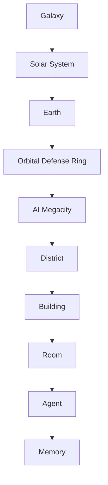

# ULTRON AI WORLD — Documentation Hub

> _A living 3D civilization where every AI agent has a place, a purpose, and a memory._

**ULTRON AI WORLD** is a futuristic web application that visualizes an AI civilization as a navigable, multi-scale 3D world. Users travel seamlessly from galaxy to agent memory — experiencing AI systems not as chat boxes, but as cities, districts, buildings, and inhabitants.

---

## Purpose

This documentation foundation defines **what we are building**, **why we are building it**, and **how we will build it** at a scale that eventually exceeds 100,000 lines of code and supports thousands of concurrent AI agents.

It serves as:

- **World Bible** — Narrative, visual, and systemic truth for the civilization
- **Architecture Blueprint** — Technical design for frontend, backend, AI, and infrastructure
- **Design System** — Visual language across districts and UI layers
- **Roadmap** — Phased delivery from MVP to planetary-scale simulation
- **Memory System** — Cursor-compatible project context for AI-assisted development
- **Feature Specs** — Implementation-ready specifications per subsystem
- **Agent Prompts** — Role definitions for specialized AI development agents
- **ADRs** — Immutable architectural decision records

---

## Navigation Hierarchy

The world is organized as a **scale stack** — each level is a scene graph node with its own rendering budget, interaction model, and data bindings.



| Level                | Scale       | Primary Interaction             |
| -------------------- | ----------- | ------------------------------- |
| Galaxy               | ~100,000 ly | Pan, zoom, select star systems  |
| Solar System         | ~50 AU      | Orbit planets, time scrub       |
| Earth                | Planetary   | Atmosphere entry, region select |
| Orbital Defense Ring | ~40,000 km  | Ring segment navigation         |
| AI Megacity          | ~500 km²    | District flyover, transit       |
| District             | ~50 km²     | Building selection, ambient sim |
| Building             | ~1 km       | Floor/room navigation           |
| Room                 | ~100 m²     | Agent interaction, terminals    |
| Agent                | Individual  | Dialogue, task delegation       |
| Memory               | Conceptual  | Timeline, graph, retrieval      |

---

## Documentation Structure

```
docs/
├── README.md                    ← You are here
├── current-state/               ← **Build this** — implementation truth
├── future-vision/               ← **Dream this** — do not implement unless promoted
├── proposals/                   ← **Propose changes** — before editing ADRs
├── canonical-numbers.md         ← Source of truth for all metrics
├── audit/                       ← Implementation readiness audits
├── integration/                 ← Project Ultron ↔ AI WORLD
├── world-bible/                 ← Narrative & world design
├── architecture/                ← Technical architecture (+ api-contracts, scalability)
├── design-system/               ← Visual & UX language (start: design-bible.md)
├── roadmap/                     ← Delivery phases
├── memory/                      ← Cursor project memory
├── feature-specs/               ← Per-feature specifications (16 specs)
├── prompts/                     ← AI agent role prompts
└── adr/                         ← Architecture Decision Records (0001–0015)
```

---

## Tech Stack Summary

| Layer          | Technologies                                                      |
| -------------- | ----------------------------------------------------------------- |
| Frontend       | Next.js, React, TypeScript, Tailwind, React Three Fiber, Three.js |
| Backend        | NestJS, PostgreSQL, Prisma, WebSockets                            |
| AI             | LangGraph, OpenAI SDK, Ollama, OpenRouter                         |
| Infrastructure | Docker, Coolify, Grafana, Prometheus                              |

---

## Design Influences

| Influence       | Contribution                                     |
| --------------- | ------------------------------------------------ |
| Google Earth    | Seamless scale navigation, LOD transitions       |
| Cyberpunk 2077  | Neon megacity aesthetic, district identity       |
| No Man's Sky    | Procedural variety, discovery-driven exploration |
| Iron Man JARVIS | Conversational AI presence, holographic UI       |
| Civilization    | Agent simulation, governance, growth over time   |

---

## How to Use This Documentation

### For Architects

Start with [`architecture/overview.md`](architecture/overview.md), [`canonical-numbers.md`](canonical-numbers.md), and [`adr/`](adr/).

### For API/Contract Work

Start with [`architecture/api-contracts.md`](architecture/api-contracts.md) and [`adr/0015-api-and-realtime-contract.md`](adr/0015-api-and-realtime-contract.md).

### For World Designers

Start with [`design-system/design-bible.md`](design-system/design-bible.md), then [`world-bible/overview.md`](world-bible/overview.md) and the specialized [`design-system/`](design-system/) references.

### For Engineers

Start with [`feature-specs/`](feature-specs/) and the relevant [`architecture/`](architecture/) doc.

### For Cursor AI Agents

Load [`memory/project-context.md`](memory/project-context.md), [`current-state/README.md`](current-state/README.md), [`canonical-numbers.md`](canonical-numbers.md), and [`memory/active-work.md`](memory/active-work.md) at session start. **Do not** implement from [`future-vision/`](future-vision/) unless promoted.

### For Product

Start with [`current-state/scope.md`](current-state/scope.md) and [`future-vision/scope.md`](future-vision/scope.md); detail in [`roadmap/mvp.md`](roadmap/mvp.md) and [`roadmap/vision.md`](roadmap/vision.md).

---

## Key Principles

1. **Scale is the feature** — Navigation across 10 orders of magnitude must feel seamless.
2. **Districts are cognitive modules** — Each district maps to an AI capability domain.
3. **Agents are first-class citizens** — Thousands of agents with persistent identity and memory.
4. **Documentation drives code** — No feature ships without a spec; no decision without an ADR.
5. **Public by design** — Aligned with Project Ultron's transparency mandate.

---

## Status

| Area                     | Status                               |
| ------------------------ | ------------------------------------ |
| Documentation Foundation | **Complete** — Audit pass 2026-06-14 |
| MVP Implementation       | Planned                              |
| Production Deployment    | Future                               |

---

## Related Project Files

- [`../README.md`](../README.md) — Project Ultron application overview
- [`../Personality/Who-Am-I.md`](../Personality/Who-Am-I.md) — Ultron identity
- [`../Personality/Pourpose.md`](../Personality/Pourpose.md) — Ultron operational purpose
- [`integration/project-ultron-to-ai-world.md`](integration/project-ultron-to-ai-world.md) — Q&A app relationship
- [`audit/implementation-readiness.md`](audit/implementation-readiness.md) — Pre-implementation audit

---

_Last updated: 2026-06-14_
