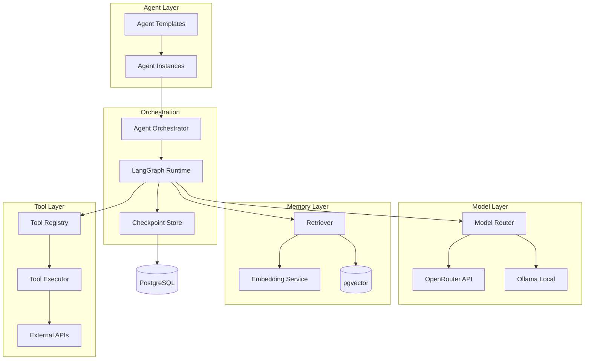
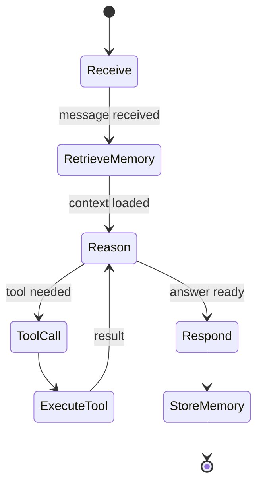
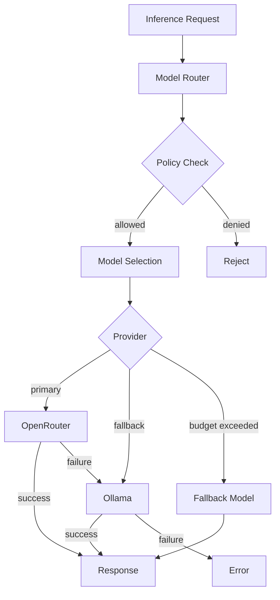
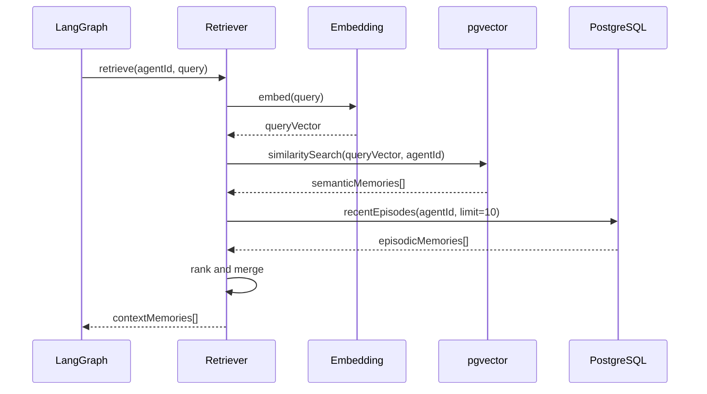

# AI System Architecture

## Purpose

Define the **AI infrastructure** powering ULTRON AI WORLD — agent workflows, model routing, memory retrieval, and the LangGraph-based orchestration layer.

---

## Responsibilities

- Agent workflow definition and execution (LangGraph)
- Multi-model routing (OpenRouter, Ollama)
- Memory retrieval and embedding generation
- Tool registration and execution
- Agent lifecycle (spawn, run, learn, decommission)
- Inference budget management and rate limiting

---

## AI Architecture Overview



---

## LangGraph Workflow Design

Each agent role has a **template graph** — a LangGraph state machine:



### Graph State Schema

```typescript
interface AgentGraphState {
  agentId: string;
  sessionId: string;
  messages: Message[];
  retrievedMemories: Memory[];
  currentPlan: Plan | null;
  toolCalls: ToolCall[];
  toolResults: ToolResult[];
  response: string | null;
  status:
    | 'receiving'
    | 'retrieving'
    | 'reasoning'
    | 'acting'
    | 'responding'
    | 'storing';
}
```

### Role-Specific Graphs

| Role         | Graph Variant    | Unique Nodes                               |
| ------------ | ---------------- | ------------------------------------------ |
| `planner`    | Planning graph   | `decompose`, `prioritize`, `validate_plan` |
| `classifier` | Perception graph | `classify`, `route`, `filter`              |
| `archivist`  | Memory graph     | `index`, `deduplicate`, `link`             |
| `executor`   | Action graph     | `select_tool`, `execute`, `verify`         |
| `trainer`    | Training graph   | `prepare_data`, `train`, `evaluate`        |
| `debater`    | Debate graph     | `argue`, `counter`, `synthesize`           |

---

## Model Router

Central routing layer — no direct LLM calls outside this service.



### Routing Rules

| Condition                     | Route To                          |
| ----------------------------- | --------------------------------- |
| Default                       | OpenRouter → configured model     |
| OpenRouter timeout (>30s)     | Ollama → local model              |
| Budget exceeded               | Ollama → smallest available model |
| Governance policy restriction | Policy-specified model only       |
| Training job                  | Dedicated Ollama GPU instance     |

### Supported Models (MVP)

| Model                    | Provider   | Use Case                | Cost Tier    |
| ------------------------ | ---------- | ----------------------- | ------------ |
| `claude-sonnet-4`        | OpenRouter | Reasoning, planning     | High         |
| `gpt-4o`                 | OpenRouter | General dialogue        | High         |
| `gpt-4o-mini`            | OpenRouter | Classification, routing | Low          |
| `llama3:70b`             | Ollama     | Fallback reasoning      | Free (local) |
| `llama3:8b`              | Ollama     | Fast classification     | Free (local) |
| `text-embedding-3-small` | OpenRouter | Embeddings              | Low          |

---

## Memory Retrieval Pipeline



### Retrieval Strategy

| Memory Type | Method                    | Weight |
| ----------- | ------------------------- | ------ |
| Semantic    | Vector similarity (top 5) | 0.5    |
| Episodic    | Recency (last 10)         | 0.3    |
| Procedural  | Agent role match          | 0.2    |

---

## Tool Registry

Agents execute tools during the Action phase:

| Tool             | District         | Description                     |
| ---------------- | ---------------- | ------------------------------- |
| `search_memory`  | Memory           | Query agent/world memory        |
| `query_building` | Any              | Get building metrics and status |
| `delegate_task`  | Any              | Assign task to another agent    |
| `execute_api`    | Action           | Call external API endpoint      |
| `update_policy`  | Governance       | Propose policy change           |
| `run_simulation` | Reasoning        | Trigger scenario simulation     |
| `start_training` | Self Improvement | Queue training job              |
| `deploy_model`   | Self Improvement | Promote model to production     |

### Tool Execution Safety

1. **Permission check** — Agent role must have tool in capabilities
2. **Input validation** — Schema validation on all tool inputs
3. **Rate limiting** — Per-agent tool call limits
4. **Audit logging** — All tool calls logged immutably
5. **Sandbox** — External API calls through proxy with allowlist

---

## Inference Budget

| Resource                      | MVP Limit | v1 Limit |
| ----------------------------- | --------- | -------- |
| Tokens per user per day       | 100,000   | 500,000  |
| Tokens per agent per hour     | 50,000    | 200,000  |
| Concurrent inference jobs     | 20        | 100      |
| Embedding requests per minute | 100       | 1,000    |
| Training GPU hours per week   | 10        | 100      |

Budget tracked in Redis with PostgreSQL audit trail.

---

## Constraints

1. **All inference through Model Router** — No direct API calls from services
2. **LangGraph checkpoints in PostgreSQL** — Durable agent state
3. **No client-side AI calls** — Server-side only
4. **Prompt templates in database** — Not hardcoded in source
5. **Embedding model version tracked** — Re-embed on model change

---

## Future Considerations

- Fine-tuned district-specific models
- Multi-modal perception (image, audio input)
- Agent swarm coordination (100+ agents on single task)
- Reinforcement learning from governance outcomes
- Model distillation pipeline (large → small for Ollama)
- AI safety monitoring dashboard
- Custom tool creation by governor users

---

## Technical Decisions

| Decision                   | Rationale                              | Tradeoff                       |
| -------------------------- | -------------------------------------- | ------------------------------ |
| LangGraph                  | Stateful, visualizable agent workflows | LangChain ecosystem dependency |
| OpenRouter primary         | Multi-model access via single API      | External dependency, cost      |
| Ollama fallback            | Local inference, no API cost           | Hardware requirements          |
| pgvector for memory        | Single database simplicity             | Scale limits                   |
| Role-based graph templates | Consistent agent behavior              | Less per-agent customization   |

See [`../adr/0005-ai-architecture.md`](../adr/0005-ai-architecture.md).

---

## Implementation Guidance

1. Install `langgraph`, `@langchain/core`, `@langchain/openai`
2. Define graph templates as TypeScript modules in `apps/api/src/modules/ai/graphs/`
3. Build `ModelRouterService` with provider abstraction
4. Implement `EmbeddingService` with batch support
5. Create `ToolRegistry` with capability-based access control
6. Store LangGraph checkpoints via `PostgresSaver`
7. Add inference metrics: latency, tokens, cost per agent per day
8. Test graphs in isolation before integrating with orchestrator
