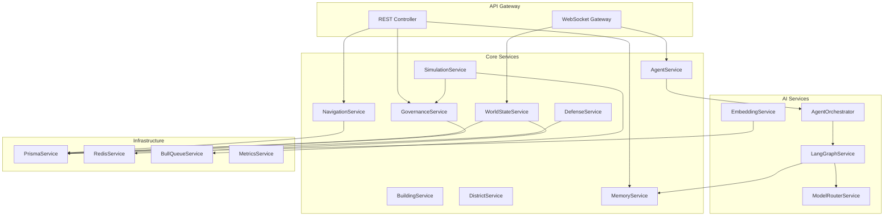
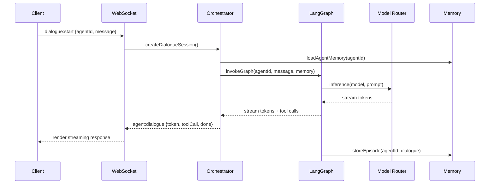

# Backend Architecture

## Purpose

Define the **server-side architecture** for ULTRON AI WORLD — a NestJS API providing REST endpoints, WebSocket gateways, agent orchestration, simulation, and governance services.

---

## Responsibilities

- REST API for CRUD operations and queries
- WebSocket gateway for realtime state synchronization
- Agent lifecycle management and task orchestration
- World simulation engine and governance policy evaluation
- Memory storage and retrieval services
- Authentication and authorization (v1)

---

## Module Structure

```
apps/api/
├── src/
│   ├── main.ts
│   ├── app.module.ts
│   ├── modules/
│   │   ├── navigation/        # Scale-aware entity queries
│   │   ├── world/             # World state management
│   │   ├── agents/            # Agent CRUD + orchestration
│   │   ├── buildings/         # Building and room management
│   │   ├── districts/         # District metadata and metrics
│   │   ├── governance/        # Policy CRUD and evaluation
│   │   ├── simulation/        # Tick engine and events
│   │   ├── memory/            # Memory graph service
│   │   ├── ai/                # LangGraph integration
│   │   ├── defense/           # Orbital ring and threats
│   │   └── health/            # Health checks and metrics
│   ├── gateways/
│   │   └── world.gateway.ts   # WebSocket gateway
│   ├── queues/
│   │   ├── simulation.queue.ts
│   │   ├── training.queue.ts
│   │   └── inference.queue.ts
│   ├── prisma/
│   │   └── schema.prisma
│   └── common/
│       ├── filters/
│       ├── guards/
│       ├── interceptors/
│       └── pipes/
├── test/
└── Dockerfile
```

---

## Service Architecture



---

## REST API Design

### Endpoint Conventions

```
GET    /api/v1/{resource}              # List with pagination
GET    /api/v1/{resource}/:id          # Get by ID
POST   /api/v1/{resource}              # Create
PATCH  /api/v1/{resource}/:id          # Update
DELETE /api/v1/{resource}/:id          # Soft delete

GET    /api/v1/navigation/:scale       # Scale-aware entity bundle
GET    /api/v1/search?q=...            # Cross-entity search
GET    /api/v1/governance/policies    # Policy list
POST   /api/v1/agents/:id/dialogue     # Start agent dialogue
GET    /api/v1/agents/:id/memory       # Agent memory (timeline MVP/v1; graph v2)
```

### Scale-Aware Navigation Endpoint

The primary data endpoint returns entities relevant to the user's current scale:

```typescript
// GET /api/v1/navigation/megacity?focus=reasoning
interface NavigationResponse {
  scale: ScaleLevel;
  focus: string | null;
  entities: {
    districts: District[];
    buildings: Building[];
    agents: AgentSummary[];
    metrics: ScaleMetrics;
  };
  transitions: AvailableTransition[];
}
```

### Response Format

```json
{
  "data": {},
  "meta": {
    "page": 1,
    "pageSize": 50,
    "total": 200,
    "scale": "megacity"
  },
  "timestamp": "2026-06-14T12:00:00Z"
}
```

---

## WebSocket Gateway

See [`architecture/realtime.md`](architecture/realtime.md) and [`architecture/api-contracts.md`](architecture/api-contracts.md) for full specification.

| Channel            | Direction       | Payload              |
| ------------------ | --------------- | -------------------- |
| `world:state`      | Server → Client | World state diffs    |
| `agent:status`     | Server → Client | Agent status changes |
| `agent:dialogue`   | Bidirectional   | Streaming dialogue   |
| `simulation:event` | Server → Client | Simulation events    |
| `defense:alert`    | Server → Client | Threat alerts        |
| `nav:subscribe`    | Client → Server | Subscribe to scale   |

---

## Agent Orchestration



---

## Queue System

| Queue        | Purpose                     | Concurrency | Priority |
| ------------ | --------------------------- | ----------- | -------- |
| `simulation` | 60-second tick processing   | 1           | High     |
| `inference`  | Batch inference jobs        | 10          | Medium   |
| `training`   | Model training jobs         | 2           | Low      |
| `embedding`  | Vector embedding generation | 5           | Medium   |
| `governance` | Policy evaluation jobs      | 3           | High     |

---

## Error Handling

| Error Type   | HTTP Code | Client Action                  |
| ------------ | --------- | ------------------------------ |
| Validation   | 400       | Show field errors              |
| Not found    | 404       | Navigate to parent scale       |
| Rate limit   | 429       | Show cooldown timer            |
| Agent busy   | 409       | Queue or try another agent     |
| Server error | 500       | Retry with exponential backoff |
| AI timeout   | 504       | Show fallback message          |

---

## Constraints

1. **All endpoints versioned** — `/api/v1/` prefix
2. **Input validation on every endpoint** — class-validator DTOs
3. **No direct database access from controllers** — Service layer only
4. **Soft deletes everywhere** — `deletedAt` timestamp pattern
5. **Idempotent mutations** — `Idempotency-Key` header support
6. **Rate limiting** — 100 req/min anonymous, 1000 req/min authenticated

---

## Future Considerations

- GraphQL gateway for complex client queries
- gRPC for inter-service communication at scale
- Event sourcing with dedicated event store
- API gateway (Kong/Traefik) for multi-service routing
- OAuth2/OIDC integration for governance roles
- Webhook system for external integrations
- API versioning strategy (v2 breaking changes)

---

## Technical Decisions

| Decision                        | Rationale                        | Tradeoff                          |
| ------------------------------- | -------------------------------- | --------------------------------- |
| NestJS modules                  | Clear boundaries, testable       | Boilerplate overhead              |
| Prisma ORM                      | Type-safe queries, migrations    | Not raw SQL performance           |
| Bull queues                     | Redis-backed, NestJS integration | Single Redis dependency           |
| Scale-aware navigation endpoint | Reduces client request count     | Large payloads at city scale      |
| Soft deletes                    | Audit trail, undo capability     | Query complexity (filter deleted) |

---

## Implementation Guidance

1. Scaffold with `nest new api --strict`
2. Add `@nestjs/websockets`, `@nestjs/bull`, `@prisma/client`
3. Define Prisma schema before building services
4. Implement `WorldGateway` first — most features depend on it
5. Build `NavigationService` with scale-aware queries
6. Add `AgentOrchestrator` with LangGraph integration
7. Implement `SimulationService` with Bull cron job
8. Add Prometheus metrics interceptor from day one
9. Write integration tests for WebSocket event flows
