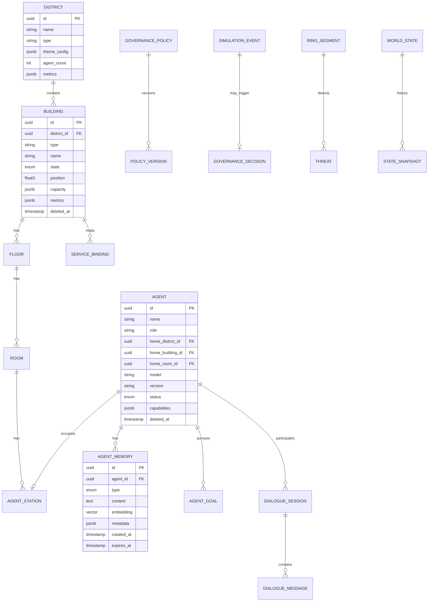

# Database Architecture

## Purpose

Define the **data persistence layer** for ULTRON AI WORLD — schema design, storage strategies, and query patterns for a system supporting thousands of agents and complex world state.

---

## Responsibilities

- Entity-relationship modeling for all world entities
- Vector storage for agent memory and semantic search
- Migration strategy and schema evolution
- Query optimization for scale-aware navigation
- Backup, replication, and disaster recovery planning

---

## Technology Stack

| Component        | Technology            | Purpose                                 |
| ---------------- | --------------------- | --------------------------------------- |
| Primary database | PostgreSQL 16+        | Relational data                         |
| Vector extension | pgvector              | Embedding storage and similarity search |
| ORM              | Prisma                | Schema management, type-safe queries    |
| Cache            | Redis 7+              | Session state, agent runtime, pub/sub   |
| Object storage   | S3-compatible (MinIO) | 3D assets, textures, glTF models        |
| Migrations       | Prisma Migrate        | Version-controlled schema changes       |

---

## Entity Relationship Diagram



---

## Core Tables

### World Entities

| Table            | Rows (v1 est.)        | Primary Index                        |
| ---------------- | --------------------- | ------------------------------------ |
| `districts`      | 5                     | `id`                                 |
| `buildings`      | 200                   | `district_id`, `state`               |
| `floors`         | 1,000                 | `building_id`                        |
| `rooms`          | 5,000                 | `floor_id`, `type`                   |
| `agents`         | 500 (v1) / 5,000 (v2) | `home_district_id`, `status`, `role` |
| `agent_stations` | 500 (v1) / 5,000 (v2) | `room_id`, `agent_id`                |

### AI & Memory

| Table                   | Rows (v1 est.) | Primary Index                           |
| ----------------------- | -------------- | --------------------------------------- |
| `agent_memories`        | 1,000,000      | `agent_id`, `type`, HNSW on `embedding` |
| `dialogue_sessions`     | 100,000        | `agent_id`, `created_at`                |
| `dialogue_messages`     | 2,000,000      | `session_id`, `created_at`              |
| `langgraph_checkpoints` | 50,000         | `thread_id`, `created_at`               |

### Governance & Simulation

| Table                   | Rows (v1 est.) | Primary Index                    |
| ----------------------- | -------------- | -------------------------------- |
| `governance_policies`   | 50             | `domain`, `active`               |
| `policy_versions`       | 500            | `policy_id`, `version`           |
| `simulation_events`     | 500,000        | `type`, `created_at`, `severity` |
| `world_state_snapshots` | 100,000        | `tick`, `created_at`             |

### Defense

| Table           | Rows (v1 est.) | Primary Index                        |
| --------------- | -------------- | ------------------------------------ |
| `ring_segments` | 360            | `zone`, `status`                     |
| `threats`       | 1,000          | `segment_id`, `status`, `risk_level` |

---

## Vector Search

Agent memory uses pgvector for semantic retrieval:

```sql
-- Conceptual query
SELECT id, content, metadata,
       1 - (embedding <=> $1) AS similarity
FROM agent_memories
WHERE agent_id = $2
  AND type = 'semantic'
  AND (embedding <=> $1) < 0.3
ORDER BY embedding <=> $1
LIMIT 10;
```

### Index Strategy

| Index Type | Column                      | Purpose                  |
| ---------- | --------------------------- | ------------------------ |
| HNSW       | `agent_memories.embedding`  | Fast similarity search   |
| B-tree     | `agent_memories.agent_id`   | Per-agent filtering      |
| B-tree     | `agents.status`             | Active agent queries     |
| GiST       | `buildings.position`        | Spatial queries (future) |
| GIN        | `governance_policies.rules` | JSONB policy queries     |

---

## Scale-Aware Queries

The `NavigationService` uses optimized queries per scale:

```sql
-- Megacity scale: districts + building summaries + agent counts
SELECT d.*,
       COUNT(DISTINCT b.id) AS building_count,
       COUNT(DISTINCT a.id) AS agent_count
FROM districts d
LEFT JOIN buildings b ON b.district_id = d.id AND b.deleted_at IS NULL
LEFT JOIN agents a ON a.home_district_id = d.id AND a.deleted_at IS NULL
GROUP BY d.id;

-- District scale: buildings with metrics
SELECT b.*,
       COUNT(a.id) AS agent_count
FROM buildings b
LEFT JOIN agents a ON a.home_building_id = b.id AND a.deleted_at IS NULL
WHERE b.district_id = $1 AND b.deleted_at IS NULL
GROUP BY b.id;
```

---

## Caching Strategy

| Data                 | Cache           | TTL       | Invalidation            |
| -------------------- | --------------- | --------- | ----------------------- |
| District metadata    | Redis           | 1 hour    | On policy change        |
| Building metrics     | Redis           | 5 s       | On metric update        |
| Agent runtime state  | Redis           | Session   | On status change        |
| Navigation snapshots | Redis           | 30 s      | On entity change        |
| Memory embeddings    | PostgreSQL only | —         | No cache (vector index) |
| 3D assets            | CDN/MinIO       | Immutable | Version in URL          |

---

## Migration Strategy

```
prisma/migrations/
├── 20260101_000001_init_world_entities/
├── 20260115_000002_add_agents/
├── 20260201_000003_add_memory_vectors/
├── 20260215_000004_add_governance/
├── 20260301_000005_add_simulation/
└── ...
```

### Rules

1. **Never destructive migrations in production** — Add columns, don't drop
2. **Seed data for districts and ring segments** — Required for boot
3. **Migration review in PR** — SQL diff inspected before merge
4. **Rollback plan** — Every migration has a documented rollback

---

## Backup & Recovery

| Strategy                  | Frequency  | Retention |
| ------------------------- | ---------- | --------- |
| Full backup (pg_dump)     | Daily      | 30 days   |
| WAL archiving             | Continuous | 7 days    |
| Redis RDB snapshot        | Hourly     | 24 hours  |
| Object storage versioning | On upload  | 90 days   |

**Recovery Time Objective (RTO)**: 1 hour
**Recovery Point Objective (RPO)**: 5 minutes

---

## Constraints

1. **UUID primary keys everywhere** — No auto-increment (distributed-safe)
2. **Soft deletes on all entity tables** — `deleted_at` column
3. **JSONB for flexible metadata** — Not for queryable core fields
4. **No cross-database joins** — PostgreSQL is the single source of truth
5. **Embedding dimensions: 1536** — OpenAI text-embedding-3-small default

---

## Future Considerations

- Table partitioning for `agent_memories` and `dialogue_messages` by month
- Read replicas for navigation queries
- Dedicated vector database (Qdrant/Pinecone) if pgvector exceeds 10M vectors
- TimescaleDB for `world_state_snapshots` time-series
- Database sharding by district at 100K+ agents
- Event store table for full state replay

---

## Technical Decisions

| Decision              | Rationale                         | Tradeoff                               |
| --------------------- | --------------------------------- | -------------------------------------- |
| PostgreSQL + pgvector | Single DB for relational + vector | Vector perf vs specialized DB          |
| Prisma ORM            | Type safety, migration management | Raw SQL perf for complex queries       |
| JSONB for metrics     | Flexible schema evolution         | Not indexable for all fields           |
| UUID v4 keys          | Distributed-safe, no collision    | Larger than serial                     |
| Soft deletes          | Audit trail, undo                 | Every query needs `deleted_at IS NULL` |

---

## Implementation Guidance

1. Define full Prisma schema before any service code
2. Seed script for 5 districts, 360 ring segments, 50 initial agents
3. Create HNSW index after initial data load (not in migration)
4. Add database connection pooling via PgBouncer at v1
5. Monitor slow queries with `pg_stat_statements`
6. Use Prisma `$queryRaw` for vector similarity (no Prisma native support)
7. Set `statement_timeout = 30s` on connection
