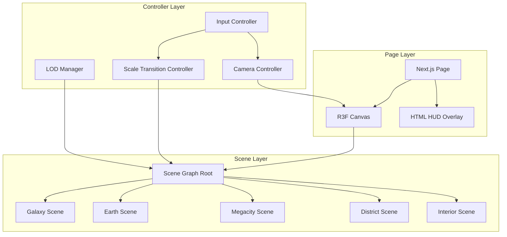
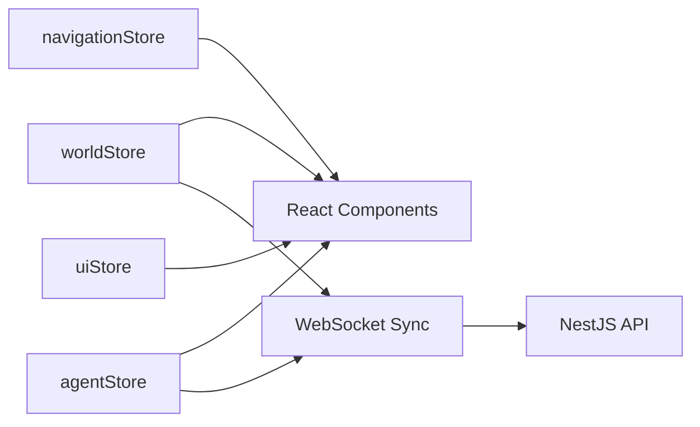

# Frontend Architecture

## Purpose

Define the **client-side architecture** for ULTRON AI WORLD — a Next.js application combining 2D UI overlays with a 3D world rendered via React Three Fiber and Three.js.

---

## Responsibilities

- Application routing and page structure
- 3D scene management and rendering pipeline
- Client state management and server synchronization
- UI overlay system (HUD, sidebars, dialogue panels)
- Performance optimization (LOD, lazy loading, code splitting)
- Accessibility and non-3D navigation alternatives

---

## Application Structure

```
apps/web/
├── app/                    # Next.js App Router
│   ├── layout.tsx          # Root layout with providers
│   ├── page.tsx            # Entry → /world/megacity (MVP); Galaxy at v2
│   └── world/
│       └── [scale]/        # Dynamic scale routes (fallback)
├── components/
│   ├── ui/                 # Tailwind UI components
│   ├── hud/                # HUD overlays per scale
│   ├── panels/             # Sidebars, dialogue, search
│   └── providers/          # Context providers
├── scenes/                 # R3F scene components
│   ├── galaxy/
│   ├── solar-system/
│   ├── earth/
│   ├── orbital-ring/
│   ├── megacity/
│   ├── district/
│   ├── building/
│   ├── room/
│   ├── agent/
│   └── memory/
├── controllers/            # Non-React logic
│   ├── ScaleTransitionController.ts
│   ├── CameraController.ts
│   ├── InputController.ts
│   └── LODManager.ts
├── stores/                 # Zustand stores
│   ├── worldStore.ts
│   ├── navigationStore.ts
│   ├── agentStore.ts
│   └── uiStore.ts
├── hooks/                  # Custom React hooks
├── lib/                    # Utilities, API client
└── types/                  # Re-exports from shared package
```

---

## Rendering Architecture



### Single Canvas Strategy

One `<Canvas>` element persists across scale transitions. Scenes are swapped, not mounted:

```tsx
// Conceptual pattern
function WorldCanvas() {
  const currentScale = useNavigationStore((s) => s.currentScale);

  return (
    <Canvas>
      <ScaleTransitionController />
      <SceneRouter scale={currentScale} />
      <CameraController />
      <ambientLight />
    </Canvas>
  );
}
```

---

## State Management

### Zustand Stores

| Store             | Responsibility                                  | Persistence   |
| ----------------- | ----------------------------------------------- | ------------- |
| `worldStore`      | Entity data (buildings, agents, districts)      | Server-synced |
| `navigationStore` | Current scale, position, selection, breadcrumbs | Session       |
| `agentStore`      | Active dialogues, streaming messages            | Session       |
| `uiStore`         | Panel visibility, HUD mode, theme               | LocalStorage  |



### Server Sync Pattern

- **Initial load**: REST fetch for current scale entities
- **Realtime updates**: WebSocket subscriptions per scale level
- **Optimistic UI**: Local state updates immediately; server confirms or rolls back
- **Stale-while-revalidate**: Show cached data during scale transitions

---

## UI Overlay System

3D world and 2D UI coexist via layered HTML:

```
┌─────────────────────────────────────────┐
│  Top Bar (breadcrumbs, search, settings)│
├──────────┬──────────────────┬───────────┤
│          │                  │           │
│  Left    │   3D Canvas      │  Right    │
│  Sidebar │   (R3F)          │  Sidebar  │
│          │                  │           │
├──────────┴──────────────────┴───────────┤
│  Bottom HUD (scale-specific metrics)    │
└─────────────────────────────────────────┘
```

| Panel         | Position     | Content                              |
| ------------- | ------------ | ------------------------------------ |
| Top bar       | Fixed top    | Breadcrumbs, search, scale indicator |
| Left sidebar  | Collapsible  | Hierarchy tree, bookmarks            |
| Right sidebar | Context      | Selected entity details              |
| Bottom HUD    | Fixed bottom | Scale-specific metrics               |
| Dialogue      | Floating     | Agent chat interface                 |
| Mini-map      | Bottom-right | 2D position map (city scale)         |

### Tailwind Design Tokens

UI uses design system tokens from [`../design-system/`](../design-system/):

```css
/* Conceptual token usage */
.hud-panel {
  @apply bg-void-black/80 border-signal-cyan/30 border backdrop-blur-md;
}
```

---

## Code Splitting Strategy

| Bundle     | Contents                     | Load Trigger            |
| ---------- | ---------------------------- | ----------------------- |
| `core`     | Layout, stores, Canvas shell | Initial                 |
| `galaxy`   | Galaxy scene + assets        | App start               |
| `earth`    | Earth + orbital ring scenes  | First Earth transition  |
| `megacity` | City + district scenes       | First city transition   |
| `interior` | Building + room scenes       | First building entry    |
| `agent`    | Agent avatar + dialogue      | First agent interaction |
| `memory`   | Memory graph visualization   | First memory view       |

Use `next/dynamic` with `ssr: false` for all R3F scenes.

---

## Performance Budget

| Metric                | Budget           | Enforcement                 |
| --------------------- | ---------------- | --------------------------- |
| Initial JS bundle     | < 200 KB gzipped | Bundle analyzer CI check    |
| Scene load time       | < 1 s            | Performance marks           |
| Draw calls (city LOD) | < 500            | LOD manager                 |
| Texture memory        | < 512 MB         | Texture atlas + compression |
| WebSocket messages/s  | < 60             | Client-side throttle        |

---

## Input Handling

| Input        | Galaxy        | City              | Interior         |
| ------------ | ------------- | ----------------- | ---------------- |
| Mouse drag   | Pan           | Rotate camera     | Look             |
| Scroll       | Zoom          | Move forward/back | —                |
| WASD         | —             | Fly               | Walk             |
| Click        | Select        | Select            | Select/interact  |
| Double-click | Transition    | Enter building    | Open dialogue    |
| Escape       | —             | Deselect          | Exit interior    |
| `G`          | Galaxy view   | Galaxy view       | Galaxy view      |
| `B`          | —             | —                 | Exit to building |
| `1-9`        | Jump to scale | Jump to scale     | Jump to scale    |

---

## Constraints

1. **No SSR for 3D scenes** — Canvas is client-only
2. **Single WebSocket connection** — Multiplexed channels
3. **No CSS-in-JS** — Tailwind only for UI overlays
4. **React 19+ with Next.js 15+** — App Router exclusively
5. **Mobile: 2D navigation primary** — 3D is optional/enhanced

---

## Future Considerations

- WebGPU renderer migration (when R3F supports stable WebGPU)
- Web Worker for LOD calculations and spatial indexing
- Service Worker for offline scene asset caching
- WebXR module for VR exploration
- React Server Components for non-3D pages (governance dashboard)
- Micro-frontend split if team scales beyond 10 engineers

---

## Technical Decisions

| Decision                  | Rationale                        | Tradeoff                           |
| ------------------------- | -------------------------------- | ---------------------------------- |
| Single Canvas             | Seamless transitions             | Memory pressure from loaded scenes |
| Zustand                   | Lightweight, no providers needed | No devtools middleware at MVP      |
| App Router                | Next.js standard, RSC for shell  | R3F incompatible with RSC          |
| Dynamic imports per scene | Load performance                 | Brief loading during first visit   |
| HTML overlays over 3D UI  | Accessibility, SEO for panels    | Visual integration challenge       |

See [`../adr/0002-frontend-stack.md`](../adr/0002-frontend-stack.md).

---

## Implementation Guidance

1. Scaffold with `create-next-app` + TypeScript + Tailwind + App Router
2. Add `@react-three/fiber`, `@react-three/drei`, `three`, `zustand` as core deps
3. Build `ScaleTransitionController` before any scene content
4. Create `SceneRouter` that mounts/unmounts scene components
5. Implement `navigationStore` with breadcrumb and selection state
6. Build HUD shell with placeholder panels; wire to stores
7. Add WebSocket hook (`useWorldSocket`) with auto-reconnect
8. Profile with `@react-three/perf` during development
