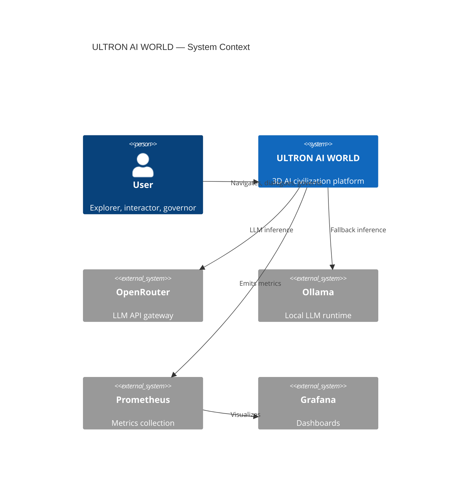
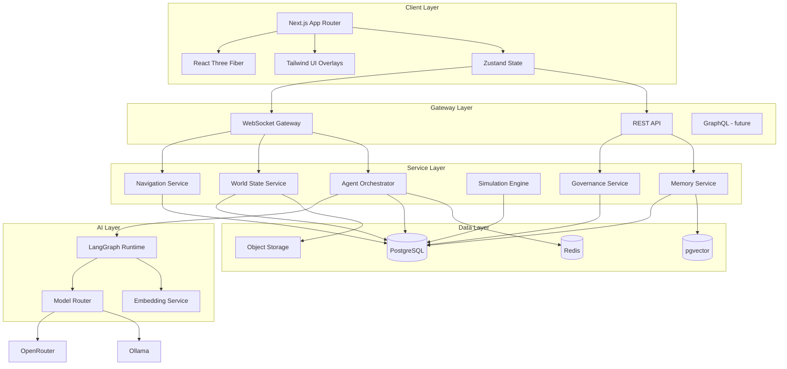
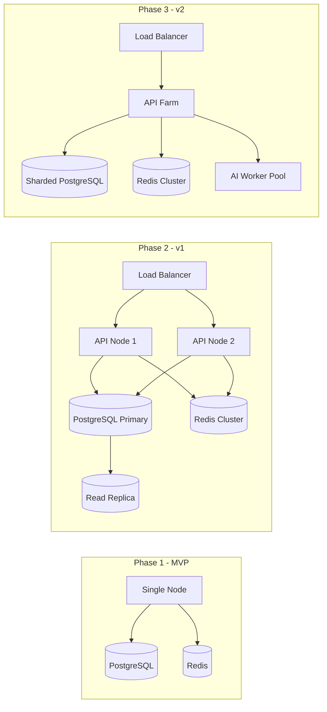

# Architecture Overview

## Purpose

This document defines the **system architecture** for ULTRON AI WORLD — a platform designed to scale beyond 100,000 lines of code and support thousands of concurrent AI agents across a seamless 3D navigation experience.

---

## Responsibilities

- Establish architectural layers and their boundaries
- Define communication patterns between subsystems
- Specify scalability targets and non-functional requirements
- Guide technology selection and integration patterns
- Provide the master reference for all child architecture documents

---

## System Context

---

## Layer Architecture

---

## Core Subsystems

| Subsystem   | Document                           | Primary Tech              |
| ----------- | ---------------------------------- | ------------------------- |
| Frontend    | [`frontend.md`](frontend.md)       | Next.js, R3F, Tailwind    |
| Backend     | [`backend.md`](backend.md)         | NestJS, Prisma            |
| Realtime    | [`realtime.md`](realtime.md)       | WebSockets, Redis Pub/Sub |
| Database    | [`database.md`](database.md)       | PostgreSQL, pgvector      |
| AI System   | [`ai-system.md`](ai-system.md)     | LangGraph, OpenRouter     |
| Rendering   | [`rendering.md`](rendering.md)     | Three.js, R3F             |
| Scene Graph | [`scene-graph.md`](scene-graph.md) | Custom scene hierarchy    |
| Deployment  | [`deployment.md`](deployment.md)   | Docker, Coolify           |

---

## Non-Functional Requirements

| Requirement                    | Target                                    | Measurement                  |
| ------------------------------ | ----------------------------------------- | ---------------------------- |
| Scale transition latency       | < 3 s (v1+ animated)                      | P95 transition time          |
| Frame rate (desktop)           | ≥ 60 FPS (P50) design; ≥ 30 FPS ship gate | See ADR-0014                 |
| Frame rate (mobile)            | ≥ 30 FPS                                  | P50 at 720p, simplified LOD  |
| Agent dialogue latency         | < 2 s first token                         | P95 streaming start          |
| Concurrent users               | 1,000 (v1)                                | Active WebSocket connections |
| Concurrent LangGraph instances | 50 (v1) / 200 (v2)                        | Active inference             |
| Uptime                         | 99.5%                                     | Monthly availability         |
| Data durability                | 99.999%                                   | PostgreSQL with backups      |

---

## Communication Patterns

### Client ↔ Server

| Pattern            | Use Case                    | Protocol            |
| ------------------ | --------------------------- | ------------------- |
| Request/Response   | CRUD, search, config        | REST (HTTPS)        |
| Streaming          | Agent dialogue, transitions | WebSocket           |
| Server Push        | World state, agent movement | WebSocket           |
| Polling (fallback) | Metrics, health checks      | REST (5 s interval) |

### Service ↔ Service

| Pattern      | Use Case                       | Protocol      |
| ------------ | ------------------------------ | ------------- |
| Sync call    | Agent task delegation          | Internal HTTP |
| Async event  | Simulation tick, state change  | Redis Pub/Sub |
| Queue        | Training jobs, batch inference | Bull (Redis)  |
| Shared state | Agent runtime state            | Redis         |

---

## Scalability Strategy

---

## Security Architecture

| Layer      | Mechanism                                         |
| ---------- | ------------------------------------------------- |
| Transport  | TLS 1.3 everywhere                                |
| API        | Rate limiting, input validation (class-validator) |
| Auth (v1)  | JWT with refresh tokens                           |
| Auth (MVP) | Anonymous session with rate limits                |
| Secrets    | Environment variables via Coolify                 |
| AI         | Prompt injection filtering in Perception District |
| Data       | Row-level security for multi-tenant (v2)          |

---

## Constraints

1. **Monorepo structure** — Frontend and backend in single repository
2. **TypeScript everywhere** — Shared types package between client and server
3. **No GraphQL at MVP** — REST + WebSocket sufficient
4. **No Kubernetes at MVP** — Docker + Coolify for deployment
5. **PostgreSQL as single source of truth** — Redis for ephemeral/cache only
6. **All AI calls routed through Model Router** — No direct client-to-LLM

---

## Future Considerations

- Event sourcing for world state history
- CQRS for read-heavy navigation queries
- GraphQL federation for complex client queries
- Edge rendering with WebGPU compute shaders
- Multi-region deployment with CRDT state sync
- Service mesh (Istio) when API farm exceeds 10 nodes
- Dedicated GPU cluster for Self Improvement District training

---

## Technical Decisions

| Decision               | Rationale                               | Tradeoff                          |
| ---------------------- | --------------------------------------- | --------------------------------- |
| NestJS over Express    | Module structure, DI, WebSocket support | Heavier framework                 |
| PostgreSQL + pgvector  | Single DB for relational + vector       | Not specialized vector DB         |
| Zustand over Redux     | Simpler API, less boilerplate           | Smaller ecosystem                 |
| Monorepo               | Shared types, atomic deploys            | Build complexity                  |
| LangGraph over raw SDK | Stateful agent workflows                | Dependency on LangChain ecosystem |

See [`../adr/`](../adr/) for formal decision records.

---

## Implementation Guidance

1. **Start with monorepo scaffold**: `apps/web`, `apps/api`, `packages/shared`
2. **Define shared types first** — Scale levels, entity IDs, WebSocket events
3. **Build WebSocket gateway early** — Most features depend on realtime
4. **Scene graph is client-only** — Server sends entity state, not geometry
5. **AI layer is stateless workers** — LangGraph checkpoints in PostgreSQL
6. **Metrics from day one** — Prometheus endpoints on all services

---

## Child Documents

- [`frontend.md`](frontend.md)
- [`backend.md`](backend.md)
- [`realtime.md`](realtime.md)
- [`database.md`](database.md)
- [`ai-system.md`](ai-system.md)
- [`rendering.md`](rendering.md)
- [`scene-graph.md`](scene-graph.md)
- [`deployment.md`](deployment.md)
