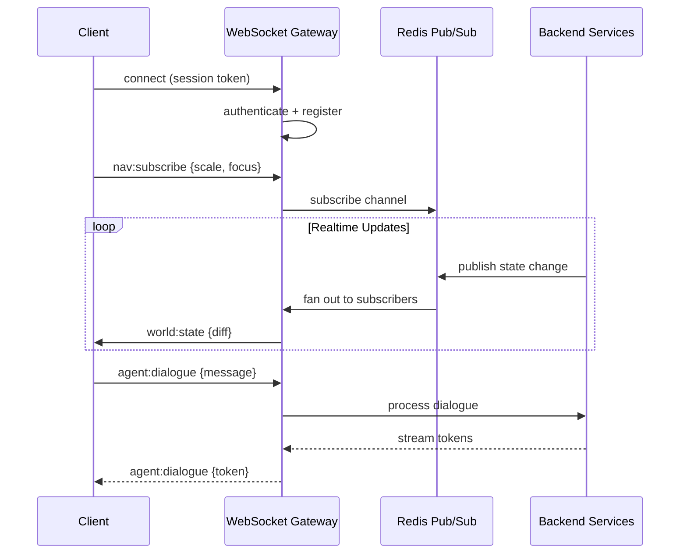
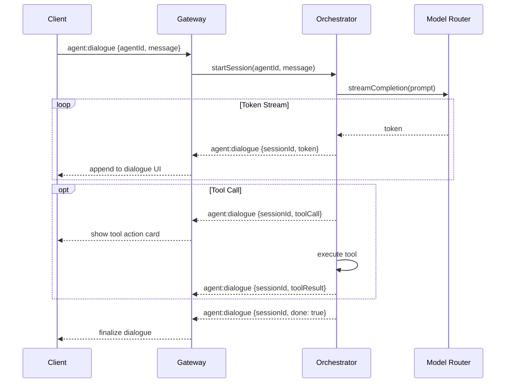
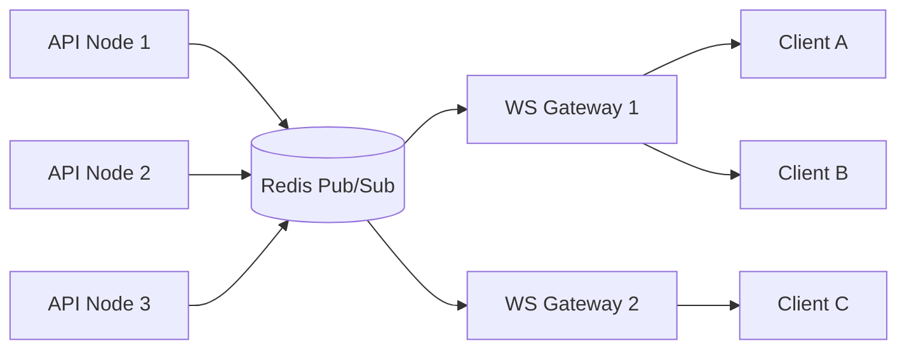

# Realtime Architecture

## Purpose

Define the **realtime communication layer** that synchronizes world state, agent activity, and user interactions between the NestJS backend and Next.js frontend.

---

## Responsibilities

- WebSocket connection management and authentication
- Channel-based pub/sub for world state updates
- Agent dialogue streaming
- Simulation event broadcasting
- Client subscription management per scale level
- Fallback polling for degraded connections

---

## Connection Architecture



---

## WebSocket Gateway

### Technology

- **Server**: `@nestjs/websockets` with `@nestjs/platform-ws` (ws library)
- **Client**: Native WebSocket with custom hook (`useWorldSocket`)
- **Message broker**: Redis Pub/Sub for multi-node fan-out (v1)

### Connection Lifecycle

| Phase      | Action                                              |
| ---------- | --------------------------------------------------- |
| Connect    | Client opens `wss://host/ws` with session cookie    |
| Auth       | Server validates session; assigns `clientId`        |
| Subscribe  | Client sends `nav:subscribe` with scale + focus     |
| Active     | Bidirectional message exchange                      |
| Heartbeat  | Ping/pong every 30 s                                |
| Disconnect | Server cleans subscriptions; client auto-reconnects |

### Reconnection Strategy

```typescript
// Conceptual client reconnection
const reconnectPolicy = {
  initialDelay: 1000, // 1 s
  maxDelay: 30000, // 30 s
  multiplier: 2, // Exponential backoff
  maxAttempts: Infinity, // Never give up
  onReconnect: () => {
    // Re-send nav:subscribe with last known state
    // Request full state snapshot (not just diffs)
  },
};
```

---

## Channel Design

### Server → Client Channels

| Event               | Payload                                 | Frequency    | Throttle     |
| ------------------- | --------------------------------------- | ------------ | ------------ |
| `world:state`       | State diff object                       | On change    | 100 ms batch |
| `agent:status`      | `{agentId, status, position}`           | On change    | None         |
| `agent:dialogue`    | `{sessionId, token?, toolCall?, done?}` | Streaming    | None         |
| `simulation:event`  | `{eventId, type, severity, data}`       | Per tick     | None         |
| `simulation:tick`   | `{tickId, worldState, changes}`         | Every 60 s   | None         |
| `defense:alert`     | `{threatId, level, segment}`            | On detection | None         |
| `building:metrics`  | `{buildingId, metrics}`                 | Every 5 s    | Per-building |
| `governance:policy` | `{policyId, change}`                    | On change    | None         |

### Client → Server Channels

| Event             | Payload                  | Validation                |
| ----------------- | ------------------------ | ------------------------- |
| `nav:subscribe`   | `{scale, focusId?}`      | Scale enum, optional UUID |
| `nav:unsubscribe` | `{scale}`                | Scale enum                |
| `agent:dialogue`  | `{agentId, message}`     | UUID, string max 10K      |
| `agent:delegate`  | `{agentId, task}`        | UUID, task object         |
| `select:entity`   | `{entityType, entityId}` | Enum, UUID                |
| `ping`            | `{}`                     | —                         |

---

## State Diff Protocol

To minimize bandwidth, server sends **diffs** not full state:

```typescript
interface StateDiff {
  tick: number;
  timestamp: ISO8601;
  scale: ScaleLevel;
  changes: {
    added: Entity[];
    updated: Partial<Entity>[];
    removed: string[]; // entity IDs
  };
}
```

### Example Diff

```json
{
  "tick": 14523,
  "timestamp": "2026-06-14T12:01:00Z",
  "scale": "district",
  "changes": {
    "added": [],
    "updated": [
      { "id": "agent-sigma-7", "status": "acting", "position": [12.4, 0, 8.1] },
      {
        "id": "reasoning-planning-tower-001",
        "metrics": { "throughput": 1250 }
      }
    ],
    "removed": []
  }
}
```

### Full Snapshot

On subscribe or reconnect, server sends full state snapshot:

```typescript
interface StateSnapshot {
  tick: number;
  timestamp: ISO8601;
  scale: ScaleLevel;
  entities: Record<string, Entity[]>;
  worldState: WorldStateVariables;
  metrics: ScaleMetrics;
}
```

---

## Agent Dialogue Streaming



---

## Subscription Scoping

Clients only receive updates for their **subscribed scale and children**:

| Subscribed Scale | Receives Updates For                        |
| ---------------- | ------------------------------------------- |
| `galaxy`         | Galaxy state only                           |
| `earth`          | Earth + ring + city summary                 |
| `megacity`       | All districts + buildings + agent positions |
| `district`       | District buildings + agents in district     |
| `building`       | Building rooms + agents in building         |
| `room`           | Room agents + terminals                     |
| `agent`          | Single agent status + dialogue              |

Agents outside subscribed scope have position updates suppressed (status changes still sent if user has active dialogue).

---

## Redis Pub/Sub (Multi-Node)



| Redis Channel         | Publisher         | Subscribers     |
| --------------------- | ----------------- | --------------- |
| `world:state:{scale}` | WorldStateService | All WS gateways |
| `agent:status`        | AgentService      | All WS gateways |
| `simulation:events`   | SimulationService | All WS gateways |
| `defense:alerts`      | DefenseService    | All WS gateways |

---

## Fallback: Polling

When WebSocket is unavailable:

| Endpoint                           | Interval  | Returns        |
| ---------------------------------- | --------- | -------------- |
| `GET /api/v1/world/state?scale=`   | 5 s       | State snapshot |
| `GET /api/v1/agents/:id/status`    | 2 s       | Agent status   |
| `POST /api/v1/agents/:id/dialogue` | On demand | SSE stream     |

Server-Sent Events (SSE) used for dialogue streaming in polling mode.

---

## Constraints

1. **Maximum 10,000 concurrent WebSocket connections per node**
2. **Message size limit: 64 KB per frame**
3. **Dialogue history not sent over WS** — Client fetches via REST
4. **No binary frames at MVP** — JSON text only
5. **Client must ack snapshots** — `nav:ack {tick}` within 5 s

---

## Future Considerations

- WebTransport for lower-latency streaming
- CRDT-based state sync for collaborative viewing
- Presence system (show other users in same scene)
- Binary protocol (MessagePack) for high-frequency agent positions
- Edge WebSocket servers for geographic distribution
- Backpressure handling for slow clients

---

## Technical Decisions

| Decision                   | Rationale                   | Tradeoff                                     |
| -------------------------- | --------------------------- | -------------------------------------------- |
| ws over Socket.IO          | Lighter, standard WebSocket | No auto-fallback transports                  |
| Diff-based updates         | Bandwidth efficiency        | Client merge complexity                      |
| Redis Pub/Sub              | Simple multi-node fan-out   | Not durable (messages lost if no subscriber) |
| Scale-scoped subscriptions | Reduces noise               | Complex subscription management              |
| SSE fallback               | Works through some proxies  | Half-duplex only                             |

---

## Implementation Guidance

1. Implement `WorldGateway` with `@WebSocketGateway()` decorator
2. Create `SubscriptionManager` service tracking client → scale mappings
3. Build `StateDiffService` that computes diffs from previous snapshots
4. Client hook: `useWorldSocket()` with reconnect, subscribe, and message routing
5. Batch `world:state` diffs every 100 ms to reduce frame churn
6. Add connection metrics: active connections, messages/sec, latency
7. Test with `autocannon` + `ws` load testing tool
