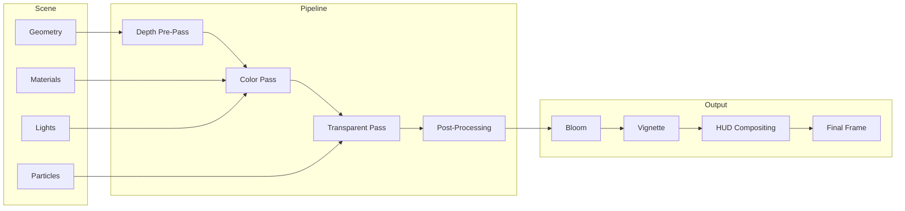
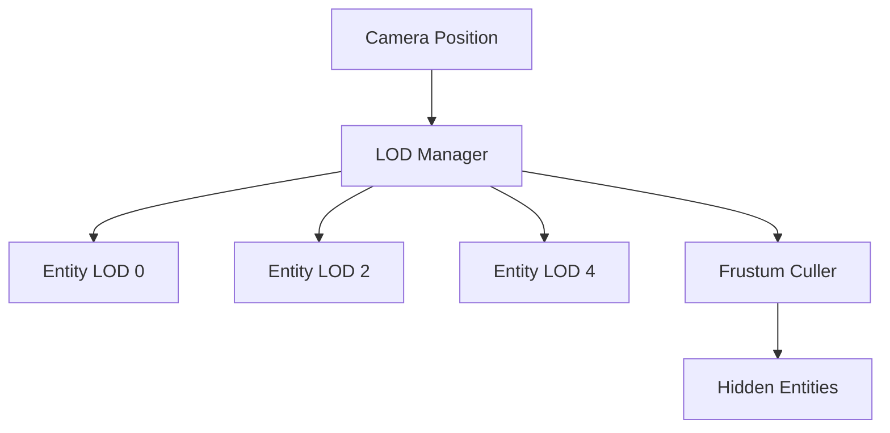
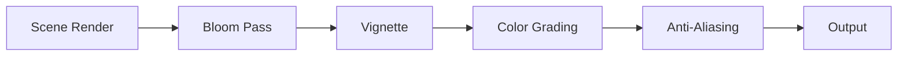
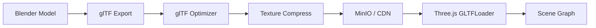

# Rendering Architecture

## Purpose

Define the **3D rendering pipeline** for ULTRON AI WORLD — LOD management, shader systems, performance budgets, and visual quality targets across all scale levels.

---

## Responsibilities

- Rendering pipeline design (forward rendering with post-processing)
- Level-of-detail (LOD) system for multi-scale geometry
- Shader library (atmosphere, hologram, neon, data flow)
- Performance budgeting and profiling
- Asset pipeline (glTF loading, texture compression, instancing)
- Post-processing effects (bloom, vignette, scan lines)

---

## Rendering Pipeline



---

## Renderer Configuration

```typescript
// Conceptual renderer setup
const rendererConfig = {
  antialias: true,
  powerPreference: 'high-performance',
  alpha: false,
  stencil: false,
  depth: true,
  toneMapping: THREE.ACESFilmicToneMapping,
  toneMappingExposure: 1.2,
  outputColorSpace: THREE.SRGBColorSpace,
  shadowMap: { enabled: true, type: THREE.PCFSoftShadowMap },
  pixelRatio: Math.min(window.devicePixelRatio, 2),
};
```

---

## LOD System

### Distance-Based LOD

| LOD Level   | Distance   | Geometry           | Textures | Shadows |
| ----------- | ---------- | ------------------ | -------- | ------- |
| 0 (Full)    | < 100 m    | Full mesh          | 4K       | Yes     |
| 1 (High)    | 100–500 m  | Simplified (50%)   | 2K       | Yes     |
| 2 (Medium)  | 500 m–2 km | Box proxy          | 1K       | No      |
| 3 (Low)     | 2–10 km    | Extruded footprint | 512      | No      |
| 4 (Minimal) | > 10 km    | Colored point/quad | 256      | No      |



### Scale-Specific LOD Rules

| Scale             | Max LOD 0 Entities | Max Total Entities | Instancing   |
| ----------------- | ------------------ | ------------------ | ------------ |
| Galaxy            | 0                  | 50,000 stars       | Yes (Points) |
| Earth             | 1 (globe)          | 50 markers         | No           |
| Megacity          | 50 buildings       | 200 buildings      | Yes (blocks) |
| District          | 20 buildings       | 40 buildings       | No           |
| Building exterior | 1                  | 1                  | No           |
| Interior          | 10 rooms           | 20 objects         | No           |

---

## Shader Library

### Core Shaders

| Shader             | Use                  | Key Features                      |
| ------------------ | -------------------- | --------------------------------- |
| `AtmosphereShader` | Earth, planets       | Rayleigh scattering, limb glow    |
| `HologramShader`   | Agents, UI panels    | Scan lines, transparency, fresnel |
| `NeonEdgeShader`   | Buildings, districts | Edge glow, pulse animation        |
| `DataFlowShader`   | Perception streams   | Particle flow along splines       |
| `WindowGlowShader` | Building windows     | Utilization-mapped brightness     |
| `WaterShader`      | City water features  | Reflection, ripple animation      |
| `SkyboxShader`     | All scenes           | Procedural stars, nebula          |
| `DissolveShader`   | Memory forgetting    | Noise-based dissolution           |

### Hologram Shader (Agent Avatars)

```glsl
// Conceptual fragment shader
uniform float uTime;
uniform vec3 uColor;
uniform float uOpacity;

void main() {
    float scanLine = sin(vUv.y * 200.0 + uTime * 3.0) * 0.5 + 0.5;
    float fresnel = pow(1.0 - dot(vNormal, vViewDir), 3.0);
    float alpha = uOpacity * (0.3 + scanLine * 0.2 + fresnel * 0.5);
    gl_FragColor = vec4(uColor, alpha);
}
```

---

## Lighting Model

| Scale    | Ambient           | Key Light       | Fill            | Special        |
| -------- | ----------------- | --------------- | --------------- | -------------- |
| Galaxy   | None              | Star emission   | —               | Nebula glow    |
| Earth    | Sun direction     | Directional sun | Earth bounce    | Atmosphere     |
| Megacity | Hemisphere        | Moon + neon     | District colors | Volumetric fog |
| District | District-specific | Neon signs      | Building glow   | Rain particles |
| Interior | Room ambient      | Ceiling panels  | Terminal glow   | Screen light   |

### District Lighting Profiles

See [`../design-system/lighting.md`](../design-system/lighting.md) for per-district configurations.

---

## Post-Processing



| Effect               | Parameters                    | Purpose                     |
| -------------------- | ----------------------------- | --------------------------- |
| Bloom                | threshold: 0.8, strength: 0.6 | Neon glow                   |
| Vignette             | offset: 0.3, darkness: 0.5    | Cinematic focus             |
| Color grading        | Per-district LUT              | District mood               |
| Film grain           | intensity: 0.05               | Cyberpunk texture           |
| Chromatic aberration | offset: 0.002                 | Hologram feel (agents only) |

Use `@react-three/postprocessing` for effect composition.

---

## Asset Pipeline



### Asset Standards

| Asset Type        | Format     | Max Size  | Compression |
| ----------------- | ---------- | --------- | ----------- |
| Building exterior | glTF 2.0   | 5 MB      | Draco mesh  |
| Interior room     | glTF 2.0   | 2 MB      | Draco mesh  |
| Agent avatar      | glTF 2.0   | 500 KB    | Draco mesh  |
| Textures          | KTX2/Basis | 2 MB each | UASTC       |
| HDR environment   | HDR        | 10 MB     | —           |
| Particle textures | PNG        | 256 KB    | —           |

### Instancing Strategy

| Entity                     | Instance Count | Per-Instance Data                |
| -------------------------- | -------------- | -------------------------------- |
| Stars                      | 50,000         | Position, magnitude, color       |
| Building blocks (city LOD) | 200            | Position, height, district color |
| Window lights              | 10,000         | Position, brightness             |
| Data particles             | 5,000          | Position, velocity, color        |
| Agent status orbs          | 1,000          | Position, status color           |

---

## Performance Budget

| Metric         | Desktop Target     | Mobile Target      |
| -------------- | ------------------ | ------------------ |
| Frame time     | < 16.6 ms (60 FPS) | < 33.3 ms (30 FPS) |
| Draw calls     | < 500              | < 100              |
| Triangles      | < 2M               | < 200K             |
| Texture memory | < 512 MB           | < 128 MB           |
| Shader compile | < 100 ms           | < 200 ms           |

### Profiling Tools

- `@react-three/perf` — Development overlay
- `THREE.WebGLRenderer.info` — Draw call tracking
- Custom `PerformanceMonitor` component — Production telemetry
- Grafana dashboard — Aggregate FPS metrics from clients

---

## Constraints

1. **Forward rendering only** — No deferred pipeline at MVP
2. **Maximum 2 post-processing passes** — Bloom + one other
3. **No ray tracing** — Performance budget
4. **Texture atlas preferred** — Reduce bind calls
5. **glTF only for 3D assets** — No FBX, OBJ, or proprietary formats
6. **WebGL 2.0 minimum** — No WebGL 1 fallback

---

## Future Considerations

- WebGPU renderer (Three.js r160+)
- GPU particle systems for data flow visualization
- Procedural building generation shaders
- Real-time global illumination (RTX/Path tracing) for interior scenes
- Level streaming with Web Worker geometry decoding
- Adaptive quality based on frame time (dynamic resolution scaling)
- HDR output for compatible displays

---

## Technical Decisions

| Decision                   | Rationale                   | Tradeoff                           |
| -------------------------- | --------------------------- | ---------------------------------- |
| Forward + post-processing  | Simpler, R3F compatible     | Limited lights per scene           |
| Distance-based LOD         | Standard, predictable       | Pop-in without crossfade           |
| glTF + Draco               | Standard web 3D format      | Compression/decompression CPU cost |
| Instancing for city blocks | 200 buildings → 1 draw call | Uniform appearance at LOD          |
| ACES tone mapping          | Cinematic look              | Requires tuned exposure per scene  |

See [`../adr/0003-rendering-engine.md`](../adr/0003-rendering-engine.md).

---

## Implementation Guidance

1. Create `LODManager` class in `controllers/` with distance calculation
2. Build shader library as `THREE.ShaderMaterial` factory functions
3. Set up glTF loading pipeline with `useGLTF` from drei
4. Implement `PerformanceMonitor` that reports to analytics endpoint
5. Use `InstancedMesh` for city-scale building blocks
6. Add `@react-three/postprocessing` bloom effect globally
7. Profile every scene at target entity counts before marking complete
8. Compress all textures to KTX2 at build time
