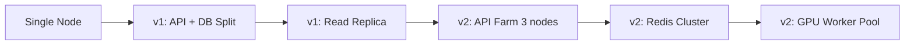

# Scalability Plan

## Purpose

Document scalability risks, capacity models, migration triggers, and load-test gates for ULTRON AI WORLD from MVP through 10,000+ concurrent users.

---

## Scale Targets by Phase

| Dimension                  | MVP | v1    | v2     |
| -------------------------- | --- | ----- | ------ |
| Concurrent users           | 50  | 1,000 | 10,000 |
| Active agents (data)       | 50  | 500   | 5,000  |
| Concurrent LangGraph runs  | 5   | 50    | 200    |
| Agent dialogues/day        | 100 | 5,000 | 50,000 |
| agent_memories rows        | 5K  | 500K  | 5M     |
| WebSocket connections/node | 500 | 5,000 | 10,000 |

See [canonical-numbers.md](../canonical-numbers.md) for authoritative values.

---

## Risk Matrix

### Critical

#### R1: LangGraph 1:1 Agent Instances

**Risk**: 5,000 agents ≠ 5,000 LangGraph instances. Memory exhaustion.

**Mitigation**:

| Phase | Strategy                                                                 |
| ----- | ------------------------------------------------------------------------ |
| MVP   | On-demand instance per dialogue; destroy on session end                  |
| v1    | Agent pool: max 50 concurrent instances; queue overflow                  |
| v2    | Worker pool with shared graph templates; agent state in Redis checkpoint |

**Load test gate (v1)**: 50 concurrent dialogues, P95 first token < 2s, memory < 4GB on API node.

#### R2: AI Inference Cost at Scale

**Risk**: 500 agents × background inference = unsustainable API cost.

**Mitigation**:

- MVP: inference on dialogue only (no background)
- v1: simulation uses rule engine, not LLM per agent per tick
- v1: daily token budget per user (see canonical-numbers)
- v2: Ollama handles 80% of simulation-classification tasks

**Cost model (v1 estimate)**:

| Item                                        | Monthly Cost  |
| ------------------------------------------- | ------------- |
| 5,000 dialogues/day × 2K tokens × $0.003/1K | ~$900         |
| Embeddings 100K/day                         | ~$50          |
| Ollama (self-hosted GPU)                    | Hardware only |

#### R3: WebSocket Fan-Out at Megacity Scale

**Risk**: `world:state` diff with 200 buildings + 500 agent positions every 100ms = large payloads.

**Mitigation**:

- Subscription scoping: client receives only subscribed scale entities
- Delta compression: only changed fields in `updated` array
- Position updates throttled to 5s for non-viewport agents
- Max payload 64KB; split into multiple frames if exceeded
- Full snapshot only on subscribe/reconnect

**Load test gate (v1)**: 1,000 WS connections, megacity subscription, P95 message latency < 50ms.

### High

#### R4: pgvector Scale Ceiling

**Trigger for migration evaluation**:

- \> 1M `agent_memories` rows
- p95 similarity query > 100ms
- Embedding storage > 50 GB

**Migration path**: Qdrant sidecar; dual-write period; pgvector becomes metadata-only.

#### R5: Single Node Capacity

**v1 single Coolify node budget**:

| Service  | CPU      | RAM        |
| -------- | -------- | ---------- |
| api      | 2 cores  | 2 GB       |
| web      | 1 core   | 1 GB       |
| postgres | 2 cores  | 4 GB       |
| redis    | 0.5 core | 512 MB     |
| ollama   | 4 cores  | 8 GB + GPU |

**Ceiling**: ~1,000 concurrent users with 50 concurrent dialogues. Beyond → add API node.

#### R6: 3D Asset Delivery without CDN

**Risk**: 200 glTF buildings × 2MB = 400MB first city load.

**Mitigation**:

- Draco + KTX2 compression (target 500KB per building)
- Lazy load per district
- CDN required before v1 public launch
- Service Worker cache (v1)

### Medium

#### R7: Redis Pub/Sub Durability

Messages lost if no subscriber connected. Mitigation: full `world:snapshot` on reconnect; `nav:ack` protocol.

#### R8: world_state_snapshots Growth

1,440 ticks/day × 1KB = 1.4MB/day. At v2 with full history: partition monthly; retain 90 days online.

#### R9: Single Canvas Memory

Preload only current + destination scene. Unload previous scene geometry after transition.

#### R10: Dialogue Message Table Growth

Partition `dialogue_messages` by month at v1. Archive > 90 days to cold storage.

---

## Agent Rendering Scale Strategy

See [agent-swarm-rendering.md](../feature-specs/agent-swarm-rendering.md).

| Agents in DB | Rendering Strategy                                       |
| ------------ | -------------------------------------------------------- |
| ≤ 50 (MVP)   | Full avatar for all visible                              |
| ≤ 500 (v1)   | Full avatar in viewport; dots on mini-map for others     |
| ≤ 5,000 (v2) | Full in room; LOD silhouette in district; dots elsewhere |

**v1 planning requirement**: Implement mini-map agent dots and viewport culling before scaling past 100 agents.

---

## Infrastructure Scaling Path

| Trigger                      | Action                       |
| ---------------------------- | ---------------------------- |
| CPU > 70% sustained          | Add API node                 |
| DB connections > 80% pool    | Add PgBouncer + read replica |
| Redis memory > 80%           | Redis cluster                |
| Inference queue depth > 100  | Add Ollama GPU worker        |
| WS connections > 5K per node | Add WS gateway node          |

---

## Load Test Gates per Milestone

### M2 (MVP)

- [ ] 50 concurrent WS connections
- [ ] 10 concurrent dialogues
- [ ] Megacity scene 30 FPS on reference GPU

### M3 (v1)

- [ ] 1,000 concurrent WS connections
- [ ] 50 concurrent dialogues
- [ ] 500 agents in DB, 50 FPS in viewport with culling
- [ ] Simulation tick < 5s with 500 agents
- [ ] Search < 500ms with 200 buildings

### M4 (v2)

- [ ] 10,000 concurrent WS connections (3 nodes)
- [ ] 200 concurrent dialogues
- [ ] 5,000 agents with swarm LOD at 30 FPS
- [ ] Memory graph 10K nodes < 3s render
- [ ] pgvector 1M rows, p95 query < 100ms

---

## Backpressure Policies

| Signal                  | Action                                       |
| ----------------------- | -------------------------------------------- |
| Inference queue > 50    | Return 429; client shows "agents busy"       |
| WS message queue > 1000 | Drop non-critical updates (building metrics) |
| DB connection wait > 5s | Circuit breaker; return 503                  |
| Token budget exceeded   | Route to Ollama fallback model               |
| GPU memory > 90%        | Reject new training jobs                     |

---

## Monitoring Alerts

| Alert              | Threshold      | Action                         |
| ------------------ | -------------- | ------------------------------ |
| API p95 latency    | > 2s for 5m    | Scale API node                 |
| WS connection drop | > 50% in 5m    | Investigate gateway            |
| Inference P95      | > 10s for 5m   | Check OpenRouter; scale Ollama |
| DB query P95       | > 500ms for 5m | Check indexes; add replica     |
| Client FPS P50     | < 24 for 1h    | Review LOD settings            |

---

## Future Considerations

- Kubernetes migration runbook (v2+)
- Multi-region with CRDT state sync
- Dedicated vector database cluster
- Edge WebSocket servers
- Agent inference batching (multiple prompts per LLM call)

---

## Implementation Guidance

1. Add load test scripts in `infra/load-tests/` at M1 (k6 or artillery)
2. Run load tests in CI weekly after M2
3. Document results in `docs/audit/load-test-results/` (create per run)
4. Review this plan at each milestone gate
