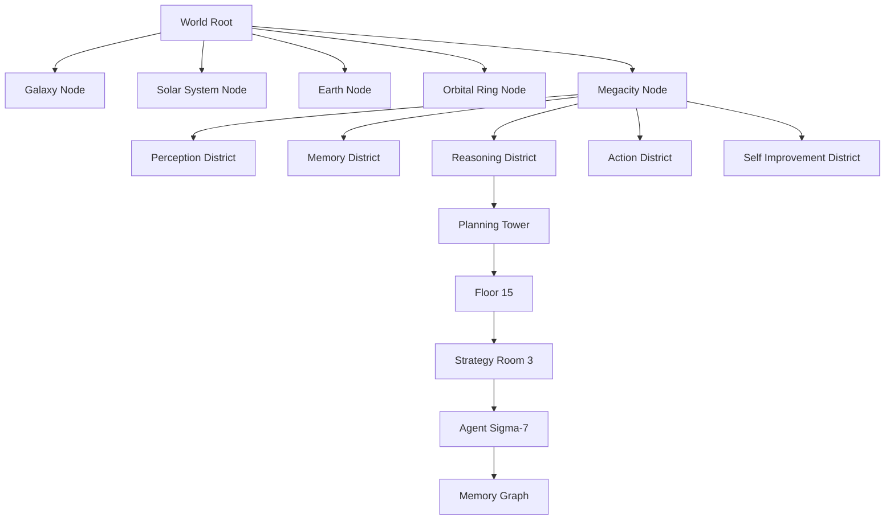
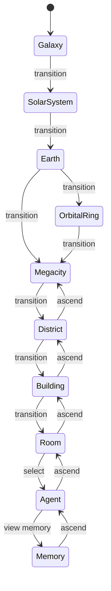
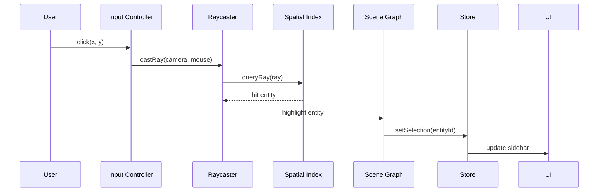
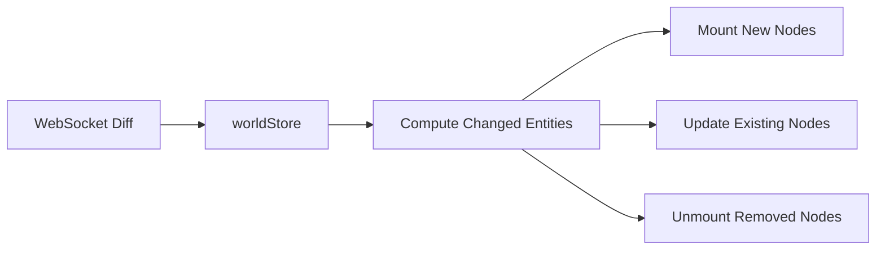

# Scene Graph Architecture

## Purpose

Define the **scene graph hierarchy** that organizes all 3D entities in ULTRON AI WORLD — the structural backbone connecting rendering, interaction, navigation, and server state.

---

## Responsibilities

- Hierarchical organization of all 3D entities
- Parent-child relationships across scale levels
- Entity lifecycle (create, update, destroy) synchronized with server
- Picking and selection raycasting
- Spatial indexing for performance
- Scene transition management

---

## Scene Graph Hierarchy



Only one branch is **active** (visible + interactive) at a time. Inactive branches are unmounted or hidden.

---

## Node Types

| Node Type      | Class           | Children                  | Server Entity    |
| -------------- | --------------- | ------------------------- | ---------------- |
| `WorldRoot`    | Container       | Scale nodes               | —                |
| `ScaleNode`    | Container       | District/system nodes     | —                |
| `DistrictNode` | Group           | BuildingNodes             | `districts`      |
| `BuildingNode` | Group           | FloorNodes, exterior mesh | `buildings`      |
| `FloorNode`    | Group           | RoomNodes                 | `floors`         |
| `RoomNode`     | Group           | AgentNodes, terminals     | `rooms`          |
| `AgentNode`    | Mesh + Logic    | MemoryNode (on demand)    | `agents`         |
| `MemoryNode`   | Custom          | Graph elements            | `agent_memories` |
| `EffectNode`   | Particles/Lines | —                         | —                |
| `LabelNode`    | HTML overlay    | —                         | —                |

---

## Entity Component Pattern

Each scene graph node follows a consistent component pattern:

```tsx
// Conceptual R3F component pattern
interface SceneNodeProps {
  entityId: string;
  data: EntityData;
  lod: number;
  selected: boolean;
  onSelect: (id: string) => void;
}

function BuildingNode({
  entityId,
  data,
  lod,
  selected,
  onSelect,
}: SceneNodeProps) {
  const meshRef = useRef<THREE.Group>(null);

  // LOD-based rendering
  if (lod >= 3) return <BuildingLODMinimal data={data} />;
  if (lod >= 1) return <BuildingLODSimple data={data} />;

  return (
    <group ref={meshRef} name={entityId}>
      <BuildingExterior data={data} />
      <WindowGlow utilization={data.metrics.throughput} />
      <LabelNode text={data.name} visible={selected || lod === 0} />
      <NeonEdge color={data.districtColor} selected={selected} />
    </group>
  );
}
```

---

## Scene Router

Manages which scene branch is mounted:



```tsx
// Conceptual SceneRouter
function SceneRouter({ scale }: { scale: ScaleLevel }) {
  switch (scale) {
    case 'galaxy':
      return <GalaxyScene />;
    case 'solar_system':
      return <SolarSystemScene />;
    case 'earth':
      return <EarthScene />;
    case 'orbital_ring':
      return <OrbitalRingScene />;
    case 'megacity':
      return <MegacityScene />;
    case 'district':
      return <DistrictScene />;
    case 'building':
      return <BuildingScene />;
    case 'room':
      return <RoomScene />;
    case 'agent':
      return <AgentScene />;
    case 'memory':
      return <MemoryScene />;
  }
}
```

---

## Spatial Indexing

### R-Tree for City Scale

At megacity and district scales, an R-tree indexes entity positions for:

- **Frustum culling** — Skip entities outside camera view
- **Raycasting** — Fast picking on click
- **LOD calculation** — Distance from camera to nearest point
- **Mini-map** — 2D projection of entity positions

```typescript
// Conceptual spatial index usage
class SpatialIndex {
  private tree: RBush<IndexedEntity>;

  insert(entity: IndexedEntity): void;
  remove(entityId: string): void;
  queryViewport(bounds: BoundingBox): IndexedEntity[];
  queryRay(ray: Ray): IndexedEntity | null;
  queryRadius(center: Vector3, radius: number): IndexedEntity[];
}
```

### Index Rebuild Strategy

| Trigger               | Action                               |
| --------------------- | ------------------------------------ |
| Scale change          | Rebuild index for new scale entities |
| Entity add/remove     | Incremental insert/delete            |
| Agent position update | Update entity position in tree       |
| Every 60 s            | Full rebuild (garbage collection)    |

---

## Selection System



### Selection Rules

| Scale    | Selectable Entities              |
| -------- | -------------------------------- |
| Galaxy   | Star systems                     |
| Earth    | Megacity beacon, ground stations |
| Megacity | Districts, buildings             |
| District | Buildings, transit stations      |
| Building | Entrance, floors (sidebar)       |
| Room     | Agents, terminals                |
| Agent    | Agent (self), memory link        |

---

## Server Synchronization

Scene graph nodes are **hydrated from server state**, not authored locally:



### Node Lifecycle

| Server Event          | Scene Graph Action                 |
| --------------------- | ---------------------------------- |
| Entity created        | Mount new node at parent           |
| Entity updated        | Update node props (no remount)     |
| Entity deleted        | Unmount node (fade out animation)  |
| Agent moved           | Animate position change            |
| Building state change | Update visual state (glow, damage) |

---

## Scale Transition in Scene Graph

During scale transitions, the scene graph:

1. **Marks outgoing branch** as transitioning (fade out)
2. **Preloads incoming branch** (async asset load)
3. **Mounts incoming branch** at opacity 0
4. **Animates camera** along flight path
5. **Crossfades** outgoing → incoming
6. **Unmounts outgoing branch** after completion

Only the active branch receives realtime updates.

---

## Constraints

1. **Maximum tree depth: 10 levels** — Root to memory node
2. **One active branch** — No multi-scale rendering simultaneously
3. **Node names = entity IDs** — For debugging and raycasting
4. **No manual scene graph mutation** — All changes through store actions
5. **Effect nodes are ephemeral** — Not synced with server

---

## Future Considerations

- Octree for interior room spatial indexing
- Scene graph serialization for save/load world state
- Multi-scene rendering for picture-in-picture (mini-map 3D)
- Scene graph diffing for efficient hot-reload during development
- Level streaming with spatial chunks at megacity scale
- Scene graph visualization debugger (Three.js inspector integration)

---

## Technical Decisions

| Decision               | Rationale                  | Tradeoff                          |
| ---------------------- | -------------------------- | --------------------------------- |
| Single active branch   | Performance, simplicity    | Cannot show multi-scale           |
| R-tree (RBush)         | Fast 2D/3D spatial queries | Rebuild cost on bulk changes      |
| Entity ID as node name | Debugging, picking         | IDs visible in dev tools          |
| Store-driven hydration | Server is source of truth  | Latency on initial load           |
| Fade transitions       | Smooth visual experience   | 0.5 s where instant might suffice |

---

## Implementation Guidance

1. Create `SceneGraphManager` class wrapping R3F group hierarchy
2. Implement `SceneRouter` as scale-driven switch component
3. Build `SpatialIndex` service with RBush library
4. Wire `useRaycaster` from drei to `SpatialIndex.queryRay()`
5. Create `EntityNode` HOC that handles LOD, selection, and server sync
6. Add `useEntitySync` hook that subscribes to worldStore changes
7. Implement transition fade using `@react-spring/three`
8. Name all nodes with entity IDs for `scene.getObjectByName()`
