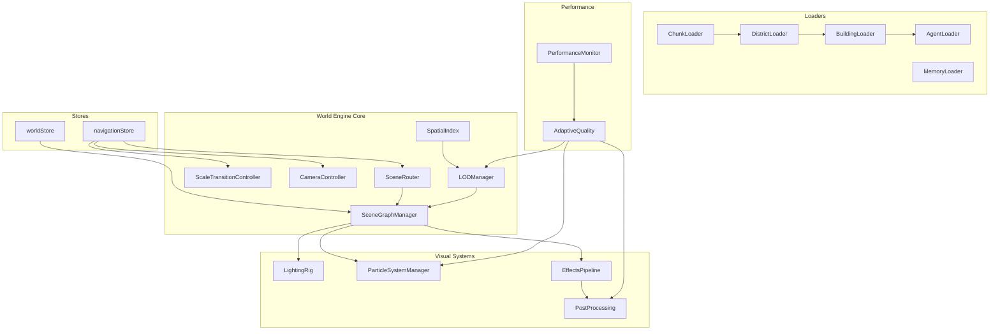
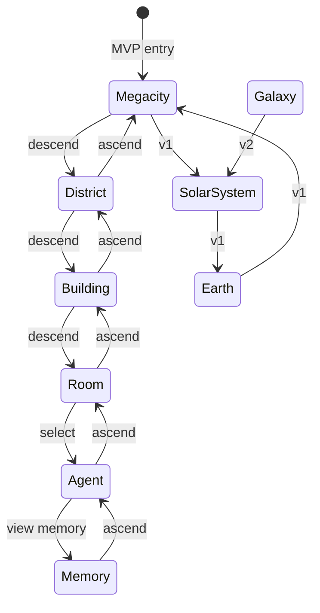
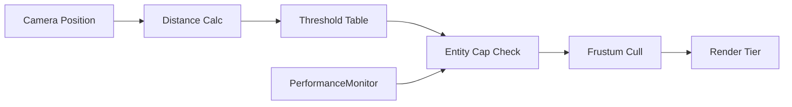
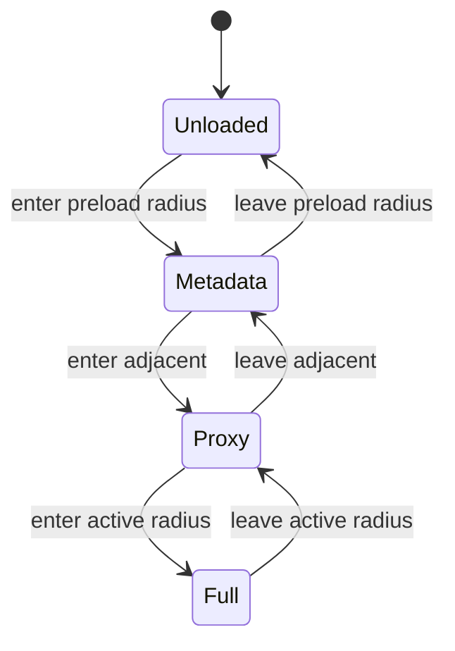
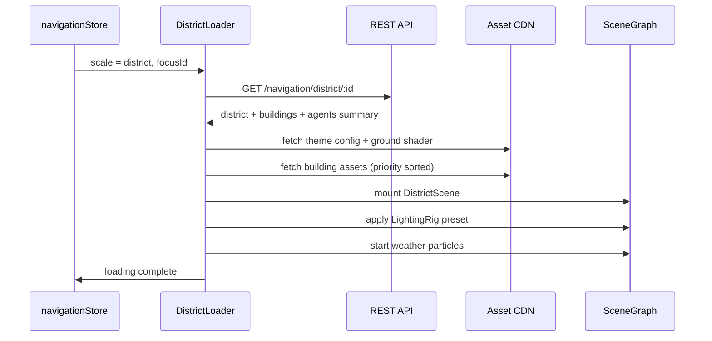
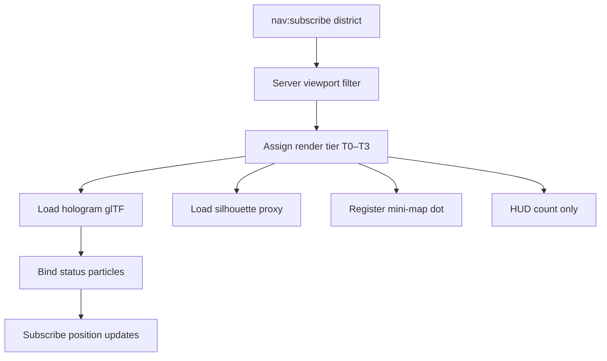
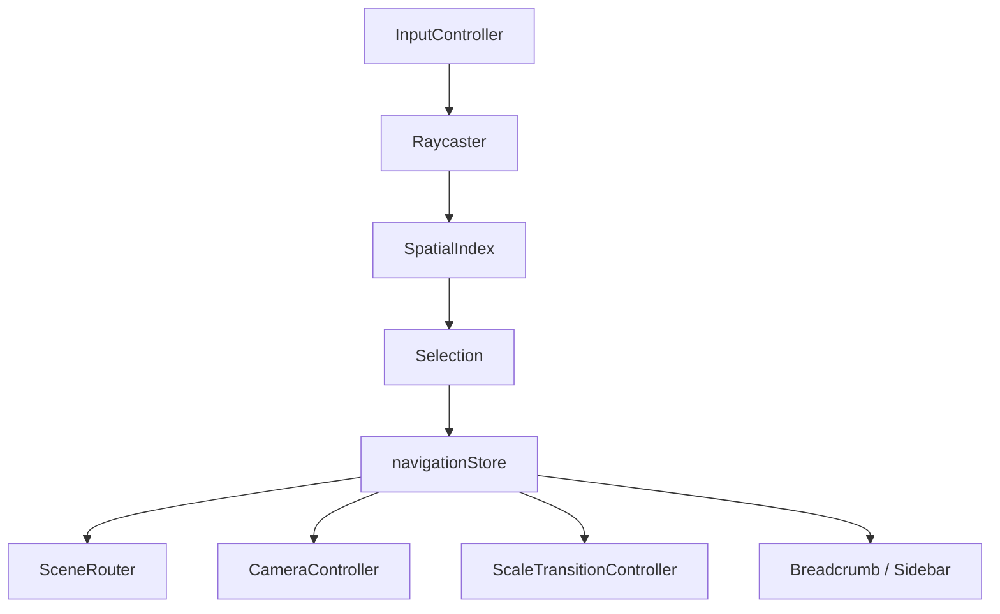
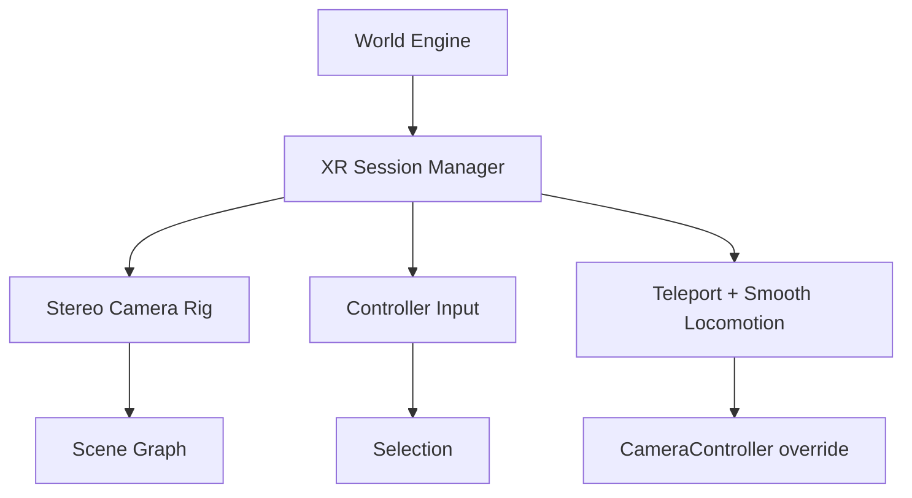

# World Engine Specification

## Purpose

Define the **World Engine** — the client-side runtime that powers all 3D rendering, spatial loading, navigation, and visual effects in ULTRON AI WORLD. This document unifies scene management, camera, LOD, streaming loaders, entity visualization, and performance policy into a single implementation contract.

The World Engine sits between **server state** (authoritative via REST + WebSocket) and **presentation** (R3F scenes, shaders, particles). It does not own business logic, AI inference, or persistence.

---

## Responsibilities

| Domain             | Owner                        | World Engine Role                           |
| ------------------ | ---------------------------- | ------------------------------------------- |
| Entity data        | `worldStore` (server-synced) | Hydrate scene nodes from store diffs        |
| Navigation intent  | `navigationStore`            | Drive scale, selection, camera, transitions |
| Rendering pipeline | World Engine                 | LOD, culling, draw-call budgeting           |
| Asset delivery     | World Engine + CDN           | Chunk/district/building streaming           |
| Visual effects     | World Engine                 | Particles, lighting rigs, post-processing   |
| Input              | `InputController`            | Raycast, selection, camera controls         |

---

## World Engine Architecture



### Module Placement

| Component                        | Location                   |
| -------------------------------- | -------------------------- |
| Scene graph, router, transitions | `apps/web/controllers/`    |
| Scene components                 | `apps/web/scenes/{scale}/` |
| Shared scale/LOD constants       | `packages/shared/`         |
| Shader factories, effect presets | `apps/web/lib/shaders/`    |

---

## Scene Management

### Single Canvas, Single Active Branch

Per ADR-0003 and forbidden-patterns: **one `<Canvas>`** persists for the application lifetime. Scenes are swapped via `SceneRouter`; multiple scale branches are never rendered simultaneously.



### Scene Graph Hierarchy

The scene graph mirrors server entity hierarchy. Only the **active branch** is mounted, updated, and subscribed to realtime events.

| Node Type      | Parent       | Children                  | Server Entity    |
| -------------- | ------------ | ------------------------- | ---------------- |
| `WorldRoot`    | —            | Scale nodes               | —                |
| `ScaleNode`    | WorldRoot    | District/system nodes     | —                |
| `DistrictNode` | ScaleNode    | BuildingNodes             | `districts`      |
| `BuildingNode` | DistrictNode | FloorNodes, exterior mesh | `buildings`      |
| `FloorNode`    | BuildingNode | RoomNodes                 | `floors`         |
| `RoomNode`     | FloorNode    | AgentNodes, terminals     | `rooms`          |
| `AgentNode`    | RoomNode     | MemoryNode (on demand)    | `agents`         |
| `MemoryNode`   | AgentNode    | Graph elements            | `agent_memories` |
| `EffectNode`   | Any          | —                         | — (ephemeral)    |
| `LabelNode`    | Any          | —                         | — (HTML overlay) |

### Lifecycle Rules

| Event               | Action                                           |
| ------------------- | ------------------------------------------------ |
| Scale change        | Unmount outgoing branch; mount incoming branch   |
| Entity created (WS) | Insert node at parent; register in spatial index |
| Entity updated (WS) | Update node props in place (no remount)          |
| Entity deleted (WS) | Fade out → unmount; remove from spatial index    |
| Transition start    | Freeze interaction; preload destination assets   |
| Transition end      | Resume controls; subscribe to new scale channel  |

### Transition Modes by Phase

| Phase | Style                                  | Max Duration       |
| ----- | -------------------------------------- | ------------------ |
| MVP   | Instant scene cut                      | < 500 ms perceived |
| v1    | Bezier camera flight (city-scale hops) | < 3 s              |
| v2    | Full-stack animated transitions        | < 3 s per hop      |

MVP uses instant cuts per [ADR-0008](../adr/0008-mvp-entry-and-scale-stack.md). Animated transitions are a v1+ capability.

### Constraints

1. Maximum tree depth: **10 levels** (Root → Memory)
2. Node names **must equal entity IDs** (picking, debugging)
3. All graph mutations flow through store actions — no imperative scene edits
4. Effect nodes are ephemeral and not server-synced
5. Only the active branch receives WebSocket updates

---

## Camera System

The camera is scale-aware, controlled by `CameraController` with presets from [`../design-system/camera.md`](../design-system/camera.md).

### Camera Types per Scale

| Scale        | Type         | FOV | Control Mode           |
| ------------ | ------------ | --- | ---------------------- |
| Galaxy       | Perspective  | 60° | Pan + logarithmic zoom |
| Solar System | Perspective  | 60° | Orbital rotation       |
| Earth        | Perspective  | 50° | Globe rotation + zoom  |
| Orbital Ring | Perspective  | 55° | Path-constrained orbit |
| Megacity     | Perspective  | 65° | Free flight            |
| District     | Perspective  | 65° | Hover / walk           |
| Building     | Perspective  | 60° | Orbit exterior         |
| Room         | Perspective  | 70° | Walk / first-person    |
| Agent        | Perspective  | 45° | Fixed focus on agent   |
| Memory       | Orthographic | —   | Graph pan + zoom       |

### Speed Scaling

Camera movement speed scales with altitude:

```
speed = baseSpeed × (currentAltitude / referenceAltitude)^0.5
```

| Scale    | Base Speed     | Reference        |
| -------- | -------------- | ---------------- |
| Galaxy   | 2×10²⁰ units/s | 1×10²¹ distance  |
| Megacity | 100 units/s    | 2000 m altitude  |
| Room     | 5 units/s      | 1.7 m eye height |

### Special Modes

| Mode            | Trigger                 | Behavior                                         |
| --------------- | ----------------------- | ------------------------------------------------ |
| Follow Agent    | Sidebar "Follow" (v1)   | 3 m behind, 1.5 m above; lerp factor 0.05        |
| Orbit Selection | Building exterior entry | Fixed-radius orbit; scroll adjusts radius        |
| Cinematic       | Scale transition (v1+)  | Scripted path; input disabled; skip after 500 ms |

### Collision Avoidance

| Scale             | Constraint                         |
| ----------------- | ---------------------------------- |
| Interior          | Sphere collision, radius 0.3 m     |
| Building exterior | Minimum 2 m from mesh surface      |
| City              | Minimum altitude 50 m above ground |
| All               | Camera never below ground plane    |

### State Persistence

Camera position, orientation, and control mode are stored in `navigationStore` on every significant move. Back navigation restores prior camera state.

### Constraints

1. No camera roll (horizon level) except cinematic sequences
2. FOV clamped: 30°–80°
3. Transition skip always available after 500 ms
4. MVP: no animated flight paths

---

## LOD System

`LODManager` computes per-entity LOD from camera distance, scale context, and performance tier. Distance-based LOD with five levels (0–4) per ADR-0003.

### Distance Thresholds (City-Scale Reference)

| LOD       | Distance   | Geometry           | Textures | Shadows |
| --------- | ---------- | ------------------ | -------- | ------- |
| 0 Full    | < 100 m    | Full mesh          | 4K       | Yes     |
| 1 High    | 100–500 m  | Simplified (50%)   | 2K       | Yes     |
| 2 Medium  | 500 m–2 km | Box proxy          | 1K       | No      |
| 3 Low     | 2–10 km    | Extruded footprint | 512      | No      |
| 4 Minimal | > 10 km    | Colored point/quad | 256      | No      |

### Scale-Specific Entity Caps

| Scale             | Max LOD 0    | Max Total Visible | Instancing   |
| ----------------- | ------------ | ----------------- | ------------ |
| Galaxy            | 0            | 50,000 stars (v2) | Points       |
| Earth             | 1 (globe)    | 50 markers        | No           |
| Megacity          | 50 buildings | 200 buildings     | Yes (blocks) |
| District          | 20 buildings | 40 buildings      | No           |
| Building exterior | 1            | 1                 | No           |
| Interior          | 10 rooms     | 20 objects        | No           |
| Agent (T0)        | 20           | 20 full avatars   | No           |

### LOD Selection Pipeline



### Agent Rendering Tiers (LOD Extension)

Agent LOD is tier-based per [agent-swarm-rendering.md](../feature-specs/agent-swarm-rendering.md):

| Tier    | Condition                 | Visual                          | Max Count |
| ------- | ------------------------- | ------------------------------- | --------- |
| T0 Full | In current room           | Hologram + particles + name tag | 20        |
| T1 LOD  | In district, outside room | Silhouette, no particles        | 50        |
| T2 Dot  | In city, outside district | Mini-map dot                    | 500       |
| T3 Data | Elsewhere                 | District HUD count only         | 5,000     |

Selected or followed agents are always promoted to T0.

### Crossfade Policy

LOD switches may cause visible pop-in. Optional 200 ms opacity crossfade at LOD boundaries (v1+). Crossfade disabled when frame budget is exceeded.

### Spatial Index Integration

At megacity and district scales, an R-tree (`RBush`) indexes entity bounding boxes for:

- Frustum culling
- Raycast picking
- LOD distance queries
- Mini-map projection

Rebuild triggers: scale change (full), entity add/remove (incremental), agent position update (incremental), 60 s periodic GC rebuild.

---

## Chunk Loading

Spatial **chunks** partition the megacity into loadable regions. Chunk loading is the foundation for progressive city streaming at v1+.

### Chunk Grid

| Parameter       | Value                                 |
| --------------- | ------------------------------------- |
| Chunk size      | 2 km × 2 km                           |
| Megacity extent | ~500 km² (~16×16 chunks)              |
| Active radius   | 3×3 chunks around camera (9 loaded)   |
| Preload radius  | 5×5 chunks (16 additional prefetched) |

### Chunk Contents

Each chunk contains:

- Building footprint proxies (LOD 3–4)
- District ground shader segment
- Transit line segments (v1)
- Spatial index entries for contained entities
- Optional weather particle emitters at district boundaries

### Load Priority Queue

| Priority | Trigger            | Content                          |
| -------- | ------------------ | -------------------------------- |
| P0       | Camera in chunk    | Full chunk geometry + textures   |
| P1       | Adjacent to camera | Footprint proxies only           |
| P2       | Preload ring       | Metadata + positions (no meshes) |
| P3       | Background         | District theme config only       |

### Chunk State Machine



### Asset Delivery

- Chunk manifests served from CDN as JSON (`chunkId`, building IDs, bounds, LOD assets)
- glTF assets loaded via `useGLTF` with Draco decompression
- Web Worker decodes geometry off main thread (v1)
- Service Worker caches visited chunks (v1)

### MVP Scope

MVP megacity is small enough (10 buildings, single district focus) that **chunk streaming is disabled**. All Reasoning District content loads in a single request. Chunk infrastructure ships at v1 with 200 buildings.

---

## District Loading

District loading activates a themed environment when the user descends from megacity to a district.

### Load Sequence



### District Theme Bundle

Loaded from `packages/shared` district theme config plus CDN assets:

| Asset              | Source           | Load Trigger            |
| ------------------ | ---------------- | ----------------------- |
| Color palette      | Shared package   | Immediate               |
| Lighting profile   | Shared package   | On district entry       |
| Ground shader      | CDN              | On district entry       |
| Fog config         | Shared package   | On district entry       |
| Ambient audio loop | CDN              | On district entry (v1)  |
| Weather particles  | CDN / procedural | On district entry (v1)  |
| Building glTF set  | CDN              | Progressive by distance |

### MVP: Reasoning District

| Content                   | Detail Level                     |
| ------------------------- | -------------------------------- |
| Planning Tower            | Full exterior + 3 interior rooms |
| Other Reasoning buildings | LOD 3 footprints only            |
| Agents                    | 50 × T0 hologram avatars         |
| Theme                     | Reasoning lighting + minimal fog |

### v1: All Five Districts

| District         | Buildings | Weather         | Special Effects       |
| ---------------- | --------- | --------------- | --------------------- |
| Perception       | 40        | Rain            | Data stream glow      |
| Memory           | 40        | Golden dust     | Light bridges         |
| Reasoning        | 40        | Clear           | Inference ring glow   |
| Action           | 40        | Industrial haze | Spark particles       |
| Self Improvement | 40        | Organic spores  | Bioluminescent garden |

### Unload Policy

When ascending to megacity, district geometry unloads after transition completes. Theme audio fades over 500 ms. Spatial index for district entities is destroyed.

---

## Building Loading

Building loading handles exterior meshes, interior rooms, metric-driven visuals, and floor navigation.

### Load Tiers

| Tier          | When                        | Content                             |
| ------------- | --------------------------- | ----------------------------------- |
| Footprint     | Megacity / distant district | Extruded polygon, district color    |
| Exterior LOD  | District view, > 500 m      | Simplified mesh, window glow shader |
| Exterior Full | District view, < 100 m      | Full glTF exterior, neon edges      |
| Interior      | Building entry              | Rooms, corridors, agent stations    |

### Exterior Load Sequence

1. Fetch `GET /api/v1/buildings/:id` + metrics subscription
2. Select LOD variant from `LODManager`
3. Load glTF from CDN (Draco-compressed, target ≤ 500 KB)
4. Apply district material variant
5. Bind `WindowGlow` shader to utilization metric (WebSocket)
6. Register in spatial index

### Interior Load Sequence

1. Portal transition: exterior camera → interior camera (instant MVP, animated v1)
2. Fetch floors + rooms: `GET /buildings/:id/floors`, `GET /buildings/:id/rooms`
3. Load room glTF assets (target ≤ 2 MB per room)
4. Place agent stations from `GET /buildings/:id/agents`
5. Enable interior `LightingRig` with shadows (max 4 casters)

### Building State Visuals

| State          | Visual Treatment                 |
| -------------- | -------------------------------- |
| `active`       | Full glow, lit windows           |
| `degraded`     | Flickering lights, damage decals |
| `offline`      | Desaturated, lights at 10%       |
| `constructing` | Holographic blueprint outline    |

### Metric Binding

`building:metrics` WebSocket events update shader uniforms:

- `WindowGlow` brightness ← throughput utilization
- Neon edge pulse rate ← error rate
- State transition ← uptime / health threshold

### Phase Targets

| Phase | Buildings                | Full Detail        | Footprint Only |
| ----- | ------------------------ | ------------------ | -------------- |
| MVP   | 10                       | 1 (Planning Tower) | 9              |
| v1    | 200                      | 25 types           | ~175 instances |
| v2    | 200+ (simulation growth) | All types          | Dynamic        |

---

## Agent Loading

Agent loading manages holographic avatars, status effects, and swarm tier demotion.

### Load Pipeline



### Avatar Assets

| Asset                 | Size Budget | Format        |
| --------------------- | ----------- | ------------- |
| Hologram avatar (T0)  | ≤ 500 KB    | glTF + Draco  |
| Silhouette proxy (T1) | ≤ 50 KB     | Single mesh   |
| Status particles      | Procedural  | GPU instanced |

### Position Update Throttle

| Tier | Update Interval    | Source                                 |
| ---- | ------------------ | -------------------------------------- |
| T0   | Realtime (WS)      | `agent:status`                         |
| T1   | 5 s                | `agent:status` (throttled server-side) |
| T2   | 30 s               | Mini-map position only                 |
| T3   | On district change | Aggregate count in nav response        |

### Selection Promotion

When user selects an agent:

1. Demote oldest T0 to T1 if at cap (20)
2. Promote selected agent to T0
3. Load full hologram if not cached
4. Start status particle system

### Phase Behavior

| Phase | Agents in DB | Render Strategy                      |
| ----- | ------------ | ------------------------------------ |
| MVP   | 50           | T0 for all visible (single district) |
| v1    | 500          | T0 in viewport + T2 mini-map dots    |
| v2    | 5,000        | Full T0–T3 tier system               |

---

## Memory Visualization

Memory visualization spans MVP timeline (2D) and v2 knowledge graph (3D).

### MVP: Memory Timeline

- **Not a 3D scene branch** — rendered as HTML panel within agent view
- Chronological list from `GET /api/v1/agents/:id/memory`
- Memory types: episodic, semantic
- Click → expand content in sidebar
- No World Engine geometry; minimal GPU impact

### v2: Memory Graph (3D Branch)

Activated when `navigationStore.currentScale = 'memory'`.

| Element           | Representation                    | Interaction                |
| ----------------- | --------------------------------- | -------------------------- |
| Memory node       | Sphere, size ∝ importance/recency | Click → detail panel       |
| Relationship edge | Line / curve between nodes        | Hover → relationship label |
| Cluster           | Semantic grouping halo            | Click → zoom to cluster    |
| Search result     | Highlight pulse on matching nodes | Navigate camera to node    |

### Graph Layout

- Force-directed layout computed in Web Worker
- Layout stabilizes over 2 s; then positions frozen
- Re-layout on filter change only (not per frame)
- Maximum 10,000 nodes at ≥ 30 FPS ship gate

### Camera

Orthographic projection. Pan (drag), zoom (scroll), orbit (right-drag). No perspective distortion — graph readability priority.

### Visual Encoding

| Property        | Visual                |
| --------------- | --------------------- |
| `episodic`      | Warm gold nodes       |
| `semantic`      | Cool blue nodes       |
| `procedural`    | Green nodes           |
| `short_term`    | Small, fading opacity |
| High confidence | Solid edge            |
| Low confidence  | Dashed edge           |
| Recent          | Brighter emissive     |

### Dissolve Effect

When memory expires or is forgotten, `DissolveShader` animates node dissolution over 1 s before removal from graph.

---

## Particle Systems

`ParticleSystemManager` owns all GPU particle emitters. Particles are **instanced** where possible.

### Particle Catalog

| System            | Scale               | Max Count       | Purpose                               |
| ----------------- | ------------------- | --------------- | ------------------------------------- |
| Star twinkle      | Galaxy              | 0 (shader)      | Brightness oscillation in star shader |
| Rain              | Perception District | 2,000           | Weather atmosphere                    |
| Golden dust       | Memory District     | 1,000           | Archive ambience                      |
| Industrial sparks | Action District     | 500             | Forge activity                        |
| Organic spores    | Self Improvement    | 1,000           | Lab garden                            |
| Data flow         | District / building | 5,000           | Perception stream visualization       |
| Agent status      | Agent (T0)          | 200 per agent   | Status feedback                       |
| Window glow pulse | Megacity            | 10,000 (shader) | Utilization (not true particles)      |
| Volumetric fog    | Megacity            | N/A (GPU fog)   | Atmosphere                            |

### Budget by Scale

| Scale      | Max Particle Count | Max Animated Entities |
| ---------- | ------------------ | --------------------- |
| Galaxy     | 0                  | 50,000 (star shader)  |
| Megacity   | 5,000              | 200 buildings         |
| District   | 2,000              | 40 buildings          |
| Interior   | 500                | 20 objects            |
| Agent view | 200                | 1 avatar              |

### Performance Rules

1. Particles use `InstancedMesh` or GPU compute (v2) — never one draw call per particle
2. If frame time > 20 ms for 3 consecutive frames, reduce particle count by 25%
3. `prefers-reduced-motion`: disable all non-essential particles
4. Mobile: particle budgets at 50% of desktop
5. Weather particles disabled on mobile at MVP; enabled selectively at v1

### Agent Status Particles

| Status   | Effect                |
| -------- | --------------------- |
| Idle     | Slow orbit            |
| Thinking | Spiral rise           |
| Acting   | Directional streak    |
| Learning | Upward leaf particles |
| Error    | Chaotic scatter       |
| Offline  | None                  |

---

## Lighting Systems

`LightingRig` components mount per scale and swap on scale/district change. Full profiles in [`../design-system/lighting.md`](../design-system/lighting.md).

### Global Principles

1. Dark world, bright accents — light conveys information
2. Neon as narrative — glow indicates activity and status
3. No pure white light — max color temperature 6000K
4. Shadows only at LOD 0–1
5. Volumetric effects used sparingly

### Scale-Level Rigs

| Scale    | Key Lights                                        | Shadows             |
| -------- | ------------------------------------------------- | ------------------- |
| Galaxy   | Star emission (per star), nebula ambient          | None                |
| Earth    | Directional sun, earth bounce ambient             | Sun only            |
| Megacity | Moon directional, hemisphere, district accents    | None                |
| District | District profile key + neon strips                | None                |
| Interior | RectArea ceiling, terminal points, agent self-lit | Yes (max 4 casters) |

### Dynamic Lighting Bindings

| Simulation State       | Lighting Response                     |
| ---------------------- | ------------------------------------- |
| Building utilization ↑ | Window glow brightens                 |
| Agent → thinking       | Agent point light pulses              |
| Defense alert          | Ring segments flash red               |
| Policy change          | Affected district key light hue shift |
| Construction           | Blueprint holographic glow            |
| Building offline       | All lights fade to 10% over 2 s       |

### Shadow Configuration

| Parameter   | LOD 0 | LOD 1 | LOD 2+ |
| ----------- | ----- | ----- | ------ |
| Enabled     | Yes   | Yes   | No     |
| Map size    | 2048  | 1024  | —      |
| Max casters | 4     | 4     | 0      |

### Constraints

1. Maximum 8 dynamic lights per scene
2. No HDRI environment maps at MVP
3. Light colors from district palette only
4. Volumetric fog disabled on mobile

---

## Effects Systems

`EffectsPipeline` composes screen-space and object-space effects after the lighting pass.

### Render Pass Order


### Object-Space Effects (Shader Library)

| Shader             | Applied To           | Key Features                      |
| ------------------ | -------------------- | --------------------------------- |
| `AtmosphereShader` | Earth, planets       | Rayleigh scattering, limb glow    |
| `HologramShader`   | Agents, UI panels    | Scan lines, fresnel, transparency |
| `NeonEdgeShader`   | Buildings, districts | Edge glow, pulse animation        |
| `DataFlowShader`   | Perception streams   | Particle flow along splines       |
| `WindowGlowShader` | Building windows     | Utilization-mapped brightness     |
| `WaterShader`      | City water features  | Reflection, ripples               |
| `SkyboxShader`     | All scenes           | Procedural stars, nebula          |
| `DissolveShader`   | Memory forgetting    | Noise-based dissolution           |

### Post-Processing Stack

Maximum **2 passes** per ADR-0003.

| Pass                         | Parameters                  | Phase |
| ---------------------------- | --------------------------- | ----- |
| Bloom                        | threshold 0.8, strength 0.6 | MVP   |
| Vignette                     | offset 0.3, darkness 0.5    | MVP   |
| Color grading (district LUT) | Per-district preset         | v1    |
| Film grain                   | intensity 0.05              | v1    |
| Chromatic aberration         | offset 0.002, agents only   | v1    |
| FXAA                         | Standard                    | v1    |

### Selection Effects

| Event                | Effect                     | Duration   |
| -------------------- | -------------------------- | ---------- |
| Entity selected      | Cyan border pulse          | 500 ms     |
| Scale transition     | Departure entity highlight | 300 ms     |
| Agent dialogue start | Hologram intensify         | Continuous |
| Building entry       | Portal shimmer             | 500 ms     |

### District Entry Effects

Crossfade lighting + fog + audio over 500 ms. Ground shader gradient animates district boundary reveal.

---

## Navigation Systems

Navigation integrates 3D interaction, camera, scene routing, and 2D UI alternatives.

### Navigation Stack



### Descend / Ascend Rules

| Action        | 3D Trigger           | UI Trigger          |
| ------------- | -------------------- | ------------------- |
| Descend       | Double-click entity  | Sidebar tree click  |
| Ascend        | Escape / back button | Breadcrumb click    |
| Quick jump    | —                    | Search (v1)         |
| Galaxy return | `G` key              | Top bar button (v2) |

### Selection by Scale

| Scale    | Selectable Entities              |
| -------- | -------------------------------- |
| Galaxy   | Star systems                     |
| Earth    | Megacity beacon, ground stations |
| Megacity | Districts, buildings             |
| District | Buildings, transit stations      |
| Building | Entrance, floors (sidebar)       |
| Room     | Agents, terminals                |
| Agent    | Agent, memory link               |
| Memory   | Graph nodes (v2)                 |

### Breadcrumb Contract

Breadcrumbs always reflect `navigationStore` state. Format:

```
[Megacity] › [Reasoning District] › [Planning Tower] › [Strategy Room] › [Agent Sigma-7]
```

Full galaxy-to-memory breadcrumb available at v2.

### WebSocket Subscription Scoping

On scale change, client sends `nav:subscribe { scale, focusId }`. Server returns only entities relevant to that scale. Previous subscription is released.

### MVP Navigation Path

Megacity → District → Building → Room → Agent → Memory timeline (6 levels, instant cuts).

---

## Performance Constraints

Authoritative numbers from [`../canonical-numbers.md`](../canonical-numbers.md) and [ADR-0014](../adr/0014-performance-targets.md).

### Dual-Target Model

| Metric                      | Design Target | Ship Gate      | Platform |
| --------------------------- | ------------- | -------------- | -------- |
| Frame rate                  | 60 FPS P50    | 30 FPS P50     | Desktop  |
| Frame rate                  | 30 FPS P50    | 24 FPS P50     | Mobile   |
| Frame time                  | < 16.6 ms     | < 33.3 ms      | Desktop  |
| Scene initial load          | < 3 s         | < 5 s          | Desktop  |
| Scene initial load          | —             | < 8 s          | Mobile   |
| Scale transition (animated) | < 3 s P95     | Skip available | v1+      |

**Design for 60, ship at 30** on reference hardware (GTX 1660 / RX 580 equivalent, 1080p).

### Per-Scale Budgets

| Scale        | Draw Calls   | Triangles    | Texture Memory |
| ------------ | ------------ | ------------ | -------------- |
| Galaxy       | < 10         | < 100K       | < 64 MB        |
| Megacity     | < 500        | < 2M         | < 512 MB       |
| District     | < 200        | < 500K       | < 256 MB       |
| Interior     | < 100        | < 200K       | < 128 MB       |
| Mobile (all) | Half desktop | Half desktop | < 128 MB       |

### Entity Budgets by Phase

| Entity                | MVP | v1             | v2             |
| --------------------- | --- | -------------- | -------------- |
| Stars                 | —   | 10,000         | 50,000         |
| Buildings visible     | 10  | 200            | 200            |
| Agent T0 avatars      | 50  | 20 in viewport | 20 in viewport |
| Agent dots (mini-map) | —   | 500            | 5,000          |
| Memory graph nodes    | —   | —              | 10,000         |

### Adaptive Quality Triggers

| Signal                         | Response                           |
| ------------------------------ | ---------------------------------- |
| Frame time > 20 ms (3 frames)  | Reduce particles 25%               |
| Frame time > 25 ms (5 frames)  | Drop post-processing to bloom only |
| Frame time > 33 ms (10 frames) | Force LOD +1 on all entities       |
| Texture memory > 80% budget    | Evict LRU chunk textures           |
| Draw calls > 90% budget        | Aggressive frustum cull            |

### Profiling Requirements

- `@react-three/perf` in development
- `THREE.WebGLRenderer.info` for draw call tracking
- `PerformanceMonitor` reports FPS to Prometheus (1% sample, production)
- Manual FPS gate at milestone acceptance — not CI-blocked

---

## GPU Optimization

### Rendering Pipeline Choices

| Decision          | Rationale                                           |
| ----------------- | --------------------------------------------------- |
| Forward rendering | < 8 lights/scene; R3F post-processing compatibility |
| Single Canvas     | Seamless transitions; one WebGL context             |
| Instancing        | Stars, city blocks, particles, window lights        |
| Texture atlases   | Reduce bind calls                                   |
| Draco + KTX2      | Minimize transfer and VRAM                          |

### Instancing Targets

| Entity                     | Max Instances | Per-Instance Data                |
| -------------------------- | ------------- | -------------------------------- |
| Stars                      | 50,000        | Position, magnitude, color       |
| Building blocks (city LOD) | 200           | Position, height, district color |
| Window lights              | 10,000        | Position, brightness             |
| Data particles             | 5,000         | Position, velocity, color        |
| Agent status orbs          | 1,000         | Position, status color           |

### Culling Strategy

1. **Frustum culling** — R-tree viewport query at city scale
2. **Distance culling** — LOD 4 entities beyond 10 km not submitted
3. **Occlusion** — Not implemented at MVP; revisit at v2
4. **Subscription culling** — Server sends only viewport-scoped agents (v1)

### Texture Management

| Policy          | Detail                                |
| --------------- | ------------------------------------- |
| Format          | KTX2/Basis Universal                  |
| Max per texture | 2 MB                                  |
| Atlas           | District materials share atlas per v1 |
| Eviction        | LRU when VRAM > 80% budget            |
| Mipmaps         | Generated at build time               |

### Shader Compile Budget

| Platform | Max Compile Time    |
| -------- | ------------------- |
| Desktop  | < 100 ms per shader |
| Mobile   | < 200 ms per shader |

Shaders are precompiled at build where possible. Lazy compile on first use with loading indicator.

### WebGL Constraints

- WebGL 2.0 minimum — no WebGL 1 fallback
- No ray tracing at any phase
- No deferred rendering pipeline
- WebGPU migration evaluated at v2 (not MVP)

---

## Mobile Strategy

Mobile treats **2D navigation as primary**; 3D is an enhanced optional view per frontend architecture constraints.

### Capability Matrix

| Feature            | Desktop          | Mobile                      |
| ------------------ | ---------------- | --------------------------- |
| Free flight camera | Yes              | No — tap-to-navigate        |
| Walk mode          | Yes              | No                          |
| Pinch zoom         | —                | Galaxy, Earth               |
| Two-finger pan     | —                | Yes                         |
| Gyroscope look     | —                | Optional (v2)               |
| Volumetric fog     | Yes              | No                          |
| Weather particles  | Yes              | Reduced / off               |
| Post-processing    | Bloom + vignette | Bloom only                  |
| Agent dialogue     | Floating panel   | Full-screen bottom sheet    |
| Mini-map           | Optional         | Primary navigation aid (v1) |

### Mobile LOD Overrides

| Override            | Value                        |
| ------------------- | ---------------------------- |
| Max LOD 0 buildings | 10 (vs 50 desktop)           |
| Max T0 agents       | 5 (vs 20 desktop)            |
| Particle budget     | 50% of desktop               |
| Star count (galaxy) | 10,000 (vs 50,000)           |
| Pixel ratio cap     | `min(devicePixelRatio, 1.5)` |

### Mobile Load Strategy

1. Load megacity footprint only on first visit
2. Defer glTF interiors until building entry
3. No chunk preload ring — load on demand only
4. Audio disabled by default; user opt-in

### Touch Targets

All interactive UI elements ≥ 44 px per design system. 3D selection uses generous hit volumes (2× mesh bounds).

### Acceptance

Mobile ship gate: **≥ 24 FPS P50** on mid-range device (Snapdragon 778G / Apple A14 equivalent) at 720p in Reasoning District.

---

## Future VR Support

VR is a **v2+ exploration** (backlog item 16.1). This section defines constraints for forward-compatible design without MVP scope.

### Target Platform

- WebXR via Three.js `VRButton` / `@react-three/xr`
- Standalone headsets (Quest 3) and desktop tethered (SteamVR)
- Not a separate application — same World Engine, VR presentation mode

### VR Mode Architecture



### VR-Specific Adaptations

| System            | VR Behavior                                                     |
| ----------------- | --------------------------------------------------------------- |
| Camera            | Stereo rig; seated and standing modes                           |
| Locomotion        | Teleport primary; smooth locomotion optional (comfort vignette) |
| Scale transitions | Instant teleport to destination (no cinematic flight)           |
| UI                | World-space panels at 1.5 m; wrist HUD for metrics              |
| Selection         | Controller raycast replaces mouse raycast                       |
| Particles         | 75% desktop budget (stereo rendering cost)                      |
| Post-processing   | Bloom only; no vignette (conflicts with HMD optics)             |

### Comfort Requirements

1. Locomotion vignette during smooth movement
2. Snap turning (30°/45°) as default
3. No artificial camera roll
4. Frame rate target: **72 FPS minimum** (Quest), **90 FPS** preferred
5. `prefers-reduced-motion` forces teleport-only locomotion

### Scope Phasing

| Phase  | VR Deliverable                                           |
| ------ | -------------------------------------------------------- |
| MVP    | None — design for single-camera compatibility            |
| v1     | None — ensure `CameraController` is mode-agnostic        |
| v2     | WebXR prototype: District + Room navigation              |
| Future | Full scale stack in VR; hand tracking for agent dialogue |

### Forward-Compatible Design Rules (Now)

1. `CameraController` abstracts camera rig — no hardcoded `PerspectiveCamera` assumptions
2. Input flows through `InputController` — add XR input source without rewriting selection
3. UI panels use world-space positioning API, not screen-fixed assumptions
4. Avoid screen-space effects that break in stereo (heavy vignette, chromatic aberration)
5. Keep draw calls within VR budget at district scale (< 200)

---

## Phase Delivery Summary

| Capability        | MVP                     | v1                  | v2                  |
| ----------------- | ----------------------- | ------------------- | ------------------- |
| Scales navigable  | 6 (Megacity → Memory)   | +Earth, Solar, Ring | +Galaxy             |
| Scene transitions | Instant cut             | Bezier camera       | Full stack          |
| Chunk loading     | Disabled                | 3×3 active grid     | + Worker decode     |
| Districts         | Reasoning only          | All 5               | + simulation growth |
| Buildings         | 1 full + 9 footprints   | 200                 | Dynamic             |
| Agent tiers       | T0 only                 | T0 + T2 dots        | T0–T3 full          |
| Memory viz        | Timeline (2D)           | Timeline            | 3D graph            |
| Particles         | Agent status only       | + district weather  | + swarm flows       |
| Post-processing   | Bloom + vignette        | + color grading     | + FXAA              |
| Mobile            | 2D-primary, reduced LOD | Mini-map navigation | Gyroscope optional  |
| VR                | —                       | —                   | WebXR prototype     |

---

## Constraints

1. **Single Canvas** — No second WebGL context (forbidden pattern)
2. **Server authoritative** — World Engine renders server state; no local entity authoring
3. **Forward rendering only** — No deferred pipeline
4. **Maximum 2 post-processing passes**
5. **glTF 2.0 only** for 3D assets
6. **No direct LLM calls** from World Engine
7. **Four Zustand stores only** — World Engine reads `worldStore` + `navigationStore`; does not create new stores
8. **Canonical numbers** — All budgets reference [`canonical-numbers.md`](../canonical-numbers.md)

---

## References

| Document                                                                                 | Relationship                          |
| ---------------------------------------------------------------------------------------- | ------------------------------------- |
| [`scene-graph.md`](scene-graph.md)                                                       | Scene hierarchy, selection, sync      |
| [`rendering.md`](rendering.md)                                                           | Pipeline, shaders, asset standards    |
| [`frontend.md`](frontend.md)                                                             | App structure, stores, code splitting |
| [`../design-system/camera.md`](../design-system/camera.md)                               | Camera presets and controls           |
| [`../design-system/lighting.md`](../design-system/lighting.md)                           | Lighting rigs and district profiles   |
| [`../design-system/animation.md`](../design-system/animation.md)                         | Motion language and particle budgets  |
| [`../feature-specs/world-navigation.md`](../feature-specs/world-navigation.md)           | Navigation UX and API                 |
| [`../feature-specs/agent-swarm-rendering.md`](../feature-specs/agent-swarm-rendering.md) | Agent tier system                     |
| [`../feature-specs/district-system.md`](../feature-specs/district-system.md)             | District themes and loading           |
| [`../feature-specs/building-system.md`](../feature-specs/building-system.md)             | Building states and interiors         |
| [`../feature-specs/memory-system.md`](../feature-specs/memory-system.md)                 | Memory data model and graph           |
| [`../canonical-numbers.md`](../canonical-numbers.md)                                     | Authoritative metrics                 |
| [`../adr/0003-rendering-engine.md`](../adr/0003-rendering-engine.md)                     | Rendering ADR                         |
| [`../adr/0008-mvp-entry-and-scale-stack.md`](../adr/0008-mvp-entry-and-scale-stack.md)   | MVP entry and transitions             |
| [`../adr/0014-performance-targets.md`](../adr/0014-performance-targets.md)               | Dual-target FPS model                 |

---

_Last updated: 2026-06-14_
