# Animation System

## Purpose

Define the **motion language** for ULTRON AI WORLD — transitions, micro-interactions, ambient animations, and performance rules.

---

## Responsibilities

- Scale transition choreography
- UI micro-interaction timing
- Ambient world animations (particles, glows, data flows)
- Agent status animations
- Performance-safe animation budgets

---

## Timing Tokens

| Token       | Duration    | Easing                         | Usage                   |
| ----------- | ----------- | ------------------------------ | ----------------------- |
| `instant`   | 100ms       | `ease-out`                     | Button feedback         |
| `fast`      | 200ms       | `ease-out`                     | Panel open/close        |
| `normal`    | 300ms       | `ease-in-out`                  | Selection highlight     |
| `slow`      | 500ms       | `ease-in-out`                  | Floor transitions       |
| `cinematic` | 1500–2500ms | `cubic-bezier(0.4, 0, 0.2, 1)` | Scale transitions       |
| `ambient`   | 3000ms+     | `linear` (loop)                | Particle systems, glows |

---

## Scale Transitions

The signature animation of the application:

```mermaid
gantt
    title Scale Transition Timeline (2.5s example)
    dateFormat X
    axisFormat %L ms

    section Departure
    Freeze interaction     :0, 200
    Highlight entity       :100, 300

    section Flight
    Camera Bezier path     :200, 2000
    LOD crossfade          :500, 1800
    Preload destination    :200, 1500

    section Arrival
    Fade in new scene      :1800, 400
    Settle controls        :2200, 300
    Audio crossfade        :1800, 700
```

### Easing Curves

| Transition            | Curve          | Feel                    |
| --------------------- | -------------- | ----------------------- |
| Galaxy → Solar System | Spiral ease-in | Accelerating descent    |
| Earth → Megacity      | Ease-in-out    | Atmospheric entry       |
| District → Building   | Ease-out       | Approaching target      |
| Room → Agent          | Ease-out-back  | Slight overshoot, focus |

---

## UI Animations

| Interaction     | Animation                   | Duration   |
| --------------- | --------------------------- | ---------- |
| Button hover    | Border glow intensify       | 200ms      |
| Panel slide in  | Translate X + fade          | 300ms      |
| Sidebar expand  | Width transition            | 300ms      |
| Toast appear    | Slide up + fade in          | 300ms      |
| Toast dismiss   | Fade out                    | 200ms      |
| Selection       | Cyan border pulse (1 cycle) | 500ms      |
| Loading         | Cyan spinner rotation       | Continuous |
| Metric update   | Number count-up             | 500ms      |
| Dialogue stream | Text fade-in per token      | 50ms       |

---

## Ambient World Animations

| Element                    | Animation                            | Performance          |
| -------------------------- | ------------------------------------ | -------------------- |
| Star twinkle               | Brightness oscillation               | GPU (shader)         |
| Earth clouds               | Y-axis rotation                      | GPU (transform)      |
| Building window glow       | Brightness pulse per utilization     | GPU (shader uniform) |
| Neon edge signs            | Color cycle through district palette | GPU (shader)         |
| Data flow particles        | Spline path following                | GPU (instanced)      |
| Agent status orbs          | Orbit speed by status                | GPU (transform)      |
| Hologram scan lines        | UV scroll                            | GPU (shader)         |
| Ring rotation              | Slow Y-axis rotation                 | GPU (transform)      |
| Rain (Perception District) | Particle fall                        | GPU (instanced)      |

### Animation Budget

| Scale      | Max animated entities | Max particle count |
| ---------- | --------------------- | ------------------ |
| Galaxy     | 50,000 (stars)        | 0                  |
| Megacity   | 200 (buildings)       | 5,000              |
| District   | 40 (buildings)        | 2,000              |
| Interior   | 20 (objects)          | 500                |
| Agent view | 1 (avatar)            | 200                |

---

## Agent Status Animations

| Status   | Body Animation            | Particle Effect       |
| -------- | ------------------------- | --------------------- |
| Idle     | Subtle hover bob (±0.05m) | Slow orbit            |
| Thinking | Head tilt, pulse glow     | Spiral rise           |
| Acting   | Lean toward target        | Directional streak    |
| Learning | Cross-legged float        | Upward leaf particles |
| Error    | Flicker + shake           | Chaotic scatter       |
| Offline  | None                      | None                  |

---

## Libraries

| Library               | Usage                                     |
| --------------------- | ----------------------------------------- |
| `@react-spring/three` | 3D position/opacity transitions           |
| `@react-spring/web`   | UI panel animations                       |
| `framer-motion`       | Complex UI sequences (optional)           |
| Custom shaders        | GPU-based ambient effects                 |
| `THREE.Clock`         | Consistent time source for all animations |

---

## Constraints

1. **Respect `prefers-reduced-motion`** — Disable all non-essential animation
2. **No animation blocks interaction after 500ms** — Skip button always available
3. **GPU-first** — Prefer shader/transform animations over layout-triggering CSS
4. **Maximum 3 simultaneous cinematic transitions** — Queue others
5. **Particle count hard limits per scale** — See budget table

---

## Future Considerations

- Spring physics for building destruction/construction
- Procedural walk animations for agents
- Weather system animations (storms, aurora)
- Cinematic camera paths authored in Blender
- Haptic feedback on mobile for selections
- Audio-reactive animations (music/visualizer mode)

---

## Implementation Guidance

1. Create `AnimationTokens` constants file in shared package
2. Use `@react-spring/three` for all 3D transitions
3. Implement `useReducedMotion` hook checking media query
4. Add skip button during cinematic transitions (visible after 500ms)
5. Profile particle systems with `@react-three/perf`
6. Use `requestAnimationFrame` budget: if frame > 20ms, reduce particles
