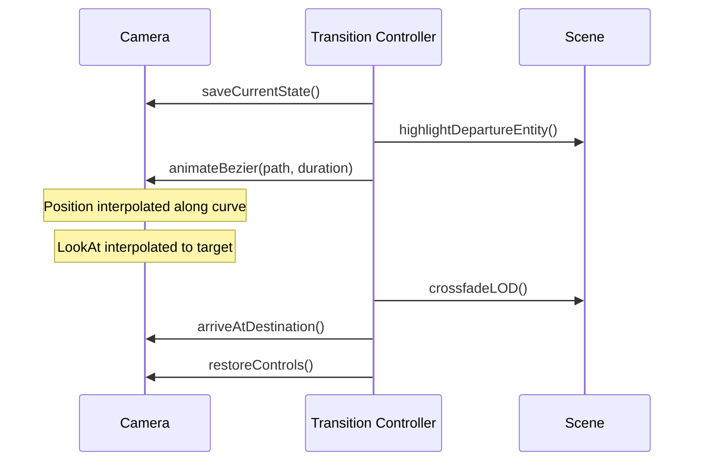

# Camera System

## Purpose

Define the **camera behavior** across all scale levels — movement, constraints, transitions, and interaction modes.

---

## Responsibilities

- Camera type and settings per scale
- Movement controls and speed scaling
- Transition flight paths
- Collision avoidance
- Focus and follow modes
- Mobile camera adaptations

---

## Camera Types per Scale

| Scale        | Camera Type           | Control Mode           |
| ------------ | --------------------- | ---------------------- |
| Galaxy       | Perspective (60° FOV) | Pan + logarithmic zoom |
| Solar System | Perspective (60° FOV) | Orbital rotation       |
| Earth        | Perspective (50° FOV) | Globe rotation + zoom  |
| Orbital Ring | Perspective (55° FOV) | Path-constrained orbit |
| Megacity     | Perspective (65° FOV) | Free flight            |
| District     | Perspective (65° FOV) | Hover / walk           |
| Building     | Perspective (60° FOV) | Orbit exterior         |
| Room         | Perspective (70° FOV) | Walk / first-person    |
| Agent        | Perspective (45° FOV) | Fixed focus on agent   |
| Memory       | Orthographic          | Graph pan + zoom       |

---

## Camera Settings

```typescript
// Conceptual camera configuration
const cameraPresets = {
  galaxy: {
    fov: 60,
    near: 0.1,
    far: 1e24,
    position: [0, 5e20, 1e21],
    zoomSpeed: 0.1, // logarithmic factor
    panSpeed: 2e20,
  },
  megacity: {
    fov: 65,
    near: 1,
    far: 50000,
    position: [0, 2000, 5000],
    flySpeed: 100,
    lookSpeed: 0.005,
  },
  room: {
    fov: 70,
    near: 0.1,
    far: 500,
    position: [0, 1.7, 5],
    walkSpeed: 5,
    lookSpeed: 0.003,
  },
};
```

---

## Movement Controls

### Desktop

| Input            | Galaxy     | City/District     | Interior   |
| ---------------- | ---------- | ----------------- | ---------- |
| Mouse drag       | Pan        | Rotate camera     | Look       |
| Scroll           | Zoom (log) | Move forward/back | —          |
| WASD             | —          | Fly               | Walk       |
| Q/E              | —          | Down/Up           | —          |
| Right-click drag | —          | Pan               | —          |
| Middle-click     | Reset view | Reset view        | Reset view |

### Speed Scaling

Camera speed scales with altitude/distance:

```
speed = baseSpeed * (currentAltitude / referenceAltitude)^0.5
```

| Scale    | Base Speed   | Reference       |
| -------- | ------------ | --------------- |
| Galaxy   | 2e20 units/s | 1e21 distance   |
| Megacity | 100 units/s  | 2000m altitude  |
| Room     | 5 units/s    | 1.7m eye height |

---

## Scale Transition Camera



### Flight Path Storage

```json
{
  "transition": "earth-to-megacity",
  "duration": 2500,
  "curve": "bezier",
  "controlPoints": [
    { "position": [0, 1e7, 2e7], "lookAt": [0, 0, 0] },
    { "position": [0, 50000, 100000], "lookAt": [0, 0, 0] },
    { "position": [0, 2000, 5000], "lookAt": [0, 0, 0] }
  ],
  "easing": "ease-in-out"
}
```

---

## Special Camera Modes

### Follow Agent

- Camera maintains 3m offset behind and 1.5m above agent
- Smooth lerp follow (factor: 0.05)
- Activated on "Follow" button in agent sidebar

### Orbit Selection

- Camera orbits selected entity at fixed radius
- Auto-activated on building exterior view
- Scroll adjusts orbit radius

### Cinematic (Transitions)

- Camera on scripted path; user input disabled
- Skip available after 500ms
- Audio syncs with camera position on path

---

## Collision Avoidance

| Scale             | Method                                        |
| ----------------- | --------------------------------------------- |
| Interior          | Simple sphere collision (camera radius: 0.3m) |
| Building exterior | Minimum distance to mesh (2m)                 |
| City              | Minimum altitude (50m above ground)           |
| All               | No camera below ground plane                  |

---

## Mobile Adaptations

| Feature        | Desktop | Mobile               |
| -------------- | ------- | -------------------- |
| Free flight    | Yes     | No (tap-to-navigate) |
| Walk mode      | Yes     | No                   |
| Pinch zoom     | —       | Yes (galaxy, earth)  |
| Two-finger pan | —       | Yes                  |
| Gyroscope look | —       | Optional (v2)        |
| Camera speed   | Full    | 50% reduced          |

---

## Constraints

### MVP implementation notes (2026-06-17)

- **Cosmic scroll journey (galaxy / earth)**: Wheel dollies the camera until `minDistance` / `maxDistance`; only at those limits does scroll advance the journey step (galaxy ↔ earth). Drag pans on galaxy (`map` profile); earth uses orbit. Earth → megacity remains click-only (`Enter Brain City`).
- **Megacity altitude**: `minAltitude` is enforced relative to `BRAIN_CITY_DECK_Y` (~700 m), not world `y = 0`, so the camera cannot pass under floating islands. `maxPolarAngle` ≈ 1.35 rad limits underside views.

1. **No camera roll** — Horizon always level (except cinematic)
2. **Maximum FOV: 80°** — Prevent distortion
3. **Minimum FOV: 30°** — Prevent tunnel vision
4. **Transition skip always available** — After 500ms
5. **Camera state saved in navigationStore** — Restorable on back navigation

---

## Future Considerations

- VR camera with head tracking
- Cinematic replay of camera paths
- Photo mode with depth of field
- Camera bookmarks (save position + orientation)
- Smooth zoom-to-cursor (Google Earth style) at all scales

---

## Implementation Guidance

1. Use `CameraControls` from `@react-three/drei` as base
2. Create `CameraController` wrapper with scale-specific presets
3. `ScaleTransitionController` overrides controls during transitions
4. Store camera state in `navigationStore` on every significant move
5. Implement collision via raycast downward for minimum altitude
6. Mobile: disable `CameraControls` and use tap-to-navigate from sidebar
