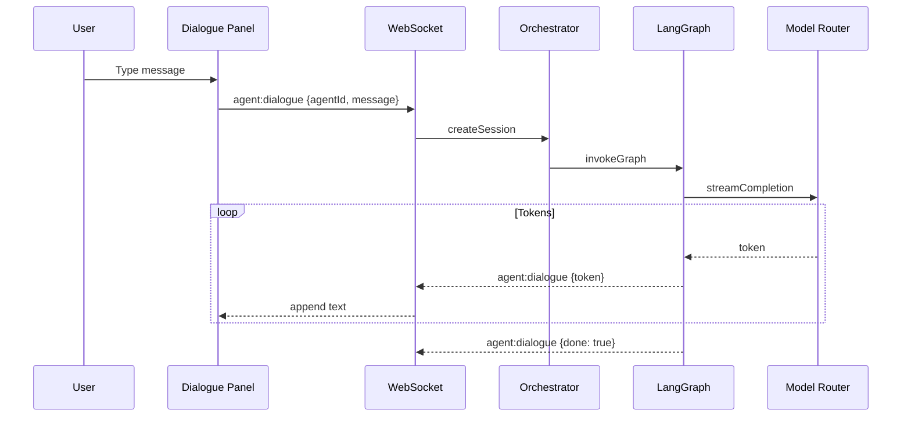

# Feature Spec: Agent System

## Purpose

Persistent AI agents with holographic avatars, JARVIS-style dialogue, task delegation, and status visualization.

## Scope: MVP (50 agents), v1 (500), v2 (5,000)

## Requirements

### MVP

- [ ] 50 agents in Reasoning District
- [ ] Holographic avatar with district-colored shader
- [ ] Status particle effects (idle, thinking, acting)
- [ ] Click → profile sidebar
- [ ] Double-click → dialogue panel
- [ ] Streaming text response via WebSocket
- [ ] Tool call visualization as inline cards
- [ ] Agent positions synced from server

### v1

- [ ] 500 agents across all districts
- [ ] Agent movement between rooms (visual)
- [ ] Task delegation between agents
- [ ] Agent follow camera mode
- [ ] Role-based avatar shapes

### v2

- [ ] 5,000 agents with swarm LOD
- [ ] Multi-agent debate in amphitheater
- [ ] Agent reputation scores
- [ ] Agent personality evolution

## Agent Dialogue Flow



## API Endpoints

```
GET /api/v1/agents
GET /api/v1/agents/:id
POST /api/v1/agents/:id/dialogue
GET /api/v1/agents/:id/status
POST /api/v1/agents/:id/delegate    # v1
```

## WebSocket Events

```
agent:dialogue { sessionId, token?, toolCall?, done? }
agent:status { agentId, status, position }
```

## Scene Components

```
scenes/agent/
├── AgentNode.tsx
├── HologramAvatar.tsx
├── StatusParticles.tsx
├── NameTag.tsx
└── DialoguePanel.tsx     # HTML overlay
```

## Implementation Steps

1. Create `HologramAvatar` with custom shader
2. Implement `StatusParticles` per status type
3. Build `DialoguePanel` with streaming text
4. Wire WebSocket dialogue events
5. Implement `AgentOrchestrator` with LangGraph planner graph
6. Add `ModelRouterService` (OpenRouter + Ollama)
7. Store dialogue episodes in memory service
8. (v1) Add agent movement interpolation
9. (v2) Implement swarm LOD renderer

## Acceptance Criteria

- [ ] 50 agents visible with holographic avatars
- [ ] Status changes reflected in particle effects
- [ ] User can dialogue with any idle agent
- [ ] Response streams token by token
- [ ] Tool calls appear as inline cards
- [ ] First token latency < 2 seconds
