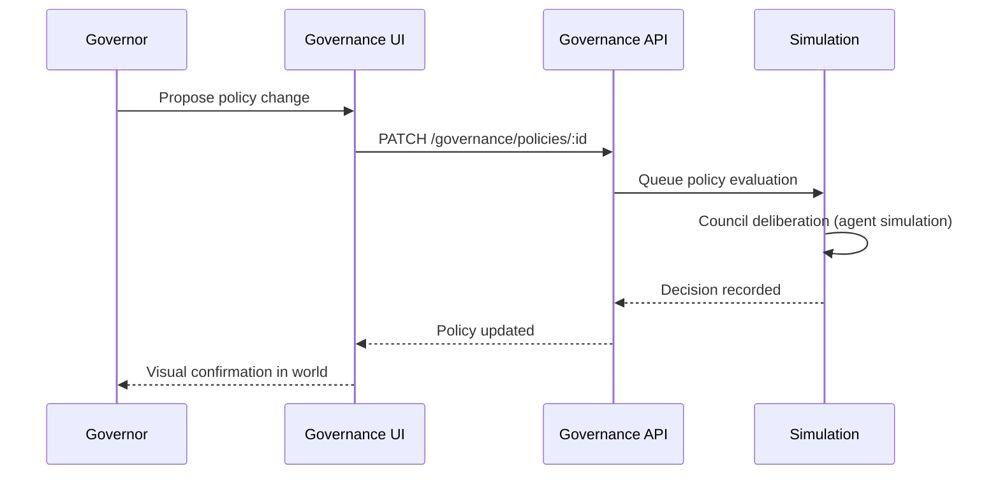

# Feature Spec: Governance System

## Purpose

User-facing governance interface for policy management, council visualization, and decision tracking.

## Scope: v2 (backend policy engine at v1 per ADR-0013)

## Requirements

### v2 Functional

- [ ] Policy list view in Reasoning District (Council Hall building)
- [ ] Policy detail: domain, rules, version history
- [ ] Governor: propose policy change
- [ ] Governor: approve/reject model promotions
- [ ] Council chamber visualization: agents deliberating
- [ ] Decision history timeline
- [ ] Policy change triggers visual world update within 1 tick
- [ ] Emergency override flow (admin only)

### v1 Prerequisite (backend only)

- [ ] `GovernanceService` with seeded policies (read-only API)
- [ ] `SimulationEngine` evaluates policies during tick
- [ ] Policy data drives simulation outcomes
- [ ] No governance UI at v1

### Policy Domains

See `docs/world-bible/governance.md` for full policy catalog.

### Governor Workflow



## API (v2)

```
GET   /governance/policies
GET   /governance/policies/:id
PATCH /governance/policies/:id        # Governor
GET   /governance/decisions?limit=20
POST  /governance/decisions/:id/vote   # Governor
```

## WebSocket

```
governance:policy { policyId, change, policy }
simulation:event { type: 'policy_changed', ... }
```

## Scene Integration

- Council Hall in Reasoning District: primary governance UI location
- Policy change pulse on affected districts
- Alert beacon for emergency overrides

## Acceptance Criteria (v2)

- [ ] Governor can view and edit policies
- [ ] Policy change reflected in simulation within 60s
- [ ] Decision history accessible for 90 days
- [ ] Non-governor users can view policies (read-only)
- [ ] Council chamber shows deliberating agents during decisions

## References

- `docs/world-bible/governance.md`
- `docs/adr/0013-simulation-vs-governance-phasing.md`
- `docs/feature-specs/simulation-system.md`
