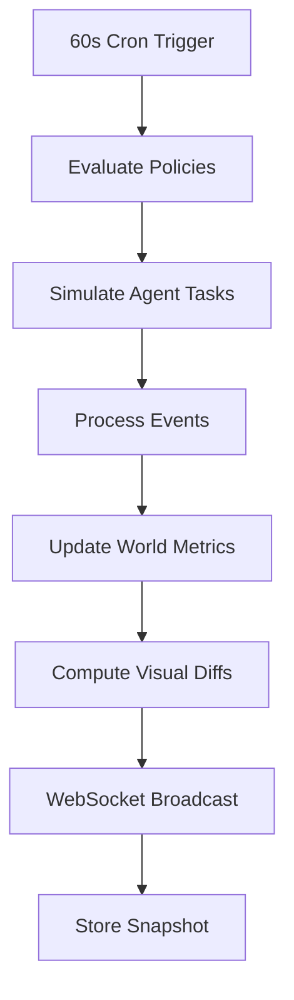

# Feature Spec: Simulation System

## Purpose

Drive world evolution through periodic simulation ticks that update metrics, trigger events, and modify visuals.

## Scope: v1

## Requirements

### Functional

- [ ] 60-second simulation tick (server-side cron)
- [ ] World state variables updated per tick
- [ ] Random events injected (threats, discoveries, failures)
- [ ] Policy evaluation during tick
- [ ] Agent task simulation (background processing)
- [ ] Visual indicators update within 1 tick of state change
- [ ] Event history accessible in sidebar

### World State Variables

| Variable          | Range | Visual Effect             |
| ----------------- | ----- | ------------------------- |
| planetary_health  | 0-100 | Earth texture vitality    |
| city_prosperity   | 0-100 | Building light intensity  |
| agent_morale      | 0-100 | Agent particle behavior   |
| defense_readiness | 0-100 | Ring segment glow         |
| knowledge_index   | 0-100 | Memory tower height       |
| innovation_rate   | 0-100 | Self Improvement activity |

## Simulation Tick Flow



## API Endpoints

```
GET /api/v1/simulation/state
GET /api/v1/simulation/events?limit=50
GET /api/v1/simulation/history?from=&to=    # v2
```

## WebSocket Events

```
simulation:tick { tickId, worldState, changes }
simulation:event { eventId, type, severity, data }
```

## Implementation Steps

1. Create `SimulationService` with Bull cron job (60s)
2. Implement `PolicyEvaluator` (JSON Logic rules)
3. Build `EventGenerator` with configurable event types
4. Update world state variables in PostgreSQL
5. Compute visual diffs and broadcast via WebSocket
6. Store snapshot in `world_state_snapshots` table
7. Build simulation event feed in sidebar UI
8. Wire visual indicators to state changes

## Event Types

| Type              | Severity    | Example                    |
| ----------------- | ----------- | -------------------------- |
| threat_detected   | medium-high | Debris cluster in LEO      |
| agent_milestone   | low         | Agent completed 1000 tasks |
| building_degraded | medium      | Error rate spike           |
| policy_changed    | low         | Council updated allocation |
| discovery         | low         | New memory pattern found   |
| training_complete | low         | Model promotion ready      |

## Acceptance Criteria

- [ ] Simulation tick runs every 60 seconds
- [ ] World metrics update and broadcast to clients
- [ ] Visual indicators reflect state within 60 seconds
- [ ] Events appear in sidebar feed
- [ ] Tick processing completes in < 5 seconds
