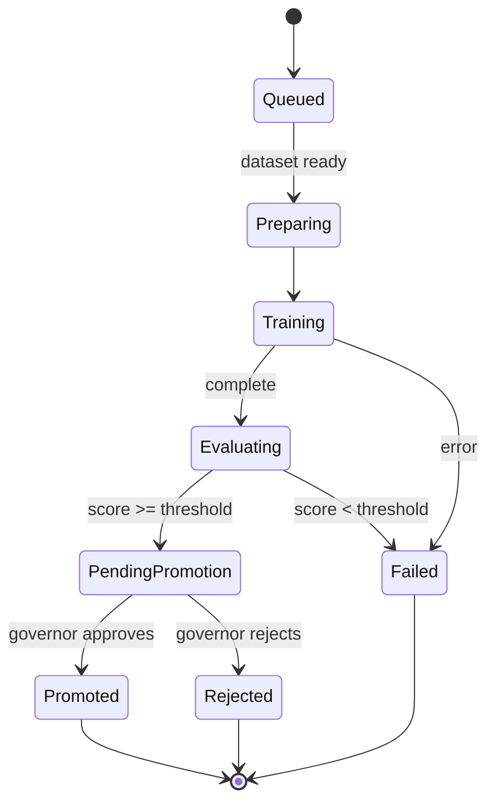

# Feature Spec: Training Pipeline

## Purpose

Model training, evaluation, and promotion workflow in the Self Improvement District.

## Scope: v2

## Requirements

### Functional

- [ ] Queue training job from Training Crucible building
- [ ] Training progress visualization (loss curve as terrain)
- [ ] Evaluation in Evaluation Arena (benchmark scores)
- [ ] Model genealogy tree in Genealogy Lab
- [ ] Promotion Gate: governor approves production deployment
- [ ] Rollback via Action District Rollback Station
- [ ] Training jobs run on Ollama GPU workers

### Job Lifecycle



### API

```
POST  /training/jobs
GET   /training/jobs/:id
GET   /training/jobs/:id/metrics     # loss curve data
GET   /models/:id/genealogy
POST  /models/:id/promote            # Governor
POST  /models/:id/rollback           # Admin
```

### Queue

- Bull queue: `training` (concurrency: 2)
- GPU requirement: Ollama with CUDA
- Budget: 100 GPU hours/week (governance policy)

### Visual Integration

- Training Crucible: crucible glow intensity = training progress
- Evaluation Arena: leaderboard hologram with scores
- Genealogy Lab: 3D tree of model versions
- Promotion Gate: approval animation on promote

## Acceptance Criteria

- [ ] Training job can be queued and monitored
- [ ] Loss curve visible as terrain elevation change
- [ ] Evaluation produces benchmark score
- [ ] Governor can approve/reject promotion
- [ ] Promoted model used by agents within 1 tick
- [ ] Rollback restores previous model version

## References

- `docs/architecture/ai-system.md`
- `docs/world-bible/districts.md` — Self Improvement District
- `docs/architecture/scalability-plan.md` — GPU workers
