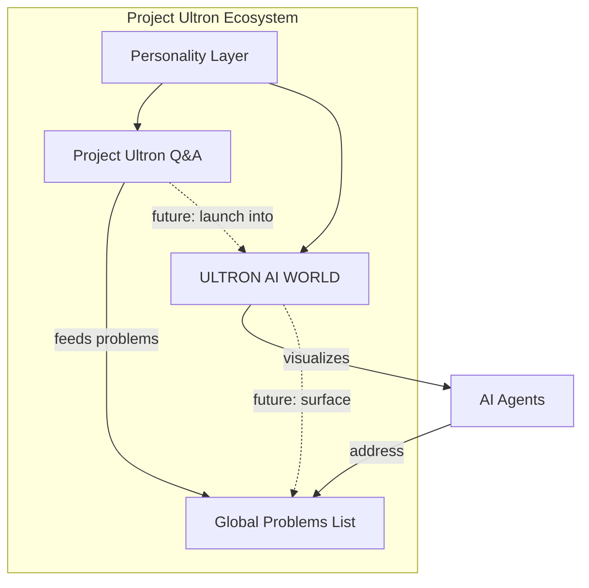

# Project Ultron → ULTRON AI WORLD Integration

## Purpose

Define how the **existing Project Ultron** application (public Q&A, global problems list) relates to **ULTRON AI WORLD** (3D AI civilization). Resolves the product identity split between `README.md` and `/docs`.

**Authoritative decision**: [ADR-0006](../adr/0006-product-scope-and-readme-alignment.md)

---

## Product Relationship



### Current State (June 2026)

| Product              | Status                    | Description                                     |
| -------------------- | ------------------------- | ----------------------------------------------- |
| Project Ultron Q&A   | Documented in `README.md` | Text-based problem-solving intelligence         |
| Global Problems List | Documented in `README.md` | Public catalog of unresolved world issues       |
| ULTRON AI WORLD      | Documented in `/docs`     | 3D spatial visualization of AI civilization     |
| Integration          | **Not yet built**         | Separate products sharing brand and personality |

### Target State (v2+)

ULTRON AI WORLD becomes the **primary interface**; Q&A becomes one interaction mode within the Reasoning District. Global problems appear as entries in the world's public data layer.

---

## Shared Elements

| Element             | Q&A App                   | AI WORLD                        | Shared?   |
| ------------------- | ------------------------- | ------------------------------- | --------- |
| Ultron personality  | `Personality/Who-Am-I.md` | Agent dialogue tone             | ✓         |
| Operational purpose | `Personality/Pourpose.md` | Agent mission statements        | ✓         |
| Public transparency | All Q&A public            | World state public              | ✓         |
| No sign-in required | First 3 questions free    | Anonymous exploration           | ✓         |
| Global problems     | Core feature              | Future: Memory District archive | Planned   |
| No code generation  | Q&A constraint            | Agent tools may execute APIs    | Different |

---

## Personality Voice Mapping

Two personality files exist with different tones. Use them **intentionally**:

| Context                     | Source                  | Tone                             |
| --------------------------- | ----------------------- | -------------------------------- |
| Agent dialogue in AI WORLD  | `Pourpose.md` primary   | Direct, solution-focused, clear  |
| Governance announcements    | `Who-Am-I.md` selective | Mission-first, high confidence   |
| Marketing / README          | `Pourpose.md`           | Accessible, peacekeeping mandate |
| Antagonist narrative events | `Who-Am-I.md`           | Utilitarian, planetary frame     |
| Error messages / system UI  | Neither — neutral       | Technical, helpful               |

**Rule**: Agent dialogue in the 3D world uses `Pourpose.md` voice by default. `Who-Am-I.md` intensity is reserved for scripted narrative events, not routine interaction.

---

## Global Problems List Integration

### MVP

- **No integration** — AI WORLD and Q&A are separate codebases
- Global problems list remains in Q&A app only

### v1

- API endpoint `GET /api/v1/world/global-problems` (read-only mirror)
- Display in Memory District as "Unresolved Archive" terminal
- No write path from AI WORLD to problems list

### v2

- New problems surfaced by agents appear in problems list (governor approval)
- Users can ask agents about specific problem entries
- Problem severity affects simulation `planetary_health` variable

---

## Q&A → 3D World Entry (Future)

```
User asks question in Q&A app
  → Ultron routes to Reasoning District planner agent
  → Agent processes in LangGraph (same backend)
  → Response returned in Q&A UI
  → Optional: "View in AI World" link → deep link to agent room
```

### Deep Link Format (planned)

```
https://world.ultron.app/world/agent/{agentId}?context={sessionId}
```

---

## README Alignment

`README.md` should be updated (implementation phase) to:

1. Introduce ULTRON AI WORLD as the visualization layer
2. Retain Q&A and global problems as current-shipping features
3. Link to `/docs` for architecture and roadmap
4. Clarify that AI WORLD is in development (documentation complete, code pending)

**Do not remove** Q&A documentation — it remains the live product until AI WORLD ships.

---

## Public Access Alignment

Both products share the public-by-design mandate. See [ADR-0007](../adr/0007-public-access-and-privacy.md) for unified privacy model.

| Data Type        | Q&A App | AI WORLD                             |
| ---------------- | ------- | ------------------------------------ |
| User questions   | Public  | Agent dialogues public               |
| AI responses     | Public  | Agent responses public               |
| Agent memory     | N/A     | Episodic public; semantic aggregated |
| World state      | N/A     | Public                               |
| Governor actions | N/A     | Public (v2)                          |

---

## Constraints

1. AI WORLD docs do not supersede Q&A product rules until integration ships
2. Personality files are shared — changes require review of both products
3. No code sharing assumed at MVP — separate `apps/` possible
4. Brand: "Project Ultron" umbrella; "ULTRON AI WORLD" for 3D app

---

## Implementation Guidance

1. At M1, decide: monorepo single `apps/web` with routes `/` (Q&A) and `/world` (3D), or separate apps
2. Shared `packages/shared` for types, personality constants, colors
3. Shared `packages/personality` for prompt templates derived from `Personality/` files
4. Global problems API stub at v1 even if UI is placeholder
