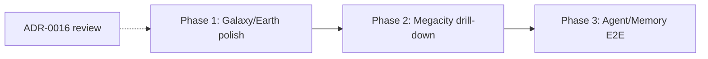

# Galaxy-First Roadmap

> **Cursor Memory File** — Sprint plan after [Proposal 0001](../proposals/0001-ui-first-mvp-entry-and-cosmic-stack.md) approval (2026-06-16).  
> **Canonical user path**: Galaxy → Earth → Megacity → District → Building → Room → Agent → Memory (Talk + View Memory).

---

## Guiding Rules

1. **Galaxy is the door** — default load, production, and primary E2E start at `galaxy`.
2. **Megacity is mid-journey** — city APIs (Nexus) unchanged; reach via scroll or `?scale=megacity` for QA shortcuts.
3. **Cosmic = mock at MVP** — Galaxy/Earth HUD use frontend mocks until v1/v2 APIs; label “simulated”.
4. **City chain = instant cuts** — megacity → memory stays ADR-0008 instant swap behavior.

---

## Phase 1: Polish Galaxy / Earth Entry (P0)

**Goal**: First-load experience is shippable — scroll journey feels intentional, HUDs honest about mock data, perf within budget.

**Status**: 🟡 In progress (2026-06-16) — HUD simulated labels, scroll hints, GalaxyHUD mount, Sol marker shipped; Playwright E2E deferred to Phase 3.

### UI surfaces

| Surface                     | File(s)                                             | Work                                                    |
| --------------------------- | --------------------------------------------------- | ------------------------------------------------------- |
| Galaxy scene + spiral field | `GalaxyScene.tsx`, `SpiralGalaxyField.tsx`          | Scroll hint clarity; focus states for star systems      |
| Galaxy HUD                  | `GalaxyHUD.tsx`, `BottomHUD.tsx`                    | “Simulated metrics” label; align copy with world bible  |
| Earth scene                 | `EarthScene.tsx`, `EarthGlobe.tsx`                  | Beacon → megacity affordance visible on scroll step     |
| Earth HUD                   | `EarthHUD.tsx`, `useEarthState.tsx`                 | Mock state documented; loading skeleton                 |
| Scroll journey              | `ScrollJourneyController.ts`, `useScrollJourney.ts` | Stable step indices; no regressions on `?scale=` bypass |
| Bottom HUD hints            | `BottomHUD.tsx`                                     | Galaxy/earth scroll ladder copy                         |

### Hooks / stores

| Hook / store          | Work                                                        |
| --------------------- | ----------------------------------------------------------- |
| `navigationStore`     | ✅ Default `galaxy` — no change                             |
| `useScrollJourney`    | Verify wheel ladder galaxy → earth → megacity → 5 districts |
| `useScaleUrlParam`    | Document QA deep links in E2E README                        |
| `useEarthState`       | Keep mock; add error/empty states for future API            |
| `useGalaxyNavigation` | Keyboard `G` / `Shift+1` documented in shortcuts overlay    |

### API gaps (UI-first worksheets — defer backend until HUD fields locked)

| Worksheet  | Fields needed                              | Endpoint (phase)        | Priority          |
| ---------- | ------------------------------------------ | ----------------------- | ----------------- |
| Earth HUD  | health, population, energy, sun phase      | `GET /earth/state` (v1) | P1 worksheet only |
| Galaxy HUD | system count, exploration %, anomaly flags | v2 star-system routes   | P2 worksheet only |

**Phase 1 backend**: None required for ship — mocks sufficient.

### Tests

| Test                             | Type          | Notes                                                    |
| -------------------------------- | ------------- | -------------------------------------------------------- |
| Default load at galaxy           | Playwright    | Assert scale + GalaxyHUD visible                         |
| Scroll galaxy → earth → megacity | Playwright    | Primary E2E entry (may use reduced motion / fast scroll) |
| `?scale=earth` bypass            | Playwright    | QA variant                                               |
| Scroll journey unit              | Vitest        | Step index boundaries                                    |
| Galaxy shader smoke              | Manual / perf | ADR-0014 budget on first paint                           |

---

## Phase 2: Megacity Drill-Down Chain (P0–P1)

**Goal**: Complete city path after cosmic entry — agent swarm, static fallback removal, API-backed shell.

### UI surfaces

| Surface                       | Work                                                                      |
| ----------------------------- | ------------------------------------------------------------------------- |
| `AgentScene`                  | Render agents from `worldStore.agents`; any agent clickable → memory path |
| `RoomScene`                   | Agent markers per room occupants                                          |
| `RightSidebar` / `EntityCard` | Remove `ENTITY_DETAILS` stubs; API-only detail                            |
| `LeftSidebar`                 | Full hierarchy from navigation API (✅ mostly done)                       |
| Per-district scroll steps     | District-specific `DistrictScene` variants (P2)                           |

### Hooks / stores

| Hook / store           | Work                                                |
| ---------------------- | --------------------------------------------------- |
| `useWorldSync`         | Hydrate agents at district/room scales for swarm UI |
| `worldStore`           | Single source for entity detail                     |
| `useBreadcrumbSync`    | Galaxy → … → agent trail when entering from scroll  |
| `getEnterNavigation()` | Enter chain from megacity onward (✅ done)          |

### API gaps

| Need              | Endpoint                    | Status              |
| ----------------- | --------------------------- | ------------------- |
| Agent swarm       | `GET /districts/:id/agents` | ✅ exists — wire UI |
| Room occupants    | `GET /buildings/:id/agents` | ✅ exists — wire UI |
| Navigation bundle | `GET /navigation/:scale`    | ✅ core             |
| Agent status chip | `GET /agents/:id/status`    | P2 — HUD badge      |

### Tests

| Test                                                  | Type           | Notes                    |
| ----------------------------------------------------- | -------------- | ------------------------ |
| Full journey: galaxy scroll → megacity → agent → Talk | Playwright E2E | **Primary MVP E2E**      |
| City-only shortcut: `?scale=megacity` → memory        | Playwright     | CI fast path variant     |
| Breadcrumb ascend from agent                          | Playwright     | Nexus scenario           |
| View Memory timeline                                  | Playwright     | `GET /agents/:id/memory` |
| `worldStore` hydration                                | Vitest         | Nexus spec               |

---

## Phase 3: Agent / Memory MVP Completion (P0–P1)

**Goal**: Dialogue + memory polished on the full path; automation complete.

### UI surfaces

| Surface             | Work                           |
| ------------------- | ------------------------------ |
| `DialoguePanel`     | ✅ streaming — E2E send/assert |
| `MemoryTimeline`    | ✅ API — expand row E2E        |
| Agent status in HUD | Live chip when endpoint wired  |
| `ShortcutsOverlay`  | Galaxy-first path documented   |

### Hooks / stores

| Hook / store       | Work                                                 |
| ------------------ | ---------------------------------------------------- |
| `useAgentDialogue` | Move inline fetch to `api-endpoints.ts` (P1 hygiene) |
| `agentStore`       | WS lifecycle integration test                        |
| `openDialogue()`   | E2E from agent selected after galaxy journey         |

### API gaps

| Need            | Endpoint                         | Status           |
| --------------- | -------------------------------- | ---------------- |
| Dialogue        | `POST /agents/:id/dialogue` + WS | ✅ Phoenix       |
| Memory          | `GET /agents/:id/memory`         | ✅ Nexus         |
| Semantic search | `POST /agents/:id/memory/search` | Defer (pgvector) |

### Tests

| Test                  | Type               | Notes                                     |
| --------------------- | ------------------ | ----------------------------------------- |
| Talk → stream → close | Playwright phoenix | After galaxy journey or megacity shortcut |
| WS handshake          | API integration    | Phoenix pending                           |
| Seed invariants       | Jest nexus         | ✅ exists                                 |
| API contract matrix   | Supertest nexus    | Pending                                   |

---

## E2E Strategy (Galaxy-First)

| Suite            | Entry                   | Scope                                                       | When                 |
| ---------------- | ----------------------- | ----------------------------------------------------------- | -------------------- |
| **Primary**      | Default load (`galaxy`) | Scroll to megacity → Reasoning → agent → Talk → View Memory | Nightly / release    |
| **Fast variant** | `?scale=megacity`       | City chain only                                             | MR CI (optional job) |
| **Cosmic smoke** | `?scale=earth`          | Earth HUD + transition                                      | Weekly               |

Document variants in `docs/qa/nexus-scenarios.md` and `e2e/README.md` when Playwright lands.

---

## Cross-Phase Dependencies

- **ADR-0016** (from Proposal 0002) should land before mass-updating canonical-numbers / PRD.
- Phase 1 can start immediately — code already Galaxy-default.

---

## Success Criteria

| Phase | Done when                                                                                 |
| ----- | ----------------------------------------------------------------------------------------- |
| 1     | First load galaxy; scroll to megacity reliable; HUDs label mock data; perf checklist pass |
| 2     | Any seeded agent selectable in 3D; no new `shell-data` stubs; breadcrumbs from full path  |
| 3     | Playwright primary E2E green against Docker stack; Phoenix + Nexus paths automated        |

---

## References

- [Proposal 0001](../proposals/0001-ui-first-mvp-entry-and-cosmic-stack.md) — Approved
- [Proposal 0002](../proposals/0002-supersede-adr-0008-galaxy-entry.md) — **Approved** → [ADR-0016](../adr/0016-galaxy-first-entry-and-scale-phasing.md)
- [`active-work.md`](./active-work.md) — live backlog
- [`ui-first-workflow.md`](./ui-first-workflow.md) — contract worksheets

---

_Update at phase boundaries or when E2E strategy changes._
