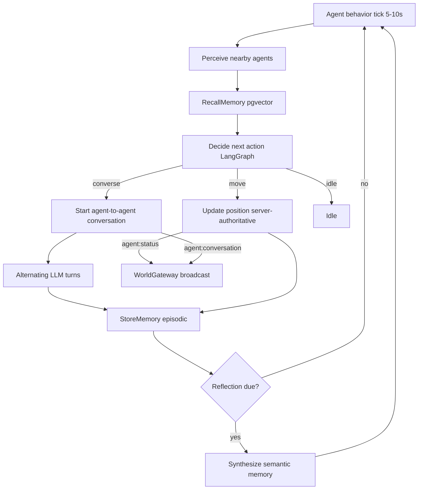

# Proposal 0003: Autonomous Living World (AI Town Direction)

## Status

**Approved** — 2026-07-04 → [ADR-0017](../adr/0017-autonomous-living-world.md)

## Author

Cursor Agent — 2026-07-04

## Problem

[AI Town](https://github.com/a16z-infra/ai-town) demonstrates a **living world** where AI characters autonomously wander, initiate **agent-to-agent** conversations, write episodic memory, periodically reflect to form higher-level beliefs, and recall relevant memories via vector search to drive their next action — all stepped by a continuous server-side simulation engine.

Project Ultron shares the substrate (3D world, persistent agents, dialogue, pgvector memory column, WebSocket gateway, `ModelRouterService`) but **does not yet implement autonomy**:

| AI Town signature behavior                                 | Ultron today (2026-07-04)                                                |
| ---------------------------------------------------------- | ------------------------------------------------------------------------ |
| Agents autonomously decide next action on engine tick      | Agents are static; positions from seed; no behavior loop                 |
| Agents spontaneously converse with each other              | Only **user ↔ agent** dialogue via `DialogueService`                     |
| Memory write + reflection + vector recall drives decisions | Memory timeline exists; semantic search endpoint deferred; no reflection |
| Continuous server engine                                   | Simulation tick **OFF** per ADR-0013 MVP; background inference **OFF**   |
| Real agent decision graph                                  | `AgentOrchestratorService` is a single-node stub (`Receive → Respond`)   |

This gap is **not documented** in any accepted feature spec or ADR. Per governance (No Assumption Rule), we cannot implement an autonomous per-agent social loop without a proposal and human-approved ADR.

The product direction is aligned with Ultron's vision — agents in a spatial civilization — but the **generative-agents loop** (perceive → recall → decide → act → remember → reflect) is new architecture that extends, but does not replace, the existing v1 macro simulation spec.

## Proposed Change

Introduce an **Autonomous Living World** capability in phased delivery, reusing the already-accepted ADR-0005 AI stack (LangGraph, OpenRouter/Ollama, pgvector, Redis budget) and the existing NestJS + WebSocket infrastructure. Do **not** adopt AI Town's Convex/PixiJS stack — Ultron keeps its R3F world engine and server-authoritative model.

### Core Architecture

1. **Autonomy loop** — Replace the stub in `apps/api/src/modules/ai/agent-orchestrator.service.ts` with a real LangGraph graph per agent role:

   ```
   Perceive → RecallMemory → Decide → (Move | StartConversation | Idle) → StoreMemory
                                                                    ↓
                                                          Reflect (periodic)
   ```

2. **Conversation coordinator** — Extend `apps/api/src/modules/realtime/dialogue.service.ts` to support **agent ↔ agent** sessions (two participants, alternating turns, both write memory) in addition to existing user ↔ agent dialogue.

3. **Dual-tick simulation** — Keep ADR-0013's 60-second **macro** simulation tick for world-state variables (`planetary_health`, `city_prosperity`, etc.). Add a faster **agent-behavior tick** (proposed: 5–10 s) that advances agent positions and triggers autonomy decisions. Server remains authoritative; client interpolates and renders diffs.

4. **Memory + recall** — Activate deferred `POST /api/v1/agents/:id/memory/search` using the existing pgvector `embedding` column on `agent_memories`. Wire `RecallMemory` node per `docs/architecture/ai-system.md` retrieval pipeline. Add periodic **reflection** that synthesizes episodic memories into semantic memories.

5. **Frontend** — `AgentScene` interpolates server-driven positions (already specced as v1 in `agent-system.md`). Render agent ↔ agent conversation bubbles via new `agent:conversation` WebSocket events. No new Zustand store — reads `worldStore` per ADR-0004.



### New Contracts (to be added after approval)

#### WebSocket events (`packages/shared/src/events.ts`)

| Event                        | Direction       | Payload (summary)                                                                                      |
| ---------------------------- | --------------- | ------------------------------------------------------------------------------------------------------ |
| `agent:conversation`         | Server → Client | `{ conversationId, participants[], speakerId, token?, done? }`                                         |
| `agent:status`               | Server → Client | **Extend existing** — server-initiated position/status at throttled cadence (today client-driven only) |
| `agent:conversation:observe` | Client → Server | (v2) Subscribe to a visible agent-to-agent conversation                                                |

Existing `agent:dialogue` remains for **user ↔ agent** sessions. Agent ↔ agent uses `agent:conversation` to avoid overloading the user-dialogue contract.

#### REST endpoints

| Endpoint                                | Phase | Purpose                                                            |
| --------------------------------------- | ----- | ------------------------------------------------------------------ |
| `POST /api/v1/agents/:id/memory/search` | 1     | Semantic recall (pgvector); already deferred in `memory-system.md` |
| `GET /api/v1/agents/:id/relationships`  | 3     | Read-only relationship scores between agents                       |
| `GET /api/v1/conversations`             | 3     | Read-only conversation history feed                                |

#### Prisma schema additions

| Model                       | Phase | Purpose                                                                                                           |
| --------------------------- | ----- | ----------------------------------------------------------------------------------------------------------------- |
| `conversations`             | 3     | Conversation sessions (agent-agent or user-agent)                                                                 |
| `conversation_participants` | 3     | Many-to-many participants                                                                                         |
| `conversation_messages`     | 3     | Turn history for replay and memory                                                                                |
| `agent_relationships`       | 3     | Accumulated familiarity / affinity scores                                                                         |
| `agent_positions`           | 2     | Server-authoritative position + room/building context (or extend `Agent` with `position Json` — see Alternatives) |
| LangGraph checkpoint tables | 1     | `PostgresSaver` per ADR-0005                                                                                      |

**Note**: `Agent` model today has no `position` field; `Room` has `position Json`. Phase 2 must add agent position persistence (new column or `agent_positions` table).

### Phased Delivery

| Phase | When    | Scope                                                                                       | User-visible outcome                                                 |
| ----- | ------- | ------------------------------------------------------------------------------------------- | -------------------------------------------------------------------- |
| **0** | Now     | This proposal + human-approved ADR                                                          | Governance gate cleared                                              |
| **1** | v1      | Real LangGraph graph; memory write after dialogue; reflection job; semantic search endpoint | User dialogue creates memories; agents "remember" past conversations |
| **2** | v1      | Agent-behavior tick; server-authoritative movement; position broadcast via `agent:status`   | Agents wander Reasoning District                                     |
| **3** | v1 → v2 | Spontaneous agent ↔ agent conversations; relationship accumulation                          | World feels alive — agents chat without user prompting               |
| **4** | v2      | Conversation bubbles in 3D; relationship sidebar; memory graph integration                  | Full AI Town-style social presence in Ultron's 3D shell              |

**MVP remains unchanged** — static world, user-triggered dialogue only, no simulation tick (ADR-0013). Phases 1–3 ship during v1 per roadmap alignment.

### Budget and Cost Controls

Continuous autonomy implies background LLM inference. Enforce existing limits from `docs/architecture/ai-system.md`:

| Control                                    | Proposed value                                  |
| ------------------------------------------ | ----------------------------------------------- |
| Max concurrent autonomy inferences         | 5 (v1), 20 (v2)                                 |
| Tokens per agent per hour                  | 50,000 (v1 existing)                            |
| Behavior tick interval                     | 10 s (v1), 5 s (v2)                             |
| Max simultaneous agent-agent conversations | 3 (v1), 10 (v2)                                 |
| Reflection frequency                       | Every 10 episodic memories or 30 min idle       |
| Degradation on budget exceed               | Pause autonomy; Ollama fallback per ModelRouter |

Agents in districts outside the user's viewport run at reduced tick rate (T2/T3 per `world-engine.md` agent tiers).

## Conflicts With

| Document                                  | Section / Decision                                                       | Conflict                                                                         | Resolution                                                                              |
| ----------------------------------------- | ------------------------------------------------------------------------ | -------------------------------------------------------------------------------- | --------------------------------------------------------------------------------------- |
| `docs/feature-specs/agent-system.md`      | MVP: no background inference; v1: agent movement; v2: multi-agent debate | Proposal adds background inference (Phase 2+) and agent-agent dialogue (Phase 3) | Extend spec after ADR approval; MVP scope unchanged                                     |
| `docs/feature-specs/simulation-system.md` | v1: 60s macro tick only                                                  | Proposal adds faster agent-behavior tick                                         | Clarify: macro tick = world metrics; behavior tick = per-agent autonomy. Both run at v1 |
| ADR-0013                                  | MVP: no simulation tick                                                  | Phases 2–3 add behavior tick at v1, not MVP                                      | No change to MVP; behavior tick is v1 deliverable                                       |
| ADR-0005                                  | LangGraph graphs for user-triggered dialogue                             | Proposal adds autonomous graph invocation                                        | Extends ADR-0005; does not replace it                                                   |
| `docs/current-state/scope.md`             | Background agent inference OFF (correct for MVP)                         | Living world requires inference ON at v1                                         | Update `current-state/` when Phase 2 ships                                              |
| `docs/architecture/world-engine.md`       | Server authoritative; agent position from WS                             | Phase 2 requires server-driven position updates                                  | Aligns with existing `agent:status` contract                                            |
| `docs/architecture/api-contracts.md`      | No `agent:conversation` event                                            | New event needed                                                                 | Add to shared contracts in Phase 3                                                      |

No conflict with ADR-0003 (single Canvas), ADR-0004 (four stores), ADR-0010 (NestJS), or forbidden-patterns (no client LLM, no second Canvas).

## Alternatives Considered

| Option                                                    | Why rejected                                                                                     |
| --------------------------------------------------------- | ------------------------------------------------------------------------------------------------ |
| **Keep current (static agents, user-only dialogue)**      | Does not move toward AI Town living-world goal; misses product differentiation                   |
| **Fork AI Town (Convex + PixiJS)**                        | Violates ADR-0002, ADR-0003, ADR-0010, ADR-0012; throws away R3F investment and scale navigation |
| **Client-side agent AI (decide in browser)**              | Forbidden pattern — security, budget control; server must be authoritative                       |
| **Single 60s tick for both macro sim and agent behavior** | Too slow for wandering/conversation feel; AI Town uses sub-second game loop with batched LLM     |
| **CrewAI / AutoGen for multi-agent**                      | ADR-0005 already chose LangGraph; adding second agent framework increases complexity             |
| **Autonomy at MVP**                                       | ADR-0013 explicitly defers simulation; MVP polish (M2) should complete before living world       |
| **Add `position` column directly on `Agent`**             | Simpler than `agent_positions` table; acceptable for v1 (50–500 agents). Revisit at 5,000 agents |

---

## Dependency Rule (if adding or replacing a package)

| Question                                      | Answer                                                                                                                                                                                                   |
| --------------------------------------------- | -------------------------------------------------------------------------------------------------------------------------------------------------------------------------------------------------------- |
| Why can't existing deps solve this?           | Autonomy requires LangGraph (already chosen in ADR-0005 but not installed — orchestrator is a stub). Bull/Redis for scheduling already in v1 simulation spec. No new vector DB — pgvector column exists. |
| Estimated bundle impact (gzip)                | **API only** — `langgraph` + `@langchain/core` ~150–200 KB server-side. **Zero web bundle impact** — all inference server-side per forbidden-patterns.                                                   |
| Maintenance cost (license, updates, security) | LangChain ecosystem (MIT). Same dependency risk already accepted in ADR-0005. Bull (MIT) already planned for simulation cron.                                                                            |
| Existing stack option tried first?            | **Yes** — proposal uses NestJS modules, Prisma, pgvector, WorldGateway, ModelRouter, `@ultron/personality`. No Convex, no PixiJS, no new state store.                                                    |

**No new critical-path dependency** beyond actually installing LangGraph (sanctioned but not yet wired).

---

## Technical Decision Evaluation

| Dimension            | Score (1–10) | Notes                                                                                     |
| -------------------- | ------------ | ----------------------------------------------------------------------------------------- |
| Complexity           | 5            | High conceptual complexity; mitigated by phased delivery and existing stubs               |
| Performance          | 6            | Background LLM cost is main risk; viewport throttling + budget caps required              |
| Maintainability      | 7            | Extends documented ADR-0005 patterns; single orchestrator entry point                     |
| Scalability          | 5            | 50 agents OK at v1; 500 needs tier throttling; 5,000 requires swarm LOD + tick staggering |
| Developer Experience | 7            | LangGraph visualizable; reuses existing WS/REST contracts                                 |

### Tradeoffs

**Pros**

- Delivers AI Town's signature "living world" feel within Ultron's existing 3D scale navigation
- Reuses accepted AI stack — no stack pivot
- Phased: memory/reflection (Phase 1) ships value before full autonomy
- Server-authoritative model preserved; public transparency mandate unchanged
- Aligns with v1 roadmap ("living city of 500 agents with real-time simulation")

**Cons**

- Background inference increases API cost and operational complexity
- Two simulation ticks (macro + behavior) require clear documentation to avoid confusion
- Agent position persistence not in current Prisma schema — migration needed
- Agent ↔ agent dialogue UX in 3D is harder than AI Town's 2D pixel map

**Risks**

| Risk                                            | Severity | Mitigation                                                                        |
| ----------------------------------------------- | -------- | --------------------------------------------------------------------------------- |
| Runaway LLM cost from continuous autonomy       | High     | Budget caps, concurrency limits, viewport-only full tick, Ollama degradation      |
| Non-deterministic agent behavior confuses users | Med      | Seed policies; reflection prompts from `@ultron/personality`; public dialogue log |
| Position desync between server and client       | Med      | Server authoritative; client lerp; periodic full snapshot via `world:snapshot`    |
| LangGraph checkpoint storage growth             | Med      | TTL on short-term checkpoints; archive completed conversations                    |
| Performance regression at 500 agents            | Med      | Agent tier system (T0–T3) already specced; throttle autonomy for T2/T3            |
| Scope creep into MVP                            | Med      | Phase 0 ADR gate; MVP completion (M2) before Phase 1                              |

---

## Implementation Impact

### Files / modules affected (by phase)

| Phase | Area           | Files / modules                                                                                                                      |
| ----- | -------------- | ------------------------------------------------------------------------------------------------------------------------------------ |
| 0     | Docs           | This proposal → new ADR; update feature specs                                                                                        |
| 1     | API AI         | `apps/api/src/modules/ai/agent-orchestrator.service.ts`, new `graphs/` templates, `EmbeddingService`, `MemoryService` reflection job |
| 1     | API Memory     | `apps/api/src/modules/memory/memory.service.ts`, `memory.controller.ts` — activate search endpoint                                   |
| 1     | Prisma         | LangGraph checkpoint tables migration                                                                                                |
| 2     | API Simulation | New `apps/api/src/modules/simulation/` — `AgentBehaviorService`, Bull scheduler                                                      |
| 2     | API Realtime   | `apps/api/src/modules/realtime/world.gateway.ts` — server-initiated `agent:status`                                                   |
| 2     | Prisma         | Agent position column or `agent_positions` table                                                                                     |
| 2     | Web            | `apps/web/scenes/agent/AgentScene.tsx`, position interpolation in `worldStore`                                                       |
| 3     | API Realtime   | `dialogue.service.ts` — agent-agent sessions; new `ConversationService`                                                              |
| 3     | Shared         | `packages/shared/src/events.ts` — `agent:conversation` types                                                                         |
| 3     | Prisma         | `conversations`, `conversation_participants`, `conversation_messages`, `agent_relationships`                                         |
| 3     | Web            | Conversation bubble overlay; optional sidebar feed                                                                                   |
| 4     | Web            | 3D bubble positioning, relationship panel, memory graph hooks                                                                        |

### Docs to update after approval

- `docs/feature-specs/agent-system.md` — add autonomy loop, agent-agent dialogue, behavior tick
- `docs/feature-specs/simulation-system.md` — document dual-tick model (macro + behavior)
- `docs/feature-specs/memory-system.md` — reflection job, semantic search activation
- `docs/architecture/ai-system.md` — autonomous graph variant, budget for background inference
- `docs/architecture/api-contracts.md` — `agent:conversation` event, new REST endpoints
- `docs/architecture/realtime.md` — server-initiated agent status broadcast
- `docs/current-state/capabilities.md` — flip simulation/autonomy rows when phases ship
- `docs/current-state/scope.md` — update "Background agent inference" when Phase 2 ships
- `docs/canonical-numbers.md` — behavior tick interval, max concurrent conversations, autonomy inference caps
- `docs/roadmap/v1.md` — add living-world phases to Feb 2027 simulation milestone
- `docs/memory/architecture-decisions.md` — row for new ADR
- `docs/memory/active-work.md` — track phase implementation

### Migration or rollback plan

- **Phase 1**: Feature-flag `AUTONOMY_ENABLED=false` (default). Memory search and reflection can ship independently.
- **Phase 2**: Behavior tick pausable via admin endpoint (mirror AI Town's `testing:stop` / `testing:resume` pattern).
- **Phase 3**: Agent-agent conversations opt-in per district; disable via env `AGENT_SOCIAL_ENABLED=false`.
- **Rollback**: Disable feature flags; agents revert to seed positions; no data loss (conversations archived).

---

## Suggested ADR-0017 Outline (for reviewer)

```markdown
# ADR-0017: Autonomous Living World (Agent Behavior Loop)

## Status

Accepted — [date after review]

## Context

[Proposal 0003 approved; AI Town direction; gap between static agents and living world]

## Decision

### Dual-Tick Simulation

- **Macro tick** (60 s): world-state variables per simulation-system.md — unchanged
- **Behavior tick** (10 s v1, 5 s v2): per-agent autonomy loop — new

### Autonomy Loop

LangGraph graph per agent role:
Perceive → RecallMemory → Decide → (Move | StartConversation | Idle) → StoreMemory
Periodic Reflect synthesizes semantic memories.

### Agent-to-Agent Conversation

- Separate WS event `agent:conversation` (not `agent:dialogue`)
- Alternating turns; both participants write episodic memory
- Max 3 simultaneous conversations (v1)

### Server Authority

- Agent positions updated server-side only
- Client interpolates via `agent:status` broadcasts
- Viewport agents: full behavior tick; off-viewport: reduced rate per agent tier

### MVP Exclusion

No autonomy at MVP. Phases ship during v1.

### Budget

Enforce ai-system.md token limits; pause autonomy on budget exceed.

## Alternatives Considered

[Copy from Proposal 0003]

## Consequences

- Extends ADR-0005 (LangGraph) and ADR-0013 (simulation phasing)
- Requires Prisma migration for agent positions and conversation tables
- feature-specs/agent-system.md and simulation-system.md updated
- canonical-numbers.md gains behavior-tick and autonomy caps

## References

- Proposal 0003
- ADR-0005 (AI Architecture)
- ADR-0013 (Simulation vs Governance Phasing)
- AI Town: https://github.com/a16z-infra/ai-town
```

---

## AI Town → Ultron Mapping Reference

For implementers — what to adopt vs ignore from AI Town:

| AI Town concept                        | Ultron equivalent                               | Adopt?                                                           |
| -------------------------------------- | ----------------------------------------------- | ---------------------------------------------------------------- |
| Convex game engine + DB                | NestJS + Prisma + Bull                          | **No** — keep stack                                              |
| PixiJS 2D rendering                    | R3F 3D World Engine                             | **No** — keep stack                                              |
| Character spritesheet movement         | Server position + client lerp in `AgentScene`   | **Yes** (pattern)                                                |
| `convex/aiTown/agent.ts` decision loop | `AgentOrchestratorService` LangGraph graph      | **Yes** (pattern)                                                |
| `convex/aiTown/conversation.ts`        | `ConversationService` + `agent:conversation` WS | **Yes** (pattern)                                                |
| Memory + reflection + vector search    | `MemoryService` + pgvector + reflection cron    | **Yes** (already specced)                                        |
| Idle world pause after 5 min           | Viewport-gated behavior tick                    | **Adapt** — pause off-screen autonomy                            |
| 8–12 characters                        | 50 (MVP) → 500 (v1) agents                      | **Scale** — tier throttling required                             |
| Single flat map                        | Multi-scale 3D (galaxy → memory)                | **Ultron advantage** — living world at district/room scale first |

---

## Approval

- [x] User approved — 2026-07-04
- [x] New ADR drafted: `docs/adr/0017-autonomous-living-world.md`
- [x] Old ADR marked Superseded (if applicable) — **N/A** (extends ADR-0005 and ADR-0013; no supersession)
