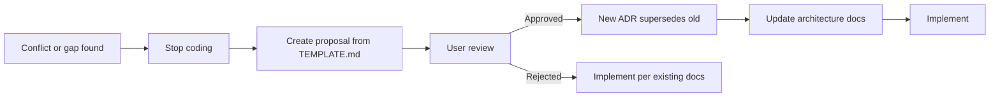

# Proposals

## Purpose

Staging area for **proposed changes** to accepted architecture — before any ADR is modified or superseded.

> Agents **must not** edit accepted ADRs directly. Write a proposal here first.

---

## When to Create a Proposal

| Trigger                           | Example                                  |
| --------------------------------- | ---------------------------------------- |
| Implementation conflicts with ADR | Want Redux instead of Zustand (ADR-0004) |
| Missing documentation blocks work | No spec for a required subsystem         |
| New dependency on critical path   | Replace Prisma, add GraphQL client       |
| Stack or pattern change           | Second Canvas, direct LLM in frontend    |
| Numeric / scope change            | Agent cap, new scale level at MVP        |

---

## Workflow



1. Copy [`TEMPLATE.md`](TEMPLATE.md) → `NNNN-short-kebab-title.md` (next number after highest in folder).
2. Complete all sections including the **Technical Decision Evaluation** scorecard.
3. Link the conflicting ADR(s) and architecture docs.
4. Wait for human approval.
5. On approval → author a new ADR with status **Accepted** and mark the old ADR **Superseded**.
6. Update `docs/architecture/`, `docs/canonical-numbers.md`, and `docs/current-state/` as needed.

---

## Naming

```
docs/proposals/
├── README.md
├── TEMPLATE.md
├── 0001-example-title.md
└── 0002-another-proposal.md
```

Proposal numbers are independent of ADR numbers. Reference ADRs by ID in the proposal body.

---

## References

- [`.cursor/rules/governance.mdc`](../../.cursor/rules/governance.mdc) — Architecture Lock, No Assumption, Dependency rules
- [`../adr/`](../adr/) — Accepted decisions (read-only for agents)
- [`../memory/active-work.md`](../memory/active-work.md) — Track open proposal TODOs

_Last updated: 2026-06-14_
