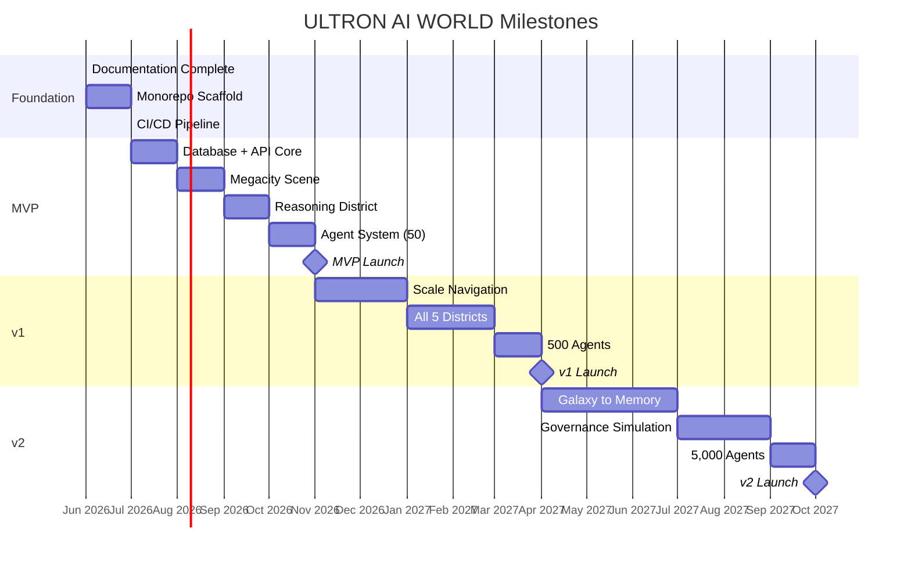

# Milestones

## Purpose

Define the **major delivery milestones** for ULTRON AI WORLD with dates, deliverables, and success criteria.

---

## Milestone Overview

---

## M1: Foundation (June–July 2026)

| Deliverable                            | Status      |
| -------------------------------------- | ----------- |
| Complete documentation (`/docs`)       | ✅ Complete |
| Monorepo scaffold (web + api + shared) | Planned     |
| Docker Compose dev environment         | Planned     |
| Prisma schema v1                       | Planned     |
| CI/CD pipeline (lint, test, build)     | Planned     |
| Prometheus + Grafana setup             | Planned     |

**Exit criteria**: Developer can clone, `docker compose up`, and see health checks pass.

---

## M2: MVP (July–November 2026)

| Deliverable          | Details                           |
| -------------------- | --------------------------------- |
| Megacity aerial view | 5 district zones visible          |
| Reasoning District   | Full detail with 5 building types |
| 50 agents            | Persistent, with dialogue         |
| Agent dialogue       | JARVIS-style streaming chat       |
| Building navigation  | Exterior + 3 interior rooms       |
| WebSocket realtime   | Agent status, building metrics    |
| Basic memory view    | Agent memory timeline             |

**Exit criteria**: User can fly into Reasoning District, enter Planning Tower, talk to an agent, and view its memory.

---

## M3: v1 (November 2026 – April 2027)

| Deliverable                | Details                                   |
| -------------------------- | ----------------------------------------- |
| Earth + Orbital Ring views | Planetary and defense navigation          |
| All 5 districts            | Full detail with unique themes            |
| 500 agents                 | Distributed across districts              |
| Scale transitions          | Earth → City → District → Building → Room |
| Simulation tick            | 60-second world state updates             |
| Search                     | Cross-entity search                       |
| Mobile UI                  | Bottom sheet navigation                   |

**Exit criteria**: User can navigate from Earth to any district, building, room, and agent.

---

## M4: v2 (April–October 2027)

| Deliverable           | Details                                             |
| --------------------- | --------------------------------------------------- |
| Galaxy + Solar System | Full scale stack                                    |
| Memory graph view     | 3D knowledge graph per agent                        |
| Governance system     | Policy management + simulation                      |
| 5,000 agents          | With swarm visualization                            |
| Defense system        | Threat tracking on orbital ring                     |
| Authentication        | Governor and admin roles (v1 JWT; governance UI v2) |
| Training pipeline     | Self Improvement District live                      |

**Exit criteria**: Full galaxy-to-memory navigation with governance, simulation, and 5,000 agents.

---

## Constraints

1. **No milestone slips without ADR** — Scope changes require decision record
2. **Each milestone has a demo** — Recorded walkthrough required
3. **Performance gates at each milestone** — FPS targets must be met
4. **Documentation updated per milestone** — Memory files kept current

---

## Implementation Guidance

Track milestone progress in [`../memory/active-work.md`](../memory/active-work.md).
