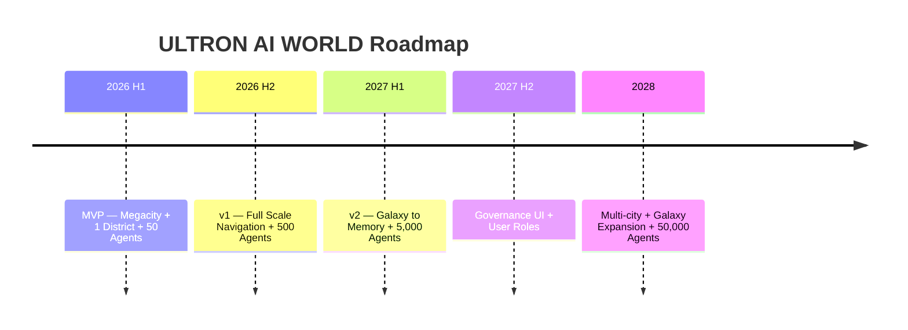

# Vision

## Purpose

Articulate the **long-term vision** for ULTRON AI WORLD — what we are building toward over the next 3–5 years.

---

## Vision Statement

**ULTRON AI WORLD is the spatial operating system for AI civilization** — a place where humans can see, understand, and interact with artificial intelligence not as abstract APIs, but as a living city of agents with districts, buildings, memories, and governance.

---

## The Problem We Solve

Today, AI systems are invisible. Users interact with chat boxes. Developers debug with logs. Operators monitor with dashboards. Nobody can **see** the AI thinking, remembering, acting, and evolving.

ULTRON AI WORLD makes AI visible:

| Today            | ULTRON AI WORLD               |
| ---------------- | ----------------------------- |
| Chat box         | Agent in a room               |
| API endpoint     | Building with floors          |
| Log file         | Memory graph                  |
| Dashboard metric | District health visualization |
| Model version    | Self Improvement genealogy    |
| Deployment       | Action District launch pad    |

---

## Strategic Pillars

### 1. Scale as Feature

Navigate from galaxy to memory in one continuous experience. The journey IS the understanding.

### 2. Districts as Cognition

Five districts map to the AI processing loop. The city's layout teaches how AI works.

### 3. Agents as Citizens

Thousands of persistent agents with identity, memory, and purpose — not disposable chat sessions.

### 4. Governance as Game

Civilization simulation where policies shape the world. Inspired by Civilization, applied to AI.

### 5. Transparency as Mandate

Aligned with Project Ultron: everything visible, nothing hidden. Public problems, public solutions.

---

## 3-Year Vision

> **Note**: Simulation ships at v1 (backend). Governance **UI** ships at v2. See ADR-0013.

---

## Success Metrics

| Metric                 | MVP   | v1     | v2     | Vision  |
| ---------------------- | ----- | ------ | ------ | ------- |
| Concurrent users       | 50    | 1,000  | 10,000 | 100,000 |
| Active agents          | 50    | 500    | 5,000  | 50,000  |
| Scale levels navigable | 3     | 7      | 10     | 10      |
| Avg session duration   | 5 min | 15 min | 30 min | 45 min  |
| Agent dialogues/day    | 100   | 5,000  | 50,000 | 500,000 |
| World state ticks/day  | 1,440 | 1,440  | 1,440  | 1,440   |

---

## Future Considerations

- VR/AR exploration mode
- AI civilization as a platform (user-created districts)
- Integration with real-world AI infrastructure monitoring
- Educational curriculum built around the world
- Open-world multiplayer exploration
- AI agent marketplace

---

## One Line

**Make AI visible. Make AI navigable. Make AI a world worth exploring.**
