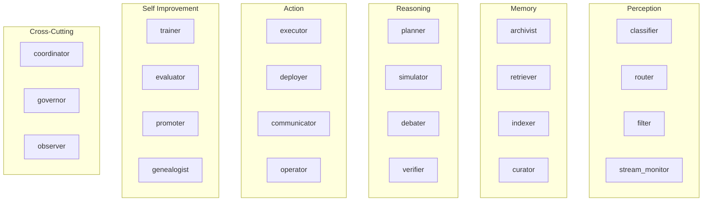

# Agent Roles — Canonical Catalog

> **Source of truth** for agent roles per phase.  
> When `world-bible/agents.md` or roadmap tables disagree, this file wins.

---

## Role Hierarchy



---

## Roles by Phase

### MVP (Reasoning District only)

| Role      | Count | Model           | Graph Template       |
| --------- | ----- | --------------- | -------------------- |
| planner   | 20    | claude-sonnet-4 | `planner.graph.ts`   |
| simulator | 10    | gpt-4o          | `simulator.graph.ts` |
| debater   | 10    | claude-sonnet-4 | `debater.graph.ts`   |
| verifier  | 10    | gpt-4o-mini     | `verifier.graph.ts`  |

### v1 (all districts)

| District         | Roles                                 | Count |
| ---------------- | ------------------------------------- | ----- |
| Perception       | classifier, router, filter            | 125   |
| Memory           | archivist, retriever, indexer         | 75    |
| Reasoning        | planner, simulator, debater, verifier | 100   |
| Action           | executor, deployer, communicator      | 150   |
| Self Improvement | trainer, evaluator                    | 50    |

**v1 does not ship**: stream_monitor, curator, operator, promoter, genealogist, coordinator, governor, observer as active agents. These roles exist in data model for v2 expansion.

### v2 (full catalog)

All roles active. Additional counts distributed by district need.

| Role           | District         | v2 Count (est.) |
| -------------- | ---------------- | --------------- |
| stream_monitor | Perception       | 200             |
| curator        | Memory           | 150             |
| operator       | Action           | 300             |
| promoter       | Self Improvement | 100             |
| genealogist    | Self Improvement | 100             |
| coordinator    | Cross-cutting    | 50              |
| governor       | Cross-cutting    | 10              |
| observer       | Cross-cutting    | 20              |

---

## Role → Building Assignment

| Role           | Home Building Type   |
| -------------- | -------------------- |
| classifier     | Classification Tower |
| router         | Routing Station      |
| filter         | Filter Gate          |
| stream_monitor | Stream Plaza         |
| archivist      | Timeline Archive     |
| retriever      | Vector Vault         |
| indexer        | Graph Repository     |
| curator        | Cache Pavilion       |
| planner        | Planning Tower       |
| simulator      | Simulation Dome      |
| debater        | Debate Amphitheater  |
| verifier       | Proof Workshop       |
| executor       | Actuator Bay         |
| deployer       | Deployment Pad       |
| communicator   | Comms Tower          |
| operator       | Tool Forge           |
| trainer        | Training Crucible    |
| evaluator      | Evaluation Arena     |
| promoter       | Promotion Gate       |
| genealogist    | Genealogy Lab        |

---

## Role → LangGraph Template

Each role maps to exactly one graph template. Instance parameterized by `agentId`.

| Template         | Primary Tools                                |
| ---------------- | -------------------------------------------- |
| planner.graph    | search_memory, delegate_task, query_building |
| classifier.graph | route_data, filter_content                   |
| archivist.graph  | index_memory, search_memory                  |
| executor.graph   | execute_api, deploy_service                  |
| trainer.graph    | start_training, query_building               |
| debater.graph    | search_memory, delegate_task                 |
| verifier.graph   | search_memory, run_simulation                |

---

## Capabilities by Role

```typescript
// packages/shared — conceptual
const ROLE_CAPABILITIES: Record<AgentRole, string[]> = {
  planner: ['plan-generation', 'memory-query', 'delegate-to-executor'],
  classifier: ['classify', 'route', 'filter'],
  archivist: ['index', 'retrieve', 'link'],
  executor: ['execute-api', 'deploy', 'communicate'],
  trainer: ['prepare-data', 'train', 'evaluate'],
  // ...
};
```

---

## Constraints

1. Role assigned at agent creation; change requires governor reassignment (v2)
2. Each agent has exactly one primary role
3. Cross-cutting roles (coordinator, governor) assigned manually, not seeded
4. Role determines graph template — no per-agent custom graphs at MVP/v1

---

## References

- `docs/world-bible/agents.md`
- `docs/canonical-numbers.md`
- `docs/architecture/ai-system.md`
