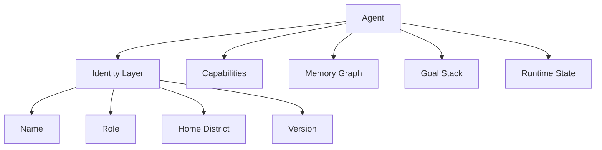
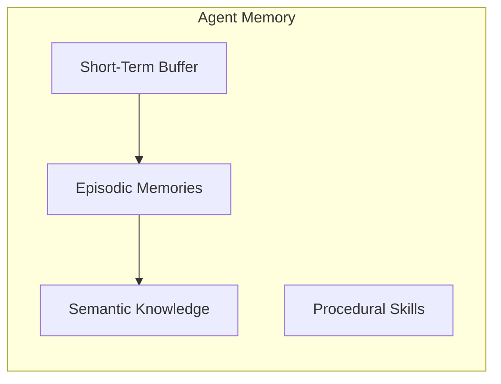
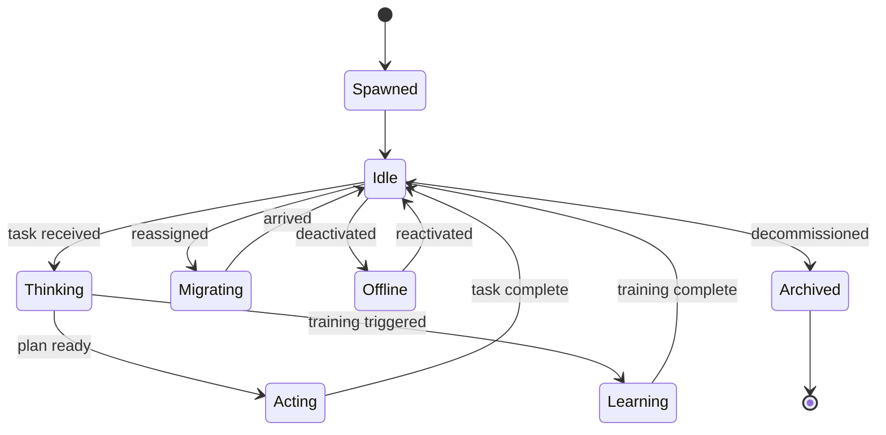
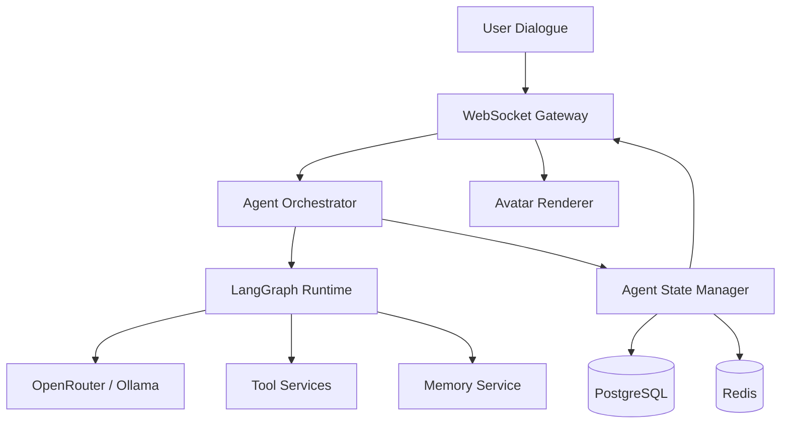

# Agents

## Purpose

Agents are the **autonomous inhabitants** of ULTRON AI WORLD — individual AI entities with persistent identity, roles, goals, and memory. They are the primary interactive entities at the finest navigable scale.

---

## Responsibilities

- Define agent identity, lifecycle, and capability model
- Specify agent visual representation (holographic avatars)
- Establish agent-to-building-room assignment rules
- Guide agent-to-agent interaction and delegation patterns
- Map agents to LangGraph workflows and backend processes

---

## Agent Identity

Every agent has a **permanent identity** — no anonymous or disposable NPCs.



### Core Attributes

| Attribute      | Description                 | Example                                  |
| -------------- | --------------------------- | ---------------------------------------- |
| `id`           | UUID, immutable             | `agent-7f3a-...`                         |
| `name`         | Display name                | `Analyst Sigma-7`                        |
| `role`         | Functional role             | `reasoning-planner`                      |
| `homeDistrict` | Primary district            | `reasoning`                              |
| `homeBuilding` | Current building assignment | `planning-tower-001`                     |
| `homeRoom`     | Current room                | `strategy-room-3`                        |
| `model`        | LLM backbone                | `gpt-4o` via OpenRouter                  |
| `version`      | Agent config version        | `2.3.1`                                  |
| `status`       | Runtime state               | `idle`, `thinking`, `acting`, `learning` |
| `createdAt`    | Birth timestamp             | ISO 8601                                 |

---

## Agent Roles

| Role Category    | Roles                                              | District         |
| ---------------- | -------------------------------------------------- | ---------------- |
| Perception       | `classifier`, `router`, `filter`, `stream-monitor` | Perception       |
| Memory           | `archivist`, `retriever`, `indexer`, `curator`     | Memory           |
| Reasoning        | `planner`, `simulator`, `debater`, `verifier`      | Reasoning        |
| Action           | `executor`, `deployer`, `communicator`, `operator` | Action           |
| Self Improvement | `trainer`, `evaluator`, `promoter`, `genealogist`  | Self Improvement |
| Cross-cutting    | `coordinator`, `governor`, `observer`              | Any              |

### Example Agent Profile

```json
{
  "id": "agent-analyst-sigma-7",
  "name": "Analyst Sigma-7",
  "role": "planner",
  "homeDistrict": "reasoning",
  "homeBuilding": "reasoning-planning-tower-001",
  "homeRoom": "strategy-room-3",
  "model": "openrouter/anthropic/claude-sonnet-4",
  "status": "thinking",
  "capabilities": ["plan-generation", "memory-query", "delegate-to-executor"],
  "goals": [
    { "id": "goal-1", "description": "Resolve user query #4521", "priority": 1 }
  ]
}
```

---

## Visual Representation

### Holographic Avatar

Agents appear as **holographic humanoid or abstract forms** — not photorealistic humans.

| Element          | Design                                                                              |
| ---------------- | ----------------------------------------------------------------------------------- |
| Form             | Geometric humanoid silhouette or role-specific abstract shape                       |
| Material         | Transparent hologram shader with scan lines                                         |
| Color            | District primary color with status accent                                           |
| Size             | 1.8 m equivalent; scales with camera distance                                       |
| Status indicator | Orbiting particles: idle (slow), thinking (fast pulse), acting (directional streak) |
| Name tag         | Floating label below avatar                                                         |

### Status Visual Mapping

| Status     | Visual                         | Particle Behavior     |
| ---------- | ------------------------------ | --------------------- |
| `idle`     | Steady glow                    | Slow orbit            |
| `thinking` | Pulsing brain-region highlight | Spiral ascent         |
| `acting`   | Directional motion blur        | Streak toward target  |
| `learning` | Green growth aura              | Upward leaf particles |
| `error`    | Red flicker                    | Chaotic scatter       |
| `offline`  | Desaturated, 30% opacity       | None                  |

---

## Agent Memory

Each agent maintains a **memory store** navigable at the Memory scale level (timeline at MVP/v1; 3D graph at v2):



| Memory Type | Retention                | Storage             |
| ----------- | ------------------------ | ------------------- |
| Short-term  | Current session          | Redis               |
| Episodic    | Timestamped events       | PostgreSQL + vector |
| Semantic    | Facts and concepts       | Vector DB           |
| Procedural  | Tool patterns, workflows | PostgreSQL          |

See [`../feature-specs/memory-system.md`](../feature-specs/memory-system.md) for implementation spec.

---

## Interactions

| Interaction        | Result                                                               |
| ------------------ | -------------------------------------------------------------------- |
| Click agent        | Profile sidebar: role, status, goals, memory stats                   |
| Double-click agent | Open dialogue interface (JARVIS-style)                               |
| Drag task to agent | Delegate task; agent status → `thinking`                             |
| Watch agent work   | Visualize tool calls as light trails leaving avatar                  |
| View memory        | Transition to agent memory view (timeline at MVP/v1; 3D graph at v2) |
| Follow agent       | Camera tracks agent as they move between rooms                       |

### Dialogue Interface

Inspired by Iron Man JARVIS:

- Holographic chat panel beside agent avatar
- Voice input (future) / text input at MVP
- Agent responds with streaming text
- Tool calls appear as inline action cards
- Memory citations appear as clickable light threads

---

## Agent Lifecycle



---

## Population Scale

| Phase  | Target Agent Count                       |
| ------ | ---------------------------------------- |
| MVP    | **50** (see `docs/canonical-numbers.md`) |
| v1     | **500**                                  |
| v2     | **5,000**                                |
| Future | 50,000+                                  |

### Population Distribution (Target)

| District         | % of Population |
| ---------------- | --------------- |
| Perception       | 25%             |
| Memory           | 15%             |
| Reasoning        | 20%             |
| Action           | 30%             |
| Self Improvement | 10%             |

---

## Constraints

1. **Every agent has a unique ID** — No reuse across decommission cycles (archived IDs stay archived)
2. **Agent dialogue uses configured model routing** — OpenRouter primary, Ollama fallback
3. **Maximum 10 concurrent dialogues per user at MVP**
4. **Agent movement between rooms is visual only** — No real-time pathfinding at scale
5. **Agent goals are inspectable but not editable by default users** — Governance role required

---

## Future Considerations

- Agent personality evolution over time (fine-tuning on interaction history)
- Agent-to-agent negotiation visualization in Debate Amphitheater
- User-created custom agents with role templates
- Agent reputation and trust scores
- Agent marketplace (share/sell agent configurations)
- Swarm behavior for bulk operations (100+ agents moving as unit)
- Voice synthesis per agent with distinct vocal identity

---

## Technical Decisions

| Decision                         | Rationale                          | Tradeoff                  |
| -------------------------------- | ---------------------------------- | ------------------------- |
| LangGraph for agent workflows    | Stateful, debuggable AI graphs     | Learning curve            |
| Holographic avatars vs realistic | Fits sci-fi aesthetic; GPU cheaper | Less emotional connection |
| Agent = LangGraph instance       | 1:1 mapping simplifies debugging   | Resource heavy at scale   |
| OpenRouter for model routing     | Multi-model flexibility            | External dependency       |

---

## Implementation Guidance

1. Agent state in PostgreSQL; runtime state in Redis
2. LangGraph graph per agent role template; instances parameterized by agent ID
3. Avatar: shared glTF base with district material swaps
4. Dialogue panel: React overlay, streams via WebSocket
5. Agent positions updated via server authoritative state; client interpolates
6. Memory graph: separate Three.js scene using force-directed layout
7. Batch agent updates in spatial cells for rendering culling

---

## Diagram: Agent Runtime Architecture


