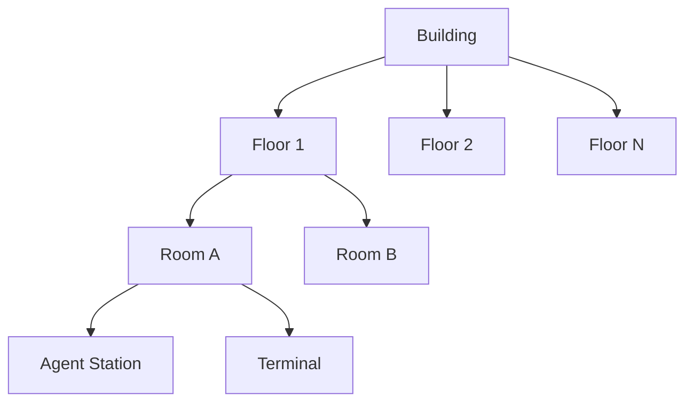
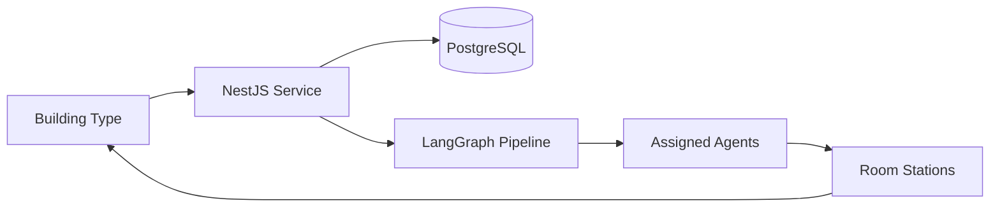

# Buildings

## Purpose

Buildings are the **service containers** of ULTRON AI WORLD — physical manifestations of AI infrastructure including models, pipelines, APIs, and agent workplaces. They bridge district-level organization and room-level execution.

---

## Responsibilities

- Define building taxonomy across all five districts
- Specify building anatomy: exterior, floors, rooms, and entrances
- Establish building lifecycle states (construction, active, degraded, offline)
- Map buildings to backend services and agent assignments
- Guide LOD representation from aerial view to interior entry

---

## Building Hierarchy



| Level    | Contains                         | Example        |
| -------- | -------------------------------- | -------------- |
| Building | Floors, exterior shell, metadata | Planning Tower |
| Floor    | Rooms, corridors                 | Strategy Floor |
| Room     | Agents, terminals, equipment     | War Room       |
| Station  | Single agent workspace           | Analyst Desk 7 |

---

## Building States

| State          | Visual                               | Behavior                     |
| -------------- | ------------------------------------ | ---------------------------- |
| `planned`      | Holographic blueprint outline        | No interaction               |
| `constructing` | Partial mesh with scaffold particles | Progress bar on HUD          |
| `active`       | Full render, lit windows             | All interactions enabled     |
| `degraded`     | Flickering lights, damage decals     | Reduced throughput indicator |
| `offline`      | Dark, no window glow                 | Read-only inspection         |
| `demolished`   | Absent; foundation pad remains       | Historical record accessible |

---

## District Building Catalog

### Perception District

| Building             | Floors | Primary Rooms                      | Max Agents |
| -------------------- | ------ | ---------------------------------- | ---------- |
| Ingestion Hub        | 3      | Intake Bay, Buffer Pool, Dispatch  | 50         |
| Classification Tower | 12     | Classifier Decks (×8), Review Room | 120        |
| Routing Station      | 2      | Router Core, Manual Override       | 20         |
| Filter Gate          | 1      | Safety Chamber, Quarantine Vault   | 30         |
| Stream Plaza         | 1      | Public Gallery, Demo Stations      | 10         |

### Memory District

| Building           | Floors | Primary Rooms                     | Max Agents |
| ------------------ | ------ | --------------------------------- | ---------- |
| Vector Vault       | 20     | Embedding Levels (×16), Query Hub | 80         |
| Timeline Archive   | 8      | Epoch Galleries, Retrieval Desk   | 40         |
| Graph Repository   | 6      | Node Chamber, Edge Workshop       | 60         |
| Cache Pavilion     | 2      | Hot Cache, Eviction Control       | 15         |
| Forgetting Chamber | 1      | Dissolution Pool, Audit Log       | 5          |

### Reasoning District

| Building            | Floors | Primary Rooms                       | Max Agents |
| ------------------- | ------ | ----------------------------------- | ---------- |
| Planning Tower      | 15     | Strategy Rooms (×10), Plan Vault    | 100        |
| Simulation Dome     | 1      | Scenario Floor, Variable Control    | 40         |
| Debate Amphitheater | 3      | Arena, Gallery, Judgment Booth      | 200        |
| Proof Workshop      | 4      | Proof Benches, Verification Lab     | 30         |
| Model Council Hall  | 2      | Council Chamber, Deliberation Rooms | 50         |

### Action District

| Building         | Floors | Primary Rooms                         | Max Agents |
| ---------------- | ------ | ------------------------------------- | ---------- |
| Tool Forge       | 5      | Forge Floor, Tool Library, Test Range | 60         |
| Deployment Pad   | 1      | Launch Pad, Rollback Bay              | 25         |
| Comms Tower      | 10     | Broadcast Deck, Message Queue Room    | 40         |
| Actuator Bay     | 3      | Command Floor, Feedback Monitor       | 35         |
| Rollback Station | 1      | Recovery Chamber, Timeline Restore    | 10         |

### Self Improvement District

| Building           | Floors | Primary Rooms                      | Max Agents |
| ------------------ | ------ | ---------------------------------- | ---------- |
| Training Crucible  | 4      | Crucible Floor, Hyperparameter Lab | 30         |
| Evaluation Arena   | 2      | Benchmark Pit, Leaderboard Hall    | 20         |
| Genealogy Lab      | 3      | Lineage Gallery, Branch Workshop   | 15         |
| Fine-Tune Workshop | 2      | Adapter Benches, Dataset Prep      | 25         |
| Promotion Gate     | 1      | Review Chamber, Approval Terminal  | 10         |

---

## Exterior Design Rules

1. **Silhouette first** — Each building type has a unique recognizable shape at aerial LOD
2. **District palette compliance** — Primary/secondary colors from district theme
3. **Activity indicator** — Window glow intensity maps to CPU/GPU utilization
4. **Label plate** — Holographic nameplate visible on hover and select
5. **Entrance marker** — Glowing portal where camera enters for interior transition

### LOD Representation

| Distance     | Representation                       |
| ------------ | ------------------------------------ |
| > 2 km       | Colored extruded footprint + height  |
| 500 m – 2 km | Simplified mesh, no interior         |
| 100 – 500 m  | Detailed exterior, window glow       |
| < 100 m      | Full exterior + entrance interaction |
| Interior     | Full room geometry                   |

---

## Data Model

```typescript
// Conceptual
interface Building {
  id: string;
  districtId: DistrictId;
  type: BuildingType;
  name: string;
  state: BuildingState;
  floors: Floor[];
  position: Vector3;
  capacity: {
    maxAgents: number;
    currentAgents: number;
    maxRooms: number;
  };
  metrics: {
    throughput: number;
    errorRate: number;
    uptime: number;
  };
  serviceBindings: ServiceRef[];
}

interface Floor {
  id: string;
  level: number;
  rooms: Room[];
}

interface Room {
  id: string;
  type: RoomType;
  agents: AgentRef[];
  terminals: TerminalRef[];
}
```

### Example Building Record

```json
{
  "id": "reasoning-planning-tower-001",
  "districtId": "reasoning",
  "type": "planning_tower",
  "name": "Planning Tower Alpha",
  "state": "active",
  "capacity": { "maxAgents": 100, "currentAgents": 73 },
  "metrics": { "throughput": 1240, "errorRate": 0.02, "uptime": 99.7 }
}
```

---

## Interactions

| Interaction            | Result                                          |
| ---------------------- | ----------------------------------------------- |
| Hover building         | Nameplate, status, agent count                  |
| Click building         | Sidebar: metrics, floors, agents                |
| Double-click / Enter   | Exterior-to-interior transition                 |
| Select floor (sidebar) | Cutaway view highlights floor                   |
| Click room             | Enter room scene                                |
| Right-click            | Context menu: inspect, filter agents, view logs |

---

## Constraints

1. **Maximum 200 buildings at MVP** — 40 per district average
2. **Interior only loads on entry** — No full interior at city LOD
3. **Building IDs are globally unique** — Format: `{district}-{type}-{seq}`
4. **Demolition is soft-delete** — Record persists in memory archive
5. **No user-placed buildings at MVP** — Placement is system-governed

---

## Future Considerations

- User-constructed buildings (custom services)
- Building upgrade paths (visual evolution with capability tiers)
- Procedural building generation for infinite city expansion
- Building-to-building data flow visualization (pipe networks)
- Damage and repair simulation from governance events
- Building interior customization (room layout editor)

---

## Technical Decisions

| Decision                              | Rationale             | Tradeoff                                |
| ------------------------------------- | --------------------- | --------------------------------------- |
| Building = microservice boundary      | Clear backend mapping | Some services don't fit single building |
| Cutaway over true interior at mid-LOD | Performance           | Less architectural realism              |
| Window glow = utilization             | Instant health read   | Abstract metric, not literal            |
| Floor-based room grouping             | Familiar navigation   | Extra click to reach room               |

---

## Implementation Guidance

1. Buildings are scene graph groups with `BuildingController` component
2. Exterior meshes are glTF assets with district material variants
3. Interior scenes are separate scene branches within the **single R3F Canvas** (see ADR-0002, ADR-0003) — not separate Canvas elements
4. Building metrics stream via WebSocket; window glow is a shader uniform
5. Use spatial index (R-tree) for building picking at city scale
6. Building list in sidebar mirrors 3D selection bidirectionally

---

## Diagram: Building → Service Mapping


