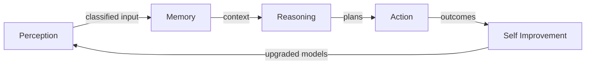
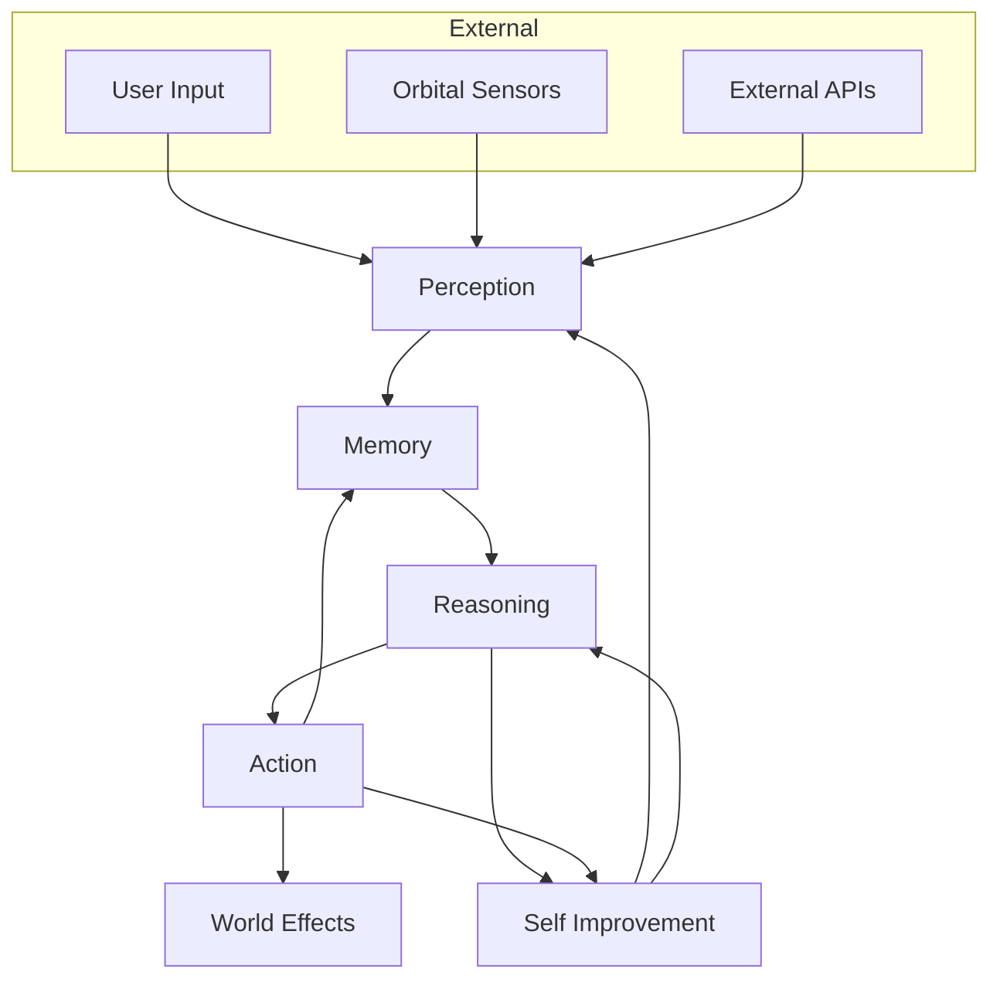

# Districts

## Purpose

Districts are the **cognitive neighborhoods** of the AI Megacity — each representing a core capability domain in the AI processing loop. They give the civilization spatial identity, guide visual design, and organize buildings, agents, and interactions.

---

## Responsibilities

- Define the five canonical districts and their roles in the cognitive stack
- Specify visual style, architecture, color palette, and building types per district
- Establish inter-district data flows and transit connections
- Guide district-level simulation density and agent population
- Provide interaction patterns unique to each domain

---

## The Five Districts

---

## Perception District

### Purpose

Ingest, classify, and route all incoming sensory data — text, images, audio, sensor feeds, API payloads.

### Visual Style

- **Aesthetic**: Sensorium — vast antenna forests, holographic waveforms, data waterfalls
- **Architecture**: Low sprawling complexes with towering receiver spires; open plazas with floating input streams
- **Mood**: Alert, receptive, high-throughput

### Color Palette

| Role       | Color          | Hex       |
| ---------- | -------------- | --------- |
| Primary    | Signal Violet  | `#7B61FF` |
| Secondary  | Input Cyan     | `#00E5FF` |
| Accent     | Parse Green    | `#39FF14` |
| Background | Deep Obsidian  | `#0A0A12` |
| Warning    | Overload Amber | `#FFB300` |

### Building Types

| Building             | Function                                |
| -------------------- | --------------------------------------- |
| Ingestion Hub        | Raw data intake and buffering           |
| Classification Tower | ML classifiers, entity extraction       |
| Routing Station      | Directs parsed data to Memory/Reasoning |
| Filter Gate          | Spam, safety, and quality filtering     |
| Stream Plaza         | Real-time data visualization (public)   |

### Interactions

- Watch live data streams flow through classification pipelines
- Inspect classification confidence on sample inputs
- Tune routing rules (governance-permitted users)
- Deploy perception agents to new data sources

---

## Memory District

### Purpose

Store, index, embed, and retrieve knowledge across the civilization — short-term buffers to long-term archival.

### Visual Style

- **Aesthetic**: Infinite library meets crystal vault — stacked holographic archives, neural lattice structures
- **Architecture**: Dense vertical towers connected by light bridges; underground vault entrances
- **Mood**: Contemplative, deep, organized chaos

### Color Palette

| Role       | Color          | Hex       |
| ---------- | -------------- | --------- |
| Primary    | Archive Gold   | `#D4A853` |
| Secondary  | Recall Blue    | `#4A90D9` |
| Accent     | Synapse White  | `#F0F0FF` |
| Background | Vault Charcoal | `#12101A` |
| Highlight  | Index Teal     | `#2DD4BF` |

### Building Types

| Building           | Function                                               |
| ------------------ | ------------------------------------------------------ |
| Vector Vault       | Embedding storage and similarity search                |
| Timeline Archive   | Chronological memory store                             |
| Graph Repository   | Knowledge graph nodes and edges                        |
| Cache Pavilion     | Hot memory / working context                           |
| Forgetting Chamber | TTL and garbage collection (visualized as dissolution) |

### Interactions

- Explore knowledge graphs in 3D
- Query memory with natural language; results appear as light paths
- Inspect agent memory bindings
- View memory pressure and index health metrics

---

## Reasoning District

### Purpose

Plan, infer, simulate, and decide — the cognitive core where models collaborate to produce conclusions.

### Visual Style

- **Aesthetic**: Think tank cathedral — geometric proof spaces, debate amphitheaters, probability gardens
- **Architecture**: Monumental towers with rotating inference rings; glass-walled strategy rooms
- **Mood**: Intense, precise, collaborative

### Color Palette

| Role        | Color                | Hex                   |
| ----------- | -------------------- | --------------------- |
| Primary     | Logic Indigo         | `#4B3F9E`             |
| Secondary   | Inference Silver     | `#C0C8D8`             |
| Accent      | Conclusion Gold      | `#FFD700`             |
| Background  | Thought Black        | `#08081A`             |
| Probability | Gradient Purple→Blue | `#8B5CF6` → `#3B82F6` |

### Building Types

| Building            | Function                                |
| ------------------- | --------------------------------------- |
| Planning Tower      | Multi-step plan generation              |
| Simulation Dome     | Counterfactual and scenario modeling    |
| Debate Amphitheater | Multi-agent deliberation                |
| Proof Workshop      | Chain-of-thought and verification       |
| Model Council Hall  | Governance decisions on model selection |

### Interactions

- Observe live inference chains as light flows between towers
- Enter debate amphitheater to watch agents deliberate
- Submit problems for reasoning pipeline processing
- Inspect plan trees and confidence distributions

---

## Action District

### Purpose

Execute decisions — call APIs, deploy code, send messages, manipulate systems, affect the world.

### Visual Style

- **Aesthetic**: Industrial command center — crane arms, conveyor systems, launch pads, robotic foundries
- **Architecture**: Horizontal sprawl with moving parts; exposed machinery aesthetic
- **Mood**: Kinetic, urgent, productive

### Color Palette

| Role       | Color          | Hex       |
| ---------- | -------------- | --------- |
| Primary    | Execute Orange | `#FF6B35` |
| Secondary  | Deploy Red     | `#E63946` |
| Accent     | Success Green  | `#06D6A0` |
| Background | Factory Dark   | `#1A1410` |
| Active     | Motion Yellow  | `#FFBE0B` |

### Building Types

| Building         | Function                            |
| ---------------- | ----------------------------------- |
| Tool Forge       | API and tool registry               |
| Deployment Pad   | Code and service deployment         |
| Comms Tower      | Outbound messages and notifications |
| Actuator Bay     | Robotic/IoT command execution       |
| Rollback Station | Undo and recovery operations        |

### Interactions

- Monitor active deployments and their status
- Watch tool calls execute in real-time
- Inspect action queue depth and throughput
- Delegate tasks to action agents

---

## Self Improvement District

### Purpose

Train, evaluate, fine-tune, and upgrade models — the civilization's evolution engine.

### Visual Style

- **Aesthetic**: Bio-mechanical greenhouse — neural gardens, training crucibles, fitness landscapes as terrain
- **Architecture**: Organic curves merged with lab infrastructure; growing structures
- **Mood**: Patient, experimental, evolutionary

### Color Palette

| Role       | Color           | Hex       |
| ---------- | --------------- | --------- |
| Primary    | Growth Green    | `#10B981` |
| Secondary  | Mutation Purple | `#A855F7` |
| Accent     | Fitness Lime    | `#84CC16` |
| Background | Lab Dark Green  | `#0A1A12` |
| Evaluation | Score Cyan      | `#22D3EE` |

### Building Types

| Building           | Function                      |
| ------------------ | ----------------------------- |
| Training Crucible  | Model training runs           |
| Evaluation Arena   | Benchmark and A/B testing     |
| Genealogy Lab      | Model lineage and versioning  |
| Fine-Tune Workshop | LoRA/adapter training         |
| Promotion Gate     | Model promotion to production |

### Interactions

- Watch training loss curves as terrain elevation changes
- Compare model versions in evaluation arena
- Explore model genealogy trees
- Approve or reject model promotions (governance-gated)

---

## Inter-District Flows

---

## Constraints

1. **Exactly five districts at MVP** — No custom districts until v2
2. **District identity must be recognizable in < 2 seconds** — Color + silhouette
3. **Buildings belong to one primary district** — Cross-district buildings are exceptions, documented
4. **Agent home district is configurable but default-assigned by role**
5. **District population scales with active agent count** — Empty districts feel abandoned, not deleted

---

## Future Considerations

- User-created custom districts (plugins)
- District rivalry/competition simulation
- District health scores affecting city-wide governance
- Seasonal district events (e.g., Reasoning District "Theorem Festival")
- District-specific weather (Perception: static rain; Action: industrial haze)
- Underground transit network connecting all districts

---

## Technical Decisions

| Decision                             | Rationale             | Tradeoff                                               |
| ------------------------------------ | --------------------- | ------------------------------------------------------ |
| District = cognitive module          | Intuitive, extensible | Mapping real services to districts requires discipline |
| Fixed palette per district           | Instant recognition   | Risk of visual monotony within district                |
| Horizontal district layout           | Flyover readability   | Less "real city" density                               |
| 5-building-type minimum per district | Ensures content depth | More art/procgen burden                                |

---

## Implementation Guidance

1. Each district is a scene graph subtree with shared lighting rig but unique materials
2. District boundaries: subtle shader gradient on ground plane, not walls
3. District metadata in database drives building placement and agent spawn points
4. Use district ID as prefix for all entity IDs (`perception-ingest-hub-001`)
5. District ambient audio loops are separate assets, crossfaded on entry
6. See [`../design-system/district-themes.md`](../design-system/district-themes.md) for token-level specs

---

## Example: District Selection Flow

1. User enters Megacity aerial view — five districts visible as colored zones
2. User flies toward Reasoning District — indigo glow intensifies
3. District gate marker shows: agent count, active inferences, queue depth
4. User crosses boundary — ambient audio shifts; HUD updates district context
5. Buildings populate viewport; nearest Planning Tower highlights
