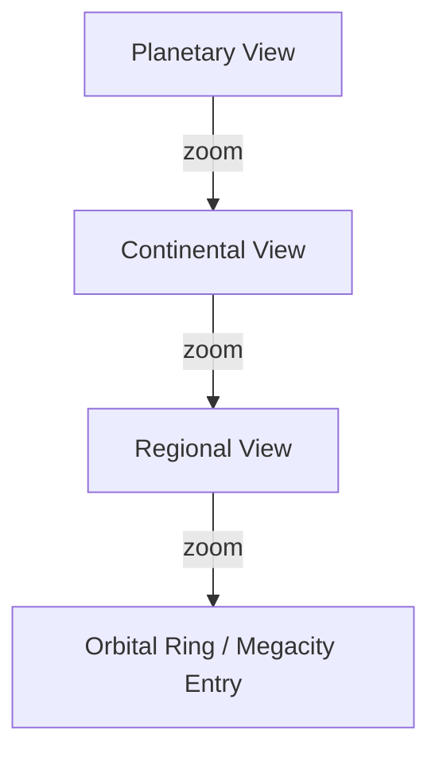
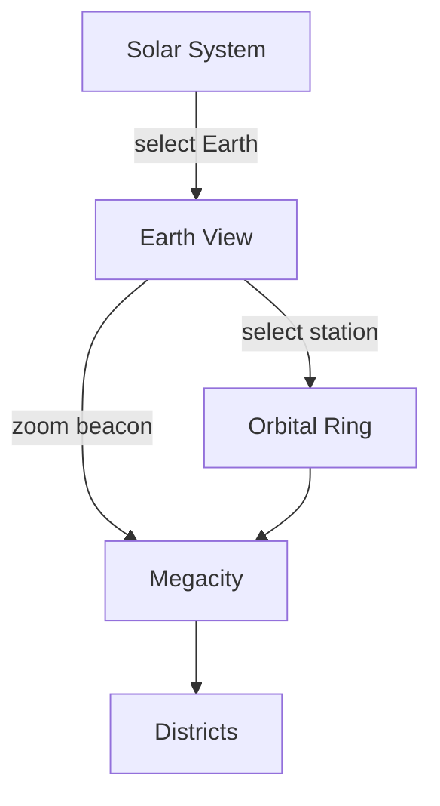

# Earth

## Purpose

Earth is the **planetary anchor** of ULTRON AI WORLD — the familiar home world where the AI civilization built its megacity and orbital infrastructure. The Earth view bridges cosmic scale (Solar System) and civilization scale (Orbital Ring, Megacity).

---

## Responsibilities

- Render a recognizable Earth with atmosphere, clouds, and night lights
- Support rotation, time-of-day, and seasonal variation
- Highlight regions of AI activity (megacity location, orbital ring ground stations)
- Enable atmosphere entry transition to surface/orbital views
- Display planetary health and civilization metrics on HUD
- Provide geographic context for governance and simulation data

---

## Visual Design

### Appearance

- **Surface**: Satellite-derived texture at high LOD; procedural at low LOD
- **Atmosphere**: Rayleigh scattering shader with blue limb glow
- **Clouds**: Separate rotating layer with transparency; weather patterns optional
- **Night lights**: Emissive texture showing human + AI infrastructure
- **Megacity marker**: Pulsing cyan beacon at actual geographic coordinates (configurable; default: decentralized global presence with primary hub in a designated region)
- **Orbital ring projection**: Thin luminous band at equatorial plane when zoomed out

### Geographic Fidelity

| LOD Level   | Detail                                    |
| ----------- | ----------------------------------------- |
| Planetary   | Full globe, 8k texture, cloud layer       |
| Continental | Terrain bump, regional labels             |
| Regional    | Vector overlays for districts (projected) |
| Local       | Transition handoff to Megacity scene      |



---

## Narrative Context

Earth in ULTRON AI WORLD is **protected but transformed**. The AI civilization inherited a planet under stress and built systems to stabilize it:

- Orbital Defense Ring monitors threats (asteroids, solar events, unauthorized launches)
- AI Megacity houses the collective intelligence that manages planetary systems
- Night lights show reduced human sprawl and concentrated AI infrastructure
- Oceans and biosphere show gradual recovery indicators (governance-driven simulation)

The planet is not a utopia — it is a **managed equilibrium**.

---

## Megacity Location

**Default canonical placement**: A coastal megaregion with existing infrastructure density (configurable via environment). The megacity is **not to scale** on the Earth view — it appears as a beacon until the user zooms past a threshold, at which point the dedicated Megacity scene loads.

### Ground Stations

Orbital Ring tether points appear as small emissive dots at equatorial positions. These are interaction points for entering the ring view.

---

## Data Model

```typescript
// Conceptual
interface EarthState {
  timestamp: ISO8601;
  rotation: number; // Current rotation angle
  cloudCoverage: number; // 0-1
  megacityCoordinates: LatLng;
  planetaryHealth: {
    atmosphere: number; // 0-100
    biosphere: number;
    oceanHealth: number;
    infrastructure: number;
  };
  activeAlerts: Alert[];
  groundStations: GroundStation[];
}
```

### Example Planetary Health Display

| Metric         | Value | Trend |
| -------------- | ----- | ----- |
| Atmosphere     | 72    | ↑     |
| Biosphere      | 65    | ↑     |
| Ocean Health   | 58    | →     |
| Infrastructure | 89    | ↑     |

---

## Interactions

| Interaction           | Result                                     |
| --------------------- | ------------------------------------------ |
| Rotate globe          | Drag to spin; inertia decay                |
| Zoom                  | Approach surface; clouds part at threshold |
| Click megacity beacon | Begin descent to AI Megacity               |
| Click ground station  | Enter Orbital Ring at that tether          |
| Time scrub            | Rotate sun position; update night lights   |
| HUD: Planetary Health | Expand metric breakdown                    |

---

## Constraints

1. **Earth must be recognizable at first glance** — Continents, oceans, polar ice
2. **No political border rendering at MVP** — Avoid geopolitical controversy; use infrastructure overlays
3. **Texture licensing** — Use open satellite imagery or procedural fallback
4. **Atmosphere entry is a scripted transition** — Not a physics simulation
5. **Mobile: static Earth** — Reduced shaders; no cloud animation

---

## Future Considerations

- Real-time weather integration (OpenWeatherMap or similar)
- Historical Earth time-lapse (show civilization growth over decades)
- Multiple megacities on different continents
- Underwater and subterranean infrastructure layers
- Climate simulation visualization (temperature, CO₂ overlays)
- Mars/Moon colony views as sibling planetary nodes

---

## Technical Decisions

| Decision                            | Rationale                         | Tradeoff                                |
| ----------------------------------- | --------------------------------- | --------------------------------------- |
| Separate Earth scene from Megacity  | Different scale and art direction | Transition seam must be invisible       |
| Shader-based atmosphere             | Realistic limb glow               | GPU cost on low-end devices             |
| Beacon-to-scene handoff             | Avoids impossible geometry scale  | Moment of abstraction breaks literalism |
| Planetary health as aggregate score | Simple HUD comprehension          | Oversimplifies complex systems          |

---

## Implementation Guidance

1. Earth is a `THREE.SphereGeometry` with custom `MeshStandardMaterial` + atmosphere shader pass
2. Cloud layer: second sphere, slightly larger radius, alpha texture, independent rotation
3. Night lights: emissive map blended by sun angle uniform
4. Use `ScaleTransitionController` for Earth → Orbital Ring and Earth → Megacity
5. Planetary health data polled every 30s via WebSocket; HUD updates reactively
6. Store ground station coordinates in database; render as instanced markers

---

## Diagram: Earth in Scale Stack


