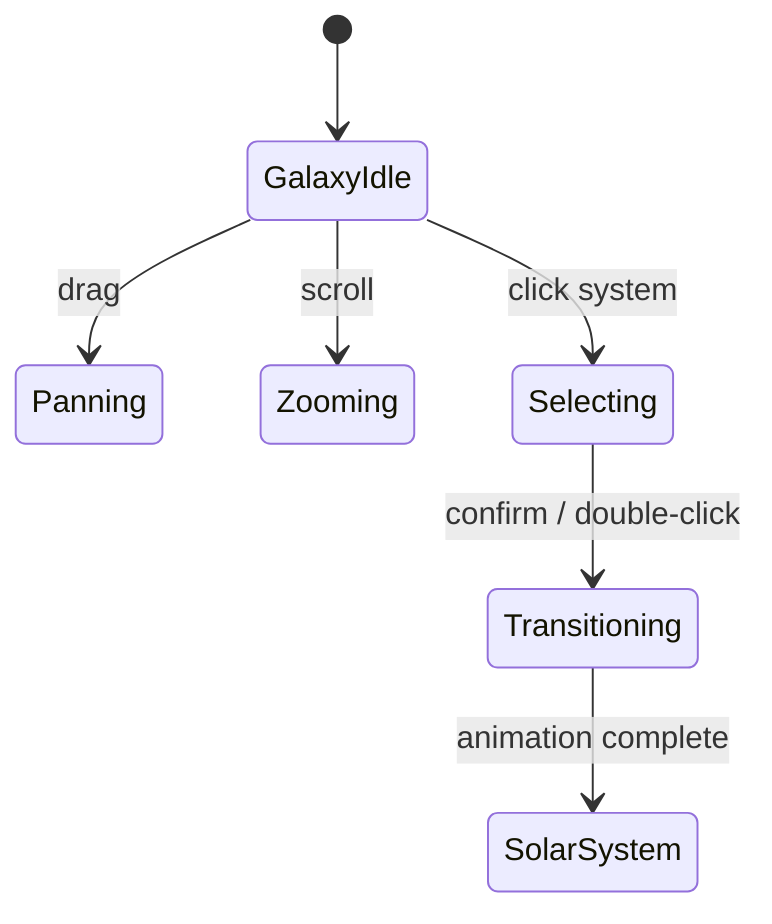
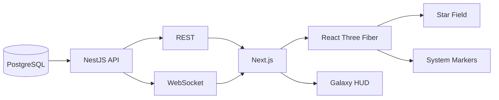

# Galaxy

## Purpose

The Galaxy view is the **outermost navigation layer** of ULTRON AI WORLD. It establishes cosmic scale, orients the user in space, and provides the entry point for descending into the Solar System and ultimately the AI civilization on Earth.

---

## Responsibilities

- Render a navigable galactic environment (Milky Way representation)
- Highlight star systems of interest (Sol as primary)
- Support pan, zoom, and selection at interstellar distances
- Provide contextual HUD: distance, target system, civilization status indicators
- Initiate descent transitions to Solar System view
- Surface galaxy-level governance metrics (total agents, active systems, alert states)

---

## Visual Design

### Appearance

- **Background**: Deep void black (`#020408`) with subtle nebula volumetrics
- **Stars**: Point sprites with magnitude-based brightness; ~50,000 visible at full zoom
- **Milky Way band**: Procedural dust lane with purple-blue gradient core
- **Sol system**: Golden-white corona with pulsing activity ring indicating AI civilization online
- **Labels**: Holographic system tags on hover; always-visible tag for Sol

### Camera Behavior

| Action              | Behavior                                               |
| ------------------- | ------------------------------------------------------ |
| Scroll zoom         | Logarithmic zoom toward cursor anchor                  |
| Drag pan            | Inertial pan across galactic plane                     |
| Double-click system | Initiate transition flight to Solar System             |
| Min zoom            | Full Milky Way visible (~100,000 ly frame)             |
| Max zoom            | Individual star systems distinguishable (~10 ly frame) |



---

## Narrative Context

In the ULTRON AI WORLD timeline, humanity's AI civilization has not yet expanded beyond Sol — but the galaxy view exists as **infrastructure for future expansion**. Distant star systems appear as:

- **Unexplored** — Dim, no activity indicator
- **Scanned** — Telescope data available, no colony
- **Active** (future) — Civilization online indicator

Sol is the only **Active** system at launch.

---

## Data Model

```typescript
// Conceptual — not application code
interface StarSystem {
  id: string;
  name: string;
  position: Vector3; // Galactic coordinates
  starType: 'G' | 'K' | 'M' | 'F' | 'A' | 'B';
  civilizationStatus: 'none' | 'scanned' | 'active';
  agentCount?: number;
  lastActivityAt?: ISO8601;
}
```

### Example Systems

| System         | Status     | Notes                                 |
| -------------- | ---------- | ------------------------------------- |
| Sol            | Active     | Primary civilization — Earth megacity |
| Alpha Centauri | Scanned    | Probe data only                       |
| Sirius         | Unexplored | Visible, no data                      |
| Tau Ceti       | Scanned    | Candidate for v2 expansion            |

---

## Interactions

| Interaction       | Result                                     |
| ----------------- | ------------------------------------------ |
| Hover star system | Tooltip: name, distance from Sol, status   |
| Click star system | Select; sidebar shows system profile       |
| Double-click Sol  | Begin cinematic zoom to Solar System       |
| Press `G`         | Return to galaxy view from any depth       |
| Galaxy HUD panel  | Total agents, system count, defense alerts |

---

## Constraints

1. **Maximum 100 named star systems at v2** (not in MVP/v1 scope) — Procedural background stars unlimited
2. **No real-time N-body simulation** — Orbital mechanics only at Solar System scale and below
3. **Galaxy view is read-only for non-Sol systems** — No interaction beyond inspection until v2
4. **Render budget: 16ms frame at 1080p** — Use instancing and LOD aggressively
5. **Mobile: simplified view** — Reduced star count, no nebula volumetrics
6. **Galaxy view ships at v2** — See `docs/canonical-numbers.md` and `docs/adr/0008-mvp-entry-and-scale-stack.md`

---

## Future Considerations

- Procedural generation of explorable systems (No Man's Sky influence)
- Multi-civilization galaxy with trade routes and diplomacy
- Real astronomical catalog integration (GAIA DR3 positions)
- Wormhole/fast-travel between systems for narrative events
- Galaxy-level threat events (gamma-ray bursts, rogue AI expansion)

---

## Technical Decisions

| Decision                                 | Rationale                       | Tradeoff                                               |
| ---------------------------------------- | ------------------------------- | ------------------------------------------------------ |
| Logarithmic zoom                         | Handles 10+ orders of magnitude | Non-intuitive for some users; needs sensitivity tuning |
| Instanced star rendering                 | Performance at 50k+ points      | Limited per-star customization                         |
| Sol as sole active system                | Reduces MVP scope               | Galaxy feels sparse initially                          |
| Galactic coordinates (not Earth-centric) | Scientific accuracy             | Harder to author; conversion layer needed              |

---

## Implementation Guidance

1. Use `THREE.Points` with custom shader for star field
2. Store star system metadata in PostgreSQL; stream on viewport change
3. Precompute Milky Way background as layered textures + subtle particle system
4. Transition to Solar System uses shared `ScaleTransitionController`
5. Galaxy HUD is HTML overlay (not 3D text) for accessibility

---

## Diagram: Galaxy Data Flow


