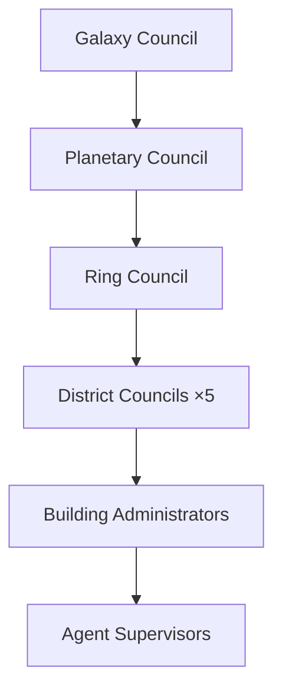
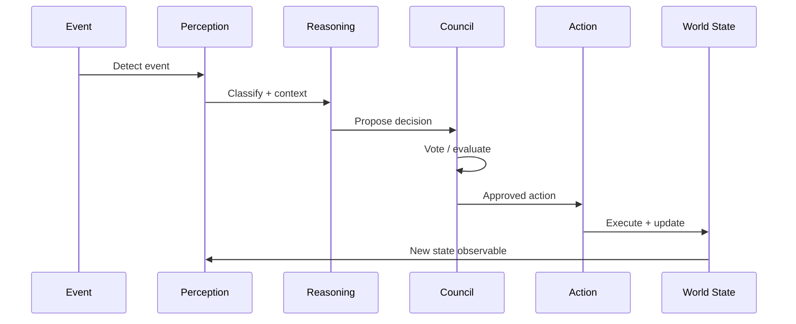
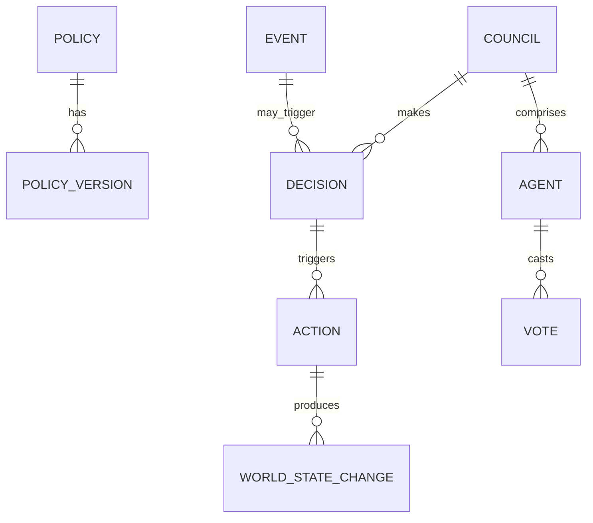

# Governance

## Purpose

Governance defines the **rules, policies, and decision-making systems** that regulate the AI civilization in ULTRON AI WORLD — how agents behave, how resources are allocated, how models are promoted, and how the world evolves over time.

---

## Responsibilities

- Define governance hierarchy and decision-making bodies
- Specify policies for agent behavior, resource allocation, and model lifecycle
- Establish simulation rules that drive world state evolution
- Guide user roles and permissions in the civilization
- Connect governance decisions to visual world changes

---

## Governance Hierarchy



| Body              | Scope                  | Decisions                                            |
| ----------------- | ---------------------- | ---------------------------------------------------- |
| Galaxy Council    | Inter-system (future)  | Expansion, first contact protocols                   |
| Planetary Council | Earth-wide             | Planetary health priorities, budget allocation       |
| Ring Council      | Orbital infrastructure | Defense posture, sensor allocation                   |
| District Council  | Per district           | Agent quotas, building construction, model selection |
| Building Admin    | Per building           | Room assignment, throughput limits                   |
| Agent Supervisor  | Per agent group        | Task priority, memory limits                         |

---

## Policy Domains

### Agent Policy

| Policy                      | Description                     | Default  |
| --------------------------- | ------------------------------- | -------- |
| `max_agents_per_district`   | Population cap                  | 10,000   |
| `agent_spawn_rate`          | New agents per hour             | 10       |
| `idle_timeout`              | Deactivate after idle period    | 24 hours |
| `memory_retention_days`     | Episodic memory TTL             | 90       |
| `cross_district_delegation` | Allow cross-district tasks      | `true`   |
| `model_override`            | Allow per-agent model selection | `false`  |

### Model Policy

| Policy                  | Description                         | Default                |
| ----------------------- | ----------------------------------- | ---------------------- |
| `promotion_threshold`   | Min evaluation score for production | 0.85                   |
| `rollback_auto`         | Auto-rollback on error rate spike   | `true`                 |
| `training_budget_hours` | GPU hours per week                  | 100                    |
| `allowed_providers`     | LLM providers                       | `openrouter`, `ollama` |
| `fallback_model`        | Degraded-mode model                 | `ollama/llama3`        |

### Resource Policy

| Policy                       | Description                | Default          |
| ---------------------------- | -------------------------- | ---------------- |
| `inference_budget_tokens`    | Daily token budget         | 10,000,000       |
| `storage_cap_tb`             | Memory district storage    | 100              |
| `building_construction_rate` | New buildings per week     | 2                |
| `district_power_allocation`  | Compute share per district | Equal (20% each) |

### Defense Policy

| Policy                     | Description              | Default |
| -------------------------- | ------------------------ | ------- |
| `threat_response_level`    | Auto / manual / passive  | `auto`  |
| `ring_segment_redundancy`  | Min operational segments | 300/360 |
| `alert_escalation_timeout` | Time before escalation   | 300 s   |

---

## Decision Flow



### Decision Types

| Type        | Latency   | Authority                     |
| ----------- | --------- | ----------------------------- |
| Automatic   | < 1 s     | Pre-approved policy rules     |
| Agent-level | < 30 s    | Agent supervisor              |
| District    | < 5 min   | District council (agent vote) |
| Planetary   | < 1 hour  | Planetary council             |
| Emergency   | Immediate | Ring council override         |

---

## Simulation Rules

The world **evolves over time** based on governance outcomes — inspired by Civilization.

### World State Variables

| Variable            | Range | Visual Effect                      |
| ------------------- | ----- | ---------------------------------- |
| `planetary_health`  | 0–100 | Earth texture vitality             |
| `city_prosperity`   | 0–100 | Building light intensity           |
| `agent_morale`      | 0–100 | Agent particle behavior            |
| `defense_readiness` | 0–100 | Ring segment glow                  |
| `knowledge_index`   | 0–100 | Memory district tower height       |
| `innovation_rate`   | 0–100 | Self Improvement district activity |

### Simulation Tick

- **Interval**: Every 60 seconds (configurable)
- **Process**: Evaluate policies → run agent tasks → update metrics → trigger visual changes
- **Events**: Random events (threat detection, discovery, failure) injected per tick

### Example Simulation Event

```json
{
  "eventId": "evt-2026-0614-a",
  "type": "threat_detected",
  "severity": "medium",
  "source": "orbital-ring-segment-alpha-12",
  "description": "Debris cluster approaching LEO",
  "proposedAction": "tracking",
  "councilRequired": false,
  "autoResolvePolicy": "threat_response_level:auto"
}
```

---

## User Roles

| Role       | Permissions                                                 |
| ---------- | ----------------------------------------------------------- |
| Observer   | View all scales, read agent profiles, watch simulation      |
| Interactor | Dialogue with agents, submit tasks                          |
| Governor   | Modify policies, approve model promotions, assign agents    |
| Architect  | Create buildings, configure services, design districts (v2) |
| Admin      | Full system access, deployment, database                    |

**MVP default**: All users are Interactors. Governor role requires authentication (future).

---

## Visual Governance Indicators

| Indicator             | Location           | Meaning                                 |
| --------------------- | ------------------ | --------------------------------------- |
| Council chamber glow  | Reasoning District | Active deliberation                     |
| Policy change pulse   | Affected district  | Recent policy update                    |
| Alert beacon          | Ring segment       | Defense event                           |
| Construction hologram | Empty building pad | Approved construction                   |
| Degradation effect    | Building exterior  | Policy violation or resource starvation |

---

## Constraints

1. **Governance policies are data, not code** — Stored in PostgreSQL, editable via API
2. **Simulation tick is server-side only** — Clients receive state diffs
3. **No user voting at MVP** — Council decisions are simulated autonomously
4. **Policy changes take effect on next tick** — No mid-tick mutation
5. **Emergency overrides logged immutably** — Audit trail in PostgreSQL

---

## Future Considerations

- User participation in planetary council votes
- Governance API for external system integration
- Policy simulation sandbox (test policies before applying)
- Inter-civilization diplomacy (when galaxy expands)
- Reputation system for governor users
- AI-generated policy recommendations from Reasoning District
- Historical governance timeline replay

---

## Technical Decisions

| Decision                   | Rationale                      | Tradeoff                    |
| -------------------------- | ------------------------------ | --------------------------- |
| Policy as database records | Hot-reload without deploy      | Schema evolution complexity |
| 60-second tick             | Balance responsiveness vs load | Not real-time simulation    |
| Simulated councils at MVP  | No user auth required          | Less engagement             |
| World state drives visuals | Makes governance tangible      | Coupling sim to rendering   |

---

## Implementation Guidance

1. `GovernanceService` in NestJS manages policy CRUD and evaluation
2. `SimulationEngine` runs on cron (Bull queue) every 60 s
3. Policy evaluation uses rule engine (JSON Logic or custom DSL)
4. World state changes broadcast via WebSocket `world:state` channel
5. Visual indicators driven by state diff — only changed entities update
6. Audit log: append-only table with policy change history
7. Council decisions: LangGraph workflow with multi-agent debate subgraph

---

## Diagram: Governance Data Model



---

## Alignment with Project Ultron

ULTRON AI WORLD governance reflects the broader Project Ultron mandate:

- **Transparency** — All governance decisions are publicly visible
- **Protection** — Defense policies prioritize planetary safety
- **Clarity** — Policy effects are visualized, not hidden in logs
- **Evolution** — Self Improvement District drives continuous model upgrades

The civilization is not utopian — it is **managed**, with trade-offs visible to anyone who navigates deep enough to see the councils at work.
