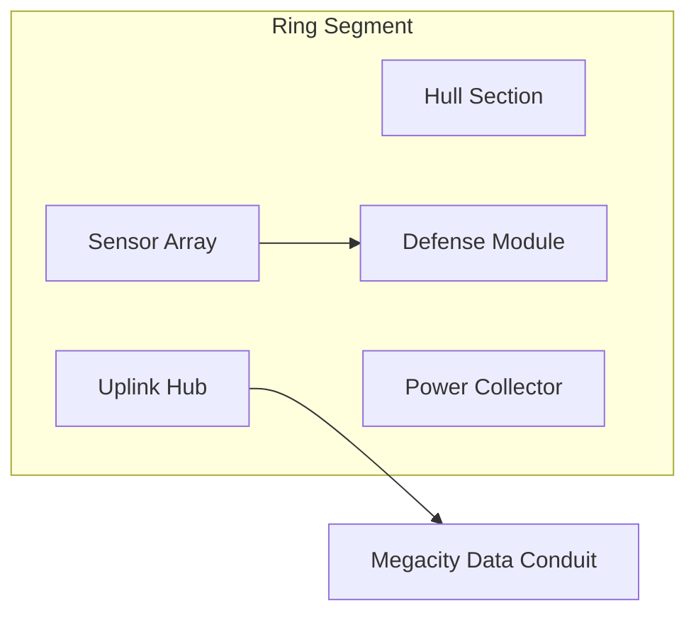

# Orbital Defense Ring

## Purpose

The Orbital Defense Ring is the **perimeter security layer** of ULTRON AI WORLD — a massive equatorial orbital structure representing the civilization's threat detection, tracking, and response systems. It is the gateway between planetary scale and the AI Megacity below.

---

## Responsibilities

- Visualize a continuous orbital infrastructure band around Earth
- Display segment-level health, sensor coverage, and alert status
- Enable navigation along the ring to access different district uplinks
- Surface real-time threat objects (satellites, debris, anomalies)
- Provide transition points into the Megacity (elevator tethers, data conduits)
- Communicate defense posture through visual and HUD states

---

## Visual Design

### Appearance

- **Structure**: Sleek modular ring segments with cyan edge lighting
- **Scale**: ~40,000 km circumference; individual segments visible at operational zoom
- **Materials**: Dark titanium hull, holographic status panels, solar collector arrays
- **Motion**: Slow rotation relative to Earth surface (configurable)
- **Threat indicators**: Red tracking lines to objects in near-Earth space
- **Tether points**: Vertical light columns connecting ring to ground stations

### Segment Anatomy



| Component       | Visual                        | Function            |
| --------------- | ----------------------------- | ------------------- |
| Hull Section    | Dark metallic panels          | Structural          |
| Sensor Array    | Glowing aperture domes        | Threat detection    |
| Defense Module  | Retracted/ deployed armatures | Response systems    |
| Uplink Hub      | Pulsing data streams downward | Megacity connection |
| Power Collector | Solar membrane wings          | Energy              |

---

## Narrative Context

The Orbital Defense Ring is Ultron's **first line of planetary defense** — inspired by the Iron Legion's distributed sentry concept. It is not merely military:

- **Monitoring**: Asteroid tracking, solar flare early warning, unauthorized launch detection
- **Communication**: Global data relay for the AI civilization
- **Transport**: Elevator tethers for material transfer (visual only at MVP)
- **Governance**: Ring Council segment coordinates cross-district policy

The ring was built after the civilization recognized that **planetary protection requires constant orbital presence**.

---

## Segment Map

The ring is divided into **360 logical segments** (1° each), grouped into **12 operational zones**:

| Zone       | Arc       | Primary Uplink District |
| ---------- | --------- | ----------------------- |
| Alpha      | 0°–30°    | Perception              |
| Beta       | 30°–60°   | Memory                  |
| Gamma      | 60°–90°   | Reasoning               |
| Delta      | 90°–120°  | Action                  |
| Epsilon    | 120°–150° | Self Improvement        |
| Zeta–Omega | 150°–360° | Rotating / redundancy   |

Users navigate zones, not individual degrees, at MVP.

---

## Data Model

```typescript
// Conceptual
interface RingSegment {
  id: string;
  zone: string;
  angleStart: number;
  angleEnd: number;
  status: 'nominal' | 'degraded' | 'critical' | 'offline';
  sensorCoverage: number; // 0-100
  activeThreats: Threat[];
  uplinkDistrict: DistrictId;
  lastMaintenanceAt: ISO8601;
}

interface Threat {
  id: string;
  type: 'debris' | 'asteroid' | 'satellite' | 'anomaly' | 'solar';
  trajectory: OrbitalPath;
  riskLevel: 'low' | 'medium' | 'high' | 'critical';
  responseStatus: 'tracking' | 'intercepting' | 'resolved';
}
```

### Example Segment Status

```json
{
  "id": "segment-alpha-12",
  "zone": "Alpha",
  "status": "nominal",
  "sensorCoverage": 98,
  "activeThreats": [
    {
      "id": "threat-7f3a",
      "type": "debris",
      "riskLevel": "low",
      "responseStatus": "tracking"
    }
  ],
  "uplinkDistrict": "perception"
}
```

---

## Interactions

| Interaction              | Result                                     |
| ------------------------ | ------------------------------------------ |
| Orbit camera around ring | Inspect segments from outside              |
| Click segment            | Sidebar: status, threats, uplink district  |
| Click threat indicator   | Threat detail panel with trajectory        |
| Select uplink hub        | Descend to linked district in Megacity     |
| Alert pulse on segment   | Navigate to critical segment               |
| Double-click tether      | Transition to ground station on Earth view |

---

## Constraints

1. **Ring is not a fully modeled 40,000 km mesh** — Modular instanced segments with LOD
2. **Maximum 50 active threat objects at MVP** — Performance and comprehension limit
3. **No weapon simulation** — Defense response is status indicator only
4. **Segment detail loads on demand** — Only visible arc is fully rendered
5. **Ring always visible from Earth view** — Thin luminous band at equator

---

## Future Considerations

- Interactive threat response mini-games or delegation to Action District agents
- Ring expansion modules (construction animation as civilization grows)
- Multi-ring architecture (inner communication ring, outer defense ring)
- Integration with real NORAD/CelesTrak debris data
- Ring Council governance UI with voting visualization
- Damaged segment repair workflows tied to Self Improvement District

---

## Technical Decisions

| Decision                            | Rationale                              | Tradeoff                                    |
| ----------------------------------- | -------------------------------------- | ------------------------------------------- |
| Zone-based navigation (12 zones)    | Reduces cognitive load vs 360 segments | Less granular control                       |
| Instanced segment rendering         | Performance                            | Uniform appearance without variation budget |
| Threat as abstract trajectory lines | Clear visualization                    | Not physically accurate orbital mechanics   |
| Uplink maps to district             | Reinforces cognitive architecture      | Arbitrary geographic mapping                |

---

## Implementation Guidance

1. Ring geometry: `THREE.InstancedMesh` along circular path at Earth radius + altitude
2. Camera: orbital path constraint — camera rides parallel to ring
3. Threat objects: separate scene layer with `Line2` trajectory arcs
4. Segment status colors driven by WebSocket feed
5. Transition to Megacity: camera dives along tether light column
6. Use segment frustum culling — only render ±30° from camera focus

---

## Diagram: Defense Data Pipeline


