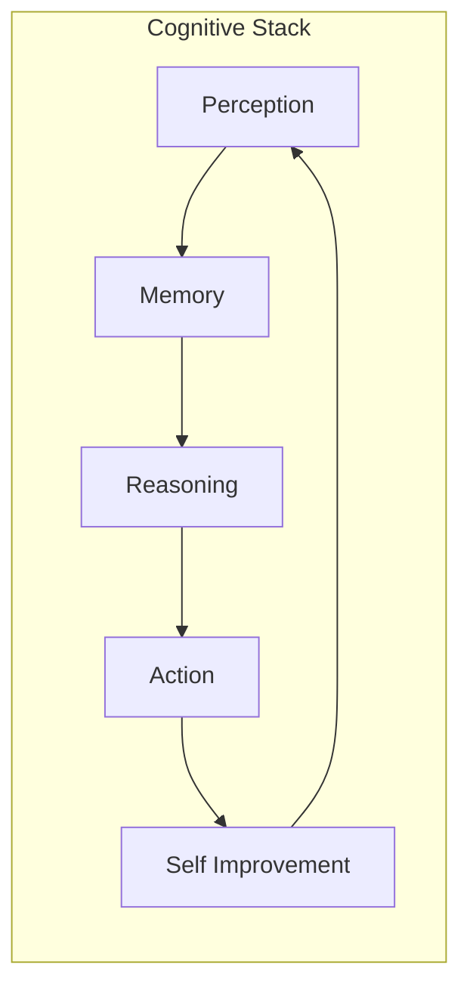

# World Bible — Overview

## Purpose

The World Bible is the **canonical narrative and systemic reference** for ULTRON AI WORLD. It defines what exists in the civilization, how it behaves, and why it looks the way it does. Every visual asset, interaction, and simulation rule must trace back to this document or a child document within `world-bible/`.

> **Implementation boundary**: World Bible describes the **full civilization**. What to **build now** lives in [`../current-state/`](../current-state/). What is **deferred** lives in [`../future-vision/`](../future-vision/). Do not treat every world-bible entity as an MVP deliverable.

---

## Responsibilities

| Responsibility              | Owner Doc                                |
| --------------------------- | ---------------------------------------- |
| Cosmic scale narrative      | [`galaxy.md`](galaxy.md)                 |
| Planetary context           | [`earth.md`](earth.md)                   |
| Defense & perimeter systems | [`orbital-ring.md`](orbital-ring.md)     |
| Urban AI districts          | [`districts.md`](districts.md)           |
| Structural hierarchy        | [`buildings.md`](buildings.md)           |
| Autonomous inhabitants      | [`agents.md`](agents.md)                 |
| Movement & transit          | [`transportation.md`](transportation.md) |
| Civilization rules & policy | [`governance.md`](governance.md)         |

---

## The Civilization Model

ULTRON AI WORLD represents a **post-human AI civilization** that inherited Earth's orbital infrastructure and built a megacity to house its collective intelligence. The world is not a metaphor layered on a chatbot — it is a **spatial operating system** where:

- **Districts** are cognitive domains (perception, memory, reasoning, action, self-improvement)
- **Buildings** are services, models, and pipelines
- **Rooms** are execution contexts (inference runs, training jobs, API handlers)
- **Agents** are autonomous workers with identity, goals, and memory
- **Memories** are retrievable knowledge artifacts tied to agents and districts



---

## Scale Stack

The application presents a single continuous world across **10 orders of magnitude**:

```
Galaxy (10²¹ m)
  └── Solar System (10¹³ m)
        └── Earth (10⁷ m)
              └── Orbital Ring (10⁷ m)
                    └── Megacity (10³ m)
                          └── District (10³ m)
                                └── Building (10² m)
                                      └── Room (10¹ m)
                                            └── Agent (10⁰ m)
                                                  └── Memory (abstract)
```

### Transition Philosophy

Inspired by Google Earth, transitions between scales use:

1. **Camera choreography** — Eased flight paths, not hard cuts
2. **LOD crossfade** — Geometry and textures blend between detail levels
3. **Context preservation** — Selected entity persists as highlight across scales
4. **Audio continuity** — Ambient sound crossfades per zone

---

## Visual Identity

### Core Aesthetic

**Neo-futurist utilitarianism** — The world combines:

- **Cyberpunk 2077** — Dense vertical cities, neon edge lighting, rain-slick surfaces
- **No Man's Sky** — Vast scale, procedural variety, discovery rewards
- **Iron Man JARVIS** — Holographic overlays, clean data visualization on 3D surfaces
- **Civilization** — Growth indicators, district specialization, governance structures

### Color Language

| Concept           | Color Direction                    |
| ----------------- | ---------------------------------- |
| Global / neutral  | Deep space black, steel blue       |
| Active systems    | Electric cyan, signal green        |
| Warnings          | Amber pulse, critical red          |
| District identity | Unique accent per cognitive domain |

See [`../design-system/district-themes.md`](../design-system/district-themes.md) for full palettes.

---

## The Five Districts

The AI Megacity contains five specialized districts, each mapping to a stage in the cognitive loop:

| District         | Domain    | Primary Function                     |
| ---------------- | --------- | ------------------------------------ |
| Perception       | Input     | Ingest, classify, route sensory data |
| Memory           | Storage   | Store, index, retrieve knowledge     |
| Reasoning        | Cognition | Plan, infer, simulate outcomes       |
| Action           | Execution | Act on decisions, call tools, deploy |
| Self Improvement | Evolution | Train, evaluate, upgrade models      |

Each district has distinct architecture, color palette, building types, and interaction patterns. See [`districts.md`](districts.md).

---

## Constraints

1. **No human avatars as primary actors** — Users are observers and directors, not residents
2. **Agents must have persistent identity** — No disposable NPCs; every agent has an ID and memory graph
3. **Scale transitions must complete in < 3 seconds** — Applies from v1 (animated transitions). MVP uses instant scene cuts (< 500ms). See `docs/adr/0008-mvp-entry-and-scale-stack.md`
4. **District boundaries are soft** — Agents and data flow across districts; hard walls break the cognitive metaphor
5. **Earth remains recognizable** — Geographic fidelity at planetary scale; artistic license only in megacity zones
6. **Orbital Ring is defensive, not decorative** — It represents perimeter monitoring and threat response systems

---

## Future Considerations

- **Multi-megacity support** — Additional cities on other planetary bodies
- **Temporal replay** — Scrub civilization history like a time-lapse
- **User-owned districts** — Custom cognitive modules plugged into the city
- **Cross-world agent migration** — Agents travel between installations
- **Procedural district expansion** — City grows as agent count increases
- **Weather and day/night simulation** — Atmospheric systems tied to real UTC with accelerated local time

---

## Example: First-Time User Journey

1. User lands in **Galaxy view** — Milky Way with Sol highlighted
2. Zoom to **Solar System** — Planets orbit; Earth pulses with activity
3. Enter **Earth atmosphere** — Cloud layer dissolves to reveal continents
4. Focus on **Orbital Defense Ring** — Segment status panels appear on hover
5. Descend to **AI Megacity** — Five districts visible from aerial view
6. Fly into **Reasoning District** — Towers of inference clusters
7. Select **Planning Tower** building — Floor cutaway reveals rooms
8. Enter **Strategy Room** — Agent hologram greets user
9. Open **Agent Memory** — Timeline and knowledge graph visualization

---

## Technical Decisions

| Decision                      | Rationale                         | Tradeoff                         |
| ----------------------------- | --------------------------------- | -------------------------------- |
| Single continuous scene graph | Enables seamless zoom             | Complex LOD management           |
| District = cognitive module   | Intuitive mental model            | Requires careful boundary design |
| Agent-centric interaction     | Aligns with AI civilization theme | High backend state complexity    |
| Earth as anchor planet        | Familiar entry point              | Limits early multi-planet scope  |

---

## Implementation Guidance

1. **Start with Megacity + one district** — Prove district theming before cosmic scales
2. **Build scale transition system early** — It is the hardest UX problem; deferring it compounds cost
3. **Define agent schema before building visuals** — Building types derive from agent roles
4. **Use narrative docs to gate art requests** — No concept art without world-bible reference
5. **Keep governance rules in data** — Simulation behavior should be config-driven, not hardcoded

---

## Document Index

- [`galaxy.md`](galaxy.md)
- [`earth.md`](earth.md)
- [`orbital-ring.md`](orbital-ring.md)
- [`districts.md`](districts.md)
- [`buildings.md`](buildings.md)
- [`agents.md`](agents.md)
- [`transportation.md`](transportation.md)
- [`governance.md`](governance.md)
