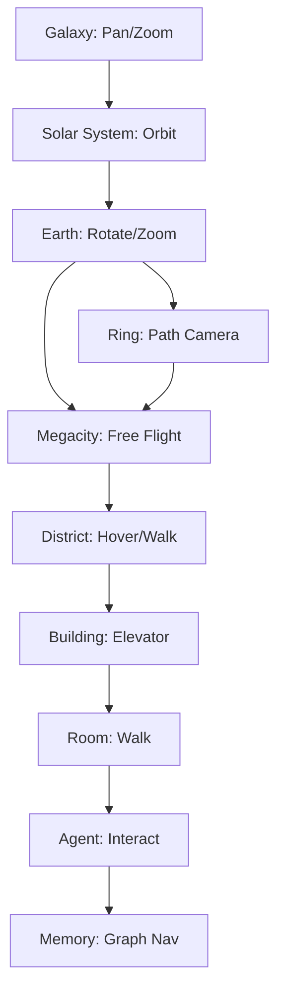
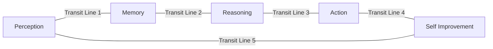

# Transportation

## Purpose

Transportation systems define **how users and agents move** through ULTRON AI WORLD — across scales, districts, buildings, and floors. Movement must feel seamless, cinematic, and context-preserving.

---

## Responsibilities

- Define navigation modes at each scale level
- Specify transit systems within the Megacity (aerial, ground, underground)
- Establish camera flight paths for scale transitions
- Guide agent movement visualization between rooms and buildings
- Ensure accessibility alternatives for non-3D navigation

---

## Navigation Modes

| Scale        | Primary Mode           | Secondary Mode        |
| ------------ | ---------------------- | --------------------- |
| Galaxy       | Pan + logarithmic zoom | System search         |
| Solar System | Orbital camera         | Planet select         |
| Earth        | Globe rotation + zoom  | Region bookmark       |
| Orbital Ring | Orbital path camera    | Segment jump          |
| Megacity     | Free flight / flyover  | District transit line |
| District     | Walk / hover mode      | Building quick-jump   |
| Building     | Floor elevator         | Room select (sidebar) |
| Room         | Walk mode              | Station select        |
| Agent        | Fixed (agent moves)    | Follow camera         |
| Memory       | Graph navigation       | Timeline scrub        |



---

## Scale Transitions

Scale transitions are **scripted camera flights** — the signature UX of the application.

### Transition Anatomy

1. **Departure** — Current view freezes interaction; selected entity highlights
2. **Flight** — Camera follows Bezier curve path; LOD crossfade on geometry
3. **Arrival** — New scale view fades in; context entity remains selected
4. **Settle** — Controls return; ambient audio crossfades

| Transition              | Duration | Path Type            |
| ----------------------- | -------- | -------------------- |
| Galaxy → Solar System   | 2.5 s    | Spiral inward        |
| Solar System → Earth    | 2.0 s    | Direct approach      |
| Earth → Orbital Ring    | 2.0 s    | Ascent to equator    |
| Earth → Megacity        | 2.5 s    | Atmospheric descent  |
| Orbital Ring → Megacity | 1.5 s    | Tether descent       |
| Megacity → District     | 1.0 s    | Forward flight       |
| District → Building     | 1.5 s    | Approach + slow      |
| Building → Room         | 1.0 s    | Portal transition    |
| Room → Agent            | 0.5 s    | Focus zoom           |
| Agent → Memory          | 0.8 s    | Dissolve to abstract |

### Constraints on Transitions

- **Maximum 3 seconds** per animated transition (v1+ requirement). MVP uses instant cuts per `docs/adr/0008-mvp-entry-and-scale-stack.md`
- **Interruptible** after 0.5 s — user can skip to arrival
- **Bidirectional** — Every descent has a matching ascent path
- **Context preserved** — Selected entity ID carries across transition

---

## Megacity Transit Systems

### Aerial Flyover (Default)

- Free-flight camera with WASD + mouse controls
- Speed scales with altitude (higher = faster)
- Soft boundaries at city limits with bounce-back
- Mini-map in HUD showing position and district zones

### District Transit Lines

Neon monorail lines connecting district centers:



| Feature   | Behavior                                               |
| --------- | ------------------------------------------------------ |
| Board     | Click transit station; camera locks to rail path       |
| Travel    | Automated flight along rail; buildings blur past       |
| Disembark | Select stop; camera releases to hover mode             |
| View      | Optional: transparent car interior with panoramic view |

### Underground Data Conduits (v2)

- Visualized as pulsing light tubes beneath city surface
- Represents inter-district data flow
- Rideable at v2 for "data packet" narrative experience

---

## Building Interior Navigation

### Elevator System

- Sidebar floor selector always available
- 3D elevator interaction: click elevator panel, select floor
- Transition: brief interior fade (0.5 s) or animated elevator car

### Corridor Walk

- First-person or third-person walk mode inside buildings
- Click room doors to enter
- Agent avatars visible in corridors (background population)

---

## Agent Movement

Agents move between rooms and buildings to visualize **task delegation and reassignment**.

| Movement Type        | Visualization                                | Trigger                      |
| -------------------- | -------------------------------------------- | ---------------------------- |
| Room to room         | Walk animation along corridor                | Task requires different room |
| Building to building | Exit building → aerial path → enter building | Reassignment                 |
| District to district | Transit line ride or aerial flight           | Cross-district delegation    |
| Return home          | Direct path to home room                     | Task complete                |

Agent movement is **server-authoritative** with client interpolation. Not all agents move simultaneously — only agents with active movement orders render transit animation.

---

## HUD Navigation Aids

| Aid              | Function                                             |
| ---------------- | ---------------------------------------------------- |
| Breadcrumb trail | Galaxy > Earth > Reasoning > Planning Tower > Room 3 |
| Mini-map         | 2D city map with position dot                        |
| Bookmark system  | Save and recall locations                            |
| Search           | Find buildings, agents, rooms by name                |
| Quick-jump menu  | Hierarchy tree for non-spatial navigation            |
| Back button      | Reverse last transition                              |

### Accessibility: Non-3D Navigation

Users who prefer not to fly manually can navigate entirely via:

- Sidebar hierarchy tree
- Search with "Go to" action
- Breadcrumb clicks
- Keyboard shortcuts (`1`–`9` for scale levels)

---

## Constraints

1. **No physics simulation for transit** — All movement is scripted or interpolated
2. **Transit lines are visual at MVP** — Not a full rail simulation
3. **Walk mode is optional** — Sidebar navigation always available
4. **Camera never clips through geometry** — Collision avoidance on all flight paths
5. **Mobile: no free flight** — Tap-to-navigate and sidebar only

---

## Future Considerations

- Personal vehicle customization (flyer skins)
- Rush hour simulation with transit crowding
- Teleportation gates between districts (fast travel)
- Historical path replay (rewatch agent movement)
- VR mode with physical movement controls
- Multiplayer: see other users as observer avatars

---

## Technical Decisions

| Decision                            | Rationale             | Tradeoff                        |
| ----------------------------------- | --------------------- | ------------------------------- |
| Bezier flight paths                 | Smooth, cinematic     | Must author per transition pair |
| Sidebar always available            | Accessibility         | Split attention from 3D view    |
| Server-authoritative agent movement | Consistent state      | Network latency visible         |
| Skip transition option              | Power user preference | May miss cinematic experience   |

---

## Implementation Guidance

1. `ScaleTransitionController` singleton manages all scale changes
2. Flight paths stored as JSON Bezier control points per transition pair
3. Use `react-spring` or `@react-three/drei` `CameraControls` with constraints
4. Transit system: path-following camera with `THREE.CatmullRomCurve3`
5. Mini-map: separate 2D Canvas rendering city layout from spatial index
6. Breadcrumb state in Zustand store, synced with scene graph focus
7. Preload destination scene during flight (first 1 s of transition)

---

## Example: Full Descent Journey

```
User at Galaxy view
  → double-click Sol (2.5s flight)
  → Solar System view, Earth highlighted
  → click Earth (2.0s flight)
  → Earth view, megacity beacon visible
  → click beacon (2.5s flight)
  → Megacity aerial view
  → fly to Reasoning District (free flight, 15s user-controlled)
  → click Planning Tower (1.5s flight)
  → Building exterior
  → enter building (1.0s portal)
  → Strategy Room 3
  → click Analyst Sigma-7 (0.5s focus)
  → Agent dialogue opens
  → click "View Memory" (0.8s dissolve)
  → Memory graph view
```

Total scripted transition time: ~11.8 s (excluding free flight)
